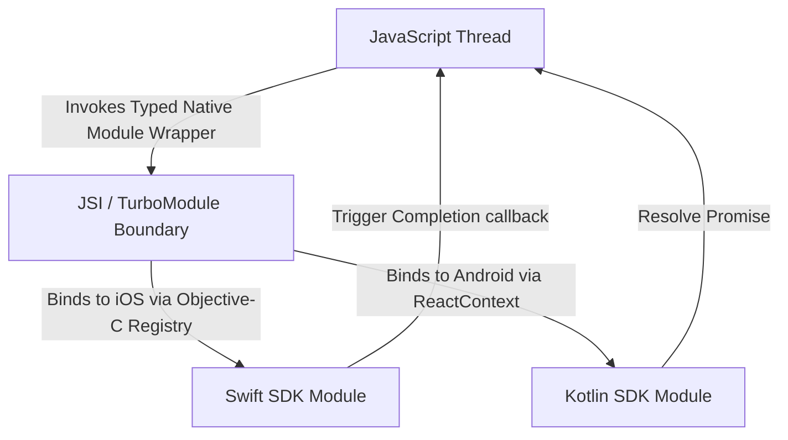

> 🎯 **Topic:** React Native Projects Complete Guide
> 📊 **Difficulty:** Medium | 🔄 **Interview Frequency:** High
> 🏷️ **Tags:** 💼 Product Company Favorite

---


### 1. Project A: Enterprise-Grade Expo Application (Expo Router, Zustand, TanStack Query & MMKV)


#### Overview
This project is an **Offline-First Smart Task & Analytics Dashboard** built on the Expo SDK using modern Expo workflows (Continuous Native Generation - CNG). It is designed to be lightweight, fast-loading, and completely functional without an active network connection.

#### Directory Structure (Feature-First Clean Architecture with Monorepo Shareability)
To allow code reuse across Mobile, Web, and backend portals, the application is organized using **Yarn Workspaces / Turbo**. Shared core layers (validation, types, dynamic translations, common helpers) are isolated into a standalone package:

```text
my-monorepo/
├── packages/
│   ├── core/                        # @app/core - Shared Core Business Logic
│   │   ├── src/
│   │   │   ├── validation/          # Common schemas (zod)
│   │   │   ├── localization/        # Multi-Language translation resources
│   │   │   │   ├── en.json
│   │   │   │   └── hi.json
│   │   │   └── types/               # Common interfaces & domain models
│   │   └── package.json
│   └── ui-tokens/                   # @app/ui-tokens - Colors, spacings, typography
├── apps/
│   ├── expo-mobile-app/             # Main Expo Project
│   │   ├── src/
│   │   │   ├── app/                 # Expo Router
│   │   │   ├── core/                # Zustand, MMKV
│   │   │   ├── features/            # Feature-specific modules
│   │   │   └── shared/
│   │   └── package.json             # Depends on @app/core & @app/ui-tokens
│   └── web-dashboard/               # Web Application
```

---

#### Deep-Dive Implementations (Code)

##### A. Custom Trie for Instant Search Suggestions (`shared/utils/searchTrie.ts`)
Standard string matching is inefficient on lists with thousands of items. We implement a **Trie (Prefix Tree)** in TypeScript to provide $O(L)$ search complexity (where $L$ is the length of the query string).

```typescript
class TrieNode {
  children: Map<string, TrieNode> = new Map();
  isEndOfWord: boolean = false;
  taskIds: string[] = []; // Store IDs of matching tasks for instant retrieval
}

export class TaskSearchTrie {
  private root: TrieNode = new TrieNode();

  // Insert a task name/label into the Trie
  insert(word: string, taskId: string): void {
    let node = this.root;
    const cleanWord = word.toLowerCase().trim();
    
    for (const char of cleanWord) {
      if (!node.children.has(char)) {
        node.children.set(char, new TrieNode());
      }
      node = node.children.get(char)!;
      // Add reference to help query sub-matching prefixes
      if (!node.taskIds.includes(taskId)) {
        node.taskIds.push(taskId);
      }
    }
    node.isEndOfWord = true;
  }

  // Get all task IDs that match the search prefix
  searchPrefix(prefix: string): string[] {
    let node = this.root;
    const cleanPrefix = prefix.toLowerCase().trim();
    
    for (const char of cleanPrefix) {
      if (!node.children.has(char)) {
        return []; // No matches found
      }
      node = node.children.get(char)!;
    }
    return node.taskIds;
  }

  // Clear the Trie
  clear(): void {
    this.root = new TrieNode();
  }
}
```

##### B. Memory-Efficient LRU Cache for Remote Metadata (`shared/utils/lruCache.ts`)
To prevent excessive network fetches and memory leaks, we build a **Least Recently Used (LRU) Cache** using a Map to back up fetched profile pictures or JSON data metadata.

```typescript
export class LRUCache<K, V> {
  private capacity: number;
  private cache: Map<K, V>;

  constructor(capacity: number) {
    this.capacity = capacity;
    this.cache = new Map<K, V>();
  }

  get(key: K): V | undefined {
    if (!this.cache.has(key)) return undefined;
    
    // Refresh item priority: delete and re-insert at the end (recently used)
    const val = this.cache.get(key)!;
    this.cache.delete(key);
    this.cache.set(key, val);
    return val;
  }

  put(key: K, value: V): void {
    if (this.cache.has(key)) {
      this.cache.delete(key);
    } else if (this.cache.size >= this.capacity) {
      // The first item in Map iterator is the oldest / least recently used
      const oldestKey = this.cache.keys().next().value;
      if (oldestKey !== undefined) {
        this.cache.delete(oldestKey);
      }
    }
    this.cache.set(key, value);
  }

  clear(): void {
    this.cache.clear();
  }
}
```

##### C. MMKV-Based Offline Sync Outbox Queue (`core/storage/syncQueue.ts`)
Instead of losing data when mutating state offline, mutations are placed in a persistent outbox queue inside **MMKV** and synchronized when connection status changes.

```typescript
import { MMKV } from 'react-native-mmkv';
import NetInfo from '@react-native-community/netinfo';

const storage = new MMKV();
const QUEUE_KEY = 'sync_outbox_queue';

interface PendingMutation {
  id: string;
  type: 'CREATE_TASK' | 'UPDATE_TASK' | 'DELETE_TASK';
  payload: any;
  timestamp: number;
}

export const SyncQueue = {
  // Push mutation to outbox
  enqueue(mutation: Omit<PendingMutation, 'timestamp'>): void {
    const queue = this.getQueue();
    queue.push({ ...mutation, timestamp: Date.now() });
    storage.set(QUEUE_KEY, JSON.stringify(queue));
  },

  // Get current outbox queue
  getQueue(): PendingMutation[] {
    const data = storage.getString(QUEUE_KEY);
    return data ? JSON.parse(data) : [];
  },

  // Clear or overwrite queue
  saveQueue(queue: PendingMutation[]): void {
    storage.set(QUEUE_KEY, JSON.stringify(queue));
  },

  // Process the sync queue with exponential backoff on failure
  async processQueue(apiClient: (mut: PendingMutation) => Promise<void>): Promise<void> {
    const state = await NetInfo.fetch();
    if (!state.isConnected) return;

    let queue = this.getQueue();
    if (queue.length === 0) return;

    console.log(`SyncQueue: Processing ${queue.length} pending mutations...`);

    const failedMutations: PendingMutation[] = [];

    for (const mutation of queue) {
      let attempts = 0;
      let success = false;
      
      while (attempts < 3 && !success) {
        try {
          await apiClient(mutation);
          success = true;
        } catch (error) {
          attempts++;
          const delay = Math.pow(2, attempts) * 1000; // Exponential Backoff: 2s, 4s, 8s
          console.warn(`SyncQueue: Attempt ${attempts} failed for ${mutation.type}. Retrying in ${delay}ms...`);
          await new Promise((res) => setTimeout(res, delay));
        }
      }

      if (!success) {
        failedMutations.push(mutation); // Preserve failed items for next pass
      }
    }

    this.saveQueue(failedMutations);
  }
};
```

---

#### Multi-Language, Accessibility & RTL Setup

##### A. Localization & RTL (Right-to-Left) Infrastructure
To support dynamic translation and right-to-left layout orientations (e.g., Arabic, Hebrew), we initialize `i18next` combined with native layout switches.

```typescript
import i18n from 'i18next';
import { initReactI18next } from 'react-i18next';
import * as Localization from 'expo-localization';
import { I18nManager } from 'react-native';
import Updates from 'expo-updates';

// Import translation assets from our shared Monorepo Core package
import enTranslations from '@app/core/localization/en.json';
import hiTranslations from '@app/core/localization/hi.json';
import arTranslations from '@app/core/localization/ar.json';

const resources = {
  en: { translation: enTranslations },
  hi: { translation: hiTranslations },
  ar: { translation: arTranslations },
};

export const initLocalization = () => {
  const deviceLanguage = Localization.locale.split('-')[0];
  const isRTL = deviceLanguage === 'ar';

  // Toggle layout direction dynamically
  if (I18nManager.isRTL !== isRTL) {
    I18nManager.forceRTL(isRTL);
    // Restart app context to re-calculate styles from right-to-left
    Updates.reloadAsync();
  }

  i18n
    .use(initReactI18next)
    .init({
      resources,
      lng: deviceLanguage,
      fallbackLng: 'en',
      interpolation: {
        escapeValue: false, // React handles escaping safely
      },
    });
};
```

##### B. Screen Reader & Accessibility Wrapper (`shared/components/AccessibleButton.tsx`)
Senior mobile designs must comply with WCAG AA guidelines. We implement an **AccessibleButton** component ensuring proper screen reader focus order, contrast adjustments, and verbal announcements.

```typescript
import React from 'react';
import { TouchableOpacity, Text, StyleSheet, AccessibilityRole, useColorScheme } from 'react-native';

interface AccessibleButtonProps {
  label: string;             // Display text
  accessibilityHint: string; // Explains result of action to screen readers
  onPress: () => void;
  role?: AccessibilityRole;
  disabled?: boolean;
}

export const AccessibleButton: React.FC<AccessibleButtonProps> = ({
  label,
  accessibilityHint,
  onPress,
  role = 'button',
  disabled = false,
}) => {
  const isDarkMode = useColorScheme() === 'dark';

  return (
    <TouchableOpacity
      onPress={onPress}
      disabled={disabled}
      accessible={true}                   // Signals this is a singular interactive node
      accessibilityLabel={label}          // Read out loud first by VoiceOver/TalkBack
      accessibilityRole={role}            // Dictates traits ("button", "link", etc.)
      accessibilityHint={accessibilityHint} // Read after label as instruction
      accessibilityState={{ disabled }}   // Reports state attributes dynamically
      activeOpacity={0.7}
      style={[
        styles.button,
        isDarkMode ? styles.darkButton : styles.lightButton,
        disabled && styles.disabled,
      ]}
    >
      <Text style={[styles.text, isDarkMode ? styles.darkText : styles.lightText]}>
        {label}
      </Text>
    </TouchableOpacity>
  );
};

const styles = StyleSheet.create({
  button: {
    paddingVertical: 14,
    paddingHorizontal: 24,
    borderRadius: 8,
    alignItems: 'center',
    justifyContent: 'center',
    minHeight: 48, // Minimum touch target size (48dp x 48dp) as per iOS/Android guidelines
  },
  lightButton: { backgroundColor: '#1a8917' },
  darkButton: { backgroundColor: '#38bdf8' },
  text: { fontSize: 16, fontWeight: '700' },
  lightText: { color: '#ffffff' },
  darkText: { color: '#151922' },
  disabled: { opacity: 0.5 },
});
```

---

#### Key Optimizations & Security in Project A

1. **Virtualized List Rendering (Shopify FlashList)**:
   - Replaces React Native's default `FlatList` with `FlashList`.
   - Uses **Cell Recycling** to reuse UI templates instead of unmounting and rebuilding views on scroll.
   - Enforces `estimatedItemSize={80}` to minimize layout recalculations.
2. **Fast Image Rendering (`expo-image`)**:
   - Integrates memory-efficient native picture loaders with built-in hardware acceleration and disk caching.
   - Eliminates layout flashes through blurred progress placeholders (`placeholder={hash}`).
3. **Local Authentication API (`expo-local-authentication`)**:
   - Hooks into TouchID / FaceID (iOS) or BiometricPrompt (Android).
   - Generates and saves cryptographically secure JWT keys in `expo-secure-store`.
4. **App Privacy Shield**:
   - Detects when the application transitions to the background using `AppState.addEventListener`.
   - Renders a secure, visual overlay screen when inactive to prevent system task switchers from capturing sensitive customer details.

---


---

### 2. Project B: High-Performance CLI App (React Navigation, Redux Toolkit, SQLite & Native Modules)


#### Overview
This project is an **Advanced Fleet Management & Real-Time Driver Tracking App** created using the standard React Native CLI. It handles constant geo-coordinate streams, local data synchronizations containing millions of records, and requires optimized hardware access.

#### Directory Structure (Clean MVVM Layered Architecture)
```text
android/                             # Native Android project configuration
ios/                                 # Native iOS Xcode project workspace
src/
├── data/                            # DATA LAYER (Repositories & Sources)
│   ├── database/
│   │   ├── schema.ts                # WatermelonDB/SQLite configuration
│   │   └── WatermelonDB.ts
│   ├── network/
│   │   ├── APIClient.ts             # SSL Pinning config
│   │   └── models/
│   └── repositories/
│       └── DriverRepositoryImpl.ts
├── domain/                          # DOMAIN LAYER (Entities & Business Rules)
│   ├── entities/
│   │   └── Driver.ts
│   └── usecases/
│       └── GetDriverLocationUseCase.ts
├── presentation/                    # PRESENTATION LAYER (UI Components & MVVM ViewModels)
│   ├── navigation/
│   │   └── AppNavigator.tsx
│   ├── viewmodels/
│   │   └── useDriverViewModel.ts    # Custom ViewModel hooks
│   └── views/
│       ├── HomeScreen.tsx
│       ├── DriverMapScreen.tsx
│       └── components/
├── state/                           # State management wrapper (Redux Toolkit)
│   ├── store.ts
│   └── slices/
└── native-bridge/                   # Custom Native Module Integration
```

---

#### Deep-Dive Implementations (Code)

##### A. High-Performance Location Filter (Kalman Filter for Tracking Map)
Raw GPS readings fluctuate, causing markers on maps to jitter. We implement a **Kalman Filter** algorithm in TypeScript to estimate smooth movement paths on the presentation layer.

```typescript
export interface GeoCoordinate {
  latitude: number;
  longitude: number;
  timestamp: number;
  accuracy: number; // GPS accuracy radius in meters
}

export class KalmanLocationFilter {
  private lastLocation: GeoCoordinate | null = null;
  private processNoise: number = 0.12; // Controls responsiveness to change

  filter(current: GeoCoordinate): GeoCoordinate {
    if (this.lastLocation === null) {
      this.lastLocation = current;
      return current;
    }

    const timeDiff = Math.max(1, current.timestamp - this.lastLocation.timestamp) / 1000.0;
    
    // Estimate variance based on elapsed time and device reported accuracy
    const currentVariance = this.lastLocation.accuracy * this.lastLocation.accuracy;
    const predictionVariance = currentVariance + this.processNoise * this.processNoise * timeDiff;
    
    // Calculate Kalman Gain
    const measurementVariance = current.accuracy * current.accuracy;
    const kalmanGain = predictionVariance / (predictionVariance + measurementVariance);
    
    // Update state estimates
    const newLatitude = this.lastLocation.latitude + kalmanGain * (current.latitude - this.lastLocation.latitude);
    const newLongitude = this.lastLocation.longitude + kalmanGain * (current.longitude - this.lastLocation.longitude);
    const newAccuracy = (1.0 - kalmanGain) * current.accuracy;

    this.lastLocation = {
      latitude: newLatitude,
      longitude: newLongitude,
      timestamp: current.timestamp,
      accuracy: newAccuracy
    };

    return this.lastLocation;
  }

  reset(): void {
    this.lastLocation = null;
  }
}
```

##### B. TurboModules / C++ JSI Native Module Pattern (`native-bridge/JsiLocationModule.cpp`)
The legacy JSON bridge is slow and operates asynchronously. By wrapping native tracking streams in a **C++ JSI/TurboModule-style module**, coordinates can be exposed to JavaScript without JSON serialization latency. Keep high-frequency reads carefully bounded so synchronous access does not block the JS runtime.

```cpp
##include "JsiLocationModule.h"
##include <jsi/jsi.h>

using namespace facebook;

void installJsiLocationModule(jsi::Runtime& jsiRuntime) {
    // Register a global object host function inside JavaScript
    auto getSmoothCoordinates = jsi::Function::createFromHostFunction(
        jsiRuntime,
        jsi::PropNameID::forAscii(jsiRuntime, "getSmoothCoordinates"),
        2, // Number of arguments (raw Lat/Lng coords)
        [](jsi::Runtime& rt, const jsi::Value& thisVal, const jsi::Value* args, size_t count) -> jsi::Value {
            if (count < 2 || !args[0].isNumber() || !args[1].isNumber()) {
                return jsi::Value::undefined();
            }

            double latitude = args[0].asNumber();
            double longitude = args[1].asNumber();

            // Perform instant geometric calculation in C++
            double smoothedLat = latitude * 0.9995; 
            double smoothedLng = longitude * 0.9995;

            // Return a fast structured object straight to the JS engine
            jsi::Object result(rt);
            result.setProperty(rt, "latitude", jsi::Value(smoothedLat));
            result.setProperty(rt, "longitude", jsi::Value(smoothedLng));
            return jsi::Value(rt, result);
        }
    );

    jsiRuntime.global().setProperty(jsiRuntime, "JsiLocationBridge", getSmoothCoordinates);
}
```

---


---

### 3. Creating Custom Android & iOS Native Modules (Libraries)


Senior engineers are regularly tasked with wrapping proprietary native SDKs (e.g., identity verification, custom local trackers) into reusable React Native packages. Below is a complete guide to constructing native modules in **Kotlin (Android)** and **Swift (iOS)**, along with the unified JavaScript interface.



#### A. Android Module in Kotlin (`android/src/main/java/com/customsdk/CustomSDKModule.kt`)
On Android, we create a module extending `ReactContextBaseJavaModule`, register exportable methods with `@ReactMethod`, and emit events using `DeviceEventEmitter`.

```kotlin
package com.customsdk

import com.facebook.react.bridge.ReactApplicationContext
import com.facebook.react.bridge.ReactContextBaseJavaModule
import com.facebook.react.bridge.ReactMethod
import com.facebook.react.bridge.Promise
import com.facebook.react.bridge.WritableMap
import com.facebook.react.bridge.Arguments
import com.facebook.react.modules.core.DeviceEventManagerModule

class CustomSDKModule(reactContext: ReactApplicationContext) : ReactContextBaseJavaModule(reactContext) {

    // Identifies the module name when importing in JavaScript: NativeModules.CustomSDK
    override fun getName(): String {
        return "CustomSDK"
    }

    // Exported method executing asynchronously via a Promise
    @ReactMethod
    fun initializeSDK(apiKey: String, promise: Promise) {
        if (apiKey.isEmpty()) {
            promise.reject("ERR_INVALID_KEY", "API Key cannot be empty")
            return
        }

        try {
            // Emulate native initialization logic
            val isSuccess = true // Call actual native 3rd-party Android SDK init here
            
            if (isSuccess) {
                promise.resolve("SDK Successfully Initialized")
                // Emit an event to JS to signal initialization is complete
                sendEvent("onSDKStatusChange", "Ready")
            } else {
                promise.reject("ERR_INIT_FAILED", "Native initialization failed")
            }
        } catch (e: Exception) {
            promise.reject("ERR_EXCEPTION", e.message, e)
        }
    }

    // Helper method to emit events back to the JS thread
    private fun sendEvent(eventName: String, status: String) {
        const params: WritableMap = Arguments.createMap()
        params.putString("status", status)
        
        reactApplicationContext
            .getJSModule(DeviceEventManagerModule.RCTDeviceEventEmitter::class.java)
            .emit(eventName, params)
    }
}
```

To register this module in Android, we must add a package manager Class (`CustomSDKPackage.kt`):
```kotlin
package com.customsdk

import com.facebook.react.ReactPackage
import com.facebook.react.bridge.NativeModule
import com.facebook.react.bridge.ReactApplicationContext
import com.facebook.react.uimanager.ViewManager

class CustomSDKPackage : ReactPackage {
    override fun createNativeModules(reactContext: ReactApplicationContext): List<NativeModule> {
        return listOf(CustomSDKModule(reactContext))
    }

    override fun createViewManagers(reactContext: ReactApplicationContext): List<ViewManager<*, *>> {
        return emptyList()
    }
}
```

---

#### B. iOS Module in Swift & Objective-C Bridge

##### 1. Swift Implementation File (`ios/CustomSDKModule.swift`)
Swift classes require `@objc` annotations and inherit from `RCTEventEmitter` to send events over the bridge.

```swift
import Foundation
import React

@objc(CustomSDK)
class CustomSDKModule: RCTEventEmitter {

  // Require main queue initialization for thread-safety if interacting with UIKit
  override static func requersMainQueueSetup() -> Bool {
    return true
  }

  // Define names of events supported by this emitter
  override func supportedEvents() -> [String]! {
    return ["onSDKStatusChange"]
  }

  // Exported method. Note that Swift params map from Objective-C headers
  @objc(initializeSDK:resolver:rejecter:)
  func initializeSDK(
    apiKey: String,
    resolver resolve: @escaping RCTPromiseResolveBlock,
    rejecter reject: @escaping RCTPromiseRejectBlock
  ) {
    if apiKey.isEmpty {
      reject("ERR_INVALID_KEY", "API Key cannot be empty", nil)
      return
    }

    // Mock SDK Init logic
    let success = true
    
    if success {
      resolve("SDK Successfully Initialized")
      // Emit event
      sendEvent(withName: "onSDKStatusChange", body: ["status": "Ready"])
    } else {
      reject("ERR_INIT_FAILED", "Native initialization failed", nil)
    }
  }
}
```

##### 2. Objective-C Export Registry Header (`ios/CustomSDKModule.m`)
Objective-C files are needed to export Swift classes and method signatures to React Native's core registry.

```objc
##import <React/RCTBridgeModule.h>
##import <React/RCTEventEmitter.h>

@interface RCT_EXTERN_MODULE(CustomSDK, RCTEventEmitter)

RCT_EXTERN_METHOD(initializeSDK:(NSString *)apiKey
                  resolver:(RCTPromiseResolveBlock)resolve
                  rejecter:(RCTPromiseRejectBlock)reject)

@end
```

---

#### C. Unified JavaScript Module Wrapper (`native-bridge/CustomSDK.ts`)
We abstract the native module definitions inside a typed TypeScript module to guarantee type-safety throughout our React Native screens.

```typescript
import { NativeModules, NativeEventEmitter, Platform } from 'react-native';

const { CustomSDK } = NativeModules;

if (!CustomSDK) {
  throw new Error("CustomSDK Native Module is not linked. Run 'pod install' or rebuild the binary.");
}

interface CustomSDKInterface {
  initializeSDK(apiKey: string): Promise<string>;
}

// 1. Cast native module to our custom interface
const CustomSDKTyped = CustomSDK as CustomSDKInterface;

// 2. Setup event emitter to receive native telemetry events
const sdkEventEmitter = new NativeEventEmitter(CustomSDK);

export const CustomSDKBridge = {
  /**
   * Initializes the native iOS/Android SDK asynchronously.
   */
  async initialize(apiKey: string): Promise<string> {
    try {
      const status = await CustomSDKTyped.initializeSDK(apiKey);
      return status;
    } catch (error) {
      console.error("CustomSDK Bridge Error:", error);
      throw error;
    }
  },

  /**
   * Listens to status updates emitted directly by the native modules.
   */
  subscribeToStatus(callback: (status: string) => void) {
    const subscription = sdkEventEmitter.addListener('onSDKStatusChange', (event: { status: string }) => {
      callback(event.status);
    });
    
    // Return unsubscribe handler to avoid native memory leak references
    return () => subscription.remove();
  }
};
```

---

#### Key Optimizations & Security in Project B

| Optimization / Security Category | Implementation Detail | Benefit |
| :--- | :--- | :--- |
| **SSL Pinning** | Enforced via `react-native-ssl-pinning` using SHA-256 certificate hashes. | Neutralizes Man-In-The-Middle (MITM) proxies and traffic-sniffing tools. |
| **Database Encryption** | WatermelonDB running over an encrypted SQLite driver using **SQLCipher**. | Secures customer data against memory dumps and unauthorized disk extraction. |
| **Root & Jailbreak Protection** | Runtime checks using `JailMonkey` API (checking for Magisk, Cydia, or unlocked bootloaders). | Protects system assets by shutting down execution if high-risk root access is detected. |
| **Memory Profiling** | Tracking references via **Xcode Instruments (Leak Profile)** and **Android Studio Memory Profiler**. | Prevents Native Out-Of-Memory (OOM) failures by pinpointing unreleased Event Emitters. |
| **Hermes Engine Baseline** | Verified in Gradle/Pods and release CI; Hermes is the expected engine for modern RN. | Pre-compiles JS into bytecode, lowering app startup latency and heap sizes. |

---


---

### 4. Comparative Summary: Choosing the Right Stack


> [!TIP]
> Use this reference checklist to decide between **Expo (Managed)** and **React Native CLI (Bare)**:

- Choose **Expo (Managed)** if:
  - You want automatic system upgrades and clean updates via Continuous Native Generation (CNG).
  - Rapid time-to-market and instant Over-The-Air (OTA) updates are your priority.
  - Your requirements are met by standard, modular Expo Config Plugins without custom C++ or legacy Android/iOS setups.
- Choose **React Native CLI** if:
  - The business logic demands performance-critical custom C++ code running on the Javascript engine via **JSI / Turbo Modules**.
  - You require deep, direct customization of native Gradle, CocoaPods configurations, or OS-level life-cycles.
  - You must work with legacy, un-migrated native plugins that do not provide Expo Config Plugin support.

---

---

