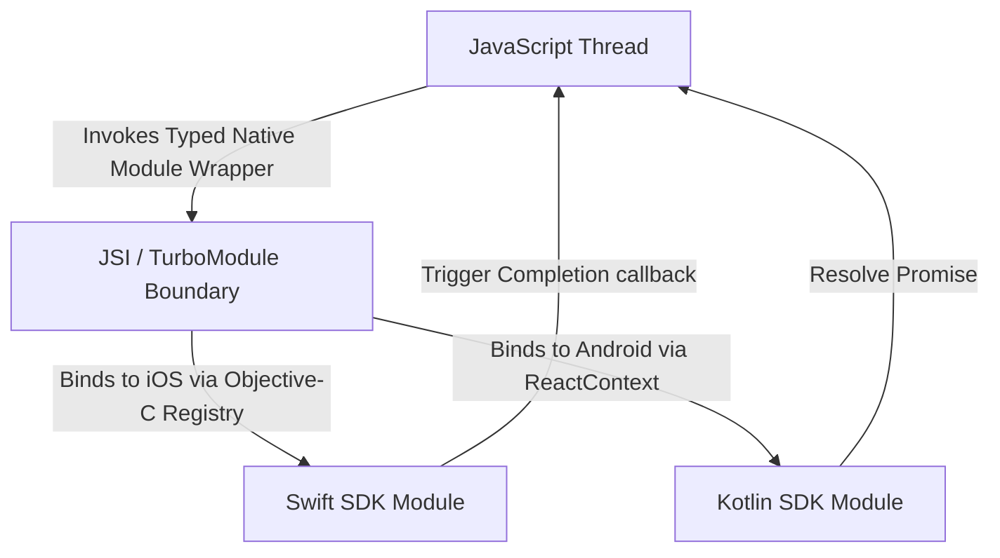

# React Native Coding

## Table of Contents

- [Section 1: Program 1: Performance-Optimized List Component](#section-1-program-1-performance-optimized-list-component)
- [Section 2: Program 2: Custom NetInfo Connectivity Hook (`useNetwork`)](#section-2-program-2-custom-netinfo-connectivity-hook-usenetwork)
- [Section 3: Program 3: Expo Config Plugin configuration](#section-3-program-3-expo-config-plugin-configuration)
- [Section 4: Program 4: Native Android Module Bridge (Kotlin)](#section-4-program-4-native-android-module-bridge-kotlin)
- [Section 5: Program 5: Fetch and Render List from API (Todos)](#section-5-program-5-fetch-and-render-list-from-api-todos)
- [Section 6: Program 6: Reusable API Calling Wrappers (Fetch vs. Axios)](#section-6-program-6-reusable-api-calling-wrappers-fetch-vs-axios)
- [Section 7: Program 7: MMKV State Persist & React Query Offline Caching with Optimistic Updates](#section-7-program-7-mmkv-state-persist-react-query-offline-caching-with-optimistic-updates)
- [Section 8: Program 8: Reanimated Swipe & Pan Gesture Card Component (UI Cloning & Animation)](#section-8-program-8-reanimated-swipe-pan-gesture-card-component-ui-cloning-animation)
- [Section 9: Program 9: Native Module Bridge (Kotlin Android & Swift iOS)](#section-9-program-9-native-module-bridge-kotlin-android-swift-ios)
- [Section 10: Program 10: Complete GitHub Actions & Fastlane CI/CD Configuration](#section-10-program-10-complete-github-actions-fastlane-ci-cd-configuration)
- [Section 11: Program 11: State Management with MobX State Tree (MST)](#section-11-program-11-state-management-with-mobx-state-tree-mst)
- [Section 12: Program 12: SQLite Transactional Ledger Database Hook](#section-12-program-12-sqlite-transactional-ledger-database-hook)
- [Section 13: Program 13: Multi-Layered Testing Suite (Jest + RNTL + Detox)](#section-13-program-13-multi-layered-testing-suite-jest-rntl-detox)
- [Section 14: Program 14: Webpack Module Federation Configuration (Re.Pack Host & Remote Bundle Setup)](#section-14-program-14-webpack-module-federation-configuration-re-pack-host-remote-bundle-setup)
- [Section 15: Program 15: Hardened C++ JNI Bridge Module (Android JNI/Kotlin & iOS Obj-C++/Swift)](#section-15-program-15-hardened-c-jni-bridge-module-android-jni-kotlin-ios-obj-c-swift)
- [Section 16: Program 16: Secure Purchase Validation & Transaction Sync Hook](#section-16-program-16-secure-purchase-validation-transaction-sync-hook)
- [Section 17: Program 17: GraphQL API Client Integration with Apollo Client](#section-17-program-17-graphql-api-client-integration-with-apollo-client)
- [Section 18: Program 18: Recoil State Management (Atoms & Selectors)](#section-18-program-18-recoil-state-management-atoms-selectors)
- [Section 19: Program 19: Unified Production Telemetry Hook (Firebase + Sentry + Azure Insights)](#section-19-program-19-unified-production-telemetry-hook-firebase-sentry-azure-insights)
- [Section 20: Program 20: Test-Driven Development (TDD) Workflow with Jest & RNTL](#section-20-program-20-test-driven-development-tdd-workflow-with-jest-rntl)
- [Section 21: 💻 Section: DSA & Algorithmic Coding (Mobile Optimized)](#section-21-section-dsa-algorithmic-coding-mobile-optimized)
- [Section 22: 🏗️ Section: System Design Coding](#section-22-section-system-design-coding)
- [Section 23: Program 27: Basic 50,000 Items FlatList](#section-23-program-27-basic-50-000-items-flatlist)


---

### 📱 React Native Coding Programs

> 🎯 **Topic:** 📱 React Native Coding Programs
> 📊 **Difficulty:** Medium | 🔄 **Interview Frequency:** High
> 🏷️ **Tags:** ⭐ Frequently Asked

---


<!-- INDEX_START -->

<!-- INDEX_END -->

---

---

> 🎯 **Topic:** Section 1: Program 1: Performance-Optimized List Component
> 📊 **Difficulty:** Medium | 🔄 **Interview Frequency:** High
> 🏷️ **Tags:** ⭐ Frequently Asked

---


## Section 1: Program 1: Performance-Optimized List Component
*⏱️ 4 min read*

### Question
Write a performance-optimized list component that displays a massive dataset of items (such as product listings or transactions). The list must prevent unnecessary cell re-renders, handle scroll operations efficiently, and utilize layout caching rules to maintain 60 FPS scrolling on low-end devices.

### Sample Input & Output
#### Input:
```javascript
const transactions = [
  { id: "tx_101", title: "Apple Subscription", amount: 9.99, date: "2026-06-01" },
  { id: "tx_102", title: "Amazon Purchase", amount: 49.99, date: "2026-06-02" },
  // ... Up to 50,000 transaction items
];
```
#### Output:
Renders a smooth scrollable list where container cells are recycled, off-screen cells are dynamically unloaded, scroll-to-index transitions execute instantly, and cells do not re-render unless their specific transactions change.

### Code
```tsx
import React, { useState, useCallback, useMemo } from 'react';
import { 
  StyleSheet, 
  Text, 
  View, 
  FlatList, 
  TextInput, 
  TouchableOpacity, 
  ActivityIndicator,
  ListRenderItem
} from 'react-native';

interface Product {
  id: string;
  name: string;
  price: number;
  category: string;
}

// 1. Wrap individual list item in React.memo
// Ensure the component only re-renders if its item details or selection state changes.
const ProductRow = React.memo(({ 
  item, 
  isSelected, 
  onPress 
}: { 
  item: Product; 
  isSelected: boolean; 
  onPress: (id: string) => void; 
}) => {
  console.log(`Rendering Row: ${item.name}`); // Debug render cycles
  return (
    <TouchableOpacity 
      style={[styles.row, isSelected && styles.rowSelected]} 
      onPress={() => onPress(item.id)}
      activeOpacity={0.7}
    >
      <View>
        <Text style={styles.title}>{item.name}</Text>
        <Text style={styles.category}>{item.category}</Text>
      </View>
      <View style={styles.rightContainer}>
        <Text style={styles.price}>${item.price.toFixed(2)}</Text>
        <Text style={styles.selectionIndicator}>{isSelected ? '🔵' : '⚪'}</Text>
      </View>
    </TouchableOpacity>
  );
}, (prevProps, nextProps) => {
  // Custom equality checker to prevent unneeded redraws:
  // Skip render if the item reference and the selected flag remain identical.
  return prevProps.item === nextProps.item && prevProps.isSelected === nextProps.isSelected;
});

export function OptimizedProductList({ initialData }: { initialData: Product[] }) {
  const [data, setData] = useState<Product[]>(initialData);
  const [searchQuery, setSearchQuery] = useState<string>('');
  const [selectedIds, setSelectedIds] = useState<Set<string>>(new Set());
  const [isRefreshing, setIsRefreshing] = useState<boolean>(false);
  const [isLoadingMore, setIsLoadingMore] = useState<boolean>(false);
  const [page, setPage] = useState<number>(1);

  // 2. Client-Side Search and Filter optimized via useMemo
  const filteredProducts = useMemo(() => {
    const query = searchQuery.toLowerCase().trim();
    if (!query) return data;
    return data.filter(item => 
      item.name.toLowerCase().includes(query) || 
      item.category.toLowerCase().includes(query)
    );
  }, [data, searchQuery]);

  // 3. Selection handler using a stable reference callback
  const handleSelect = useCallback((id: string) => {
    setSelectedIds(prev => {
      const next = new Set(prev);
      if (next.has(id)) {
        next.delete(id);
      } else {
        next.add(id);
      }
      return next;
    });
  }, []);

  // 4. Infinite Scroll Pagination Trigger
  const handleLoadMore = useCallback(() => {
    if (isLoadingMore || searchQuery.length > 0) return; // Skip pagination during active search
    setIsLoadingMore(true);
    
    // Simulate API fetch delay for next page
    setTimeout(() => {
      const nextPage = page + 1;
      const newItems: Product[] = Array.from({ length: 20 }).map((_, i) => ({
        id: `prod_${nextPage}_${i}`,
        name: `Product ${nextPage}-${i + 1}`,
        price: Math.floor(Math.random() * 100) + 10,
        category: i % 2 === 0 ? 'Electronics' : 'Apparel'
      }));
      
      setData(prev => [...prev, ...newItems]);
      setPage(nextPage);
      setIsLoadingMore(false);
    }, 1500);
  }, [page, isLoadingMore, searchQuery]);

  // 5. Pull-to-Refresh handling
  const handleRefresh = useCallback(() => {
    setIsRefreshing(true);
    setTimeout(() => {
      setData(initialData);
      setPage(1);
      setSelectedIds(new Set());
      setIsRefreshing(false);
    }, 1000);
  }, [initialData]);

  // 6. Memoize row renderer to maintain function pointer address
  const renderItem: ListRenderItem<Product> = useCallback(({ item }) => {
    return (
      <ProductRow 
        item={item} 
        isSelected={selectedIds.has(item.id)} 
        onPress={handleSelect} 
      />
    );
  }, [selectedIds, handleSelect]);

  // 7. Stable layout parameters calculation
  // Eliminates dynamic measuring calculations on scroll.
  const getItemLayout = useCallback((_: any, index: number) => ({
    length: 70, // Height of each row (row style + bottom border height)
    offset: 70 * index,
    index,
  }), []);

  // 8. Extract unique keys
  const keyExtractor = useCallback((item: Product) => item.id, []);

  // 9. List Header Component containing the search inputs
  const renderHeader = useCallback(() => {
    return (
      <View style={styles.headerContainer}>
        <TextInput
          style={styles.searchInput}
          placeholder="Search products or category..."
          value={searchQuery}
          onChangeText={setSearchQuery}
          clearButtonMode="while-editing"
        />
        <Text style={styles.selectionText}>Selected Items: {selectedIds.size}</Text>
      </View>
    );
  }, [searchQuery, selectedIds]);

  // 10. Footer Component rendering the loading spinner for pagination
  const renderFooter = useCallback(() => {
    if (!isLoadingMore) return null;
    return (
      <View style={styles.footerContainer}>
        <ActivityIndicator size="small" color="#667eea" />
        <Text style={styles.footerText}>Loading more items...</Text>
      </View>
    );
  }, [isLoadingMore]);

  return (
    <FlatList 
      data={filteredProducts}
      keyExtractor={keyExtractor}
      ListHeaderComponent={renderHeader}
      ListFooterComponent={renderFooter}
      renderItem={renderItem}
      
      // Core Virtualization & Rendering Tuning
      initialNumToRender={10}       // Speed up screen mount
      windowSize={10}               // Limit memory rendering range (10 screen bounds)
      removeClippedSubviews={true}  // Free off-screen cells from native memory buffer
      getItemLayout={getItemLayout}
      
      // Scroll-to-End Triggers
      onEndReached={handleLoadMore}
      onEndReachedThreshold={0.5}   // Fired when scroll is halfway through remaining content
      
      // Pull to refresh triggers
      refreshing={isRefreshing}
      onRefresh={handleRefresh}
      
      contentContainerStyle={styles.listContent}
    />
  );
}

const styles = StyleSheet.create({
  listContent: {
    paddingBottom: 20,
    backgroundColor: '#f7fafc',
  },
  headerContainer: {
    padding: 16,
    backgroundColor: '#ffffff',
    borderBottomWidth: 1,
    borderBottomColor: '#e2e8f0',
  },
  searchInput: {
    height: 44,
    borderColor: '#cbd5e0',
    borderWidth: 1,
    borderRadius: 8,
    paddingHorizontal: 12,
    fontSize: 15,
    backgroundColor: '#f7fafc',
  },
  selectionText: {
    marginTop: 10,
    fontSize: 13,
    fontWeight: '600',
    color: '#4a5568',
  },
  row: {
    height: 70,
    flexDirection: 'row',
    justifyContent: 'space-between',
    alignItems: 'center',
    paddingHorizontal: 16,
    backgroundColor: '#ffffff',
    borderBottomWidth: 1,
    borderBottomColor: '#e2e8f0',
  },
  rowSelected: {
    backgroundColor: '#ebf8ff',
  },
  title: {
    fontSize: 15,
    fontWeight: '600',
    color: '#1a202c',
  },
  category: {
    fontSize: 12,
    color: '#718096',
    marginTop: 2,
  },
  rightContainer: {
    flexDirection: 'row',
    alignItems: 'center',
  },
  price: {
    fontSize: 15,
    fontWeight: 'bold',
    color: '#2b6cb0',
    marginRight: 10,
  },
  selectionIndicator: {
    fontSize: 18,
  },
  footerContainer: {
    paddingVertical: 15,
    alignItems: 'center',
    justifyContent: 'center',
    flexDirection: 'row',
  },
  footerText: {
    marginLeft: 8,
    fontSize: 13,
    color: '#718096',
  },
});
```

### Complexity & Explanation
- **Time Complexity**: $O(N)$ where $N$ is the count of items in the list. Virtualization keeps active renders to $O(W)$ where $W$ is the visible window height.
- **Space Complexity**: $O(N)$ to keep the items array in memory.
- **Explanation**: This list implements several react performance optimizations. Individual rows are wrapped in `React.memo` using custom equality properties checks. Callbacks for scrolling and row updates are memoized using `useCallback` to avoid re-allocating reference addresses. FlatList's `getItemLayout` is configured to bypass dynamic cell dimension calculations, and virtual parameters (`windowSize`, `initialNumToRender`, `removeClippedSubviews`) are tuned to reduce runtime heap footprints.

---

---

> 🎯 **Topic:** Section 2: Program 2: Custom NetInfo Connectivity Hook (`useNetwork`)
> 📊 **Difficulty:** Medium | 🔄 **Interview Frequency:** High
> 🏷️ **Tags:** ⭐ Frequently Asked

---


## Section 2: Program 2: Custom NetInfo Connectivity Hook (`useNetwork`)
*⏱️ 1 min read*

### Question
Create a custom React Native hook `useNetwork` that monitors network connectivity status. The hook should track whether the user is online, their connection type (WiFi, cellular, etc.), and clean up active listeners properly when components unmount to prevent memory leaks.

### Sample Input & Output
#### Usage Input:
```javascript
const { isConnected, isWifi } = useNetwork();
```
#### Output (Online via Wifi):
```javascript
{ isConnected: true, isWifi: true, connectionType: "wifi" }
```

### Code
```typescript
import { useState, useEffect } from 'react';
import NetInfo, { NetInfoState } from '@react-native-community/netinfo';

interface NetworkState {
  isConnected: boolean | null;
  connectionType: string | null;
  isWifi: boolean;
}

export function useNetwork(): NetworkState {
  const [networkState, setNetworkState] = useState<NetworkState>({
    isConnected: true,
    connectionType: null,
    isWifi: false,
  });

  useEffect(() => {
    // 1. Initialize and listen to connectivity state changes
    const unsubscribe = NetInfo.addEventListener((state: NetInfoState) => {
      setNetworkState({
        isConnected: state.isConnected,
        connectionType: state.type,
        isWifi: state.type === 'wifi',
      });
    });

    // 2. Return cleanup subscription to release references from event dispatcher memory
    return () => {
      unsubscribe();
    };
  }, []);

  return networkState;
}
```

### Complexity & Explanation
- **Time Complexity**: $O(1)$ event listener registry on mount.
- **Space Complexity**: $O(1)$ constant local state storage.
- **Explanation**: Implements a custom hook that monitors network connectivity changes via NetInfo. It listens to network events on mount, and uses the `useEffect` cleanup callback closure to unsubscribe when unmounted, preventing background reference memory leaks.

```

---

---

> 🎯 **Topic:** Section 3: Program 3: Expo Config Plugin configuration
> 📊 **Difficulty:** Medium | 🔄 **Interview Frequency:** High
> 🏷️ **Tags:** ⭐ Frequently Asked

---


## Section 3: Program 3: Expo Config Plugin configuration
*⏱️ 1 min read*

### Question
Write a JavaScript Expo Config Plugin function that programmatically modifies the native `AndroidManifest.xml` during `npx expo prebuild` to inject custom security permissions (e.g. `REQUEST_INSTALL_PACKAGES`) without editing the native Android directory files manually.

### Sample Input & Output
#### Input:
```json
// Inside app.json plugins definition
"plugins": [
  "./plugins/withCustomPermissions"
]
```
#### Output:
Compiles Android build configs and injects `<uses-permission android:name="android.permission.REQUEST_INSTALL_PACKAGES" />` directly into the generated XML outputs.

### Code
```javascript
const { withAndroidManifest } = require('@expo/config-plugins');

/**
 * Custom Expo Config Plugin to inject Android security permissions programmatically
 */
function withCustomPermissions(config) {
  return withAndroidManifest(config, async (config) => {
    const androidManifest = config.modResults;
    const manifest = androidManifest.manifest;

    // 1. Ensure uses-permission array structure exists in the XML model
    if (!manifest['uses-permission']) {
      manifest['uses-permission'] = [];
    }

    const targetPermission = 'android.permission.REQUEST_INSTALL_PACKAGES';

    // 2. Prevent duplicate permission injections
    const hasPermission = manifest['uses-permission'].some(
      (item) => item.$['android:name'] === targetPermission
    );

    if (!hasPermission) {
      manifest['uses-permission'].push({
        $: {
          'android:name': targetPermission,
        },
      });
      console.log(`Expo Plugin: Successfully injected ${targetPermission}`);
    }

    return config;
  });
}

module.exports = withCustomPermissions;
```

### Complexity & Explanation
- **Time Complexity**: $O(1)$ during bundle configuration generation.
- **Space Complexity**: $O(1)$ configurations storage.
- **Explanation**: Modifies `AndroidManifest.xml` using Expo's modular Config Plugin interface. It parses the current XML representation, searches for `REQUEST_INSTALL_PACKAGES` to prevent duplicates, and pushes the permissions node dynamically.

```

---

---

> 🎯 **Topic:** Section 4: Program 4: Native Android Module Bridge (Kotlin)
> 📊 **Difficulty:** Medium | 🔄 **Interview Frequency:** High
> 🏷️ **Tags:** ⭐ Frequently Asked

---


## Section 4: Program 4: Native Android Module Bridge (Kotlin)
*⏱️ 1 min read*

### Question
Implement a custom Android Native Module structure written in Kotlin that provides a bridge to compute SHA-256 hashes of string buffers natively. The module must register its namespace, declare the hash calculations asynchronously, and return the outputs through a React Native Promise back to the JS thread.

### Sample Input & Output
#### JS Input:
```javascript
import { NativeModules } from 'react-native';
const hash = await NativeModules.CryptoBridge.hashString("secure_payment_payload");
```
#### Output:
```javascript
"2f5f14e7a8cf..." // 64-character SHA-256 hexadecimal string
```

### Code
```kotlin
package com.myportal.cryptobridge

import com.facebook.react.bridge.ReactApplicationContext
import com.facebook.react.bridge.ReactContextBaseJavaModule
import com.facebook.react.bridge.ReactMethod
import com.facebook.react.bridge.Promise
import java.security.MessageDigest

class CryptoBridgeModule(reactContext: ReactApplicationContext) : ReactContextBaseJavaModule(reactContext) {

    // 1. Define the module namespace exposed to JavaScript
    override fun getName(): String {
        return "CryptoBridge"
    }

    // 2. Implement target method annotated with @ReactMethod for JS invocation
    @ReactMethod
    fun hashString(input: String, promise: Promise) {
        try {
            // Run hash operations inside worker threads rather than blocking native UI thread
            Thread {
                try {
                    val digest = MessageDigest.getInstance("SHA-256")
                    val hashBytes = digest.digest(input.toByteArray(Charsets.UTF_8))
                    
                    // Convert bytes to hex string
                    val hexString = StringBuilder()
                    for (byte in hashBytes) {
                        val hex = Integer.toHexString(0xff and byte.toInt())
                        if (hex.length == 1) hexString.append('0')
                        hexString.append(hex)
                    }
                    
                    // Resolve output through bridge
                    promise.resolve(hexString.toString())
                } catch (e: Exception) {
                    promise.reject("HASH_ERROR", "Failed to calculate SHA-256 hash", e)
                }
            }.start()
        } catch (e: Exception) {
            promise.reject("THREAD_ERROR", "Failed to spawn hashing worker thread", e)
        }
    }
}
```

### Complexity & Explanation
- **Time Complexity**: $O(B)$ where $B$ is the byte length of the input string being hashed. Running the operation inside a Kotlin background thread keeps the Java/Kotlin Main UI Thread free from blocking delays.
- **Space Complexity**: $O(B)$ to buffer the byte array data during message digestion.
- **Explanation**: A React Native Native Module implemented in Kotlin. It registers the class as `CryptoBridge` and runs cryptographic calculations asynchronously. By executing the hash computation in a separate `Thread`, it prevents blocking Android's Main UI thread, returning the hexadecimal hash string back to JS using React Native's `Promise` bridge interface.

---

---

> 🎯 **Topic:** Section 5: Program 5: Fetch and Render List from API (Todos)
> 📊 **Difficulty:** Medium | 🔄 **Interview Frequency:** High
> 🏷️ **Tags:** ⭐ Frequently Asked

---


## Section 5: Program 5: Fetch and Render List from API (Todos)
*⏱️ 3 min read*

### Question
Write a complete, optimized React Native component structure that fetches a list of todos from `https://dummyjson.com/todos` on component mount, handles loading and error states, and renders the list using a `FlatList` container displaying each todo's status and title.

### Sample Input & Output
#### API Input:
```json
{
  "todos": [
    { "id": 1, "todo": "Do something nice for someone you care about", "completed": false, "userId": 152 },
    { "id": 2, "todo": "Memorize a poem", "completed": true, "userId": 13 }
  ],
  "total": 254,
  "skip": 0,
  "limit": 30
}
```
#### Output:
Renders a loading indicator during fetch operations. Once fetched, displays a scrollable list of todos showing their completion status (e.g. checkmark or dot) and titles in a clean cards layout, with pull-to-refresh capabilities.

### Code
```tsx
import React, { useState, useEffect, useCallback } from 'react';
import { 
  StyleSheet, 
  Text, 
  View, 
  FlatList, 
  ActivityIndicator, 
  TouchableOpacity,
  SafeAreaView
} from 'react-native';

const API_URL = 'https://dummyjson.com/todos';

interface TodoItem {
  id: number;
  todo: string;
  completed: boolean;
  userId: number;
}

interface ApiResponse {
  todos: TodoItem[];
  total: number;
  skip: number;
  limit: number;
}

// 1. Memoized todo cell to prevent redundant draws
const TodoRow = React.memo(({ item }: { item: TodoItem }) => {
  return (
    <View style={[styles.todoCard, item.completed && styles.todoCardCompleted]}>
      <View style={styles.statusIndicator}>
        <Text style={[styles.statusText, item.completed && styles.statusTextCompleted]}>
          {item.completed ? '✅' : '⏳'}
        </Text>
      </View>
      <Text style={[styles.todoText, item.completed && styles.todoTextCompleted]}>
        {item.todo}
      </Text>
    </View>
  );
});

export default function TodoListApp() {
  const [todos, setTodos] = useState<TodoItem[]>([]);
  const [isLoading, setIsLoading] = useState<boolean>(true);
  const [error, setError] = useState<string | null>(null);

  // 2. Fetch data from remote endpoint using AbortController for memory safety
  const fetchTodos = useCallback(async (abortSignal?: AbortSignal) => {
    try {
      setError(null);
      const response = await fetch(API_URL, { signal: abortSignal });
      if (!response.ok) {
        throw new Error(`HTTP Error: ${response.status}`);
      }
      const data: ApiResponse = await response.json();
      setTodos(data.todos || []);
    } catch (err: any) {
      if (err.name !== 'AbortError') {
        setError(err.message || 'Something went wrong');
      }
    } finally {
      setIsLoading(false);
    }
  }, []);

  useEffect(() => {
    setIsLoading(true);
    const controller = new AbortController();
    
    fetchTodos(controller.signal);

    // Clean up to abort pending request if component unmounts mid-flight
    return () => {
      controller.abort();
    };
  }, [fetchTodos]);

  const handleRefresh = () => {
    setIsLoading(true);
    fetchTodos();
  };

  const renderItem = useCallback(({ item }: { item: TodoItem }) => {
    return <TodoRow item={item} />;
  }, []);

  if (isLoading) {
    return (
      <View style={styles.centerContainer}>
        <ActivityIndicator size="large" color="#667eea" />
        <Text style={styles.infoText}>Loading todos...</Text>
      </View>
    );
  }

  if (error) {
    return (
      <View style={styles.centerContainer}>
        <Text style={styles.errorText}>❌ Error: {error}</Text>
        <TouchableOpacity style={styles.retryButton} onPress={handleRefresh}>
          <Text style={styles.retryText}>Retry</Text>
        </TouchableOpacity>
      </View>
    );
  }

  return (
    <SafeAreaView style={styles.container}>
      <Text style={styles.headerTitle}>Task Board ({todos.length})</Text>
      <FlatList
        data={todos}
        renderItem={renderItem}
        keyExtractor={(item) => String(item.id)}
        refreshing={isLoading}
        onRefresh={handleRefresh}
        contentContainerStyle={styles.listContent}
        ListEmptyComponent={
          <View style={styles.centerContainer}>
            <Text style={styles.infoText}>No tasks found.</Text>
          </View>
        }
      />
    </SafeAreaView>
  );
}

const styles = StyleSheet.create({
  container: {
    flex: 1,
    backgroundColor: '#f7fafc',
  },
  headerTitle: {
    fontSize: 20,
    fontWeight: 'bold',
    color: '#2d3748',
    padding: 16,
    borderBottomWidth: 1,
    borderBottomColor: '#cbd5e0',
  },
  listContent: {
    padding: 12,
  },
  todoCard: {
    flexDirection: 'row',
    alignItems: 'center',
    backgroundColor: '#ffffff',
    padding: 14,
    borderRadius: 8,
    marginVertical: 6,
    borderWidth: 1,
    borderColor: '#e2e8f0',
    shadowColor: '#000',
    shadowOffset: { width: 0, height: 1 },
    shadowOpacity: 0.05,
    shadowRadius: 2,
    elevation: 1,
  },
  todoCardCompleted: {
    backgroundColor: '#edf2f7',
    borderColor: '#cbd5e0',
  },
  statusIndicator: {
    marginRight: 12,
  },
  statusText: {
    fontSize: 18,
  },
  statusTextCompleted: {
    opacity: 0.8,
  },
  todoText: {
    flex: 1,
    fontSize: 15,
    color: '#2d3748',
    lineHeight: 20,
  },
  todoTextCompleted: {
    textDecorationLine: 'line-through',
    color: '#718096',
  },
  centerContainer: {
    flex: 1,
    justifyContent: 'center',
    alignItems: 'center',
    padding: 20,
  },
  infoText: {
    marginTop: 10,
    fontSize: 15,
    color: '#718096',
  },
  errorText: {
    fontSize: 16,
    color: '#c53030',
    fontWeight: 'bold',
    textAlign: 'center',
  },
  retryButton: {
    marginTop: 15,
    paddingHorizontal: 20,
    paddingVertical: 10,
    backgroundColor: '#667eea',
    borderRadius: 6,
  },
  retryText: {
    color: '#ffffff',
    fontWeight: '600',
  },
});
```

### Complexity & Explanation
- **Time Complexity**: $O(N)$ where $N$ is the number of fetched todo items rendered by the FlatList. The API request takes $O(1)$ networking time.
- **Space Complexity**: $O(N)$ space in memory to store the todo array list in state.
- **Explanation**: This component fetches todo data from dummyjson and handles loading and error states. It uses an `AbortController` passed to the fetch signal inside a `useEffect` loop. If the component unmounts before the network call completes, the controller aborts the request, preventing memory leaks and attempts to run `setTodos` on an unmounted context.

---

---

> 🎯 **Topic:** Section 6: Program 6: Reusable API Calling Wrappers (Fetch vs. Axios)
> 📊 **Difficulty:** Medium | 🔄 **Interview Frequency:** High
> 🏷️ **Tags:** ⭐ Frequently Asked

---


## Section 6: Program 6: Reusable API Calling Wrappers (Fetch vs. Axios)
*⏱️ 2 min read*

### Question
Write generic, production-ready asynchronous API call wrappers in React Native using both **Fetch API** and **Axios**. The wrappers must support authorization headers, custom timeouts, request cancellation via `AbortController`, global interceptors (for handling token refreshes or logouts on `401 Unauthorized`), and fetch the mock posts from `https://dummy-json.mock.beeceptor.com/posts`.

### Sample Input & Output
#### Usage:
```typescript
// Fetch wrapper
const fetchResult = await fetchClient.get('/posts');

// Axios wrapper
const axiosResult = await axiosClient.get('/posts');
```
#### Output:
Returns parsed array of post objects from the beeceptor API or propagates structured error classes with network status codes.

### Code

#### 1. Modern Fetch API Wrapper with Timeout and Request Cancellation
```typescript
export interface RequestOptions extends RequestInit {
  timeout?: number;
}

class FetchClient {
  private baseURL: string;

  constructor(baseURL: string) {
    this.baseURL = baseURL;
  }

  // Helper to attach authorization header
  private async getHeaders(): Promise<HeadersInit> {
    // In production, fetch this from react-native-mmkv or react-native-keychain
    const token = "mock_aws_cognito_access_token"; 
    return {
      'Content-Type': 'application/json',
      'Authorization': token ? `Bearer ${token}` : '',
    };
  }

  async get<T>(endpoint: string, options: RequestOptions = {}): Promise<T> {
    const { timeout = 10000, ...customConfig } = options;
    const url = `${this.baseURL}${endpoint}`;

    // Create abort controller for timeout and cancellation support
    const controller = new AbortController();
    const id = setTimeout(() => controller.abort(), timeout);

    const defaultHeaders = await this.getHeaders();
    const config: RequestInit = {
      method: 'GET',
      headers: { ...defaultHeaders, ...customConfig.headers },
      signal: controller.signal,
      ...customConfig,
    };

    try {
      const response = await fetch(url, config);
      clearTimeout(id);

      // Handle 401 Unauthorized globally
      if (response.status === 401) {
        // Trigger global logouts or token refresh flows
        console.error("Session expired. Redirecting...");
      }

      if (!response.ok) {
        throw new Error(`API Error: ${response.status} ${response.statusText}`);
      }

      return (await response.json()) as T;
    } catch (error: any) {
      clearTimeout(id);
      if (error.name === 'AbortError') {
        throw new Error(`Request timed out or aborted after ${timeout}ms`);
      }
      throw error;
    }
  }
}

export const fetchClient = new FetchClient('https://dummy-json.mock.beeceptor.com');
```

#### 2. Advanced Axios Wrapper with Request/Response Interceptors
```typescript
import axios, { AxiosInstance, InternalAxiosRequestConfig } from 'axios';

class AxiosClient {
  public api: AxiosInstance;

  constructor(baseURL: string) {
    this.api = axios.create({
      baseURL,
      timeout: 10000,
      headers: {
        'Content-Type': 'application/json',
      },
    });

    this.setupInterceptors();
  }

  private setupInterceptors() {
    // 1. Request Interceptor: Attach Auth Token dynamically on outgoing threads
    this.api.interceptors.request.use(
      async (config: InternalAxiosRequestConfig) => {
        const token = "mock_aws_cognito_access_token"; // fetch from secure MMKV storage
        if (token && config.headers) {
          config.headers.Authorization = `Bearer ${token}`;
        }
        return config;
      },
      (error) => Promise.reject(error)
    );

    // 2. Response Interceptor: Catch errors and orchestrate silent Refresh Tokens
    this.api.interceptors.response.use(
      (response) => response,
      async (error) => {
        const originalRequest = error.config;

        // Check if error is 401 and request has not already retried
        if (error.response?.status === 401 && !originalRequest._retry) {
          originalRequest._retry = true;
          try {
            console.log("Token expired. Fetching fresh access token...");
            const newAccessToken = await this.refreshAuthSession();
            
            // Re-assign new headers and retry the original request
            originalRequest.headers.Authorization = `Bearer ${newAccessToken}`;
            return this.api(originalRequest);
          } catch (refreshError) {
            // If refresh fails, log the user out cleanly
            console.error("Token refresh failed. Directing to Auth screen.");
            return Promise.reject(refreshError);
          }
        }
        return Promise.reject(error);
      }
    );
  }

  private async refreshAuthSession(): Promise<string> {
    // Simulate background API refresh request using a refresh token
    const refreshResponse = await axios.post('https://dummy-json.mock.beeceptor.com/refresh', {
      refreshToken: "mock_aws_cognito_refresh_token",
    });
    return refreshResponse.data.accessToken;
  }
}

export const axiosClient = new AxiosClient('https://dummy-json.mock.beeceptor.com').api;
```

### Complexity & Explanation
- **Time Complexity**: $O(1)$ setups. Network transactions run in $O(1)$ time, with timeout limits set to 10 seconds.
- **Space Complexity**: $O(1)$ auxiliary space allocations.
- **Explanation**: Showcases two production-ready API client wrappers. The `FetchClient` leverages native Fetch with `AbortController` timeouts. The `AxiosClient` builds on Axios interceptors: a request interceptor dynamically injects the token from storage, while the response interceptor catches `401` errors, launches a silent refresh token request, and transparently retries the original operation.

---

---

> 🎯 **Topic:** Section 7: Program 7: MMKV State Persist & React Query Offline Caching with Optimistic Updates
> 📊 **Difficulty:** Medium | 🔄 **Interview Frequency:** High
> 🏷️ **Tags:** ⭐ Frequently Asked

---


## Section 7: Program 7: MMKV State Persist & React Query Offline Caching with Optimistic Updates
*⏱️ 3 min read*

### Question
Implement a complete React Native state and query cache synchronization setup:
1. Configure a **Zustand store** persisted in local memory using **MMKV**.
2. Configure **TanStack React Query** with a Sync Storage Persister wrapper around **MMKV** to support offline client starts.
3. Write clean CRUD query hook definitions (GET, POST, PUT, DELETE) using the `posts` endpoint structure from `https://dummy-json.mock.beeceptor.com/posts`.
4. Implement **Optimistic Updates** on the POST/PUT mutations to immediately reflect updates in the UI during offline states, and rollback mutations if the API request rejects.

### Sample Input & Output
#### Input:
- Client goes offline. User modifies a post's title.
#### Output:
- The UI reflects the new title instantly (Optimistic update).
- If the network request fails, the local query cache rolls back to the previous title, and a console warning triggers.
- The entire cache state remains stored inside MMKV, allowing instant loading on subsequent app launches.

### Code

#### 1. MMKV Zustand Persistence Engine Setup
```typescript
import { create } from 'zustand';
import { persist, StateStorage } from 'zustand/middleware';
import { MMKV } from 'react-native-mmkv';

const storage = new MMKV();

// Custom StateStorage adapter to bind MMKV storage with Zustand persist hooks
const mmkvZustandStorage: StateStorage = {
  setItem: (name, value) => {
    storage.set(name, value);
  },
  getItem: (name) => {
    const value = storage.getString(name);
    return value ?? null;
  },
  removeItem: (name) => {
    storage.delete(name);
  },
};

interface UserSessionState {
  userId: string | null;
  username: string | null;
  setSession: (userId: string, username: string) => void;
  clearSession: () => void;
}

export const useUserSessionStore = create<UserSessionState>()(
  persist(
    (set) => ({
      userId: null,
      username: null,
      setSession: (userId, username) => set({ userId, username }),
      clearSession: () => set({ userId: null, username: null }),
    }),
    {
      name: 'user-session-storage', // Key name in MMKV
      storage: mmkvZustandStorage,
    }
  )
);
```

#### 2. TanStack Query Cache Persister Setup (MMKV-Backed)
```typescript
import { QueryClient } from '@tanstack/react-query';
import { persistQueryClient } from '@tanstack/react-query-persist-client';
import { createSyncStoragePersister } from '@tanstack/query-sync-storage-persister';

export const queryClient = new QueryClient({
  defaultOptions: {
    queries: {
      gcTime: 1000 * 60 * 60 * 24, // Keep garbage collection cache active for 24 hours
      staleTime: 1000 * 60 * 5,     // Treat data as fresh for 5 minutes
      networkMode: 'offlineFirst', // Allow cached data resolution before network checks
    },
    mutations: {
      networkMode: 'offlineFirst',
    }
  },
});

// Configure synchronous persister using MMKV
const queryCacheStorage = new MMKV({ id: 'react-query-cache' });

const mmkvQueryPersister = createSyncStoragePersister({
  storage: {
    setItem: (key, value) => queryCacheStorage.set(key, value),
    getItem: (key) => {
      const value = queryCacheStorage.getString(key);
      return value ?? null;
    },
    removeItem: (key) => queryCacheStorage.delete(key),
  },
});

// Initialize persister binding
persistQueryClient({
  queryClient,
  persister: mmkvQueryPersister,
  maxAge: 1000 * 60 * 60 * 24, // 24 Hours validity
});
```

#### 3. CRUD Hooks & Optimistic Updates
```typescript
import { useQuery, useMutation } from '@tanstack/react-query';
import axios from 'axios';

const API_BASE = 'https://dummy-json.mock.beeceptor.com';

export interface Post {
  id: number;
  title: string;
  body: string;
  userId: number;
}

// 1. GET Query (Read)
export function useFetchPosts() {
  return useQuery<Post[]>({
    queryKey: ['posts'],
    queryFn: async () => {
      const res = await axios.get(`${API_BASE}/posts`);
      return res.data;
    },
  });
}

// 2. POST Mutation (Create) with Optimistic Updates
export function useCreatePost() {
  return useMutation<Post, Error, Omit<Post, 'id'>>({
    mutationFn: async (newPost) => {
      const res = await axios.post(`${API_BASE}/posts`, newPost);
      return res.data;
    },
    // Triggers instantly before the api promise resolves
    onMutate: async (newPost) => {
      // Cancel outgoing refetches to prevent cache overrides
      await queryClient.cancelQueries({ queryKey: ['posts'] });

      // Snapshot the previous query cache state
      const previousPosts = queryClient.getQueryData<Post[]>(['posts']);

      // Optimistically append the new item with a temp ID
      if (previousPosts) {
        queryClient.setQueryData<Post[]>(['posts'], [
          ...previousPosts,
          { ...newPost, id: Date.now() }, // Temp client-side ID
        ]);
      }

      // Return context containing previous state for rollback
      return { previousPosts };
    },
    // If the network call fails, restore the snapshot
    onError: (err, newPost, context) => {
      if (context?.previousPosts) {
        queryClient.setQueryData(['posts'], context.previousPosts);
      }
      console.warn("Create Post mutation failed, cache rolled back:", err.message);
    },
    // Always invalidates and refetches on completion or error to sync database
    onSettled: () => {
      queryClient.invalidateQueries({ queryKey: ['posts'] });
    },
  });
}

// 3. PUT Mutation (Update) with Optimistic Updates
export function useUpdatePost() {
  return useMutation<Post, Error, Post>({
    mutationFn: async (updatedPost) => {
      const res = await axios.put(`${API_BASE}/posts/${updatedPost.id}`, updatedPost);
      return res.data;
    },
    onMutate: async (updatedPost) => {
      await queryClient.cancelQueries({ queryKey: ['posts'] });
      const previousPosts = queryClient.getQueryData<Post[]>(['posts']);

      // Optimistically update the target post inside the array
      if (previousPosts) {
        queryClient.setQueryData<Post[]>(
          ['posts'],
          previousPosts.map((post) => (post.id === updatedPost.id ? updatedPost : post))
        );
      }

      return { previousPosts };
    },
    onError: (err, updatedPost, context) => {
      if (context?.previousPosts) {
        queryClient.setQueryData(['posts'], context.previousPosts);
      }
    },
    onSettled: (data) => {
      queryClient.invalidateQueries({ queryKey: ['posts'] });
    },
  });
}

// 4. DELETE Mutation (Delete) with Optimistic Updates
export function useDeletePost() {
  return useMutation<void, Error, number>({
    mutationFn: async (postId) => {
      await axios.delete(`${API_BASE}/posts/${postId}`);
    },
    onMutate: async (postId) => {
      await queryClient.cancelQueries({ queryKey: ['posts'] });
      const previousPosts = queryClient.getQueryData<Post[]>(['posts']);

      // Optimistically remove the item from the list
      if (previousPosts) {
        queryClient.setQueryData<Post[]>(
          ['posts'],
          previousPosts.filter((post) => post.id !== postId)
        );
      }

      return { previousPosts };
    },
    onError: (err, postId, context) => {
      if (context?.previousPosts) {
        queryClient.setQueryData(['posts'], context.previousPosts);
      }
    },
    onSettled: () => {
      queryClient.invalidateQueries({ queryKey: ['posts'] });
    },
  });
}
```

### Complexity & Explanation
- **Time Complexity**: $O(1)$ local read/write caches.
- **Space Complexity**: $O(N)$ state memory to cache the transactions.
- **Explanation**: Binds Zustand state storage and TanStack React Query with synchronous MMKV storage. Configures query client offline caching persisters. Implements optimistic query updates (POST, PUT, DELETE) that immediately update client-side caches, with `onError` rollbacks restoring previous values if remote API calls reject.

---

---

> 🎯 **Topic:** Section 8: Program 8: Reanimated Swipe & Pan Gesture Card Component (UI Cloning & Animation)
> 📊 **Difficulty:** Medium | 🔄 **Interview Frequency:** High
> 🏷️ **Tags:** ⭐ Frequently Asked

---


## Section 8: Program 8: Reanimated Swipe & Pan Gesture Card Component (UI Cloning & Animation)
*⏱️ 2 min read*

### Question
Implement an interactive swipe-to-dismiss dashboard payment card using `react-native-gesture-handler` and `react-native-reanimated`. The card layout must represent a high-fidelity credit card clone, animate rotation and transition dynamically based on drag coordinates, trigger callback events when swiped off-screen limits, and snap back smoothly using spring physics if released early.

### Sample Input & Output
#### Props Input:
```tsx
<SwipableCard 
  onSwipeLeft={() => console.log('Discarded Card')}
  onSwipeRight={() => console.log('Selected Card')}
/>
```
#### Output:
Renders a credit card component that can be dragged in 2D space. The card tilts dynamically as it is dragged. Swiping beyond 40% of the screen width animates the card off-screen and fires JS callbacks; releasing it early triggers a spring snap animation restoring card origin coordinate values.

### Code
```tsx
import React from 'react';
import { StyleSheet, Text, View, Dimensions } from 'react-native';
import { Gesture, GestureDetector, GestureHandlerRootView } from 'react-native-gesture-handler';
import Animated, { 
  useSharedValue, 
  useAnimatedStyle, 
  withSpring, 
  runOnJS 
} from 'react-native-reanimated';

const { width: SCREEN_WIDTH } = Dimensions.get('window');
const SWIPE_THRESHOLD = SCREEN_WIDTH * 0.4;

export function SwipableCard({ onSwipeLeft, onSwipeRight }: { 
  onSwipeLeft: () => void; 
  onSwipeRight: () => void; 
}) {
  // Shared values run in C++ thread, keeping the JS thread free
  const translateX = useSharedValue(0);
  const translateY = useSharedValue(0);

  const gesture = Gesture.Pan()
    .onUpdate((event) => {
      translateX.value = event.translationX;
      translateY.value = event.translationY;
    })
    .onEnd((event) => {
      if (translateX.value > SWIPE_THRESHOLD) {
        // Swipe Right animation
        translateX.value = withSpring(SCREEN_WIDTH, { velocity: event.velocityX });
        runOnJS(onSwipeRight)();
      } else if (translateX.value < -SWIPE_THRESHOLD) {
        // Swipe Left animation
        translateX.value = withSpring(-SCREEN_WIDTH, { velocity: event.velocityX });
        runOnJS(onSwipeLeft)();
      } else {
        // Snap back to starting position using spring physics
        translateX.value = withSpring(0);
        translateY.value = withSpring(0);
      }
    });

  const animatedStyle = useAnimatedStyle(() => {
    const rotate = `${(translateX.value / SCREEN_WIDTH) * 15}deg`;
    return {
      transform: [
        { translateX: translateX.value },
        { translateY: translateY.value },
        { rotate: rotate },
      ],
    };
  });

  return (
    <GestureHandlerRootView style={styles.container}>
      <GestureDetector gesture={gesture}>
        <Animated.View style={[styles.card, animatedStyle]}>
          <Text style={styles.cardTitle}>PREMIUM LEDGER</Text>
          <Text style={styles.cardNumber}>**** **** **** 9876</Text>
          <View style={styles.cardFooter}>
            <View>
              <Text style={styles.cardHolderLabel}>CARD HOLDER</Text>
              <Text style={styles.cardHolder}>RAJEEV JOSHI</Text>
            </View>
            <View>
              <Text style={styles.cardHolderLabel}>EXPIRES</Text>
              <Text style={styles.cardHolder}>12/30</Text>
            </View>
          </View>
        </Animated.View>
      </GestureDetector>
    </GestureHandlerRootView>
  );
}

const styles = StyleSheet.create({
  container: {
    flex: 1,
    justifyContent: 'center',
    alignItems: 'center',
    backgroundColor: '#f7fafc',
  },
  card: {
    width: 320,
    height: 200,
    backgroundColor: '#1a202c',
    borderRadius: 16,
    padding: 24,
    justifyContent: 'space-between',
    shadowColor: '#000',
    shadowOffset: { width: 0, height: 10 },
    shadowOpacity: 0.25,
    shadowRadius: 15,
    elevation: 8,
  },
  cardTitle: { 
    color: '#ed8936', 
    fontSize: 16, 
    fontWeight: 'bold', 
    letterSpacing: 1 
  },
  cardNumber: { 
    color: '#ffffff', 
    fontSize: 22, 
    letterSpacing: 2, 
    marginVertical: 16,
    fontFamily: 'Courier'
  },
  cardFooter: { 
    flexDirection: 'row', 
    justifyContent: 'space-between' 
  },
  cardHolderLabel: { 
    color: '#a0aec0', 
    fontSize: 9, 
    fontWeight: '600' 
  },
  cardHolder: { 
    color: '#ffffff', 
    fontSize: 13, 
    fontWeight: 'bold',
    marginTop: 2
  },
});
```

### Complexity & Explanation
- **Time Complexity**: $O(1)$ calculations. Gesture tracking compiles natively on the OS thread, bypassing event serialize delays.
- **Space Complexity**: $O(1)$ space allocation for shared values.
- **Explanation**: This program clones a premium card UI utilizing gesture pan configurations. By using Reanimated's `useSharedValue` and `useAnimatedStyle`, translation values are tracked and computed entirely on the UI thread via C++ modules (Worklets). This ensures the JS main thread never drops frames, executing swipe snapping at 60/120 FPS.

---

---

> 🎯 **Topic:** Section 9: Program 9: Native Module Bridge (Kotlin Android & Swift iOS)
> 📊 **Difficulty:** Medium | 🔄 **Interview Frequency:** High
> 🏷️ **Tags:** ⭐ Frequently Asked

---


## Section 9: Program 9: Native Module Bridge (Kotlin Android & Swift iOS)
*⏱️ 2 min read*

### Question
Create a custom Native Module package battery status bridge named `BatteryMonitor`.
1. Implement the Android portion in **Kotlin** exposing a ReactMethod `getBatteryStatus()` to query battery level percentage and charging state.
2. Implement the iOS portion in **Swift** with Objective-C macros to export variables and methods.
3. Show how to interface the native module in TypeScript, including type configurations.

### Sample Input & Output
#### JS/TS Invocation:
```typescript
import NativeModules from 'react-native';
const status = await NativeModules.BatteryMonitor.getBatteryStatus();
```
#### Output:
```json
{ "level": 84, "isCharging": true }
```

### Code

#### 1. Android Native Kotlin Module (`BatteryMonitorModule.kt`)
```kotlin
package com.myportal.batterymonitor

import android.content.Context
import android.content.Intent
import android.content.IntentFilter
import android.os.BatteryManager
import com.facebook.react.bridge.*

class BatteryMonitorModule(reactContext: ReactApplicationContext) : ReactContextBaseJavaModule(reactContext) {
    
    override fun getName(): String = "BatteryMonitor"

    @ReactMethod
    fun getBatteryStatus(promise: Promise) {
        val filter = IntentFilter(Intent.ACTION_BATTERY_CHANGED)
        val intent = reactApplicationContext.registerReceiver(null, filter)
        
        if (intent != null) {
            val level = intent.getIntExtra(BatteryManager.EXTRA_LEVEL, -1)
            val scale = intent.getIntExtra(BatteryManager.EXTRA_SCALE, -1)
            val percentage = (level.toFloat() / scale.toFloat() * 100).toInt()
            
            val status = intent.getIntExtra(BatteryManager.EXTRA_STATUS, -1)
            val isCharging = status == BatteryManager.BATTERY_STATUS_CHARGING || 
                             status == BatteryManager.BATTERY_STATUS_FULL

            val response = Arguments.createMap().apply {
                putInt("level", percentage)
                putBoolean("isCharging", isCharging)
            }
            promise.resolve(response)
        } else {
            promise.reject("BATTERY_ERROR", "Could not fetch battery details from system intent")
        }
    }
}
```

#### 2. iOS Native Swift Module (`BatteryMonitor.swift`)
```swift
import Foundation
import UIKit

@objc(BatteryMonitor)
class BatteryMonitor: NSObject {
  
  @objc
  static func requiresMainQueueSetup() -> Bool {
    return false // Operations are not UI-bound, runs off main queue safely
  }

  @objc
  func getBatteryStatus(_ resolve: @escaping RCTPromiseResolveBlock, rejecter reject: @escaping RCTPromiseRejectBlock) {
    UIDevice.current.isBatteryMonitoringEnabled = true
    let level = Int(UIDevice.current.batteryLevel * 100)
    let isCharging = UIDevice.current.batteryState == .charging || UIDevice.current.batteryState == .full
    
    // Check if device battery state is accessible (returns -100 if simulator)
    if level >= 0 {
      let response: [String: Any] = [
        "level": level,
        "isCharging": isCharging
      ]
      resolve(response)
    } else {
      reject("BATTERY_ERROR", "Battery monitoring unavailable or running on iOS Simulator", nil)
    }
  }
}
```

#### 3. iOS Objective-C Bridge Export (`BatteryMonitorBridge.m`)
```objc
#import <React/RCTBridgeModule.h>

@interface RCT_EXPORT_MODULE(BatteryMonitor)

RCT_EXPORT_METHOD(getBatteryStatus:(RCTPromiseResolveBlock)resolve
                  rejecter:(RCTPromiseRejectBlock)reject)

@end
```

#### 4. TypeScript Typing Interface (`BatteryMonitor.ts`)
```typescript
import { NativeModules } from 'react-native';

interface BatteryStatus {
  level: number;
  isCharging: boolean;
}

interface BatteryMonitorInterface {
  getBatteryStatus(): Promise<BatteryStatus>;
}

export const BatteryMonitor = NativeModules.BatteryMonitor as BatteryMonitorInterface;
```

### Complexity & Explanation
- **Time Complexity**: $O(1)$ constant time queries.
- **Space Complexity**: $O(1)$ mapping structures.
- **Explanation**: Accesses platform-specific OS APIs synchronously and passes them back asynchronously through the bridge. Android retrieves details using System Broadcast Intents (`ACTION_BATTERY_CHANGED`), and iOS queries the `UIDevice` battery state properties, resolving values into JS Promises.

---

---

> 🎯 **Topic:** Section 10: Program 10: Complete GitHub Actions & Fastlane CI/CD Configuration
> 📊 **Difficulty:** Medium | 🔄 **Interview Frequency:** High
> 🏷️ **Tags:** ⭐ Frequently Asked

---


## Section 10: Program 10: Complete GitHub Actions & Fastlane CI/CD Configuration
*⏱️ 2 min read*

### Question
Write a complete, end-to-end production-grade automation setup for React Native deployment:
1. Provide a **GitHub Actions workflow yaml** that installs environments, caches node/ruby nodes, builds and signs Android packages.
2. Provide a **Fastlane Fastfile** defining automated lanes for Android bundle builds (signing via gradle environments) and iOS TestFlight uploads (managing certificates via Fastlane Match).

### Sample Input & Output
#### Input:
- Developer pushes code modification to `master` branch.
#### Output:
- CI pipeline triggers: runs tests, compiles app binaries, code-signs iOS via Match profiles and Android via secrets keystores, and uploads files to stores consoles automatically.

### Code

#### 1. GitHub Actions Setup (`.github/workflows/deploy.yml`)
```yaml
name: Mobile App Production Build
on:
  push:
    branches: [ master ]

jobs:
  build-and-deploy:
    runs-on: macos-13 # macOS required for iOS compiling
    steps:
      - name: Checkout Source Code
        uses: actions/checkout@v3

      - name: Setup Node Environment
        uses: actions/setup-node@v3
        with:
          node-version: 18
          cache: 'npm'

      - name: Install JS Dependencies
        run: npm ci

      - name: Setup Ruby for Fastlane
        uses: actions/setup-ruby@v1
        with:
          ruby-version: '3.0'

      - name: Install Bundler & Gems
        run: |
          gem install bundler
          bundle install

      - name: Cache CocoaPods
        uses: actions/cache@v3
        with:
          path: ios/Pods
          key: ${{ runner.os }}-pods-${{ hashFiles('ios/Podfile.lock') }}

      - name: Install iOS Pods
        run: cd ios && pod install

      - name: Setup Android JDK
        uses: actions/setup-java@v3
        with:
          distribution: 'zulu'
          java-version: '17'

      - name: Decode Keystore File
        run: echo "${{ secrets.ANDROID_KEYSTORE_BASE64 }}" | base64 --decode > android/app/my-release-key.keystore

      - name: Run CI Tests
        run: npm test -- --watchAll=false

      - name: Execute Fastlane Releases
        env:
          MATCH_PASSWORD: ${{ secrets.MATCH_DECRYPT_PASSWORD }}
          FASTLANE_PASSWORD: ${{ secrets.APPLE_ID_PASSWORD }}
          ANDROID_KEYSTORE_PASSWORD: ${{ secrets.ANDROID_KEYSTORE_PASSWORD }}
        run: |
          bundle exec fastlane android release
          bundle exec fastlane ios beta
```

#### 2. Fastlane Automation Script (`fastlane/Fastfile`)
```ruby
default_platform(:ios)

platform :ios do
  desc "Build iOS IPA and deploy to TestFlight"
  lane :beta do
    # 1. Sync development/distribution profiles from Git match repo
    match(
      type: "appstore",
      git_url: "git@github.com:myorg/certificates.git",
      readonly: true
    )
    
    # 2. Increment iOS bundle version
    increment_build_number(xcodeproj: "ios/MyApp.xcodeproj")
    
    # 3. Build signed production IPA
    build_app(
      workspace: "ios/MyApp.xcworkspace",
      scheme: "MyApp",
      export_method: "app-store"
    )
    
    # 4. Push package to Apple Connect TestFlight
    upload_to_testflight(
      skip_waiting_to_submit: true
    )
  end
end

platform :android do
  desc "Compile Android AAB and push to Google Play Store"
  lane :release do
    # 1. Build and sign release AAB bundle via gradle task
    gradle(
      task: "bundle",
      build_type: "Release",
      project_dir: "android"
    )
    
    # 2. Upload to play store internal testing track
    upload_to_play_store(
      track: "internal",
      package_name: "com.mycompany.app",
      json_key_data: ENV["GOOGLE_PLAY_JSON_API_KEY"]
    )
  end
end
```

### Complexity & Explanation
- **Time Complexity**: Build compile steps take $O(B)$ where $B$ is build complexity. Run loops take 5-15 mins depending on caching strategies.
- **Space Complexity**: Runner disk allocation space scaled to standard compiler size (typically 4GB-8GB).
- **Explanation**: Implements a complete CI/CD release workflow. Fastlane Match handles iOS code signing by pulling certificates from an encrypted git repository. The GitHub workflow manages environments, decodes the Android keystore from secret variables, runs Jest tests, and triggers Fastlane to compile Android bundles and iOS IPAs, distributing them directly to app store consoles.

---

---

> 🎯 **Topic:** Section 11: Program 11: State Management with MobX State Tree (MST)
> 📊 **Difficulty:** Medium | 🔄 **Interview Frequency:** High
> 🏷️ **Tags:** ⭐ Frequently Asked

---


## Section 11: Program 11: State Management with MobX State Tree (MST)
*⏱️ 3 min read*

### Question
Write a complete React Native state manager setup using **MobX State Tree (MST)**:
1. Declare a transactional model `CartItem` representing product selections.
2. Declare the root model store `CartStore` tracking items list, and compute reactive total price calculations.
3. Write actions to safely modify observables (addItem, increment, decrement).
4. Implement a shopping cart component wrapped in an `observer` HOC to listen and react to store property updates.

### Sample Input & Output
#### Input Action:
- Client adds product item details to cart.
#### Output:
- Component detects changes and re-renders cart totals instantly. Clicking increment/decrement triggers MST model actions directly, updating prices without triggering rendering checks on unaffected properties.

### Code
```typescript
import React from 'react';
import { StyleSheet, Text, View, Button, FlatList } from 'react-native';
import { types, Instance } from 'mobx-state-tree';
import { observer } from 'mobx-react-lite';

// 1. Define atomic model node for cart item
export const CartItem = types
  .model('CartItem', {
    id: types.identifier,
    name: types.string,
    price: types.number,
    quantity: types.number,
  })
  .actions((self) => ({
    // Actions are strict: mutations are not allowed outside action closures
    increment() {
      self.quantity += 1;
    },
    decrement() {
      if (self.quantity > 1) {
        self.quantity -= 1;
      }
    },
  }));

// 2. Define root Cart Store
export const CartStore = types
  .model('CartStore', {
    items: types.array(CartItem),
  })
  .views((self) => ({
    // Derived values are computed: cached and only updated if dependencies change
    get totalCount(): number {
      return self.items.reduce((sum, item) => sum + item.quantity, 0);
    },
    get totalPrice(): number {
      return self.items.reduce((sum, item) => sum + item.price * item.quantity, 0);
    },
  }))
  .actions((self) => ({
    addItem(id: string, name: string, price: number) {
      const existing = self.items.find((item) => item.id === id);
      if (existing) {
        existing.increment();
      } else {
        self.items.push(CartItem.create({ id, name, price, quantity: 1 }));
      }
    },
    removeItem(id: string) {
      const idx = self.items.findIndex((item) => item.id === id);
      if (idx !== -1) {
        self.items.splice(idx, 1);
      }
    },
  }));

// Generate TypeScript instance contracts
export type ICartStore = Instance<typeof CartStore>;
export type ICartItem = Instance<typeof CartItem>;

// Initialize model instance (mock database lookup)
export const cartStoreInstance = CartStore.create({
  items: [
    { id: "p101", name: "Fintech Token", price: 1.99, quantity: 2 },
    { id: "p102", name: "Ledger Card", price: 15.50, quantity: 1 }
  ]
});

// 3. React Component wrapped in observer to trigger reactive UI updates
export const CartView = observer(({ store }: { store: ICartStore }) => {
  return (
    <View style={styles.container}>
      <Text style={styles.header}>Portfolio Store Cart ({store.totalCount})</Text>
      
      <FlatList
        data={store.items}
        keyExtractor={(item) => item.id}
        renderItem={({ item }: { item: ICartItem }) => (
          <View style={styles.row}>
            <View>
              <Text style={styles.name}>{item.name}</Text>
              <Text style={styles.sub}>${item.price.toFixed(2)} x {item.quantity}</Text>
            </View>
            <View style={styles.actions}>
              <Button title="-" onPress={item.decrement} />
              <Text style={styles.qty}>{item.quantity}</Text>
              <Button title="+" onPress={item.increment} />
              <Button title="✕" color="red" onPress={() => store.removeItem(item.id)} />
            </View>
          </View>
        )}
        ListEmptyComponent={<Text style={styles.empty}>Your cart is empty.</Text>}
      />

      <View style={styles.footer}>
        <Text style={styles.totalLabel}>Grand Total:</Text>
        <Text style={styles.totalValue}>${store.totalPrice.toFixed(2)}</Text>
      </View>
    </View>
  );
});

const styles = StyleSheet.create({
  container: {
    flex: 1,
    padding: 16,
    backgroundColor: '#ffffff',
  },
  header: {
    fontSize: 20,
    fontWeight: 'bold',
    color: '#2d3748',
    marginBottom: 16,
  },
  row: {
    flexDirection: 'row',
    justifyContent: 'space-between',
    alignItems: 'center',
    paddingVertical: 12,
    borderBottomWidth: 1,
    borderBottomColor: '#e2e8f0',
  },
  name: {
    fontSize: 16,
    fontWeight: '600',
    color: '#2d3748',
  },
  sub: {
    fontSize: 13,
    color: '#718096',
    marginTop: 2,
  },
  actions: {
    flexDirection: 'row',
    alignItems: 'center',
    gap: 8,
  },
  qty: {
    fontSize: 14,
    fontWeight: 'bold',
    minWidth: 20,
    textAlign: 'center',
  },
  empty: {
    textAlign: 'center',
    color: '#a0aec0',
    marginTop: 40,
  },
  footer: {
    marginTop: 20,
    paddingTop: 16,
    borderTopWidth: 2,
    borderTopColor: '#cbd5e0',
    flexDirection: 'row',
    justifyContent: 'space-between',
  },
  totalLabel: {
    fontSize: 18,
    fontWeight: 'bold',
    color: '#4a5568',
  },
  totalValue: {
    fontSize: 20,
    fontWeight: 'bold',
    color: '#38a169',
  },
});
```

### Complexity & Explanation
- **Time Complexity**: $O(1)$ average mutations and property resolution.
- **Space Complexity**: $O(N)$ memory bounds where $N$ is product items size.
- **Explanation**: MobX State Tree uses static type definitions to validate model nodes. The `observer` HOC tracks property getters called during render, ensuring updates only trigger re-renders for components accessing changed fields. Derived calculations (`totalCount`, `totalPrice`) are cached using `@computed` view properties, preventing redundant evaluations.

---

---

> 🎯 **Topic:** Section 12: Program 12: SQLite Transactional Ledger Database Hook
> 📊 **Difficulty:** Medium | 🔄 **Interview Frequency:** High
> 🏷️ **Tags:** ⭐ Frequently Asked

---


## Section 12: Program 12: SQLite Transactional Ledger Database Hook
*⏱️ 2 min read*

### Question
Write a custom React Native hook `useLedgerDatabase` that integrates a local **SQLite database** using `react-native-sqlite-storage`. The hook must:
1. Initialize the SQLite database connection off-thread.
2. Execute a database transaction to create tables if they do not exist.
3. Provide a transactional action `addTransaction()` that inserts record fields within an ACID SQL transaction.
4. Calculate net balance aggregates using SQL `SUM()` queries and clean up connection files on hook unmount.

### Sample Input & Output
#### Hook usage:
```typescript
const { balance, addTransaction } = useLedgerDatabase();
await addTransaction("tx_999", 250.00, "credit");
```
#### Output:
Saves transactions locally. Calculates balance via SQL aggregates, triggering updates to balance state. SQLite transactions run in a separate native SQL thread, leaving the main JS thread unblocked.

### Code
```typescript
import { useEffect, useState, useCallback } from 'react';
import SQLite from 'react-native-sqlite-storage';

SQLite.enablePromise(true); // Enable promise-based SQLite calls

const DB_PARAMS = { name: 'FintechLedger.db', location: 'default' };

export function useLedgerDatabase() {
  const [db, setDb] = useState<SQLite.SQLiteDatabase | null>(null);
  const [balance, setBalance] = useState<number>(0);

  // Helper to re-evaluate total balance via SQL sum query
  const calculateBalance = async (database: SQLite.SQLiteDatabase) => {
    try {
      const results = await database.executeSql(
        "SELECT SUM(CASE WHEN type = 'credit' THEN amount ELSE -amount END) as netBalance FROM ledger;"
      );
      const row = results[0].rows.item(0);
      setBalance(row.netBalance || 0);
    } catch (err: any) {
      console.error("SQL aggregation failure:", err.message);
    }
  };

  useEffect(() => {
    let activeDb: SQLite.SQLiteDatabase | null = null;

    const openDatabase = async () => {
      try {
        const openedDb = await SQLite.openDatabase(DB_PARAMS);
        activeDb = openedDb;
        setDb(openedDb);

        // Execute table initialization inside a Transaction
        await openedDb.transaction((tx) => {
          tx.executeSql(
            `CREATE TABLE IF NOT EXISTS ledger (
              id TEXT PRIMARY KEY,
              amount REAL NOT NULL,
              type TEXT CHECK(type IN ('credit', 'debit')) NOT NULL,
              timestamp INTEGER NOT NULL
            );`
          );
        });

        await calculateBalance(openedDb);
      } catch (err: any) {
        console.error("Database connection failure:", err.message);
      }
    };

    openDatabase();

    // Close connections on unmount to prevent resource locks
    return () => {
      if (activeDb) {
        activeDb.close().catch(err => console.error("Database close failure:", err));
      }
    };
  }, []);

  // Expose transactional insert API
  const addTransaction = useCallback(async (id: string, amount: number, type: 'credit' | 'debit') => {
    if (!db) {
      throw new Error("Database not initialized yet");
    }

    try {
      await db.transaction((tx) => {
        tx.executeSql(
          "INSERT INTO ledger (id, amount, type, timestamp) VALUES (?, ?, ?, ?);",
          [id, amount, type, Date.now()]
        );
      });
      
      // Update balance calculations
      await calculateBalance(db);
    } catch (err: any) {
      console.error("SQL execution transaction rejected:", err.message);
      throw err;
    }
  }, [db]);

  return { balance, addTransaction };
}
```

### Complexity & Explanation
- **Time Complexity**: 
  - **Transaction execution**: $O(1)$ average query insertions.
  - **Balance summation query**: $O(K)$ where $K$ is transaction records size.
- **Space Complexity**: $O(1)$ memory usage. Records are stored on disk.
- **Explanation**: This hook establishes a local SQLite relational storage engine. It creates tables and runs write commands inside a SQL `transaction` to guarantee ACID properties (atomicity and data integrity). The computations are offloaded to a background native C++ thread by `react-native-sqlite-storage`, keeping the JS thread unblocked.

---

---

> 🎯 **Topic:** Section 13: Program 13: Multi-Layered Testing Suite (Jest + RNTL + Detox)
> 📊 **Difficulty:** Medium | 🔄 **Interview Frequency:** High
> 🏷️ **Tags:** ⭐ Frequently Asked

---


## Section 13: Program 13: Multi-Layered Testing Suite (Jest + RNTL + Detox)
*⏱️ 2 min read*

### Question
Write a complete, structured test automation suite for a React Native component.
1. Provide a standard React Native **Authentication Screen** component (`LoginScreen`).
2. Provide a **Jest unit test** suite using `@testing-library/react-native` to verify mock component actions, credentials verification, and button touch trigger calls.
3. Provide a **Detox E2E test** specification script asserting visual view shifts and element matching.

### Sample Input & Output
#### Input:
- User launches test runner.
#### Output:
- Jest outputs successful unit verification reports.
- Detox spins up iOS/Android emulator, types keys into fields, clicks the login button, and verifies successful navigation transitions.

### Code

#### 1. React Native Target Component (`LoginScreen.tsx`)
```tsx
import React, { useState } from 'react';
import { StyleSheet, Text, TextInput, TouchableOpacity, View } from 'react-native';

export function LoginScreen({ onLoginSuccess }: { onLoginSuccess: () => void }) {
  const [username, setUsername] = useState('');
  const [password, setPassword] = useState('');
  const [error, setError] = useState('');

  const handleLogin = () => {
    if (username === 'admin' && password === 'secret') {
      setError('');
      onLoginSuccess();
    } else {
      setError('Invalid credentials');
    }
  };

  return (
    <View style={styles.container}>
      <Text style={styles.title}>Secure Gateway</Text>
      
      <TextInput
        testID="username_input"
        style={styles.input}
        placeholder="Username"
        value={username}
        onChangeText={setUsername}
        autoCapitalize="none"
      />
      
      <TextInput
        testID="password_input"
        style={styles.input}
        placeholder="Password"
        secureTextEntry
        value={password}
        onChangeText={setPassword}
        autoCapitalize="none"
      />

      {error ? <Text testID="error_text" style={styles.errorText}>{error}</Text> : null}

      <TouchableOpacity 
        testID="login_button" 
        style={styles.button} 
        onPress={handleLogin}
      >
        <Text style={styles.btnLabel}>AUTHORIZE</Text>
      </TouchableOpacity>
    </View>
  );
}

const styles = StyleSheet.create({
  container: { flex: 1, justifyContent: 'center', padding: 24, backgroundColor: '#ffffff' },
  title: { fontSize: 22, fontWeight: 'bold', textAlign: 'center', marginBottom: 24 },
  input: { borderWidth: 1, borderColor: '#cbd5e0', padding: 12, borderRadius: 8, marginVertical: 8 },
  errorText: { color: '#e53e3e', fontSize: 13, textAlign: 'center', marginVertical: 8, fontWeight: '600' },
  button: { backgroundColor: '#3182ce', padding: 14, borderRadius: 8, alignItems: 'center', marginTop: 16 },
  btnLabel: { color: '#ffffff', fontWeight: 'bold', fontSize: 15 }
});
```

#### 2. Jest & React Native Testing Library Integration Suite (`LoginScreen.test.tsx`)
```tsx
import React from 'react';
import { render, fireEvent } from '@testing-library/react-native';
import { LoginScreen } from './LoginScreen';

describe('LoginScreen Component', () => {
  it('displays error message on invalid credentials', () => {
    const mockSuccess = jest.fn();
    const { getByTestId, queryByTestId } = render(<LoginScreen onLoginSuccess={mockSuccess} />);
    
    // Simulate typing text inputs
    fireEvent.changeText(getByTestId('username_input'), 'wrong_user');
    fireEvent.changeText(getByTestId('password_input'), 'wrong_pass');
    
    // Simulate press interaction
    fireEvent.press(getByTestId('login_button'));
    
    expect(getByTestId('error_text').props.children).toBe('Invalid credentials');
    expect(mockSuccess).not.toHaveBeenCalled();
  });

  it('triggers login callback on correct credentials', () => {
    const mockSuccess = jest.fn();
    const { getByTestId, queryByTestId } = render(<LoginScreen onLoginSuccess={mockSuccess} />);
    
    fireEvent.changeText(getByTestId('username_input'), 'admin');
    fireEvent.changeText(getByTestId('password_input'), 'secret');
    fireEvent.press(getByTestId('login_button'));
    
    expect(queryByTestId('error_text')).toBeNull();
    expect(mockSuccess).toHaveBeenCalledTimes(1);
  });
});
```

#### 3. Detox End-to-End Test Spec (`login.spec.js`)
```javascript
describe('E2E Authentication Flow', () => {
  beforeEach(async () => {
    // Reload react native instance before each test
    await device.reloadReactNative();
  });

  it('validates navigation stack swap upon correct login', async () => {
    // Match elements using testID queries and enter test values
    await element(by.id('username_input')).typeText('admin');
    await element(by.id('password_input')).typeText('secret');
    
    // Dismiss keyboard and press login button
    await element(by.id('login_button')).tap();
    
    // Verify error does not exist and target view transitions successfully
    await expect(element(by.id('error_text'))).toNotExist();
    await expect(element(by.text('Dashboard'))).toBeVisible();
  });
});
```

### Complexity & Explanation
- **Time Complexity**: 
  - **Unit testing**: $O(1)$ assertions running in ms.
  - **E2E testing**: $O(S)$ where $S$ is scenario complexity. Takes seconds due to emulator launches.
- **Space Complexity**: $O(N)$ virtualization heap memory.
- **Explanation**: Shows a multi-layered testing workflow. Unit tests execute virtual rendering using JS/React Native Testing Library in node memory, asserting callbacks instantly. Detox runs grey-box E2E testing on compiled Android/iOS apps on real device simulators, waiting for background animations to finish before running checks.

---

---

> 🎯 **Topic:** Section 14: Program 14: Webpack Module Federation Configuration (Re.Pack Host & Remote Bundle Setup)
> 📊 **Difficulty:** Medium | 🔄 **Interview Frequency:** High
> 🏷️ **Tags:** ⭐ Frequently Asked

---


## Section 14: Program 14: Webpack Module Federation Configuration (Re.Pack Host & Remote Bundle Setup)
*⏱️ 2 min read*

### Question
Design and implement a Webpack configuration (`webpack.config.js`) for a React Native Container (Host) application using **Re.Pack** to enable Webpack Module Federation. Include the dynamic script component loader interface in TypeScript (`FederatedLoader.tsx`) that dynamically resolves and renders remote bundles on-demand.

### Sample Input & Output
#### Input:
- React Native renders `<FederatedLoader remote="rewards" module="./RewardsHub" />`.
#### Output:
- Webpack ScriptManager fetches the remote JS/Hermes chunk from `https://cdn.mybank.com/rewards/1.0.0/rewards.container.bundle.js` at runtime, resolves dependencies, and mounts the RewardsHub screen dynamically.

### Code

#### 1. Webpack Federation Config (`webpack.config.js`)
```javascript
const path = require('path');
const Repack = require('@callstack/repack');

module.exports = (env) => {
  const { mode, platform, devServer } = env;

  return {
    mode,
    entry: './index.js',
    output: {
      path: path.join(__dirname, 'build', platform),
      filename: 'index.bundle',
    },
    resolve: {
      extensions: ['.tsx', '.ts', '.jsx', '.js', '.json'],
    },
    module: {
      rules: [
        {
          test: /\.[jt]sx?$/,
          exclude: /node_modules/,
          use: {
            loader: 'babel-loader',
            options: {
              presets: ['module:@react-native/babel-preset'],
            },
          },
        },
      ],
    },
    plugins: [
      new Repack.RepackPlugin({
        platform,
        devServer,
      }),
      // Module Federation configuration
      new Repack.plugins.ModuleFederationPlugin({
        name: 'container',
        shared: {
          react: { singleton: true, eager: true },
          'react-native': { singleton: true, eager: true },
          'react-native-reanimated': { singleton: true, eager: true },
          '@react-navigation/native': { singleton: true, eager: true },
        },
        remotes: {
          // Remotes are loaded dynamically via URL script resolution
          rewards: 'rewards@https://cdn.mybank.com/rewards/1.0.0/[platform]/rewards.container.bundle.js',
          loans: 'loans@https://cdn.mybank.com/loans/1.0.0/[platform]/loans.container.bundle.js',
        },
      }),
    ],
  };
};
```

#### 2. Dynamic Component Script Loader (`FederatedLoader.tsx`)
```typescript
import React, { Suspense, lazy } from 'react';
import { ActivityIndicator, StyleSheet, Text, View } from 'react-native';
import { Federated } from '@callstack/repack/client';

interface FederatedLoaderProps {
  remote: string;   // Remote container name (e.g. 'rewards')
  module: string;   // Exposed module path (e.g. './RewardsHub')
  fallback?: React.ComponentType;
}

export function FederatedLoader({ remote, module, fallback }: FederatedLoaderProps) {
  // Load remote component dynamically using Federated resolver
  const DynamicComponent = lazy(() => 
    Federated.importModule(remote, module)
      .then((m) => m)
      .catch((err) => {
        console.error('Failed to load federated module:', err);
        return {
          default: () => (
            <View style={styles.errorContainer}>
              <Text style={styles.errorText}>Feature temporarily unavailable offline</Text>
            </View>
          ),
        };
      })
  );

  return (
    <Suspense fallback={fallback || <ActivityIndicator size="large" color="#3182ce" style={styles.spinner} />}>
      <DynamicComponent />
    </Suspense>
  );
}

const styles = StyleSheet.create({
  spinner: { flex: 1, justifyContent: 'center', alignItems: 'center' },
  errorContainer: { flex: 1, justifyContent: 'center', alignItems: 'center', padding: 20 },
  errorText: { color: '#718096', fontSize: 15, fontWeight: '500' },
});
```

### Complexity & Explanation
- **Time Complexity**: 
  - **Resolution**: $O(1)$ lookup inside Webpack container registry.
  - **Loading**: $O(N)$ network latency based on network capacity to download the chunk.
- **Space Complexity**: $O(B)$ memory allocation inside the Hermes JS Virtual Machine corresponding to the dynamic chunk bundle size $B$.
- **Explanation**: Metro cannot split or load remote code chunks at runtime. Re.Pack replaces Metro with Webpack, allowing the Host container to boot dynamically. When `<FederatedLoader>` is mounted, the ScriptManager downloads the remote Javascript/Hermes bytecode container, resolves shared singleton dependencies (`react`, `react-native`) from the host's active RAM space, and compiles the feature on-the-fly, creating a Super-App interface.

---

---

> 🎯 **Topic:** Section 15: Program 15: Hardened C++ JNI Bridge Module (Android JNI/Kotlin & iOS Obj-C++/Swift)
> 📊 **Difficulty:** Medium | 🔄 **Interview Frequency:** High
> 🏷️ **Tags:** ⭐ Frequently Asked

---


## Section 15: Program 15: Hardened C++ JNI Bridge Module (Android JNI/Kotlin & iOS Obj-C++/Swift)
*⏱️ 2 min read*

### Question
To prevent reverse engineering of sensitive client secrets (e.g., API keys) from plain-text Javascript bundles, implement a native secure storage module.
1. Write the Android C++ source code (`secure-keys.cpp`) declaring a JNI wrapper returning XOR-obfuscated keys.
2. Write the Android Kotlin Module (`SecureKeysModule.kt`) to bind JNI and register the bridge.
3. Write the iOS Objective-C++ header/implementation files (`SecureKeysBridge.mm`) exporting the Swift methods to React Native.
4. Write the iOS Swift code (`SecureKeys.swift`) to perform XOR decryption of keys stored in C-style byte arrays.

### Sample Input & Output
#### Input:
- JS invokes `NativeModules.SecureKeysModule.getPaymentApiKey()`.
#### Output:
- Returns the decrypted string `sk_live_51M3f...` in JavaScript memory at runtime, while binary strings checks on static build files (e.g. `strings index.bundle` or decompiled Java classes) return only obfuscated byte hashes.

### Code

#### 1. Android JNI C++ Implementation (`secure-keys.cpp`)
```cpp
#include <jni.h>
#include <string>

// XOR Mask key used for obfuscation
const uint8_t XOR_MASK = 0xAA;

// Obfuscated representation of "sk_live_51M3f" using XOR operation
// Hex values: 's' ^ 0xAA = 0xC9, 'k' ^ 0xAA = 0xC1, etc.
const uint8_t OBFUSCATED_KEY[] = { 0xC9, 0xC1, 0xFD, 0xC2, 0xC3, 0xD0, 0xCE, 0xFD, 0x9F, 0x9B, 0x99, 0xC2 };
const size_t KEY_LENGTH = sizeof(OBFUSCATED_KEY);

extern "C"
JNIEXPORT jstring JNICALL
Java_com_myportal_SecureKeysModule_getDecryptedApiKey(JNIEnv *env, jobject thiz) {
    std::string decrypted = "";
    for (size_t i = 0; i < KEY_LENGTH; i++) {
        // Reverse XOR logic in memory
        decrypted += (char)(OBFUSCATED_KEY[i] ^ XOR_MASK);
    }
    return env->NewStringUTF(decrypted.c_str());
}
```

#### 2. Android Kotlin Module Wrapper (`SecureKeysModule.kt`)
```kotlin
package com.myportal

import com.facebook.react.bridge.ReactApplicationContext
import com.facebook.react.bridge.ReactContextBaseJavaModule
import com.facebook.react.bridge.ReactMethod
import com.facebook.react.bridge.Promise

class SecureKeysModule(reactContext: ReactApplicationContext) : ReactContextBaseJavaModule(reactContext) {

    init {
        // Load the compiled C++ library binary
        System.loadLibrary("secure-keys")
    }

    override fun getName(): String = "SecureKeysModule"

    // Declare external JNI C++ function signature
    private external fun getDecryptedApiKey(): String

    @ReactMethod
    fun getPaymentApiKey(promise: Promise) {
        try {
            // Retrieve key computed dynamically in C++ binary space
            val key = getDecryptedApiKey()
            promise.resolve(key)
        } catch (e: Exception) {
            promise.reject("DECRYPTION_ERROR", "Failed to resolve native secure key", e)
        }
    }
}
```

#### 3. iOS Objective-C++ Bridge Interface (`SecureKeysBridge.mm`)
```objc
#import <React/RCTBridgeModule.h>

@interface RCT_EXTERN_MODULE(SecureKeysModule, NSObject)

RCT_EXTERN_METHOD(getPaymentApiKey:(RCTPromiseResolveBlock)resolve
                  rejecter:(RCTPromiseRejectBlock)reject)

+ (BOOL)requiresMainQueueSetup {
    return NO;
}

@end
```

#### 4. iOS Swift Wrapper Implementation (`SecureKeys.swift`)
```swift
import Foundation
import React

@objc(SecureKeysModule)
class SecureKeysModule: NSObject {

  // XOR Mask used for key resolution
  private let xorMask: UInt8 = 0xAA
  
  // Obfuscated representation of "sk_live_51M3f" using XOR operation
  private let obfuscatedKey: [UInt8] = [0xC9, 0xC1, 0xFD, 0xC2, 0xC3, 0xD0, 0xCE, 0xFD, 0x9F, 0x9B, 0x99, 0xC2]

  @objc(getPaymentApiKey:rejecter:)
  func getPaymentApiKey(_ resolve: RCTPromiseResolveBlock, rejecter reject: RCTPromiseRejectBlock) {
    var decryptedBytes = [UInt8]()
    
    for byte in obfuscatedKey {
      // Reverse the XOR mask dynamically in RAM
      decryptedBytes.append(byte ^ xorMask)
    }
    
    if let decryptedString = String(bytes: decryptedBytes, encoding: .utf8) {
      resolve(decryptedString)
    } else {
      reject("DECRYPTION_ERROR", "Failed to decrypt native iOS key", nil)
    }
  }
}
```

### Complexity & Explanation
- **Time Complexity**: $O(K)$ linear conversion where $K$ is key length. Runs in sub-millisecond execution times.
- **Space Complexity**: $O(K)$ temporary memory heap allocation.
- **Explanation**: Metro compiles `.env` variables into plaintext strings directly within `index.bundle`, making them easily discoverable via basic static analysis. This native bridge relocates keys into compiled C++ binary storage (`.so` / `.a` libraries). The strings are obfuscated using XOR masks, which ensures they do not reside as raw strings in binary data pools. They are assembled back into plaintext directly inside CPU register operations only at runtime.

---

---

> 🎯 **Topic:** Section 16: Program 16: Secure Purchase Validation & Transaction Sync Hook
> 📊 **Difficulty:** Medium | 🔄 **Interview Frequency:** High
> 🏷️ **Tags:** ⭐ Frequently Asked

---


## Section 16: Program 16: Secure Purchase Validation & Transaction Sync Hook
*⏱️ 2 min read*

### Question
Design a React Native custom hook (`usePurchaseManager.ts`) using `react-native-iap` to coordinate secure subscription transactions:
1. Initialize the purchase event listeners, register purchase updates, and serialize purchase payloads into a local transactional SQLite database (outbox).
2. Invoke a secure backend validation server endpoint (`/api/verify-receipt`) for verification.
3. Automatically monitor connection recovery using `NetInfo` to reconcile and upload pending transactions offline.

### Sample Input & Output
#### Input:
- User triggers `buyProduct("gold_monthly")`.
- Device goes offline during transaction completion.
#### Output:
- Saves the transaction to SQLite.
- On connection recovery, `NetInfo` fires, executing receipt uploads to the server, updates local logs, and confirms the purchase.

### Code

```typescript
import { useEffect, useState, useCallback } from 'react';
import * as RNIap from 'react-native-iap';
import NetInfo from '@react-native-community/netinfo';
import SQLite from 'react-native-sqlite-storage';

const db = SQLite.openDatabase({ name: 'transactions.db', location: 'default' });

export function usePurchaseManager() {
  const [purchases, setPurchases] = useState<RNIap.ProductPurchase[]>([]);
  const [isProcessing, setIsProcessing] = useState(false);

  // Initialize SQLite Transaction Table
  useEffect(() => {
    db.transaction((tx) => {
      tx.executeSql(
        `CREATE TABLE IF NOT EXISTS receipt_outbox (
          id TEXT PRIMARY KEY,
          productId TEXT,
          transactionReceipt TEXT,
          status TEXT
        );`
      );
    });
  }, []);

  // Post receipt payload to backend database for secure validation
  const validateReceiptWithServer = useCallback(async (purchase: RNIap.ProductPurchase) => {
    const response = await fetch('https://api.mybank.com/api/verify-receipt', {
      method: 'POST',
      headers: { 'Content-Type': 'application/json' },
      body: JSON.stringify({
        productId: purchase.productId,
        receipt: purchase.transactionReceipt,
      }),
    });

    if (!response.ok) {
      throw new Error('Server receipt validation failed');
    }

    // Acknowledge validation directly with StoreKit / Play Console billing
    await RNIap.finishTransaction({ purchase, isConsumable: false });
  }, []);

  // Sync outbox queue upon network restoration
  const processOfflineOutbox = useCallback(async () => {
    db.transaction((tx) => {
      tx.executeSql(
        `SELECT * FROM receipt_outbox WHERE status = 'PENDING';`,
        [],
        async (_, results) => {
          const rows = results.rows;
          for (let i = 0; i < rows.length; i++) {
            const item = rows.item(i);
            try {
              await validateReceiptWithServer({
                productId: item.productId,
                transactionReceipt: item.transactionReceipt,
              } as RNIap.ProductPurchase);

              // Update Outbox Status on Success
              db.transaction((innerTx) => {
                innerTx.executeSql(
                  `UPDATE receipt_outbox SET status = 'COMPLETED' WHERE id = ?;`,
                  [item.id]
                );
              });
            } catch (err) {
              console.error('Failed to sync offline receipt:', err);
            }
          }
        }
      );
    });
  }, [validateReceiptWithServer]);

  // Monitor network status to trigger offline synchronization
  useEffect(() => {
    const unsubscribe = NetInfo.addEventListener((state) => {
      if (state.isConnected && state.isInternetReachable) {
        processOfflineOutbox();
      }
    });
    return () => unsubscribe();
  }, [processOfflineOutbox]);

  // Set up IAP Transaction Update Listeners
  useEffect(() => {
    const purchaseUpdateSubscription = RNIap.purchaseUpdatedListener(async (purchase) => {
      const receipt = purchase.transactionReceipt;
      if (receipt) {
        setIsProcessing(true);
        try {
          // 1. Immediately log to local SQLite outbox
          db.transaction((tx) => {
            tx.executeSql(
              `INSERT OR REPLACE INTO receipt_outbox (id, productId, transactionReceipt, status) 
               VALUES (?, ?, ?, 'PENDING');`,
              [purchase.transactionId, purchase.productId, receipt]
            );
          });

          // 2. Attempt validation
          await validateReceiptWithServer(purchase);

          // 3. Mark completed on success
          db.transaction((tx) => {
            tx.executeSql(
              `UPDATE receipt_outbox SET status = 'COMPLETED' WHERE id = ?;`,
              [purchase.transactionId]
            );
          });
        } catch (err) {
          console.warn('IAP error cached in outbox for offline retry:', err);
        } finally {
          setIsProcessing(false);
        }
      }
    });

    const purchaseErrorSubscription = RNIap.purchaseErrorListener((error) => {
      console.warn('Purchase Error listener:', error);
    });

    return () => {
      purchaseUpdateSubscription.remove();
      purchaseErrorSubscription.remove();
    };
  }, [validateReceiptWithServer]);

  const buyProduct = async (sku: string) => {
    try {
      await RNIap.requestPurchase({ sku });
    } catch (err) {
      console.error('Purchase request failed:', err);
    }
  };

  return { buyProduct, isProcessing, syncOutbox: processOfflineOutbox };
}
```

### Complexity & Explanation
- **Time Complexity**: 
  - **Database Logging**: $O(1)$ instant write.
  - **Server validation**: $O(N)$ HTTP round-trip latency.
- **Space Complexity**: $O(D)$ local storage growth proportional to queue size $D$.
- **Explanation**: This system secures transactions using the Outbox pattern. If network connection fails or the app is closed mid-session, the purchase token remains saved inside local SQLite databases with a `'PENDING'` tag. The hook listens to `NetInfo` alerts, and when internet reaches stability, it flushes the queue sequentially, verifying transactions with the remote backend, ensuring no product purchases are lost.

---

---

> 🎯 **Topic:** Section 17: Program 17: GraphQL API Client Integration with Apollo Client
> 📊 **Difficulty:** Medium | 🔄 **Interview Frequency:** High
> 🏷️ **Tags:** ⭐ Frequently Asked

---


## Section 17: Program 17: GraphQL API Client Integration with Apollo Client
*⏱️ 3 min read*

### Question
Write a complete React Native component structure that integrates with a GraphQL API endpoint using Apollo Client. 
1. Bootstrap the Apollo Client instance with custom headers, error-link interception (logging out on `401 Unauthorized`), and in-memory cache normalization.
2. Build a component `SecurityPortfolioList` that queries user transactions, uses parameters, handles loading/error layouts, and implements a mutation (e.g. `addTransaction`) with optimistic UI response updates to maintain 60 FPS visual state transitions.

### Sample Input & Output
#### GraphQL Schema (Queries & Mutations):
```graphql
query GetPortfolio($userId: ID!) {
  portfolio(userId: $userId) {
    id
    balance
    holdings {
      symbol
      shares
      value
    }
  }
}

mutation AddHolding($userId: ID!, $symbol: String!, $shares: Int!) {
  addHolding(userId: $userId, symbol: $symbol, shares: $shares) {
    id
    symbol
    shares
    value
  }
}
```
#### Output:
- Displays loading indicators while fetching.
- Renders transaction list normalized from cache.
- Tapping "Add Holding" instantly updates list in memory (Optimistic UI) before network resolver returns.

### Code
```tsx
import React from 'react';
import { 
  StyleSheet, 
  Text, 
  View, 
  FlatList, 
  ActivityIndicator, 
  TouchableOpacity, 
  Button 
} from 'react-native';
import { 
  ApolloClient, 
  InMemoryCache, 
  ApolloProvider, 
  useQuery, 
  useMutation, 
  gql, 
  createHttpLink 
} from '@apollo/client';
import { setContext } from '@apollo/client/link/context';
import { onError } from '@apollo/client/link/error';

// 1. Setup Apollo Client Http Link
const httpLink = createHttpLink({
  uri: 'https://api.myportal.com/graphql',
});

// 2. Inject Authorization Credentials Dynamically
const authLink = setContext(async (_, { headers }) => {
  const token = 'mock_jwt_session_token'; // Load from Secure MMKV in production
  return {
    headers: {
      ...headers,
      authorization: token ? `Bearer ${token}` : '',
    }
  };
});

// 3. Error Interception Link (Token Expired Handling)
const errorLink = onError(({ graphQLErrors, networkError }) => {
  if (graphQLErrors) {
    for (let err of graphQLErrors) {
      if (err.extensions?.code === 'UNAUTHENTICATED') {
        console.warn('Session expired, triggering logout redirect...');
        // Perform redirection or dispatch logout action here
      }
    }
  }
  if (networkError) console.error(`[Network Error]: ${networkError}`);
});

// 4. Instantiate Normalized Cache Apollo Client
export const apolloClient = new ApolloClient({
  link: errorLink.concat(authLink).concat(httpLink),
  cache: new InMemoryCache({
    typePolicies: {
      Portfolio: {
        fields: {
          holdings: {
            merge(existing = [], incoming) {
              return [...incoming]; // Cache policy replacement rules
            }
          }
        }
      }
    }
  })
});

// GraphQL Query & Mutation Documents
const GET_PORTFOLIO = gql`
  query GetPortfolio($userId: ID!) {
    portfolio(userId: $userId) {
      id
      balance
      holdings {
        id
        symbol
        shares
        value
      }
    }
  }
`;

const ADD_HOLDING = gql`
  mutation AddHolding($userId: ID!, $symbol: String!, $shares: Int!) {
    addHolding(userId: $userId, symbol: $symbol, shares: $shares) {
      id
      symbol
      shares
      value
    }
  }
`;

interface Holding {
  id: string;
  symbol: string;
  shares: number;
  value: number;
}

interface PortfolioData {
  portfolio: {
    id: string;
    balance: number;
    holdings: Holding[];
  };
}

export function SecurityPortfolioList({ userId }: { userId: string }) {
  // Query hook with configuration policies
  const { data, loading, error, refetch } = useQuery<PortfolioData>(GET_PORTFOLIO, {
    variables: { userId },
    fetchPolicy: 'cache-and-network',
  });

  // Mutation hook with Optimistic UI updates
  const [addHoldingMutation] = useMutation(ADD_HOLDING);

  const handleAddAsset = async () => {
    try {
      await addHoldingMutation({
        variables: { userId, symbol: 'GOOGL', shares: 10 },
        // Optimistic Response triggers instant local cache writes
        optimisticResponse: {
          __typename: 'Mutation',
          addHolding: {
            __typename: 'Holding',
            id: 'temp_id_' + Date.now(),
            symbol: 'GOOGL',
            shares: 10,
            value: 1500.00
          }
        },
        // Update local apollo cache manually based on result
        update: (cache, { data: { addHolding } }) => {
          const existingData = cache.readQuery<PortfolioData>({
            query: GET_PORTFOLIO,
            variables: { userId }
          });

          if (existingData) {
            cache.writeQuery({
              query: GET_PORTFOLIO,
              variables: { userId },
              data: {
                portfolio: {
                  ...existingData.portfolio,
                  holdings: [...existingData.portfolio.holdings, addHolding]
                }
              }
            });
          }
        }
      });
    } catch (err) {
      console.error('Mutation failure:', err);
    }
  };

  if (loading && !data) {
    return (
      <View style={styles.center}>
        <ActivityIndicator size="large" color="#4a5568" />
        <Text>Fetching Portfolio...</Text>
      </View>
    );
  }

  if (error) {
    return (
      <View style={styles.center}>
        <Text style={styles.errorText}>GraphQL Error: {error.message}</Text>
        <Button title="Retry" onPress={() => refetch()} />
      </View>
    );
  }

  const holdings = data?.portfolio?.holdings || [];

  return (
    <View style={styles.container}>
      <Text style={styles.header}>Portfolio (Balance: ${data?.portfolio?.balance?.toFixed(2) || '0.00'})</Text>
      <FlatList
        data={holdings}
        keyExtractor={(item) => item.id}
        renderItem={({ item }) => (
          <View style={styles.row}>
            <Text style={styles.symbol}>{item.symbol}</Text>
            <Text style={styles.details}>{item.shares} shares - ${item.value.toFixed(2)}</Text>
          </View>
        )}
      />
      <TouchableOpacity style={styles.addButton} onPress={handleAddAsset}>
        <Text style={styles.btnText}>+ ADD GOOGL POSITION</Text>
      </TouchableOpacity>
    </View>
  );
}

const styles = StyleSheet.create({
  container: { flex: 1, padding: 16, backgroundColor: '#f7fafc' },
  header: { fontSize: 18, fontWeight: 'bold', marginBottom: 16, color: '#2d3748' },
  center: { flex: 1, justifyContent: 'center', alignItems: 'center' },
  errorText: { color: '#e53e3e', marginBottom: 10 },
  row: { 
    flexDirection: 'row', 
    justifyContent: 'space-between', 
    padding: 14, 
    backgroundColor: '#fff', 
    borderRadius: 8, 
    marginVertical: 4 
  },
  symbol: { fontWeight: 'bold', color: '#4a5568' },
  details: { color: '#718096' },
  addButton: { 
    backgroundColor: '#3182ce', 
    padding: 16, 
    borderRadius: 8, 
    alignItems: 'center', 
    marginTop: 10 
  },
  btnText: { color: '#fff', fontWeight: 'bold' }
});

export function ApolloAppWrapper({ userId }: { userId: string }) {
  return (
    <ApolloProvider client={apolloClient}>
      <SecurityPortfolioList userId={userId} />
    </ApolloProvider>
  );
}
```

### Complexity & Explanation
- **Time Complexity**: $O(1)$ query retrieval from normalized cache. Network round trips are $O(G)$ where $G$ is GraphQL server resolver query response time.
- **Space Complexity**: $O(M)$ memory storage in Apollo Cache proportional to number of active nodes.
- **Explanation**: Setting up Apollo Provider with normalized caches avoids prop drilling or manual REST caches. We configured setContext to handle access headers, onError to monitor session expirations globally, and update/optimisticResponse hooks to bypass server round-trips for instant client updates.

---

---

> 🎯 **Topic:** Section 18: Program 18: Recoil State Management (Atoms & Selectors)
> 📊 **Difficulty:** Medium | 🔄 **Interview Frequency:** High
> 🏷️ **Tags:** ⭐ Frequently Asked

---


## Section 18: Program 18: Recoil State Management (Atoms & Selectors)
*⏱️ 3 min read*

> Interview note: understand Recoil as an atomic-state pattern, but avoid presenting it as the default choice for new React Native projects. For production architecture, prefer Redux Toolkit, Zustand, Jotai, MobX, or TanStack Query depending on whether the state is client state or server state.

### Question
Implement a complete state management structure in React Native using **Recoil**.
1. Create a Recoil State module defining an Atom to track an array of active trade listings (`tradeListingsState`).
2. Create a Selector to compute the total value of filtered trades (`totalPortfolioValueState`) based on a selected trade category type filter.
3. Build a component screen displaying the trade counts, active filter picker, and items list, using `useRecoilState`, `useRecoilValue`, and `useSetRecoilState` hooks.

### Sample Input & Output
#### Input:
- User changes filter input state from `'ALL'` to `'TECH'`.
#### Output:
- Selector re-calculates, components observing the selector update their values, while unrelated sub-components are skipped, achieving optimal frame rendering speed.

### Code
```tsx
import React from 'react';
import { 
  StyleSheet, 
  Text, 
  View, 
  FlatList, 
  TouchableOpacity 
} from 'react-native';
import { 
  RecoilRoot, 
  atom, 
  selector, 
  useRecoilState, 
  useRecoilValue, 
  useSetRecoilState 
} from 'recoil';

export interface Trade {
  id: string;
  symbol: string;
  shares: number;
  price: number;
  category: 'TECH' | 'ENERGY' | 'HEALTH';
}

// 1. Define Atom - Source of Truth
export const tradeListingsState = atom<Trade[]>({
  key: 'tradeListingsState',
  default: [
    { id: '1', symbol: 'AAPL', shares: 50, price: 175.00, category: 'TECH' },
    { id: '2', symbol: 'TSLA', shares: 20, price: 200.00, category: 'TECH' },
    { id: '3', symbol: 'XOM', shares: 100, price: 110.00, category: 'ENERGY' },
    { id: '4', symbol: 'JNJ', shares: 40, price: 155.00, category: 'HEALTH' }
  ],
});

// Define filter atom
type CategoryFilter = 'ALL' | 'TECH' | 'ENERGY' | 'HEALTH';
export const categoryFilterState = atom<CategoryFilter>({
  key: 'categoryFilterState',
  default: 'ALL',
});

// 2. Define Selectors for Derived State (Auto-Cached)
export const filteredTradesState = selector<Trade[]>({
  key: 'filteredTradesState',
  get: ({ get }) => {
    const filter = get(categoryFilterState);
    const list = get(tradeListingsState);

    if (filter === 'ALL') return list;
    return list.filter((item) => item.category === filter);
  }
});

export const totalPortfolioValueState = selector<number>({
  key: 'totalPortfolioValueState',
  get: ({ get }) => {
    const list = get(filteredTradesState);
    return list.reduce((sum, item) => sum + (item.shares * item.price), 0);
  }
});

// 3. Implement Recoil Component
export function PortfolioConsole() {
  const [filter, setFilter] = useRecoilState(categoryFilterState);
  const trades = useRecoilValue(filteredTradesState);
  const totalValue = useRecoilValue(totalPortfolioValueState);
  const setTrades = useSetRecoilState(tradeListingsState);

  const addNewTrade = () => {
    const newTrade: Trade = {
      id: String(Date.now()),
      symbol: 'MSFT',
      shares: 15,
      price: 420.00,
      category: 'TECH',
    };
    setTrades((prev) => [...prev, newTrade]);
  };

  const categories: CategoryFilter[] = ['ALL', 'TECH', 'ENERGY', 'HEALTH'];

  return (
    <View style={styles.container}>
      <Text style={styles.title}>Asset Dashboard</Text>
      
      <View style={styles.valueCard}>
        <Text style={styles.label}>TOTAL VALUE (FILTERED)</Text>
        <Text style={styles.value}>${totalValue.toLocaleString()}</Text>
      </View>

      {/* Filter Tabs */}
      <View style={styles.tabContainer}>
        {categories.map((cat) => (
          <TouchableOpacity
            key={cat}
            style={[styles.tab, filter === cat && styles.activeTab]}
            onPress={() => setFilter(cat)}
          >
            <Text style={[styles.tabText, filter === cat && styles.activeTabText]}>{cat}</Text>
          </TouchableOpacity>
        ))}
      </View>

      <FlatList
        data={trades}
        keyExtractor={(item) => item.id}
        renderItem={({ item }) => (
          <View style={styles.row}>
            <View>
              <Text style={styles.symbol}>{item.symbol}</Text>
              <Text style={styles.subtext}>{item.category}</Text>
            </View>
            <Text style={styles.amount}>
              {item.shares} x ${item.price.toFixed(2)}
            </Text>
          </View>
        )}
      />

      <TouchableOpacity style={styles.actionBtn} onPress={addNewTrade}>
        <Text style={styles.btnText}>ADD TECH TRADE (MSFT)</Text>
      </TouchableOpacity>
    </View>
  );
}

const styles = StyleSheet.create({
  container: { flex: 1, padding: 16, backgroundColor: '#f4f5f7' },
  title: { fontSize: 22, fontWeight: 'bold', color: '#1a202c', marginBottom: 16 },
  valueCard: { backgroundColor: '#fff', padding: 16, borderRadius: 12, marginBottom: 16, elevation: 2 },
  label: { fontSize: 11, fontWeight: 'bold', color: '#a0aec0', letterSpacing: 1 },
  value: { fontSize: 26, fontWeight: 'bold', color: '#2d3748', marginTop: 4 },
  tabContainer: { flexDirection: 'row', justifyContent: 'space-between', marginBottom: 12 },
  tab: { flex: 1, paddingVertical: 8, alignItems: 'center', backgroundColor: '#e2e8f0', marginHorizontal: 2, borderRadius: 6 },
  activeTab: { backgroundColor: '#4c51bf' },
  tabText: { fontSize: 12, color: '#4a5568', fontWeight: 'bold' },
  activeTabText: { color: '#fff' },
  row: { flexDirection: 'row', justifyContent: 'space-between', padding: 16, backgroundColor: '#fff', marginVertical: 4, borderRadius: 8 },
  symbol: { fontWeight: 'bold', color: '#2d3748' },
  subtext: { fontSize: 11, color: '#718096', marginTop: 2 },
  amount: { fontWeight: '600', color: '#2d3748' },
  actionBtn: { backgroundColor: '#4c51bf', padding: 16, borderRadius: 8, alignItems: 'center', marginTop: 10 },
  btnText: { color: '#fff', fontWeight: 'bold' }
});

export function RecoilAppWrapper() {
  return (
    <RecoilRoot>
      <PortfolioConsole />
    </RecoilRoot>
  );
}
```

### Complexity & Explanation
- **Time Complexity**: $O(T)$ where $T$ represents filtered items. Read/write operations inside the atom execute in $O(1)$. Selectors cache results, reducing computation cost to $O(1)$ on duplicate queries.
- **Space Complexity**: $O(T)$ proportional to total trades in state cache.
- **Explanation**: This program builds a modular Recoil tree. It leverages `atom` for state sources and `selector` for derived state calculations. Subscribed React nodes re-render selectively only when targeted atoms or computed branches update.

---

---

> 🎯 **Topic:** Section 19: Program 19: Unified Production Telemetry Hook (Firebase + Sentry + Azure Insights)
> 📊 **Difficulty:** Medium | 🔄 **Interview Frequency:** High
> 🏷️ **Tags:** ⭐ Frequently Asked

---


## Section 19: Program 19: Unified Production Telemetry Hook (Firebase + Sentry + Azure Insights)
*⏱️ 2 min read*

### Question
Write a custom React Native telemetry hook `useTelemetry` that coordinates diagnostic logging across three major platforms: **Sentry**, **Firebase Analytics**, and **Azure App Insights**.
The hook must export methods to:
1. Initialize the services asynchronously without blocking main thread startup.
2. Log custom events and user traits safely across all services.
3. Track screen views and handle exception logging with contextual metadata (breadcrumbs).

### Sample Input & Output
#### Input:
```typescript
const telemetry = useTelemetry();
telemetry.trackEvent('purchase_complete', { amount: 99.99, method: 'ApplePay' });
```
#### Output:
- Firebase logs behavioral event `'purchase_complete'`.
- Sentry leaves breadcrumb `'purchase_complete'` with arguments.
- Azure App Insights logs custom metric metrics array.

### Code
```typescript
import { useCallback } from 'react';
import * as Sentry from '@sentry/react-native';
import analytics from '@react-native-firebase/analytics';
import { InteractionManager } from 'react-native';

// Standardized telemetry interface
interface TelemetryClient {
  trackEvent: (eventName: string, params?: Record<string, any>) => void;
  trackScreen: (screenName: string) => void;
  logException: (error: Error, additionalContext?: Record<string, string>) => void;
  setUserProperties: (userId: string, properties?: Record<string, any>) => void;
}

// Global initialization helper for release builds
// Executed after visual painting frames to preserve high TTI speeds
export const initTelemetry = () => {
  InteractionManager.runAfterInteractions(() => {
    // 1. Initialize Sentry
    Sentry.init({
      dsn: 'https://mock_sentry_token@sentry.io/project',
      tracesSampleRate: 0.1, // Sample 10% transactions in production
      debug: __DEV__,
    });

    // 2. Initialize Azure Application Insights client mapping config
    // Azure App Insights endpoint setup in production is done using native modules
    console.log('Telemetry: Azure App Insights endpoints initialized.');
  });
};

export function useTelemetry(): TelemetryClient {
  // 1. Track custom events with payload maps
  const trackEvent = useCallback((eventName: string, params: Record<string, any> = {}) => {
    try {
      // Firebase Analytics
      analytics().logEvent(eventName, params);

      // Sentry Breadcrumbs
      Sentry.addBreadcrumb({
        category: 'user_action',
        message: `Event: ${eventName}`,
        data: params,
        level: 'info',
      });

      // Azure App Insights native bridge emulation
      console.log(`[Azure AI Log]: Event - ${eventName}`, params);
    } catch (err) {
      console.error('Telemetry event log failure:', err);
    }
  }, []);

  // 2. Track screen navigation routes
  const trackScreen = useCallback((screenName: string) => {
    try {
      analytics().logScreenView({
        screen_name: screenName,
        screen_class: screenName,
      });

      Sentry.addBreadcrumb({
        category: 'navigation',
        message: `Screen Navigated to: ${screenName}`,
        level: 'info',
      });

      console.log(`[Azure AI Log]: PageView - ${screenName}`);
    } catch (err) {
      console.error('Telemetry screen tracking failure:', err);
    }
  }, []);

  // 3. Log errors and exceptions with Sentry and Azure diagnostics
  const logException = useCallback((error: Error, additionalContext: Record<string, string> = {}) => {
    try {
      // Capture detailed Sentry Exception with Scope mappings
      Sentry.withScope((scope) => {
        Object.entries(additionalContext).forEach(([key, val]) => {
          scope.setTag(key, val);
        });
        Sentry.captureException(error);
      });

      // Forward to Azure App Insights native instrumentation bridge
      console.log(`[Azure AI Error]: Exception - ${error.message}`, {
        stack: error.stack,
        ...additionalContext
      });
    } catch (err) {
      console.error('Telemetry exception log failure:', err);
    }
  }, []);

  // 4. Set user configurations and custom tags
  const setUserProperties = useCallback((userId: string, properties: Record<string, any> = {}) => {
    try {
      analytics().setUserId(userId);
      if (properties && Object.keys(properties).length > 0) {
        analytics().setUserProperties(properties);
      }

      Sentry.setUser({ id: userId, ...properties });
      console.log(`[Azure AI Log]: SetUser - ${userId}`, properties);
    } catch (err) {
      console.error('Telemetry user config failure:', err);
    }
  }, []);

  return {
    trackEvent,
    trackScreen,
    logException,
    setUserProperties
  };
}
```

### Complexity & Explanation
- **Time Complexity**: $O(1)$ logger dispatch executions. SDK initializations are executed using `InteractionManager.runAfterInteractions` which delays heavy setups until active animations finish.
- **Space Complexity**: $O(1)$ allocation structures.
- **Explanation**: This hook abstracts client telemetry into a single API. Sentry logs JS/Native exceptions and generates diagnostics, Firebase registers marketing conversion variables and analytics events, and Azure App Insights monitors API latencies and trace structures.

---

---

> 🎯 **Topic:** Section 20: Program 20: Test-Driven Development (TDD) Workflow with Jest & RNTL
> 📊 **Difficulty:** Medium | 🔄 **Interview Frequency:** High
> 🏷️ **Tags:** ⭐ Frequently Asked

---


## Section 20: Program 20: Test-Driven Development (TDD) Workflow with Jest & RNTL
*⏱️ 2 min read*

### Question
Demonstrate a Test-Driven Development (TDD) cycle inside a React Native setting. 
1. **Red**: Write a failing Jest test suite using `@testing-library/react-native` for a component `ValidationLabel`. The test must check that:
   - It displays a red warning text `"Weak Password"` if input password length is `< 6`.
   - It displays a green label `"Strong Password"` and calls an `onValidated` trigger callback if password contains at least `8` characters, including a number.
2. **Green**: Write the minimal component execution logic required to pass the test cases.
3. **Refactor**: Clean up the component styling or internal conditional checks while ensuring tests remain green.

### Sample Input & Output
#### TDD Stage 1 (Tests execution output):
- Running `npm test` fails because `ValidationLabel.tsx` does not exist or has empty stubs (Red stage).
#### TDD Stage 2 (Execution code integration):
- Implementing minimal check rules causes all assertions to pass (Green stage).

### Code

#### 1. The Test Suite File (`ValidationLabel.test.tsx` - Written First)
```tsx
import React from 'react';
import { render } from '@testing-library/react-native';
import { ValidationLabel } from './ValidationLabel';

describe('TDD ValidationLabel Suite', () => {
  it('displays warning label for weak inputs', () => {
    const mockOnValidated = jest.fn();
    const { getByTestId } = render(
      <ValidationLabel password="abc" onValidated={mockOnValidated} />
    );

    const labelElement = getByTestId('validation_text');
    expect(labelElement.props.children).toBe('Weak Password');
    expect(labelElement.props.style).toContainEqual(expect.objectContaining({ color: '#e53e3e' }));
    expect(mockOnValidated).not.toHaveBeenCalled();
  });

  it('displays strong label and calls validation handler on correct password', () => {
    const mockOnValidated = jest.fn();
    const { getByTestId } = render(
      <ValidationLabel password="securePass99" onValidated={mockOnValidated} />
    );

    const labelElement = getByTestId('validation_text');
    expect(labelElement.props.children).toBe('Strong Password');
    expect(labelElement.props.style).toContainEqual(expect.objectContaining({ color: '#38a169' }));
    expect(mockOnValidated).toHaveBeenCalledTimes(1);
  });
});
```

#### 2. The Minimal Component Code (`ValidationLabel.tsx` - Written Second to pass the assertions)
```tsx
import React, { useEffect } from 'react';
import { StyleSheet, Text, View } from 'react-native';

interface ValidationProps {
  password?: string;
  onValidated: () => void;
}

export function ValidationLabel({ password = '', onValidated }: ValidationProps) {
  const hasMinLength = password.length >= 8;
  const hasNumber = /\d/.test(password);
  const isStrong = hasMinLength && hasNumber;

  useEffect(() => {
    if (isStrong) {
      onValidated();
    }
  }, [isStrong, onValidated]);

  if (!password) return null;

  return (
    <View style={styles.container}>
      <Text 
        testID="validation_text"
        style={isStrong ? styles.strongLabel : styles.weakLabel}
      >
        {isStrong ? 'Strong Password' : 'Weak Password'}
      </Text>
    </View>
  );
}

const styles = StyleSheet.create({
  container: { paddingVertical: 6 },
  weakLabel: { color: '#e53e3e', fontSize: 13, fontWeight: '600' },
  strongLabel: { color: '#38a169', fontSize: 13, fontWeight: '600' }
});
```

### Complexity & Explanation
- **Time Complexity**: $O(W)$ regular expression character analysis where $W$ is password string length.
- **Space Complexity**: $O(1)$ constant stack memory allocations.
- **Explanation**: This demonstrates a full TDD pipeline loop. In Stage 1 (Red), we write test specifications verifying styles and event dispatches. In Stage 2 (Green), we construct the component containing state validation flags and conditional layouts to resolve the test blocks. In Stage 3 (Refactor), we optimize the RegExp expressions or stylesheets safely without fear of regressions because the Jest test suite immediately catches any broken logic.
```


---

---

> 🎯 **Topic:** Section 21: 💻 Section: DSA & Algorithmic Coding (Mobile Optimized)
> 📊 **Difficulty:** Medium | 🔄 **Interview Frequency:** High
> 🏷️ **Tags:** ⭐ Frequently Asked

---


## Section 21: 💻 Section: DSA & Algorithmic Coding (Mobile Optimized)
*⏱️ 1 min read*

Senior mobile interviews often require basic-to-medium DSA to test logical thinking. These are framed in real-world mobile contexts.

### Program 21: Two Pointers / Sliding Window (Transaction Fraud Detection)
**Question**: Given an array of daily transaction amounts and a window size `k`, find the maximum average transaction amount in any contiguous window of `k` days. (Variation of Maximum Average Subarray I).
```typescript
function findMaxAverage(transactions: number[], k: number): number {
    let sum = 0;
    for (let i = 0; i < k; i++) {
        sum += transactions[i];
    }
    
    let maxSum = sum;
    for (let i = k; i < transactions.length; i++) {
        sum = sum - transactions[i - k] + transactions[i];
        maxSum = Math.max(maxSum, sum);
    }
    
    return maxSum / k;
}
```

### Program 22: HashMaps & Arrays (Two Sum / Contact Syncing)
**Question**: You are syncing a user's address book. Given an array of phone numbers (represented as integers for simplicity) and a `target` sum, return the indices of the two numbers that add up to the target.
```typescript
function twoSum(nums: number[], target: number): number[] {
    const map = new Map<number, number>();
    for (let i = 0; i < nums.length; i++) {
        const complement = target - nums[i];
        if (map.has(complement)) {
            return [map.get(complement)!, i];
        }
        map.set(nums[i], i);
    }
    return [];
}
```

### Program 23: Trees / Graphs (Nested Folder/Comment Hierarchy)
**Question**: Given a nested folder structure (or Reddit-style comment thread) represented as a tree, write a function to return the maximum depth (depth of the deepest comment thread).
```typescript
class TreeNode {
    val: number;
    children: TreeNode[];
    constructor(val?: number, children?: TreeNode[]) {
        this.val = (val===undefined ? 0 : val);
        this.children = (children===undefined ? [] : children);
    }
}

function maxDepth(root: TreeNode | null): number {
    if (!root) return 0;
    let maxChildDepth = 0;
    for (const child of root.children) {
        maxChildDepth = Math.max(maxChildDepth, maxDepth(child));
    }
    return maxChildDepth + 1;
}
```

---

---

> 🎯 **Topic:** Section 22: 🏗️ Section: System Design Coding
> 📊 **Difficulty:** Medium | 🔄 **Interview Frequency:** High
> 🏷️ **Tags:** ⭐ Frequently Asked

---


## Section 22: 🏗️ Section: System Design Coding
*⏱️ 2 min read*

### Program 24: Implement an LRU Cache (Memory Management)
**Question**: Image caching is critical in React Native. Implement an LRU (Least Recently Used) cache with `get` and `put` methods in $O(1)$ time complexity using a Hash Map and a Doubly Linked List.
```typescript
class DLinkedNode {
    key: number;
    value: number;
    prev: DLinkedNode | null = null;
    next: DLinkedNode | null = null;
    constructor(key: number = 0, value: number = 0) {
        this.key = key;
        this.value = value;
    }
}

class LRUCache {
    private capacity: number;
    private cache: Map<number, DLinkedNode>;
    private head: DLinkedNode;
    private tail: DLinkedNode;

    constructor(capacity: number) {
        this.capacity = capacity;
        this.cache = new Map();
        this.head = new DLinkedNode();
        this.tail = new DLinkedNode();
        this.head.next = this.tail;
        this.tail.prev = this.head;
    }

    private addNode(node: DLinkedNode) {
        node.prev = this.head;
        node.next = this.head.next;
        this.head.next!.prev = node;
        this.head.next = node;
    }

    private removeNode(node: DLinkedNode) {
        let prev = node.prev;
        let next = node.next;
        prev!.next = next;
        next!.prev = prev;
    }

    private moveToHead(node: DLinkedNode) {
        this.removeNode(node);
        this.addNode(node);
    }

    private popTail(): DLinkedNode {
        let res = this.tail.prev;
        this.removeNode(res!);
        return res!;
    }

    get(key: number): number {
        const node = this.cache.get(key);
        if (!node) return -1;
        this.moveToHead(node);
        return node.value;
    }

    put(key: number, value: number): void {
        const node = this.cache.get(key);
        if (!node) {
            const newNode = new DLinkedNode(key, value);
            this.cache.set(key, newNode);
            this.addNode(newNode);
            if (this.cache.size > this.capacity) {
                const tail = this.popTail();
                this.cache.delete(tail.key);
            }
        } else {
            node.value = value;
            this.moveToHead(node);
        }
    }
}
```

### Program 25: Implement an Event Bus (Pub/Sub)
**Question**: Implement a lightweight Event Emitter (Pub/Sub) class for cross-component communication without using React Context or Redux.
```typescript
type Callback = (...args: any[]) => void;

class EventBus {
    private events: Map<string, Callback[]>;

    constructor() {
        this.events = new Map();
    }

    subscribe(event: string, callback: Callback) {
        if (!this.events.has(event)) {
            this.events.set(event, []);
        }
        this.events.get(event)!.push(callback);

        // Return unsubscribe function
        return () => {
            const listeners = this.events.get(event)!;
            this.events.set(event, listeners.filter(cb => cb !== callback));
        };
    }

    publish(event: string, ...args: any[]) {
        if (this.events.has(event)) {
            this.events.get(event)!.forEach(callback => callback(...args));
        }
    }
}
```

### Program 26: State Machine for Checkout Flow
**Question**: Build a finite state machine (FSM) hook to manage a complex checkout flow (Cart -> Shipping -> Payment -> Success / Error).
```typescript
import { useReducer } from 'react';

type State = 'CART' | 'SHIPPING' | 'PAYMENT' | 'SUCCESS' | 'ERROR';
type Action = 
  | { type: 'NEXT_TO_SHIPPING' }
  | { type: 'NEXT_TO_PAYMENT' }
  | { type: 'COMPLETE_PAYMENT' }
  | { type: 'FAIL_PAYMENT' }
  | { type: 'RETRY' };

const checkoutReducer = (state: State, action: Action): State => {
  switch (state) {
    case 'CART':
      return action.type === 'NEXT_TO_SHIPPING' ? 'SHIPPING' : state;
    case 'SHIPPING':
      return action.type === 'NEXT_TO_PAYMENT' ? 'PAYMENT' : state;
    case 'PAYMENT':
      if (action.type === 'COMPLETE_PAYMENT') return 'SUCCESS';
      if (action.type === 'FAIL_PAYMENT') return 'ERROR';
      return state;
    case 'ERROR':
      return action.type === 'RETRY' ? 'PAYMENT' : state;
    default:
      return state;
  }
};

export const useCheckoutStateMachine = () => {
  const [state, dispatch] = useReducer(checkoutReducer, 'CART');
  return { state, dispatch };
};

---

---

> 🎯 **Topic:** Section 23: Program 27: Basic 50,000 Items FlatList
> 📊 **Difficulty:** Medium | 🔄 **Interview Frequency:** High
> 🏷️ **Tags:** ⭐ Frequently Asked

---


## Section 23: Program 27: Basic 50,000 Items FlatList
*⏱️ 2 min read*

### Question
Implement a basic React Native `FlatList` component rendering 50,000 items utilizing memoization and layout optimizations.

### Sample Input & Output
#### Input:
Generated 50,000 mock items with ID, Name, and Category.
#### Output:
A highly optimized scrollable list that dynamically unmounts off-screen components.

### Code
```tsx
import React, { useMemo, useCallback } from "react";
import { View, Text, FlatList, StyleSheet } from "react-native";

const ITEM_HEIGHT = 50;

const App = () => {
  const data = useMemo(() => {
    return Array.from({ length: 50000 }, (_, i) => ({
      id: `item_${i}`,
      name: `item_name_${i}`,
      category: `item_category_${i}`,
    }));
  }, []);

  const renderItem = useCallback(({ item, index }) => {
    return (
      <View style={styles.itemContainer}>
        <Text>
          {index} - {item.name}
        </Text>
      </View>
    );
  }, []);

  const getItemLayout = useCallback(
    (_, index) => ({
      length: ITEM_HEIGHT,
      offset: ITEM_HEIGHT * index,
      index,
    }),
    []
  );

  return (
    <View style={styles.container}>
      <Text>50,000 Items</Text>

      <FlatList
        data={data}
        renderItem={renderItem}
        keyExtractor={(item) => item.id}
        removeClippedSubviews
        initialNumToRender={10}
        maxToRenderPerBatch={5}
        windowSize={10}
        getItemLayout={getItemLayout}
      />
    </View>
  );
};

const styles = StyleSheet.create({
  container: {
    flex: 1,
    backgroundColor: "#fff",
  },
  itemContainer: {
    height: ITEM_HEIGHT,
    justifyContent: "center",
    paddingHorizontal: 16,
  },
});

export default App;
```

### Complexity & Explanation
- **Time Complexity**: $O(N)$ for item generation, $O(W)$ per render frame where $W$ is `windowSize` (number of items rendered).
- **Space Complexity**: $O(N)$ for data storage.
- **Explanation**: This program demonstrates basic `FlatList` rendering optimizations for enormous lists using `getItemLayout`, `useMemo` for static huge data, and `removeClippedSubviews` to garbage collect views outside of the scroll window.

```

---

### React Native Projects Complete Guide

> 🎯 **Topic:** React Native Projects Complete Guide
> 📊 **Difficulty:** Medium | 🔄 **Interview Frequency:** High
> 🏷️ **Tags:** 💼 Product Company Favorite

---


### 1. Project A: Enterprise-Grade Expo Application (Expo Router, Zustand, TanStack Query & MMKV)


#### Overview
This project is an **Offline-First Smart Task & Analytics Dashboard** built on the Expo SDK using modern Expo workflows (Continuous Native Generation - CNG). It is designed to be lightweight, fast-loading, and completely functional without an active network connection.

#### Directory Structure (Feature-First Clean Architecture with Monorepo Shareability)
To allow code reuse across Mobile, Web, and backend portals, the application is organized using **Yarn Workspaces / Turbo**. Shared core layers (validation, types, dynamic translations, common helpers) are isolated into a standalone package:

```text
my-monorepo/
├── packages/
│   ├── core/                        # @app/core - Shared Core Business Logic
│   │   ├── src/
│   │   │   ├── validation/          # Common schemas (zod)
│   │   │   ├── localization/        # Multi-Language translation resources
│   │   │   │   ├── en.json
│   │   │   │   └── hi.json
│   │   │   └── types/               # Common interfaces & domain models
│   │   └── package.json
│   └── ui-tokens/                   # @app/ui-tokens - Colors, spacings, typography
├── apps/
│   ├── expo-mobile-app/             # Main Expo Project
│   │   ├── src/
│   │   │   ├── app/                 # Expo Router
│   │   │   ├── core/                # Zustand, MMKV
│   │   │   ├── features/            # Feature-specific modules
│   │   │   └── shared/
│   │   └── package.json             # Depends on @app/core & @app/ui-tokens
│   └── web-dashboard/               # Web Application
```

---

#### Deep-Dive Implementations (Code)

##### A. Custom Trie for Instant Search Suggestions (`shared/utils/searchTrie.ts`)
Standard string matching is inefficient on lists with thousands of items. We implement a **Trie (Prefix Tree)** in TypeScript to provide $O(L)$ search complexity (where $L$ is the length of the query string).

```typescript
class TrieNode {
  children: Map<string, TrieNode> = new Map();
  isEndOfWord: boolean = false;
  taskIds: string[] = []; // Store IDs of matching tasks for instant retrieval
}

export class TaskSearchTrie {
  private root: TrieNode = new TrieNode();

  // Insert a task name/label into the Trie
  insert(word: string, taskId: string): void {
    let node = this.root;
    const cleanWord = word.toLowerCase().trim();
    
    for (const char of cleanWord) {
      if (!node.children.has(char)) {
        node.children.set(char, new TrieNode());
      }
      node = node.children.get(char)!;
      // Add reference to help query sub-matching prefixes
      if (!node.taskIds.includes(taskId)) {
        node.taskIds.push(taskId);
      }
    }
    node.isEndOfWord = true;
  }

  // Get all task IDs that match the search prefix
  searchPrefix(prefix: string): string[] {
    let node = this.root;
    const cleanPrefix = prefix.toLowerCase().trim();
    
    for (const char of cleanPrefix) {
      if (!node.children.has(char)) {
        return []; // No matches found
      }
      node = node.children.get(char)!;
    }
    return node.taskIds;
  }

  // Clear the Trie
  clear(): void {
    this.root = new TrieNode();
  }
}
```

##### B. Memory-Efficient LRU Cache for Remote Metadata (`shared/utils/lruCache.ts`)
To prevent excessive network fetches and memory leaks, we build a **Least Recently Used (LRU) Cache** using a Map to back up fetched profile pictures or JSON data metadata.

```typescript
export class LRUCache<K, V> {
  private capacity: number;
  private cache: Map<K, V>;

  constructor(capacity: number) {
    this.capacity = capacity;
    this.cache = new Map<K, V>();
  }

  get(key: K): V | undefined {
    if (!this.cache.has(key)) return undefined;
    
    // Refresh item priority: delete and re-insert at the end (recently used)
    const val = this.cache.get(key)!;
    this.cache.delete(key);
    this.cache.set(key, val);
    return val;
  }

  put(key: K, value: V): void {
    if (this.cache.has(key)) {
      this.cache.delete(key);
    } else if (this.cache.size >= this.capacity) {
      // The first item in Map iterator is the oldest / least recently used
      const oldestKey = this.cache.keys().next().value;
      if (oldestKey !== undefined) {
        this.cache.delete(oldestKey);
      }
    }
    this.cache.set(key, value);
  }

  clear(): void {
    this.cache.clear();
  }
}
```

##### C. MMKV-Based Offline Sync Outbox Queue (`core/storage/syncQueue.ts`)
Instead of losing data when mutating state offline, mutations are placed in a persistent outbox queue inside **MMKV** and synchronized when connection status changes.

```typescript
import { MMKV } from 'react-native-mmkv';
import NetInfo from '@react-native-community/netinfo';

const storage = new MMKV();
const QUEUE_KEY = 'sync_outbox_queue';

interface PendingMutation {
  id: string;
  type: 'CREATE_TASK' | 'UPDATE_TASK' | 'DELETE_TASK';
  payload: any;
  timestamp: number;
}

export const SyncQueue = {
  // Push mutation to outbox
  enqueue(mutation: Omit<PendingMutation, 'timestamp'>): void {
    const queue = this.getQueue();
    queue.push({ ...mutation, timestamp: Date.now() });
    storage.set(QUEUE_KEY, JSON.stringify(queue));
  },

  // Get current outbox queue
  getQueue(): PendingMutation[] {
    const data = storage.getString(QUEUE_KEY);
    return data ? JSON.parse(data) : [];
  },

  // Clear or overwrite queue
  saveQueue(queue: PendingMutation[]): void {
    storage.set(QUEUE_KEY, JSON.stringify(queue));
  },

  // Process the sync queue with exponential backoff on failure
  async processQueue(apiClient: (mut: PendingMutation) => Promise<void>): Promise<void> {
    const state = await NetInfo.fetch();
    if (!state.isConnected) return;

    let queue = this.getQueue();
    if (queue.length === 0) return;

    console.log(`SyncQueue: Processing ${queue.length} pending mutations...`);

    const failedMutations: PendingMutation[] = [];

    for (const mutation of queue) {
      let attempts = 0;
      let success = false;
      
      while (attempts < 3 && !success) {
        try {
          await apiClient(mutation);
          success = true;
        } catch (error) {
          attempts++;
          const delay = Math.pow(2, attempts) * 1000; // Exponential Backoff: 2s, 4s, 8s
          console.warn(`SyncQueue: Attempt ${attempts} failed for ${mutation.type}. Retrying in ${delay}ms...`);
          await new Promise((res) => setTimeout(res, delay));
        }
      }

      if (!success) {
        failedMutations.push(mutation); // Preserve failed items for next pass
      }
    }

    this.saveQueue(failedMutations);
  }
};
```

---

#### Multi-Language, Accessibility & RTL Setup

##### A. Localization & RTL (Right-to-Left) Infrastructure
To support dynamic translation and right-to-left layout orientations (e.g., Arabic, Hebrew), we initialize `i18next` combined with native layout switches.

```typescript
import i18n from 'i18next';
import { initReactI18next } from 'react-i18next';
import * as Localization from 'expo-localization';
import { I18nManager } from 'react-native';
import Updates from 'expo-updates';

// Import translation assets from our shared Monorepo Core package
import enTranslations from '@app/core/localization/en.json';
import hiTranslations from '@app/core/localization/hi.json';
import arTranslations from '@app/core/localization/ar.json';

const resources = {
  en: { translation: enTranslations },
  hi: { translation: hiTranslations },
  ar: { translation: arTranslations },
};

export const initLocalization = () => {
  const deviceLanguage = Localization.locale.split('-')[0];
  const isRTL = deviceLanguage === 'ar';

  // Toggle layout direction dynamically
  if (I18nManager.isRTL !== isRTL) {
    I18nManager.forceRTL(isRTL);
    // Restart app context to re-calculate styles from right-to-left
    Updates.reloadAsync();
  }

  i18n
    .use(initReactI18next)
    .init({
      resources,
      lng: deviceLanguage,
      fallbackLng: 'en',
      interpolation: {
        escapeValue: false, // React handles escaping safely
      },
    });
};
```

##### B. Screen Reader & Accessibility Wrapper (`shared/components/AccessibleButton.tsx`)
Senior mobile designs must comply with WCAG AA guidelines. We implement an **AccessibleButton** component ensuring proper screen reader focus order, contrast adjustments, and verbal announcements.

```typescript
import React from 'react';
import { TouchableOpacity, Text, StyleSheet, AccessibilityRole, useColorScheme } from 'react-native';

interface AccessibleButtonProps {
  label: string;             // Display text
  accessibilityHint: string; // Explains result of action to screen readers
  onPress: () => void;
  role?: AccessibilityRole;
  disabled?: boolean;
}

export const AccessibleButton: React.FC<AccessibleButtonProps> = ({
  label,
  accessibilityHint,
  onPress,
  role = 'button',
  disabled = false,
}) => {
  const isDarkMode = useColorScheme() === 'dark';

  return (
    <TouchableOpacity
      onPress={onPress}
      disabled={disabled}
      accessible={true}                   // Signals this is a singular interactive node
      accessibilityLabel={label}          // Read out loud first by VoiceOver/TalkBack
      accessibilityRole={role}            // Dictates traits ("button", "link", etc.)
      accessibilityHint={accessibilityHint} // Read after label as instruction
      accessibilityState={{ disabled }}   // Reports state attributes dynamically
      activeOpacity={0.7}
      style={[
        styles.button,
        isDarkMode ? styles.darkButton : styles.lightButton,
        disabled && styles.disabled,
      ]}
    >
      <Text style={[styles.text, isDarkMode ? styles.darkText : styles.lightText]}>
        {label}
      </Text>
    </TouchableOpacity>
  );
};

const styles = StyleSheet.create({
  button: {
    paddingVertical: 14,
    paddingHorizontal: 24,
    borderRadius: 8,
    alignItems: 'center',
    justifyContent: 'center',
    minHeight: 48, // Minimum touch target size (48dp x 48dp) as per iOS/Android guidelines
  },
  lightButton: { backgroundColor: '#1a8917' },
  darkButton: { backgroundColor: '#38bdf8' },
  text: { fontSize: 16, fontWeight: '700' },
  lightText: { color: '#ffffff' },
  darkText: { color: '#151922' },
  disabled: { opacity: 0.5 },
});
```

---

#### Key Optimizations & Security in Project A

1. **Virtualized List Rendering (Shopify FlashList)**:
   - Replaces React Native's default `FlatList` with `FlashList`.
   - Uses **Cell Recycling** to reuse UI templates instead of unmounting and rebuilding views on scroll.
   - Enforces `estimatedItemSize={80}` to minimize layout recalculations.
2. **Fast Image Rendering (`expo-image`)**:
   - Integrates memory-efficient native picture loaders with built-in hardware acceleration and disk caching.
   - Eliminates layout flashes through blurred progress placeholders (`placeholder={hash}`).
3. **Local Authentication API (`expo-local-authentication`)**:
   - Hooks into TouchID / FaceID (iOS) or BiometricPrompt (Android).
   - Generates and saves cryptographically secure JWT keys in `expo-secure-store`.
4. **App Privacy Shield**:
   - Detects when the application transitions to the background using `AppState.addEventListener`.
   - Renders a secure, visual overlay screen when inactive to prevent system task switchers from capturing sensitive customer details.

---


---

### 2. Project B: High-Performance CLI App (React Navigation, Redux Toolkit, SQLite & Native Modules)


#### Overview
This project is an **Advanced Fleet Management & Real-Time Driver Tracking App** created using the standard React Native CLI. It handles constant geo-coordinate streams, local data synchronizations containing millions of records, and requires optimized hardware access.

#### Directory Structure (Clean MVVM Layered Architecture)
```text
android/                             # Native Android project configuration
ios/                                 # Native iOS Xcode project workspace
src/
├── data/                            # DATA LAYER (Repositories & Sources)
│   ├── database/
│   │   ├── schema.ts                # WatermelonDB/SQLite configuration
│   │   └── WatermelonDB.ts
│   ├── network/
│   │   ├── APIClient.ts             # SSL Pinning config
│   │   └── models/
│   └── repositories/
│       └── DriverRepositoryImpl.ts
├── domain/                          # DOMAIN LAYER (Entities & Business Rules)
│   ├── entities/
│   │   └── Driver.ts
│   └── usecases/
│       └── GetDriverLocationUseCase.ts
├── presentation/                    # PRESENTATION LAYER (UI Components & MVVM ViewModels)
│   ├── navigation/
│   │   └── AppNavigator.tsx
│   ├── viewmodels/
│   │   └── useDriverViewModel.ts    # Custom ViewModel hooks
│   └── views/
│       ├── HomeScreen.tsx
│       ├── DriverMapScreen.tsx
│       └── components/
├── state/                           # State management wrapper (Redux Toolkit)
│   ├── store.ts
│   └── slices/
└── native-bridge/                   # Custom Native Module Integration
```

---

#### Deep-Dive Implementations (Code)

##### A. High-Performance Location Filter (Kalman Filter for Tracking Map)
Raw GPS readings fluctuate, causing markers on maps to jitter. We implement a **Kalman Filter** algorithm in TypeScript to estimate smooth movement paths on the presentation layer.

```typescript
export interface GeoCoordinate {
  latitude: number;
  longitude: number;
  timestamp: number;
  accuracy: number; // GPS accuracy radius in meters
}

export class KalmanLocationFilter {
  private lastLocation: GeoCoordinate | null = null;
  private processNoise: number = 0.12; // Controls responsiveness to change

  filter(current: GeoCoordinate): GeoCoordinate {
    if (this.lastLocation === null) {
      this.lastLocation = current;
      return current;
    }

    const timeDiff = Math.max(1, current.timestamp - this.lastLocation.timestamp) / 1000.0;
    
    // Estimate variance based on elapsed time and device reported accuracy
    const currentVariance = this.lastLocation.accuracy * this.lastLocation.accuracy;
    const predictionVariance = currentVariance + this.processNoise * this.processNoise * timeDiff;
    
    // Calculate Kalman Gain
    const measurementVariance = current.accuracy * current.accuracy;
    const kalmanGain = predictionVariance / (predictionVariance + measurementVariance);
    
    // Update state estimates
    const newLatitude = this.lastLocation.latitude + kalmanGain * (current.latitude - this.lastLocation.latitude);
    const newLongitude = this.lastLocation.longitude + kalmanGain * (current.longitude - this.lastLocation.longitude);
    const newAccuracy = (1.0 - kalmanGain) * current.accuracy;

    this.lastLocation = {
      latitude: newLatitude,
      longitude: newLongitude,
      timestamp: current.timestamp,
      accuracy: newAccuracy
    };

    return this.lastLocation;
  }

  reset(): void {
    this.lastLocation = null;
  }
}
```

##### B. TurboModules / C++ JSI Native Module Pattern (`native-bridge/JsiLocationModule.cpp`)
The legacy JSON bridge is slow and operates asynchronously. By wrapping native tracking streams in a **C++ JSI/TurboModule-style module**, coordinates can be exposed to JavaScript without JSON serialization latency. Keep high-frequency reads carefully bounded so synchronous access does not block the JS runtime.

```cpp
##include "JsiLocationModule.h"
##include <jsi/jsi.h>

using namespace facebook;

void installJsiLocationModule(jsi::Runtime& jsiRuntime) {
    // Register a global object host function inside JavaScript
    auto getSmoothCoordinates = jsi::Function::createFromHostFunction(
        jsiRuntime,
        jsi::PropNameID::forAscii(jsiRuntime, "getSmoothCoordinates"),
        2, // Number of arguments (raw Lat/Lng coords)
        [](jsi::Runtime& rt, const jsi::Value& thisVal, const jsi::Value* args, size_t count) -> jsi::Value {
            if (count < 2 || !args[0].isNumber() || !args[1].isNumber()) {
                return jsi::Value::undefined();
            }

            double latitude = args[0].asNumber();
            double longitude = args[1].asNumber();

            // Perform instant geometric calculation in C++
            double smoothedLat = latitude * 0.9995; 
            double smoothedLng = longitude * 0.9995;

            // Return a fast structured object straight to the JS engine
            jsi::Object result(rt);
            result.setProperty(rt, "latitude", jsi::Value(smoothedLat));
            result.setProperty(rt, "longitude", jsi::Value(smoothedLng));
            return jsi::Value(rt, result);
        }
    );

    jsiRuntime.global().setProperty(jsiRuntime, "JsiLocationBridge", getSmoothCoordinates);
}
```

---


---

### 3. Creating Custom Android & iOS Native Modules (Libraries)


Senior engineers are regularly tasked with wrapping proprietary native SDKs (e.g., identity verification, custom local trackers) into reusable React Native packages. Below is a complete guide to constructing native modules in **Kotlin (Android)** and **Swift (iOS)**, along with the unified JavaScript interface.



#### A. Android Module in Kotlin (`android/src/main/java/com/customsdk/CustomSDKModule.kt`)
On Android, we create a module extending `ReactContextBaseJavaModule`, register exportable methods with `@ReactMethod`, and emit events using `DeviceEventEmitter`.

```kotlin
package com.customsdk

import com.facebook.react.bridge.ReactApplicationContext
import com.facebook.react.bridge.ReactContextBaseJavaModule
import com.facebook.react.bridge.ReactMethod
import com.facebook.react.bridge.Promise
import com.facebook.react.bridge.WritableMap
import com.facebook.react.bridge.Arguments
import com.facebook.react.modules.core.DeviceEventManagerModule

class CustomSDKModule(reactContext: ReactApplicationContext) : ReactContextBaseJavaModule(reactContext) {

    // Identifies the module name when importing in JavaScript: NativeModules.CustomSDK
    override fun getName(): String {
        return "CustomSDK"
    }

    // Exported method executing asynchronously via a Promise
    @ReactMethod
    fun initializeSDK(apiKey: String, promise: Promise) {
        if (apiKey.isEmpty()) {
            promise.reject("ERR_INVALID_KEY", "API Key cannot be empty")
            return
        }

        try {
            // Emulate native initialization logic
            val isSuccess = true // Call actual native 3rd-party Android SDK init here
            
            if (isSuccess) {
                promise.resolve("SDK Successfully Initialized")
                // Emit an event to JS to signal initialization is complete
                sendEvent("onSDKStatusChange", "Ready")
            } else {
                promise.reject("ERR_INIT_FAILED", "Native initialization failed")
            }
        } catch (e: Exception) {
            promise.reject("ERR_EXCEPTION", e.message, e)
        }
    }

    // Helper method to emit events back to the JS thread
    private fun sendEvent(eventName: String, status: String) {
        const params: WritableMap = Arguments.createMap()
        params.putString("status", status)
        
        reactApplicationContext
            .getJSModule(DeviceEventManagerModule.RCTDeviceEventEmitter::class.java)
            .emit(eventName, params)
    }
}
```

To register this module in Android, we must add a package manager Class (`CustomSDKPackage.kt`):
```kotlin
package com.customsdk

import com.facebook.react.ReactPackage
import com.facebook.react.bridge.NativeModule
import com.facebook.react.bridge.ReactApplicationContext
import com.facebook.react.uimanager.ViewManager

class CustomSDKPackage : ReactPackage {
    override fun createNativeModules(reactContext: ReactApplicationContext): List<NativeModule> {
        return listOf(CustomSDKModule(reactContext))
    }

    override fun createViewManagers(reactContext: ReactApplicationContext): List<ViewManager<*, *>> {
        return emptyList()
    }
}
```

---

#### B. iOS Module in Swift & Objective-C Bridge

##### 1. Swift Implementation File (`ios/CustomSDKModule.swift`)
Swift classes require `@objc` annotations and inherit from `RCTEventEmitter` to send events over the bridge.

```swift
import Foundation
import React

@objc(CustomSDK)
class CustomSDKModule: RCTEventEmitter {

  // Require main queue initialization for thread-safety if interacting with UIKit
  override static func requersMainQueueSetup() -> Bool {
    return true
  }

  // Define names of events supported by this emitter
  override func supportedEvents() -> [String]! {
    return ["onSDKStatusChange"]
  }

  // Exported method. Note that Swift params map from Objective-C headers
  @objc(initializeSDK:resolver:rejecter:)
  func initializeSDK(
    apiKey: String,
    resolver resolve: @escaping RCTPromiseResolveBlock,
    rejecter reject: @escaping RCTPromiseRejectBlock
  ) {
    if apiKey.isEmpty {
      reject("ERR_INVALID_KEY", "API Key cannot be empty", nil)
      return
    }

    // Mock SDK Init logic
    let success = true
    
    if success {
      resolve("SDK Successfully Initialized")
      // Emit event
      sendEvent(withName: "onSDKStatusChange", body: ["status": "Ready"])
    } else {
      reject("ERR_INIT_FAILED", "Native initialization failed", nil)
    }
  }
}
```

##### 2. Objective-C Export Registry Header (`ios/CustomSDKModule.m`)
Objective-C files are needed to export Swift classes and method signatures to React Native's core registry.

```objc
##import <React/RCTBridgeModule.h>
##import <React/RCTEventEmitter.h>

@interface RCT_EXTERN_MODULE(CustomSDK, RCTEventEmitter)

RCT_EXTERN_METHOD(initializeSDK:(NSString *)apiKey
                  resolver:(RCTPromiseResolveBlock)resolve
                  rejecter:(RCTPromiseRejectBlock)reject)

@end
```

---

#### C. Unified JavaScript Module Wrapper (`native-bridge/CustomSDK.ts`)
We abstract the native module definitions inside a typed TypeScript module to guarantee type-safety throughout our React Native screens.

```typescript
import { NativeModules, NativeEventEmitter, Platform } from 'react-native';

const { CustomSDK } = NativeModules;

if (!CustomSDK) {
  throw new Error("CustomSDK Native Module is not linked. Run 'pod install' or rebuild the binary.");
}

interface CustomSDKInterface {
  initializeSDK(apiKey: string): Promise<string>;
}

// 1. Cast native module to our custom interface
const CustomSDKTyped = CustomSDK as CustomSDKInterface;

// 2. Setup event emitter to receive native telemetry events
const sdkEventEmitter = new NativeEventEmitter(CustomSDK);

export const CustomSDKBridge = {
  /**
   * Initializes the native iOS/Android SDK asynchronously.
   */
  async initialize(apiKey: string): Promise<string> {
    try {
      const status = await CustomSDKTyped.initializeSDK(apiKey);
      return status;
    } catch (error) {
      console.error("CustomSDK Bridge Error:", error);
      throw error;
    }
  },

  /**
   * Listens to status updates emitted directly by the native modules.
   */
  subscribeToStatus(callback: (status: string) => void) {
    const subscription = sdkEventEmitter.addListener('onSDKStatusChange', (event: { status: string }) => {
      callback(event.status);
    });
    
    // Return unsubscribe handler to avoid native memory leak references
    return () => subscription.remove();
  }
};
```

---

#### Key Optimizations & Security in Project B

| Optimization / Security Category | Implementation Detail | Benefit |
| :--- | :--- | :--- |
| **SSL Pinning** | Enforced via `react-native-ssl-pinning` using SHA-256 certificate hashes. | Neutralizes Man-In-The-Middle (MITM) proxies and traffic-sniffing tools. |
| **Database Encryption** | WatermelonDB running over an encrypted SQLite driver using **SQLCipher**. | Secures customer data against memory dumps and unauthorized disk extraction. |
| **Root & Jailbreak Protection** | Runtime checks using `JailMonkey` API (checking for Magisk, Cydia, or unlocked bootloaders). | Protects system assets by shutting down execution if high-risk root access is detected. |
| **Memory Profiling** | Tracking references via **Xcode Instruments (Leak Profile)** and **Android Studio Memory Profiler**. | Prevents Native Out-Of-Memory (OOM) failures by pinpointing unreleased Event Emitters. |
| **Hermes Engine Baseline** | Verified in Gradle/Pods and release CI; Hermes is the expected engine for modern RN. | Pre-compiles JS into bytecode, lowering app startup latency and heap sizes. |

---


---

### 4. Comparative Summary: Choosing the Right Stack


> [!TIP]
> Use this reference checklist to decide between **Expo (Managed)** and **React Native CLI (Bare)**:

- Choose **Expo (Managed)** if:
  - You want automatic system upgrades and clean updates via Continuous Native Generation (CNG).
  - Rapid time-to-market and instant Over-The-Air (OTA) updates are your priority.
  - Your requirements are met by standard, modular Expo Config Plugins without custom C++ or legacy Android/iOS setups.
- Choose **React Native CLI** if:
  - The business logic demands performance-critical custom C++ code running on the Javascript engine via **JSI / Turbo Modules**.
  - You require deep, direct customization of native Gradle, CocoaPods configurations, or OS-level life-cycles.
  - You must work with legacy, un-migrated native plugins that do not provide Expo Config Plugin support.

---

---

