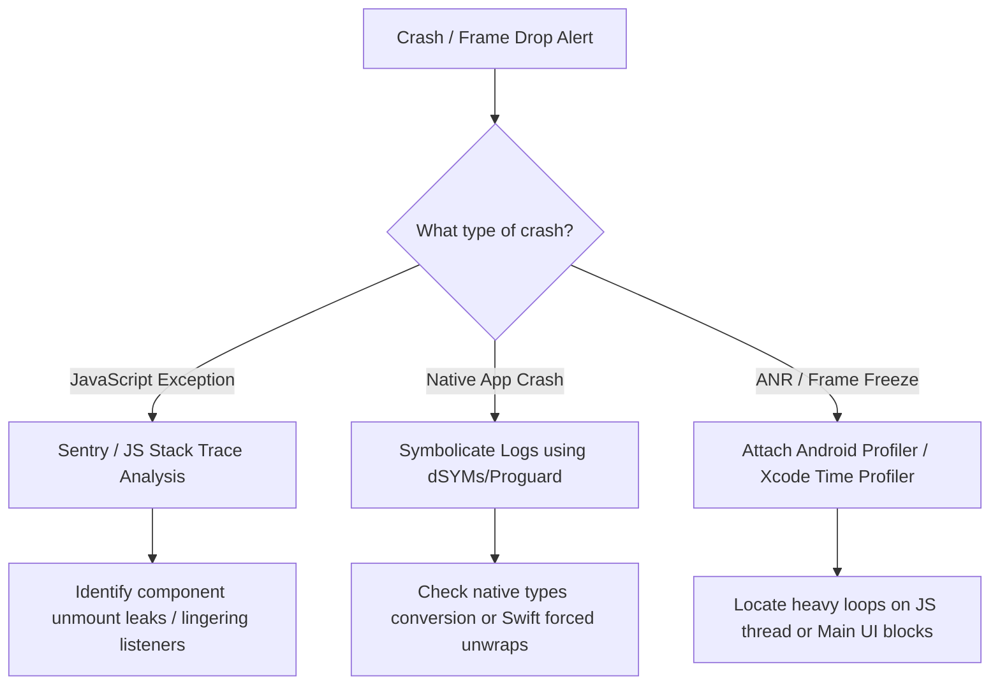

## ⚡ Section 3: Performance Engineering & Memory Triage (Lead Perspective)

*⏱️ 2 min read*

Enterprise applications running complex data graphs require advanced performance triage strategies.

#### 1. Native Profiling (Xcode Instruments & Android Profiler)

When JavaScript thread diagnostics are insufficient, Tech Leads use native platform profiling tools:

- **Xcode Instruments**:
  - **Allocations**: Identifies memory growth trends. Capture memory snapshots before and after screen interaction sequences. Rising persistent generation heights confirm heap leaks.
  - **Time Profiler**: Analyzes CPU core execution paths. Locates thread-blocking execution stacks in native libraries (C++, Swift, Objective-C).
- **Android Studio Profiler**:
  - **CPU Profiler**: Records method traces (Call Charts/Flame Graphs) to locate native methods blocking the Android Main Thread (causing ANR warnings).
  - **Memory Profiler**: Captures Heap Dumps. Analyze classes with high instance counts (e.g., uncollected Bitmaps or leaked Fragment bindings).
  - **Network Profiler**: Tracks outbound request timings, data sizes, and checks for redundant or duplicate API calls.

---

#### 2. Triage of Memory Leaks, Frame Drops, and ANRs/Crashes

##### Diagnostics Pipeline:

- **Resolving ANRs (App Not Responding)**: Occurs when Android's Main Thread is blocked for $>5$ seconds. Ensure all Native Module logic runs on background worker threads using Kotlin coroutines or Java thread pools (`ExecutorService`), returning callbacks to React Native asynchronously.
- **Symbolication**: Upload source maps to Sentry on every build to resolve obfuscated stack traces (like `Bundle.js:1:2034`) to readable paths (e.g., `PaymentScreen.tsx:L142`).

---

#### 3. Large List Optimizations (Shopify FlashList & Layout Caching)

When rendering massive datasets (e.g., directory listings in telecom portals or statements in banking platforms), traditional `FlatList` has high memory footprints due to view node recreation.

- **Shopify FlashList**: Uses **Cell Recycling** (similar to Android's `RecyclerView` or iOS's `UICollectionView`). When cell views scroll out of bounds, they are not unmounted from native memory. Instead, the native view structure is retained, and only the underlying dataset is swapped.
- **Performance Guidelines**:
  - Keep cell layout components lightweight. Avoid complex view hierarchies inside list elements.
  - Use `estimatedItemSize` in FlashList to allow the layout engine to allocate memory buffers accurately.
  - Wrap list rows in `React.memo` with strict value checks to bypass rendering cycles if list updates occur.

---

---
