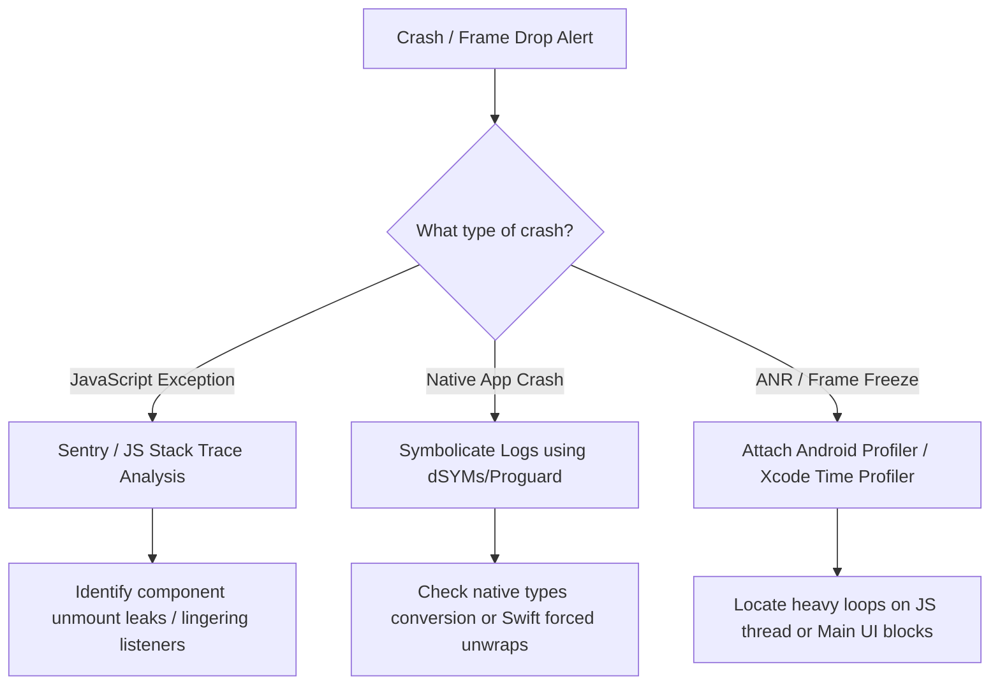

# 🏛️ Senior & Lead React Native Developer Guide (MNC & GSI Focus)

<!-- INDEX_START -->
<details>
  <summary>📖 <b>Table of Contents (Click to expand)</b></summary>

- [🏗️ Section 1: MNC & Consulting Architectural Expectations](#section-1-mnc-consulting-architectural-expectations)
  - [1. Clean Architecture & SOLID Principles in React Native](#1-clean-architecture-solid-principles-in-react-native)
  - [2. Monorepos vs. Multirepos (Yarn, pnpm, Nx) for Large Teams](#2-monorepos-vs-multirepos-yarn-pnpm-nx-for-large-teams)
  - [3. Legacy Migration & Upgrades (e.g., v0.60 to v0.75+)](#3-legacy-migration-upgrades-eg-v060-to-v075)
- [🔒 Section 2: Enterprise Security, Compliance & OWASP Mobile Top 10](#section-2-enterprise-security-compliance-owasp-mobile-top-10)
  - [1. SSL Pinning & Certificate Rotation](#1-ssl-pinning-certificate-rotation)
  - [2. Jailbreak/Root Detection and Frida Instrumentation Defenses](#2-jailbreakroot-detection-and-frida-instrumentation-defenses)
  - [3. Secure Local Storage & Data Isolation (Keychain/Keystore)](#3-secure-local-storage-data-isolation-keychainkeystore)
- [⚡ Section 3: Performance Engineering & Memory Triage (Lead Perspective)](#section-3-performance-engineering-memory-triage-lead-perspective)
  - [1. Native Profiling (Xcode Instruments & Android Profiler)](#1-native-profiling-xcode-instruments-android-profiler)
  - [2. Triage of Memory Leaks, Frame Drops, and ANRs/Crashes](#2-triage-of-memory-leaks-frame-drops-and-anrscrashes)
  - [3. Large List Optimizations (Shopify FlashList & Layout Caching)](#3-large-list-optimizations-shopify-flashlist-layout-caching)
- [📦 Section 4: CI/CD Pipelines, Fastlane & Release Management](#section-4-cicd-pipelines-fastlane-release-management)
  - [1. Fastlane Match & Provisioning Profile Automation](#1-fastlane-match-provisioning-profile-automation)
  - [2. Over-the-Air (OTA) Updates Rollback & Versioning Strategy](#2-over-the-air-ota-updates-rollback-versioning-strategy)
  - [3. Managing App Store Rejections & Play Store Compliance](#3-managing-app-store-rejections-play-store-compliance)
- [💼 Section 5: MNC Client Scenarios & Tech Lead Behavior Q&A](#section-5-mnc-client-scenarios-tech-lead-behavior-q-a)
  - [1. Client-Facing Communication & React Native Recommendations](#1-client-facing-communication-react-native-recommendations)
  - [2. Project Estimation & Resource Planning Methods](#2-project-estimation-resource-planning-methods)
  - [3. Resolving Technical Debt and Team Performance Bottlenecks](#3-resolving-technical-debt-and-team-performance-bottlenecks)
</details>
<!-- INDEX_END -->

---

## 🏗️ Section 1: MNC & Consulting Architectural Expectations
*⏱️ 4 min read*

MNC client architectures require robust separation of concerns, scalability, and long-term maintainability. Senior and Lead developers must design architectures that can scale across large teams and multi-year product cycles.

### 1. Clean Architecture & SOLID Principles in React Native

Applying **Clean Architecture** to React Native ensures that business logic is completely decoupled from the UI framework, styling libraries, and state management frameworks:

```text
[UI Components (Views)] ➡️ [React Hooks (Presenters)] ➡️ [Use Cases (Domain)] ➡️ [Repositories / Adapters (Data)]
       |                           |                                                  |
(Styles, Native Components)  (Local State/Recoil)                             (Axios, Apollo, MMKV)
```

- **Domain Layer (Core)**: Contains pure business entities and use cases. This layer should have zero dependencies on React, React Native, or third-party storage/networking APIs. It defines interface contracts (interfaces) for data fetching.
- **Data Layer (Infrastructure)**: Implements repository interfaces defined by the Domain layer. Handles remote API calls (Axios, Apollo Client), local storage operations (MMKV, SQLite), and caching.
- **Presentation Layer (UI)**: Contains React components, styling (StyleSheet, Tailwind), and local state hooks. It calls Domain use cases to execute business logic.

#### Applying SOLID Principles:
- **Single Responsibility Principle (SRP)**: Split screens into presenting views (UI-only components) and state containers (custom hooks containing data fetching and form control logic).
- **Open/Closed Principle (OCP)**: Design components to accept styles, custom action renderers, or configurations as props instead of hardcoding platform or feature checks directly inside components.
- **Liskov Substitution Principle (LSP)**: Ensure custom wrapper components (e.g. `CustomTextInput`) extend and maintain the native properties interface of React Native's `<TextInput>` without breaking behavior.
- **Interface Segregation Principle (ISP)**: Create small, focused typescript interfaces for components and API models instead of passing large global user objects to components that only require a user name.
- **Dependency Inversion Principle (DIP)**: Use Dependency Injection (DI). UI components depend on abstract hooks or domain interfaces rather than importing concrete API client singletons directly.

---

### 2. Monorepos vs. Multirepos (Yarn, pnpm, Nx) for Large Teams

When coordinating development across multiple sister applications (e.g., customer, partner, agent apps) in large MNC projects, choosing a repository model is a critical decision.

| Model / Feature | Yarn/pnpm Workspaces Monorepo | Nx/Turborepo Monorepo | Multirepos (Separate Git Repos) |
| :--- | :--- | :--- | :--- |
| **Best For** | Medium teams sharing basic TS interfaces & UI elements. | Enterprise-grade multi-app systems with shared native modules. | Siloed teams with completely independent release cycles. |
| **Code Reuse** | High. Shared local folders with workspace symlinks. | Extreme. Enforces strict dependency mapping rules. | Low. Requires publishing private npm packages. |
| **CI/CD Build caching** | Basic. Rebuilds everything unless custom scripts exist. | Advanced. Invalidate cache based on code hashes. | Separate builds. No cross-repo cache sharing. |
| **Dependency Lock** | Single Lockfile. Keeps packages on identical versions. | Single lockfile or workspace scoping options. | Multiple lockfiles. Version drift is common. |

#### Architectural Lead Strategy:
For large-scale teams (50+ engineers), configure **Nx Monorepos** with **pnpm**:
- Enforce boundaries using Nx module tags (e.g., `app:customer` cannot import from `app:agent` directly).
- Use dynamic path mapping in `tsconfig.json` to prevent relative import paths (e.g., import from `@shared/ui` instead of `../../shared/ui`).
- Implement independent version tagging inside packages to decouple deployment cycles while maintaining single-source code storage.

---

### 3. Legacy Migration & Upgrades (e.g., v0.60 to v0.75+)

Tech Leads are frequently tasked with resolving technical debt by migrating legacy apps or executing major version upgrades.

#### A. Upgrading Legacy React Native (e.g., v0.63 to v0.75+):
1. **Analyze Dependencies**: Run audits to check compatibility of third-party native libraries with the target React Native version and Hermes.
2. **Utilize React Native Upgrade Helper**: Generate code diffs for native files (`AndroidManifest.xml`, `AppDelegate.mm`, `build.gradle`, `Podfile`) using the community upgrade tool.
3. **Execute Upgrade Steps (Incrementally)**: Upgrading across multiple major versions (e.g., 0.63 ➡️ 0.68 ➡️ 0.72 ➡️ 0.75) is safer than jumping directly.
4. **Hermes & New Architecture Migration**:
   - Enable Hermes on iOS (`use_hermes => true` in Podfile) and Android (`hermesEnabled=true` in gradle.properties).
   - Resolve Objective-C compiler flags in Xcode to transition to the new `RCTAppDelegate` structure.
   - Enforce TurboModules/Fabric compatibility. Create temporary bridging compatibility layers if legacy libraries fail to implement the new C++ JSI specs.

#### B. Migrating Native Android/iOS to React Native:
- **Phase 1: Hybrid Integration (Sub-views)**: Rather than rewriting the entire app, integrate React Native as a single fragment/controller inside the native application. Load the `ReactRootView` inside an Android Activity or iOS UIViewController.
- **Phase 2: Data Bridge Synchronization**: Synchronize authentication states, database registries, and configurations between the native container and React Native JS context using custom bridge events.
- **Phase 3: Incremental Screen Replaces**: Replace legacy screens one-by-one based on feature updates. Once the container navigation is fully replaced by React Navigation, remove native routing files completely.

---

## 🔒 Section 2: Enterprise Security, Compliance & OWASP Mobile Top 10
*⏱️ 2 min read*

Enterprise banking, healthcare, and telecom clients require strict mobile security standards. Lead developers must design applications to protect user data and binary integrity.

### 1. SSL Pinning & Certificate Rotation

To defend against Man-in-the-Middle (MitM) attacks on public networks, enterprise configurations enforce **SSL Pinning**:

```text
[Mobile App Request] ➡️ Check server certificate hash ➡️ Does it match pre-bundled pin?
                                                                 |
                                                Yes ➡️ Execute request
                                                No  ➡️ Drop connection immediately
```

- **Implementation**: Avoid JavaScript-layer pinning (which is easily bypassed by runtime instrumentation tools like Frida). Implement SSL pinning at the native platform layers:
  - **Android**: Use `OkHttpClient`'s `CertificatePinner` with SHA-256 hashes of the server's public key certificate.
  - **iOS**: Integrate `TrustKit` via Podfile config.
- **Certificate Rotation Strategy**: Bundling static pins in the app binary causes app breakage when certificates expire. Secure configurations:
  - Bundle **backup pins** (e.g., root CA pins or secondary intermediate CA keys).
  - Implement a **dynamic certificate rotation link** (fetch signed, updated pin lists from an authenticated secondary secure endpoint before updating the main API client configurations in memory).

---

### 2. Jailbreak/Root Detection and Frida Instrumentation Defenses

Attackers decompile binaries and run them on rooted/jailbroken devices to inspect active memory and intercept security functions.

- **Defensive Measures**:
  - **Jailbreak Detection (iOS)**: Check for jailbreak directories (e.g., `/Applications/Cydia.app`), check sandbox integrity by writing to restricted folders, and evaluate if standard native fork calls succeed.
  - **Root Detection (Android)**: Search for the presence of the `su` binary, look for Magisk Manager package registries, and check if test-keys signatures are active on the running kernel.
  - **Anti-Frida Safeguards**: Frida injects dynamic agent libraries and listens on default port `27042`. Use C/C++ native modules to scan `/proc/self/maps` at startup to detect injected `.so` files, and scan local sockets to drop connections if Frida ports are active.

---

### 3. Secure Local Storage & Data Isolation (Keychain/Keystore)

The OWASP Mobile Top 10 highlights **Insecure Data Storage** as a top vulnerability.

- **Data Isolation**: Never write authentication details, user profiles, or transaction states in plain JSON text format (e.g., standard `AsyncStorage`).
- **Encrypted MMKV**: Wrap MMKV instances with an AES-256 encryption key.
- **Hardware Enclave Binding**: Secure the encryption key itself by writing it to the device's hardware enclaves: **iOS Keychain** and **Android Keystore** (via `react-native-keychain`). The key is resolved in memory only when the application context launches and is verified using biometrics.

---

## ⚡ Section 3: Performance Engineering & Memory Triage (Lead Perspective)
*⏱️ 2 min read*

Enterprise applications running complex data graphs require advanced performance triage strategies.

### 1. Native Profiling (Xcode Instruments & Android Profiler)

When JavaScript thread diagnostics are insufficient, Tech Leads use native platform profiling tools:

- **Xcode Instruments**:
  - **Allocations**: Identifies memory growth trends. Capture memory snapshots before and after screen interaction sequences. Rising persistent generation heights confirm heap leaks.
  - **Time Profiler**: Analyzes CPU core execution paths. Locates thread-blocking execution stacks in native libraries (C++, Swift, Objective-C).
- **Android Studio Profiler**:
  - **CPU Profiler**: Records method traces (Call Charts/Flame Graphs) to locate native methods blocking the Android Main Thread (causing ANR warnings).
  - **Memory Profiler**: Captures Heap Dumps. Analyze classes with high instance counts (e.g., uncollected Bitmaps or leaked Fragment bindings).
  - **Network Profiler**: Tracks outbound request timings, data sizes, and checks for redundant or duplicate API calls.

---

### 2. Triage of Memory Leaks, Frame Drops, and ANRs/Crashes

#### Diagnostics Pipeline:



- **Resolving ANRs (App Not Responding)**: Occurs when Android's Main Thread is blocked for $>5$ seconds. Ensure all Native Module logic runs on background worker threads using Kotlin coroutines or Java thread pools (`ExecutorService`), returning callbacks to React Native asynchronously.
- **Symbolication**: Upload source maps to Sentry on every build to resolve obfuscated stack traces (like `Bundle.js:1:2034`) to readable paths (e.g., `PaymentScreen.tsx:L142`).

---

### 3. Large List Optimizations (Shopify FlashList & Layout Caching)

When rendering massive datasets (e.g., directory listings in telecom portals or statements in banking platforms), traditional `FlatList` has high memory footprints due to view node recreation.

- **Shopify FlashList**: Uses **Cell Recycling** (similar to Android's `RecyclerView` or iOS's `UICollectionView`). When cell views scroll out of bounds, they are not unmounted from native memory. Instead, the native view structure is retained, and only the underlying dataset is swapped.
- **Performance Guidelines**:
  - Keep cell layout components lightweight. Avoid complex view hierarchies inside list elements.
  - Use `estimatedItemSize` in FlashList to allow the layout engine to allocate memory buffers accurately.
  - Wrap list rows in `React.memo` with strict value checks to bypass rendering cycles if list updates occur.

---

## 📦 Section 4: CI/CD Pipelines, Fastlane & Release Management
*⏱️ 2 min read*

In large MNC teams, manual app compilation is unacceptable. Automated deployment guarantees reproducibility and consistency.

### 1. Fastlane Match & Provisioning Profile Automation

Managing iOS certificate files and provisioning profiles across multiple developers and build agents frequently causes build failures.

- **Fastlane Match**: Implements a Git-based code signing strategy:
  - All developer and distribution certificates, along with their matching provisioning profiles, are encrypted using a symmetric passphrase and stored in a private Git repository.
  - During local or CI/CD builds, Fastlane clones this repository, decrypts the certificates, and installs them directly onto the build machine.
  - Prevents provisioning profile mismatches, duplicate certificate creations, and ensures Xcode builds execute successfully.

---

### 2. Over-the-Air (OTA) Updates Rollback & Versioning Strategy

OTA updates (CodePush / Expo Updates) allow immediate JS-only updates without App Store reviews. However, they carry significant runtime crash risks if managed poorly.

- **The Gold Rules of OTA Versioning**:
  - **Target Binary Locking**: Every OTA bundle must target specific native binary versions (e.g., `~1.4.0` or `1.4.x`). Never target open ranges if native dependencies are updated.
  - **Checking Native Signatures**: If an update changes a native module binding (e.g. adding a new native library), you must bump the binary version. If an old binary downloads the new JS bundle, it will crash immediately due to missing native selectors.
- **Rollback Orchestration**:
  - Configure the updater client to track app start health. If the app crashes twice within 2 minutes of applying an OTA bundle, the updater client must roll back to the stable local embedded bundle immediately.

---

### 3. Managing App Store Rejections & Play Store Compliance

Tech Leads must navigate compliance requirements to avoid release delays:

- **App Store Rejections (Apple Guidelines)**:
  - *Guideline 2.1 (Performance)*: Ensure Apple reviewers can log in (provide valid mock credentials) and that the app runs without placeholder data or network timeouts.
  - *Guideline 4.8 (Sign in with Apple)*: If the app implements third-party social logins (Google, Facebook), you **must** also provide Apple Sign-In as an equivalent option.
  - *Guideline 5.1.1 (Privacy)*: Declare all background permissions clearly in the `Info.plist` (e.g., Location, Camera) and request usage authorization prompt messages.
- **Play Store Compliance (Google Policies)**:
  - *Target SDK Updates*: Android requires apps to target recent Android API versions. Ensure `compileSdkVersion` and `targetSdkVersion` are updated annually.
  - *Google Play Billing*: Paid features must route through Google Billing APIs rather than external payment portals.

---

## 💼 Section 5: MNC Client Scenarios & Tech Lead Behavior Q&A
*⏱️ 3 min read*

These scenarios evaluate consulting capabilities, leadership skills, and architectural decision-making.

### 1. Client-Facing Communication & React Native Recommendations

#### Interview Scenario:
> *"A banking client asks if they should rebuild their existing native iOS and Android retail banking apps using React Native. How do you advise them?"*

- **Strategic Response**:
  "I would guide the client through an Objective Decision Matrix, evaluating their product roadmap, engineering resources, and performance requirements:
  - **When to recommend React Native**:
    - If the product roadmap focuses on UI interactions, forms, statements, data charts, and dynamic content updates.
    - If the client wants to reduce maintenance costs by unifying business logic (TypeScript) and styling across a single team, reducing feature release cycles.
  - **When to retain Native (Swift/Kotlin)**:
    - If the app integrates low-level hardware or OS services (e.g., continuous background location tracking, background audio processing).
    - If the app requires high-performance GPU-bound processing (e.g., real-time face detection models, AR/VR scanning).
  - **Hybrid Recommendation (The Enterprise Way)**:
    - For large banks, I recommend a **Hybrid Strategy**. Retain native containers for core security frameworks, device token registrations, and biometrics. Integrate React Native inside native Activities/Controllers to deliver feature screens (e.g., loans, rewards). This combines native security with cross-platform release speeds."

---

### 2. Project Estimation & Resource Planning Methods

#### Interview Scenario:
> *"How do you estimate a complex project migration from legacy architectures to React Native?"*

- **Strategic Response**:
  "I apply a multi-tier estimation approach to ensure accuracy and account for integration risks:
  - **1. Feature Decomposition**: Break down the application into modular components: Core Infrastructure (Auth, Networking, Secure Storage), Shared UI Kit components, Feature Screens, and Native Integrations (Custom bridges, push notifications).
  - **2. Three-Point Estimation**: For each component, I gather inputs from senior team members to calculate:
    - $O$: Optimistic duration
    - $P$: Pessimistic duration
    - $M$: Most Likely duration
    - Calculate expected duration using: $E = \frac{O + 4M + P}{6}$
  - **3. Risk Buffer Allocation**: Add a 20-30% buffer specifically for native module integration, build pipeline setups, and third-party SDK upgrades.
  - **4. Sprint Planning Integration**: Map feature components to 2-week sprints, accounting for velocity, testing cycles, and store approval queues."

---

### 3. Resolving Technical Debt and Team Performance Bottlenecks

#### Interview Scenario:
> *"You join a team where the React Native app build is extremely slow, developers complain about continuous merge conflicts, and crash rates in production are rising. What is your first 30-day action plan?"*

- **Strategic Response**:
  "My first 30 days would follow a structured assessment and remediation framework:
  - **Days 1–10: Audit and Diagnostics**:
    - Analyze crash logs in Sentry to identify the top 3 crash causes.
    - Audit the current CI/CD pipeline bottlenecks (e.g., identify why local caching is disabled during node module restorations).
    - Map dependency graphs to locate version mismatches.
  - **Days 11–20: Immediate Remediations (Quick Wins)**:
    - Implement strict Git hooks (Husky, lint-staged) to enforce linting and type-checks before commits occur, reducing compiler breakages.
    - Fix the top 3 crash causes to stabilize production.
    - Configure dependency cache directories on CI/CD runners to reduce build times by 40-50%.
  - **Days 21–30: Long-Term Architecture Setup**:
    - Introduce feature-based folder organization to isolate code changes, minimizing git merge conflicts.
    - Establish a monorepo strategy if multiple teams are working on shared packages.
    - Draft clear documentation, alignment guidelines, and define automated code review rules."
