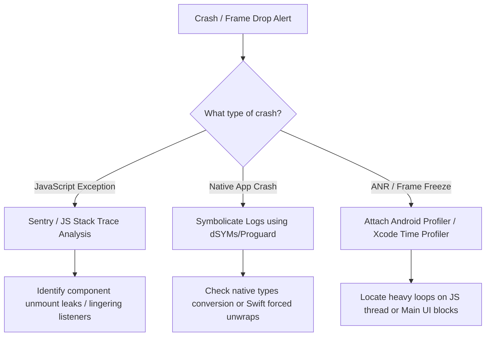

# 🏛️ Senior & Lead React Native Developer Guide (MNC & GSI Focus)

<!-- INDEX_START -->
<details>
  <summary>📖 <b>विषय सूची (Table of Contents - विस्तार करने के लिए क्लिक करें)</b></summary>

- [🏗️ Section 1: MNC & Consulting Architectural Expectations](#section-1-mnc-consulting-architectural-expectations)
  - [1. Clean Architecture & SOLID Principles in React Native](#1-clean-architecture-solid-principles-in-react-native)
  - [2. Monorepos vs. Multirepos (Yarn, pnpm, Nx) for Large Teams](#2-monorepos-vs-multirepos-yarn-pnpm-nx-for-large-teams)
  - [3. Legacy Migration & Upgrades (e.g., v0.60 to v0.75+)](#3-legacy-migration-upgrades-eg-v060-to-v075)
- [🔒 Section 2: Enterprise Security, Compliance & OWASP Mobile Top 10](#section-2-enterprise-security-compliance-owasp-mobile-top-10)
  - [1. SSL Pinning & Certificate Rotation](#1-ssl-pinning-certificate-rotation)
  - [2. Jailbreak/Root Detection and Frida Instrumentation Defenses](#2-jailbreakroot-detection-and-frida-instrumentation-defenses)
  - [3. Secure Local Storage & Data Isolation (Keychain/Keystore)](#3-secure-local-storage-data-isolation-keychainkeystore)
- [⚡ Section 3: Performance Engineering & Memory Triage (Lead Perspective)](#section-3-performance-engineering-memory-triage-lead-perspective)
  - [1. Native Profiling (Xcode Instruments & Android Profiler)](#1-native-profiling-xcode-instruments-android-profiler)
  - [2. Triage of Memory Leaks, Frame Drops, and ANRs/Crashes](#2-triage-of-memory-leaks-frame-drops-and-anrscrashes)
  - [3. Large List Optimizations (Shopify FlashList & Layout Caching)](#3-large-list-optimizations-shopify-flashlist-layout-caching)
- [📦 Section 4: CI/CD Pipelines, Fastlane & Release Management](#section-4-cicd-pipelines-fastlane-release-management)
  - [1. Fastlane Match & Provisioning Profile Automation](#1-fastlane-match-provisioning-profile-automation)
  - [2. Over-the-Air (OTA) Updates Rollback & Versioning Strategy](#2-over-the-air-ota-updates-rollback-versioning-strategy)
  - [3. Managing App Store Rejections & Play Store Compliance](#3-managing-app-store-rejections-play-store-compliance)
- [💼 Section 5: MNC Client Scenarios & Tech Lead Behavior Q&A](#section-5-mnc-client-scenarios-tech-lead-behavior-q-a)
  - [1. Client-Facing Communication & React Native Recommendations](#1-client-facing-communication-react-native-recommendations)
  - [2. Project Estimation & Resource Planning Methods](#2-project-estimation-resource-planning-methods)
  - [3. Resolving Technical Debt and Team Performance Bottlenecks](#3-resolving-technical-debt-and-team-performance-bottlenecks)
</details>
<!-- INDEX_END -->

---

## 🏗️ Section 1: MNC & Consulting Architectural Expectations
*⏱️ 4 min read*

MNC client architectures को robust Separation of Concerns, scalability, और long-term maintainability की आवश्यकता होती है। Senior और Lead developers को ऐसी architectures design करनी चाहिए जो बड़ी teams और multi-year product cycles में scale हो सकें।

### 1. Clean Architecture & SOLID Principles in React Native

React Native में **Clean Architecture** लागू करने से यह सुनिश्चित होता है कि business logic पूरी तरह से UI framework, styling libraries, और state management frameworks से decoupled (अलग) हो जाए:

```text
[UI Components (Views)] ➡️ [React Hooks (Presenters)] ➡️ [Use Cases (Domain)] ➡️ [Repositories / Adapters (Data)]
       |                           |                                                  |
(Styles, Native Components)  (Local State/Recoil)                             (Axios, Apollo, MMKV)
```

- **Domain Layer (Core)**: इसमें शुद्ध business entities और use cases होते हैं। इस layer की React, React Native, या third-party storage/networking APIs पर शून्य dependency होनी चाहिए। यह data fetching के लिए interface contracts (interfaces) को परिभाषित (define) करता है।
- **Data Layer (Infrastructure)**: Domain layer द्वारा परिभाषित repository interfaces को implement करता है। यह remote API calls (Axios, Apollo Client), local storage operations (MMKV, SQLite), और caching को संभालता है।
- **Presentation Layer (UI)**: इसमें React components, styling (StyleSheet, Tailwind), और local state hooks होते हैं। यह business logic को execute करने के लिए Domain use cases को call करता है।

#### SOLID Principles को लागू करना:
- **Single Responsibility Principle (SRP)**: Screens को presenting views (UI-only components) और state containers (custom hooks जिसमें data fetching और form control logic हो) में विभाजित (split) करें।
- **Open/Closed Principle (OCP)**: Components को इस तरह design करें कि वे props के रूप में styles, custom action renderers, या configurations स्वीकार कर सकें, बजाय इसके कि components के अंदर सीधे platform या feature checks को hardcode किया जाए।
- **Liskov Substitution Principle (LSP)**: सुनिश्चित करें कि custom wrapper components (जैसे `CustomTextInput`) बिना किसी व्यवहार (behavior) को तोड़े React Native के `<TextInput>` के native properties interface को extend और बनाए रखें।
- **Interface Segregation Principle (ISP)**: Components और API models के लिए छोटे, केंद्रित (focused) typescript interfaces बनाएं, बजाय इसके कि उन components को बड़े global user objects पास किए जाएं जिन्हें केवल user name की आवश्यकता होती है।
- **Dependency Inversion Principle (DIP)**: Dependency Injection (DI) का उपयोग करें। UI components सीधे concrete API client singletons को import करने के बजाय abstract hooks या domain interfaces पर निर्भर (depend) करते हैं।

---

### 2. Monorepos vs. Multirepos (Yarn, pnpm, Nx) बड़ी Teams के लिए

MNC projects में कई sister applications (जैसे, customer, partner, agent apps) में development को coordinate करते समय, सही repository model चुनना एक महत्वपूर्ण निर्णय है।

| Model / Feature | Yarn/pnpm Workspaces Monorepo | Nx/Turborepo Monorepo | Multirepos (Separate Git Repos) |
| :--- | :--- | :--- | :--- |
| **Best For** | Medium teams जो basic TS interfaces और UI elements साझा (share) करती हैं। | Enterprise-grade multi-app systems जिसमें shared native modules हों। | पूरी तरह से स्वतंत्र (independent) release cycles वाली अलग-अलग teams। |
| **Code Reuse** | High. workspace symlinks के साथ shared local folders। | Extreme. सख्त dependency mapping rules लागू करता है। | Low. private npm packages को publish करने की आवश्यकता होती है। |
| **CI/CD Build caching** | Basic. जब तक custom scripts न हों, सब कुछ फिर से build करता है। | Advanced. code hashes के आधार पर cache को अमान्य (invalidate) करता है। | Separate builds. कोई cross-repo cache sharing नहीं। |
| **Dependency Lock** | Single Lockfile. packages को समान versions पर रखता है। | Single lockfile या workspace scoping options। | Multiple lockfiles. Version drift होना आम बात है। |

#### Architectural Lead Strategy:
बड़े पैमाने की teams (50+ engineers) के लिए, **pnpm** के साथ **Nx Monorepos** configure करें:
- Nx module tags का उपयोग करके सीमाएं (boundaries) लागू करें (जैसे, `app:customer` सीधे `app:agent` से import नहीं कर सकता)।
- relative import paths से बचने के लिए `tsconfig.json` में dynamic path mapping का उपयोग करें (जैसे, `../../shared/ui` के बजाय `@shared/ui` से import करें)।
- package के अंदर स्वतंत्र version tagging लागू करें ताकि single-source code storage को बनाए रखते हुए deployment cycles को decoupled किया जा सके।

---

### 3. Legacy Migration & Upgrades (जैसे, v0.60 से v0.75+)

Tech Leads को अक्सर legacy apps को migrate करके या major version upgrades करके technical debt को हल करने का काम सौंपा जाता है।

#### A. Legacy React Native को Upgrade करना (जैसे, v0.63 से v0.75+):
1. **Analyze Dependencies**: target React Native version और Hermes के साथ third-party native libraries की compatibility जांचने के लिए audit चलाएं।
2. **React Native Upgrade Helper का उपयोग करें**: community upgrade tool का उपयोग करके native files (`AndroidManifest.xml`, `AppDelegate.mm`, `build.gradle`, `Podfile`) के लिए code diffs उत्पन्न (generate) करें।
3. **Upgrade Steps को क्रमिक रूप से (Incrementally) निष्पादित करें**: सीधे कूदने के बजाय कई major versions (जैसे, 0.63 ➡️ 0.68 ➡️ 0.72 ➡️ 0.75) में अपग्रेड करना अधिक सुरक्षित है।
4. **Hermes & New Architecture Migration**:
   - iOS पर Hermes सक्षम (enable) करें (Podfile में `use_hermes => true`) और Android पर (`gradle.properties` में `hermesEnabled=true`)।
   - नए `RCTAppDelegate` structure में transition करने के लिए Xcode में Objective-C compiler flags को हल करें।
   - TurboModules/Fabric compatibility लागू करें। यदि legacy libraries नई C++ JSI specs को implement करने में विफल रहती हैं, तो अस्थायी (temporary) bridging compatibility layers बनाएं।

#### B. Native Android/iOS को React Native में Migrate करना:
- **Phase 1: Hybrid Integration (Sub-views)**: पूरे ऐप को दोबारा लिखने के बजाय, React Native को native application के अंदर एक fragment/controller के रूप में एकीकृत (integrate) करें। native Android Activity या iOS UIViewController के अंदर `ReactRootView` लोड करें।
- **Phase 2: Data Bridge Synchronization**: custom bridge events का उपयोग करके native container और React Native JS context के बीच authentication states, database registries, और configurations को synchronize करें।
- **Phase 3: Incremental Screen Replaces**: feature updates के आधार पर एक-एक करके legacy screens को बदलें। एक बार जब container navigation पूरी तरह से React Navigation द्वारा बदल दिया जाता है, तो native routing files को पूरी तरह से हटा दें।

---

## 🔒 Section 2: Enterprise Security, Compliance & OWASP Mobile Top 10
*⏱️ 2 min read*

Enterprise banking, healthcare, और telecom clients को सख्त mobile security standards की आवश्यकता होती है। Lead developers को user data और binary integrity की रक्षा करने के लिए applications design करने चाहिए।

### 1. SSL Pinning & Certificate Rotation

Public networks पर Man-in-the-Middle (MitM) हमलों से बचाव के लिए, enterprise configurations **SSL Pinning** लागू करती हैं:

```text
[Mobile App Request] ➡️ Check server certificate hash ➡️ Does it match pre-bundled pin?
                                                                 |
                                                Yes ➡️ Execute request
                                                No  ➡️ Drop connection immediately
```

- **Implementation**: JavaScript-layer pinning से बचें (जिसे Frida जैसे runtime instrumentation tools द्वारा आसानी से बाईपास किया जा सकता है)। SSL pinning को native platform layers पर लागू करें:
  - **Android**: server की public key certificate के SHA-256 hashes के साथ `OkHttpClient` के `CertificatePinner` का उपयोग करें।
  - **iOS**: Podfile config के माध्यम से `TrustKit` को एकीकृत (integrate) करें।
- **Certificate Rotation Strategy**: app binary में static pins को बंडल करने से certificates समाप्त (expire) होने पर ऐप टूट जाता है। सुरक्षित configurations:
  - **backup pins** बंडल करें (जैसे, root CA pins या secondary intermediate CA keys)।
  - एक **dynamic certificate rotation link** लागू करें (main API client configurations को memory में update करने से पहले एक authenticated secondary secure endpoint से signed, updated pin lists प्राप्त करें)।

---

### 2. Jailbreak/Root Detection और Frida Instrumentation से बचाव

Attackers binaries को decompile करते हैं और active memory का निरीक्षण (inspect) करने और security functions को बाधित करने के लिए उन्हें rooted/jailbroken devices पर चलाते हैं।

- **Defensive Measures**:
  - **Jailbreak Detection (iOS)**: jailbreak directories की जांच करें (जैसे, `/Applications/Cydia.app`), restricted folders में लिखकर sandbox integrity का मूल्यांकन करें, और जांचें कि क्या standard native fork calls सफल होती हैं।
  - **Root Detection (Android)**: `su` binary की उपस्थिति की खोज करें, Magisk Manager package registries की तलाश करें, और जांचें कि क्या चल रहे kernel पर test-keys signatures active हैं।
  - **Anti-Frida Safeguards**: Frida dynamic agent libraries को inject करता है और default port `27042` पर सुनता है। startup पर `/proc/self/maps` को scan करने के लिए C/C++ native modules का उपयोग करें ताकि injected `.so` files का पता लगाया जा सके, और यदि Frida ports active हैं तो connections को समाप्त करने के लिए local sockets को scan करें।

---

### 3. Secure Local Storage & Data Isolation (Keychain/Keystore)

OWASP Mobile Top 10 **Insecure Data Storage** को एक प्रमुख vulnerability के रूप में उजागर करता है।

- **Data Isolation**: authentication details, user profiles, या transaction states को कभी भी plain JSON text format में न लिखें (जैसे, standard `AsyncStorage`)।
- **Encrypted MMKV**: MMKV instances को AES-256 encryption key से सुरक्षित करें।
- **Hardware Enclave Binding**: encryption key को device के hardware enclaves में लिखकर सुरक्षित करें: **iOS Keychain** और **Android Keystore** (`react-native-keychain` के माध्यम से)। key को memory में केवल तब resolve किया जाता है जब application context लॉन्च होता है और biometrics का उपयोग करके सत्यापित (verify) किया जाता है।

---

## ⚡ Section 3: Performance Engineering & Memory Triage (Lead Perspective)
*⏱️ 2 min read*

Complex data graphs चलाने वाले Enterprise applications को advanced performance triage strategies की आवश्यकता होती है।

### 1. Native Profiling (Xcode Instruments & Android Profiler)

जब JavaScript thread diagnostics अपर्याप्त होते हैं, तो Tech Leads native platform profiling tools का उपयोग करते हैं:

- **Xcode Instruments**:
  - **Allocations**: memory growth trends की पहचान करता है। screen interaction sequences से पहले और बाद में memory snapshots लें। लगातार persistent generation heights बढ़ने से heap leaks की पुष्टि होती है।
  - **Time Profiler**: CPU core execution paths का विश्लेषण करता है। native libraries (C++, Swift, Objective-C) में thread-blocking execution stacks का पता लगाता है।
- **Android Studio Profiler**:
  - **CPU Profiler**: Android Main Thread को ब्लॉक करने वाले native methods (ANR warnings के कारण) का पता लगाने के लिए method traces (Call Charts/Flame Graphs) रिकॉर्ड करता है।
  - **Memory Profiler**: Heap Dumps कैप्चर करता है। उच्च instance counts वाले classes का विश्लेषण करें (जैसे, uncollected Bitmaps या leaked Fragment bindings)।
  - **Network Profiler**: outbound request timings, data sizes को track करता है और redundant या duplicate API calls की जांच करता है।

---

### 2. Triage of Memory Leaks, Frame Drops, और ANRs/Crashes

#### Diagnostics Pipeline:



- **ANRs (App Not Responding) को हल करना**: यह तब होता है जब Android का Main Thread $>5$ seconds के लिए ब्लॉक हो जाता है। सुनिश्चित करें कि सभी Native Module logic background worker threads पर Kotlin coroutines या Java thread pools (`ExecutorService`) का उपयोग करके चलें, और callbacks को React Native में asynchronously लौटाएं।
- **Symbolication**: obfuscated stack traces (जैसे `Bundle.js:1:2034`) को पठनीय paths (जैसे, `PaymentScreen.tsx:L142`) में बदलने के लिए हर build पर Sentry पर source maps अपलोड करें।

---

### 3. Large List Optimizations (Shopify FlashList & Layout Caching)

Massive datasets (जैसे banking platforms में statements या telecom portals में directory listings) को render करते समय, traditional `FlatList` में view node recreation के कारण memory footprints बहुत अधिक होते हैं।

- **Shopify FlashList**: यह **Cell Recycling** का उपयोग करता है (Android के `RecyclerView` या iOS के `UICollectionView` के समान)। जब cell views screen से बाहर scroll होते हैं, तो वे native memory से unmount नहीं होते हैं। इसके बजाय, native view structure को बनाए रखा जाता है, और केवल underlying dataset को बदला (swap) जाता है।
- **Performance Guidelines**:
  - cell layout components को हल्का रखें। list elements के अंदर जटिल view hierarchies से बचें।
  - layout engine को memory buffers को सटीक रूप से allocate करने की अनुमति देने के लिए FlashList में `estimatedItemSize` का उपयोग करें।
  - यदि list updates होते हैं तो rendering cycles को बायपास करने के लिए list rows को strict value checks के साथ `React.memo` में लपेटें।

---

## 📦 Section 4: CI/CD Pipelines, Fastlane & Release Management
*⏱️ 2 min read*

बड़ी MNC teams में, manual app compilation अस्वीकार्य है। Automated deployment प्रतिरूपकता (reproducibility) और निरंतरता सुनिश्चित करता है।

### 1. Fastlane Match & Provisioning Profile Automation

कई developers और build agents में iOS certificate files और provisioning profiles को प्रबंधित (manage) करने से अक्सर build failures होते हैं।

- **Fastlane Match**: एक Git-आधारित code signing strategy लागू करता है:
  - सभी developer और distribution certificates, उनके matching provisioning profiles के साथ, एक symmetric passphrase का उपयोग करके encrypt किए जाते हैं और एक private Git repository में संग्रहीत (store) किए जाते हैं।
  - local या CI/CD builds के दौरान, Fastlane इस repository को clone करता है, certificates को decrypt करता है, और उन्हें सीधे build machine पर install करता है।
  - यह provisioning profile mismatches, duplicate certificate creations को रोकता है, और सुनिश्चित करता है कि Xcode builds सफलतापूर्वक निष्पादित (execute) हों।

---

### 2. Over-the-Air (OTA) Updates Rollback & Versioning Strategy

OTA updates (CodePush / Expo Updates) App Store reviews के बिना तत्काल JS-only updates की अनुमति देते हैं। हालांकि, यदि उन्हें ठीक से प्रबंधित नहीं किया जाता है, तो वे महत्वपूर्ण runtime crash जोखिम पैदा करते हैं।

- **OTA Versioning के सुनहरे नियम (Gold Rules)**:
  - **Target Binary Locking**: प्रत्येक OTA bundle को विशिष्ट native binary versions (जैसे, `~1.4.0` या `1.4.x`) को target करना चाहिए। यदि native dependencies को update किया जाता है, तो open ranges को कभी target न करें।
  - **Native Signatures की जांच**: यदि कोई update native module binding को बदलता है (जैसे कि एक नई native library जोड़ना), तो आपको binary version बढ़ाना (bump) होगा। यदि कोई पुराना binary नया JS bundle डाउनलोड करता है, तो missing native selectors के कारण यह तुरंत crash हो जाएगा।
- **Rollback Orchestration**:
  - app start health को track करने के लिए updater client को configure करें। यदि OTA bundle लागू करने के 2 मिनट के भीतर ऐप दो बार crash हो जाता है, तो updater client को तुरंत stable local embedded bundle पर वापस (roll back) आ जाना चाहिए।

---

### 3. App Store Rejections & Play Store Compliance को संभालना

Tech Leads को release में देरी से बचने के लिए compliance आवश्यकताओं को नेविगेट करना चाहिए:

- **App Store Rejections (Apple Guidelines)**:
  - *Guideline 2.1 (Performance)*: सुनिश्चित करें कि Apple reviewers log in कर सकें (वैध mock credentials प्रदान करें) और ऐप बिना placeholder data या network timeouts के चले।
  - *Guideline 4.8 (Sign in with Apple)*: यदि ऐप third-party social logins (Google, Facebook) लागू करता है, तो आपको Apple Sign-In को एक समान विकल्प के रूप में प्रदान **करना होगा**।
  - *Guideline 5.1.1 (Privacy)*: `Info.plist` में सभी background permissions को स्पष्ट रूप से घोषित (declare) करें (जैसे, Location, Camera) और usage authorization prompt messages का अनुरोध करें।
- **Play Store Compliance (Google Policies)**:
  - *Target SDK Updates*: Android को हाल के Android API versions को target करने के लिए ऐप्स की आवश्यकता होती है। सुनिश्चित करें कि `compileSdkVersion` और `targetSdkVersion` सालाना updated हों।
  - *Google Play Billing*: भुगतान वाली सुविधाओं (paid features) को external payment portals के बजाय Google Billing APIs के माध्यम से रूट किया जाना चाहिए।

---

## 💼 Section 5: MNC Client Scenarios & Tech Lead Behavior Q&A
*⏱️ 3 min read*

ये scenarios consulting capabilities, leadership skills, और architectural decision-making का मूल्यांकन करते हैं।

### 1. Client-Facing Communication & React Native Recommendations

#### Interview Scenario:
> *"एक banking client पूछता है कि क्या उन्हें अपने मौजूदा native iOS और Android retail banking apps को React Native का उपयोग करके फिर से बनाना चाहिए। आप उन्हें क्या सलाह देते हैं?"*

- **Strategic Response**:
  "मैं client को उनके product roadmap, engineering resources, और performance आवश्यकताओं का मूल्यांकन करते हुए एक Objective Decision Matrix के माध्यम से गाइड करूँगा:
  - **React Native की सिफारिश कब करें**:
    - यदि product roadmap UI interactions, forms, statements, data charts, और dynamic content updates पर केंद्रित है।
    - यदि client shared typescript code और styling के माध्यम से single team के साथ maintenance लागत को कम करना चाहता है, जिससे feature release cycles कम हो जाते हैं।
  - **Native (Swift/Kotlin) को कब बनाए रखें**:
    - यदि ऐप low-level hardware या OS services को एकीकृत करता है (जैसे, continuous background location tracking, background audio processing)।
    - यदि ऐप को उच्च-प्रदर्शन GPU-bound processing की आवश्यकता होती है (जैसे, real-time face detection models, AR/VR scanning)।
  - **Hybrid Recommendation (The Enterprise Way)**:
    - बड़े बैंकों के लिए, मैं एक **Hybrid Strategy** की सिफारिश करता हूँ। core security frameworks, device token registrations, और biometrics के लिए native containers को बनाए रखें। feature screens (जैसे, loans, rewards) वितरित करने के लिए native Activities/Controllers के अंदर React Native को एकीकृत करें। यह native security को cross-platform release speeds के साथ जोड़ता है।"

---

### 2. Project Estimation & Resource Planning Methods

#### Interview Scenario:
> *"आप legacy architectures से React Native में एक जटिल project migration का अनुमान (estimate) कैसे लगाते हैं?"*

- **Strategic Response**:
  "मैं सटीकता सुनिश्चित करने और integration जोखिमों को ध्यान में रखने के लिए एक multi-tier estimation दृष्टिकोण लागू करता हूँ:
  - **1. Feature Decomposition**: application को modular components में विभाजित करें: Core Infrastructure (Auth, Networking, Secure Storage), Shared UI Kit components, Feature Screens, और Native Integrations (Custom bridges, push notifications)।
  - **2. Three-Point Estimation**: प्रत्येक component के लिए, मैं senior team members से इनपुट एकत्र करता हूँ ताकि गणना की जा सके:
    - $O$: Optimistic duration
    - $P$: Pessimistic duration
    - $M$: Most Likely duration
    - Expected duration की गणना इस formula से करें: $E = \frac{O + 4M + P}{6}$
  - **3. Risk Buffer Allocation**: native module integration, build pipeline setups, और third-party SDK upgrades के लिए विशेष रूप से 20-30% का buffer जोड़ें।
  - **4. Sprint Planning Integration**: velocity, testing cycles, और store approval queues को ध्यान में रखते हुए, feature components को 2-week sprints में map करें।"

---

### 3. Technical Debt और Team Performance Bottlenecks को हल करना

#### Interview Scenario:
> *"आप एक ऐसी team में शामिल होते हैं जहाँ React Native app build बेहद धीमा है, developers लगातार merge conflicts की शिकायत करते हैं, और production में crash rates बढ़ रहे हैं। आपकी पहली 30 दिनों की कार्य योजना (action plan) क्या होगी?"*

- **Strategic Response**:
  "मेरी पहली 30 दिन एक संरचित (structured) मूल्यांकन और सुधार ढांचे का पालन करेंगे:
  - **Days 1–10: Audit and Diagnostics**:
    - top 3 crash कारणों की पहचान करने के लिए Sentry में crash logs का विश्लेषण करें।
    - वर्तमान CI/CD pipeline bottlenecks का audit करें (जैसे, पहचानें कि node module restorations के दौरान local caching क्यों अक्षम है)।
    - version mismatches का पता लगाने के लिए dependency graphs का नक्शा बनाएं।
  - **Days 11–20: Immediate Remediations (Quick Wins)**:
    - commits होने से पहले linting और type-checks को लागू करने के लिए सख्त Git hooks (Husky, lint-staged) पेश करें, जिससे compiler breakages कम होते हैं।
    - production को स्थिर करने के लिए top 3 crash कारणों को ठीक करें।
    - build times को 40-50% तक कम करने के लिए CI/CD runners पर dependency cache directories configure करें।
  - **Days 21–30: Long-Term Architecture Setup**:
    - code changes को अलग करने के लिए feature-based folder organization शुरू करें, जिससे git merge conflicts न्यूनतम हो जाते हैं।
    - यदि कई teams shared packages पर काम कर रही हैं, तो एक monorepo strategy स्थापित करें।
    - स्पष्ट documentation, alignment guidelines तैयार करें, और automated code review rules को परिभाषित करें।"