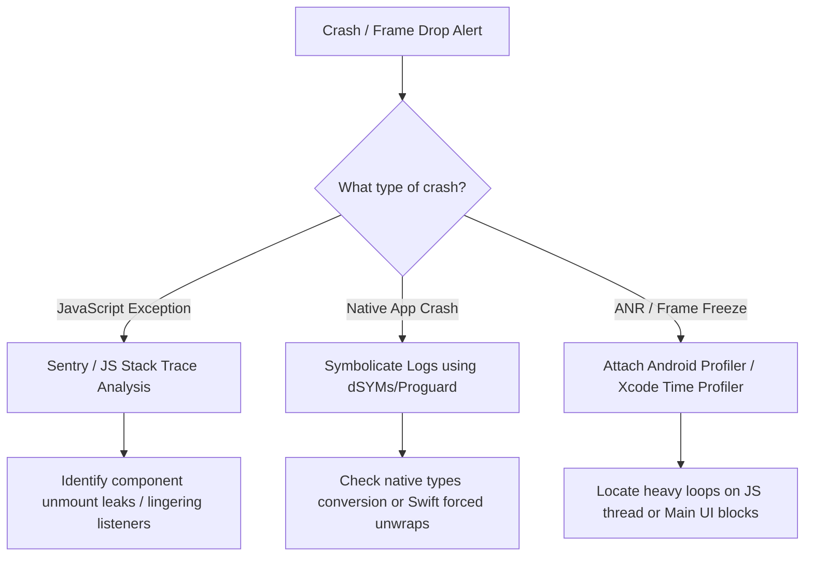

# 🏛️ senior aur lead reactive native developer guide (mnc aur gsi focus)

<!-- INDEX_START -->
<details>
 <summary>📖<b>samagri taalika (vistar karne ke liye click karen)</b></summary> 

-[🏗️ dhara 1: mnc aur paramarsh vastushilp apekshayen](#section-1-mnc-consulting-architectural-expectations)
 -[1. react native mein swachh vastukala aur thos siddhant](#1-clean-architecture-solid-principles-in-react-native)
 -[2. badi teamon ke liye monorepos banaam malterepos (yarn, pnpm, nx)।](#2-monorepos-vs-multirepos-yarn-pnpm-nx-for-large-teams)
 -[3. legacy migration aur upgrade (udaharan ke liye, v0.60 se v0.75+)](#3-legacy-migration-upgrades-eg-v060-to-v075)
-[🔒 dhara 2: enterprise suraksha, anupalan aur OWASP mobile top 10](#section-2-enterprise-security-compliance-owasp-mobile-top-10)
 -[1. ssl pinning aur certificate rotation](#1-ssl-pinning-certificate-rotation)
 -[2. jailbrek/root detection aur frida instrumentation defence](#2-jailbreakroot-detection-and-frida-instrumentation-defenses)
 -[3. surakshit sthaniya bhandaran aur data algaav (kichen/kistor)](#3-secure-local-storage-data-isolation-keychainkeystore)
-[⚡ dhara 3: pradarshan engineering aur memory triage (leed pariprekshya)](#section-3-performance-engineering-memory-triage-lead-perspective)
 -[1. native profiling (excod instruments aur android profiler)](#1-native-profiling-xcode-instruments-android-profiler)
 - [1. react native mein swachh vastukala aur thos siddhant](#1-clean-architecture-solid-principles-in-react-native)0 
 - [1. react native mein swachh vastukala aur thos siddhant](#1-clean-architecture-solid-principles-in-react-native)1 
- [1. react native mein swachh vastukala aur thos siddhant](#1-clean-architecture-solid-principles-in-react-native)2 
 - [1. react native mein swachh vastukala aur thos siddhant](#1-clean-architecture-solid-principles-in-react-native)3 
 - [1. react native mein swachh vastukala aur thos siddhant](#1-clean-architecture-solid-principles-in-react-native)4 
 - [1. react native mein swachh vastukala aur thos siddhant](#1-clean-architecture-solid-principles-in-react-native)5 
- [1. react native mein swachh vastukala aur thos siddhant](#1-clean-architecture-solid-principles-in-react-native)6 
 - [1. react native mein swachh vastukala aur thos siddhant](#1-clean-architecture-solid-principles-in-react-native)7 
 - [1. react native mein swachh vastukala aur thos siddhant](#1-clean-architecture-solid-principles-in-react-native)8 
 - [1. react native mein swachh vastukala aur thos siddhant](#1-clean-architecture-solid-principles-in-react-native)9 
</details>
<!-- INDEX_END -->

---

## 🏗️ dhara 1: mnc aur paramarsh vastukala apekshaen
*⏱️ 4 minute padhen*

mnc client architecture ko chintaon, skelebility aur dirghkaalik rakhrakhav ki majboot prithakkaran ki aavashyakta hoti hai। varishth aur lead developers ko aise architecture design karne chahiye jo badi teamon aur bahu-varshiy utpad chakron mein scale kar saken।

### 1. react native mein swachh vastukala aur thos siddhant

react native mein **clin arkitectur** ko lagu karne se yah sunishchit hota hai ki vyavasayik tark ui fremwark, styling libreries aur rajya prabandhan framework se puri tarah se alag ho gaya hai:

```text
[UI Components (Views)] ➡️ [React Hooks (Presenters)] ➡️ [Use Cases (Domain)] ➡️ [Repositories / Adapters (Data)]
 | | |
(Styles, Native Components) (Local State/Recoil) (Axios, Apollo, MMKV)
```

- **domen parat (kor)**: isme shuddh vyavasayik ikaiyan aur upyog ke mamle shamil han। is parat mein react, react nativ, ya thard-parti storage/netwarking api par shunya nirbharta honi chahiye। yah data laane ke liye interface anubandh (interfess) ko paribhashit karta hai।
- **deta layer (infrastructur)**: domain layer dwara paribhashit repository interface ko lagu karta hai। remote api call (exios, apollo clint), sthaniya storage operations (mmkv, squlight), aur cashing ko sambhalta hai।
- **prastuti parat (ui)**: isme react ghatak, styling (stylesheet, telvind), aur sthaniya rajya hook shamil han। yah vyavasayik tark nishpadit karne ke liye domain upyog mamlon ko call karta hai।

#### thos siddhant lagu karna:
- **ekal uttardayitva siddhant (srp)**: screen ko prastut drishya (ui-keval ghatak) aur rajya container (deta laane aur form niyantran tark wale custom huk) mein vibhajit karen।
- **khula/band siddhant (ocp)**: sidhe ghatakon ke andar hardcoding platform ya fichar check ke bajay shailiyon, custom action rendrors, ya configuration ko props ke roop mein sweekar karne ke liye ghatakon ko design karen।
- **liskov pratisthapan siddhant (lsp)**: sunishchit karen ki custom rapper ghatak (jaise `CustomTextInput`) vyavahar ko tode bina react native ke`<TextInput>`ke mool gun interface ka vistar aur rakhrakhav karen।
- **interfess prithakkaran siddhant (isp)**: bade vaishvik upyogkarta object ko un ghatakon mein bhejne ke bajay ghatakon aur api model ke liye chhote, kendrit typescript interface banaen, jinke liye keval upyogkarta naam ki aavashyakta hoti hai।
- **nirbharta vyutkram siddhant (dip)**: nirbharta injection (di) ka upyog karen। ui ghatak sidhe thos api client singleton aayat karne ke bajay amurt hook ya domain interface par nirbhar karte han।

---

### 2. badi teamon ke liye monorepos banaam malterepos (yarn, pnpm, nx)

badi mnc pariyojnaon mein kai sahyogi anuprayogon (jaise, grahak, bhagidar, agent apps) mein vikas ka samanvay karte samay, repository model chunna ek mahatvapurn nirnay hai।

| model/fichar | yarn/pnpm karyasthan monorepo | nx/torborepo monorepo | malterepos (alg git repos) |
| :--- | :--- | :--- | :--- |
| **ke liye sarvashreshth** | madhyam teamein buniyadi ts interface aur ui tatv sajha kar rahi han। | sajha deshi module ke saath anterpriz-gred malti-app sistm। | puri tarah se swatantra release chakra ke saath silband temen। |
| **kod ka pun: upyog** | ucch। karyakshetra simlink ke saath sajha sthaniya folder। | charam। sakht nirbharta maanchitran niyam lagu karta hai। | kam। niji npm package prakashit karne ki aavashyakta hai। |
| **ci/cd build cashing** | buniyadi। jab tak custom script maujood na ho, har cheez ka punarnirmaan karta hai। | viksit। code hash ke aadhar par cash ko amanya karen। | alag nirman. koi cross-repo cash sharing nahin। |
| **nirbharta lock** | single lockfyle। packagon ko samaan sanskaranon par rakhta hai। | single lockfil ya varkaspace scoping vikalp। | ekadhik lockfilen। varjan bahav aam baat hai. |

#### architectural lead ranniti:
bade paimane ki teamon (50+ engineeron) ke liye, **Nx Monorepos** ko **pnpm** ke saath configar karen:
- nx module tag ka upyog karke seemaen lagu karen (udaharan ke liye,`app:customer`sidhe`app:agent`se aayat nahin kiya ja sakta)।
- sapeksh aayat pathon ko rokne ke liye`tsconfig.json`mein gatisheel path mapping ka upyog karen (udaharan ke liye,`../../shared/ui`ke bajay`@shared/ui`se aayat karen)।
- ekal-srot code bhandaran ko banae rakhte hue tainati chakron ko alag karne ke liye packagon ke andar swatantra sanskaran tagging lagu karen।

---

### 3. legacy migration aur upgrade (udaharan ke liye, v0.60 se v0.75+)

tek leads ko aksar purane apps ko migrate karke ya pramukh sanskaran upgrade nishpadit karke takniki rin ko hal karne ka kaam saunpa jata hai।

#### A. ligacy react native ko upgrade karna (udaharan ke liye, v0.63 se v0.75+):
1. **nirbhartaon ka vishleshan karen**: lakshya reactive native sanskaran aur harmis ke saath tritiy-paksh deshi pustakaalayon ki sangatata ki jaanch karne ke liye audit chalaen।
2. **react native upgrade helper ka upyog karen**: samudayik upgrade tool ka upyog karke mool filon (`AndroidManifest.xml`, `AppDelegate.mm`, `build.gradle`, `<TextInput>`0) ke liye code bhinn utpann karen।
3. **upgred charan nishpadit karen (vriddhishil roop se)**: kai pramukh sanskaranon mein upgrade karna (udaharan ke liye, 0.63 ➡️ 0.68 ➡️ 0.72 ➡️ 0.75) sidhe kudne ki tulna mein adhik surakshit hai।
4. **hemiz aur new architecture migration**:
 - ios (podfil mein `<TextInput>`1) aur android (gradel.proparties mein `<TextInput>`2) par hemiz ko saksham karen।
 - nai `<TextInput>`3 sanrachna mein parivartan ke liye Xcode mein objectiv-si compyler flag ka samadhan karen।
 - TurboModules/Fabric anukulta lagu karen। yadi legacy library naye C++ JSI vinirdeshon ko lagu karne mein vifal rehti han, to asthayi brising sangatata paraten banaen।

#### bi. native android/ios ko react native mein migrate karna:
- **charan 1: hybrid ekikaran (up-drishya)**: poore app ko phir se likhne ke bajay, react native ko mool application ke andar ek ekal tukde/niyantrak ke roop mein ekikrit karen। `<TextInput>`4 ko Android gatividhi ya iOS UIViewController ke andar load karen।
- **charan 2: data bridge sinkronization**: custom bridge event ka upyog karke mool container aur react native js sandarbh ke beech pramanikaran sthiti, database registriyon aur configuration ko sinkroniz karen।
- **charan 3: vriddhishil screen pratisthapan**: feature update ke aadhar par purani screen ko ek-ek karke badlen। ek baar jab container navigation puri tarah se react navigation dwara badal diya jata hai, to mool routing filon ko puri tarah se hata den।

---

## 🔒 dhara 2: enterprise suraksha, anupalan aur OWASP mobile top 10
*⏱️ 2 minute padhen*

anterprise banking, healthcare aur telecom grahakon ko sakht mobile suraksha maanakon ki aavashyakta hoti hai। lead developers ko upyogkarta data aur binary akhandata ki suraksha ke liye application design karna chahiye।

### 1. ssl pinning aur certificate rotation

sarvjanik network par man-in-d-middle (mitm) hamlon se bachav ke liye, enterprise configuration **ssl pining** lagu karte han:

```text
[Mobile App Request] ➡️ Check server certificate hash ➡️ Does it match pre-bundled pin?
 |
 Yes ➡️ Execute request
 No ➡️ Drop connection immediately
```

- **karyanvan**: javascript-lar pinning se bachen (jise frida jaise runtime instrumentation tools dwara aasani se bypass kiya jata hai)। mool platform paraton par SSL pinning lagu karen:
 - **android**: server ke sarvajanik kunji pramanpatra ke SHA-256 hash ke saath `<TextInput>`5 ke `<TextInput>`6 ka upyog karen।
 - **ios**: podfil configuration ke madhyam se `<TextInput>`7 ko ekikrit karen।
- **pramanpatra rotation ranniti**: app binary mein sthir pin ko bandal karne se pramanpatra samapt hone par app toot jata hai। surakshit configaration:
 - bandal **backup pin** (udaharan ke liye, root ca pin ya secondary intermediate ca kunji)।
 - ek **dynamik certificate rotation link** lagu karen (memori mein mukhya api client configuration ko update karne se pehle ek pramanit madhyamik surakshit andpoint se hastaksharit, adyatan pin suchiyan prapt karen)।

---

### 2. jailbrek/root detection aur frida instrumentation defence

sakriya memory ka nirikshan karne aur suraksha karyon ko badhit karne ke liye hamlavar bineriz ko vighatit karte hain aur unhen root kiye gaye/jailbrek kiye gaye upkaranon par chalate han।

- **rakshatmak upay**:
 - **jailbrek detection (ios)**: jailbreak nirdeshikaon ki jaanch karen (udaharan ke liye, `<TextInput>`8), pratibandhit folderon mein likhkar sandbox akhandata ki jaanch karen, aur mulyankan karen ki kya manak deshi fork call safal hote han।
- **root detection (android)**: `<TextInput>`9 binary ki upasthiti ki khoj karen, magic manager package registriyon ki talash karen, aur janchen ki kya parikshan-kunji hastakshar chal rahe karnel par sakriya han।
 - **anti-frida suraksha upay**: freeda dynamic agent libreries ko inject karta hai aur defolt port `app:customer`0 par sunta hai। injected `app:customer`2 filon ka pata lagane ke liye startup par `app:customer`1 ko scan karne ke liye C/C++ native module ka upyog karen, aur yadi frida port sakriya hain to connection drop karne ke liye sthaniya socket ko scan karen।

---

### 3. surakshit sthaniya bhandaran aur data algaav (kichen/kistor)

OWASP mobile top 10 mein **asurakshit data storage** ko sheersh bhedyata ke roop mein ujagar kiya gaya hai।

- **deta algav**: pramanikaran vivran, upyogkarta profyle, ya lenden sthiti ko kabhi bhi saade JSON text praroop (udaharan ke liye, manak `app:customer`3) mein na likhen।
- **encripted MMKV**: MMKV instancess ko AES-256 encription kunji ke saath lapeten।
- **hardwar enclave binding**: encription kunji ko device ke hardware enclave mein likhkar surakshit karen: **ios kichen** aur **android kistor** (`app:customer`4 ke madhyam se)। kunji ko memory mein tabhi hal kiya jata hai jab application sandarbh launch hota hai aur biometrics ka upyog karke satyapit kiya jata hai।

---

## ⚡ dhara 3: pradarshan engineering aur memory triage (leed pariprekshya)
*⏱️ 2 minute padhen*

jatil data graph chalane wale enterprise anuprayogon ko unnat pradarshan triage ranneetiyon ki aavashyakta hoti hai।

### 1. native profiling (excod instruments aur android profiler)

jab javascript thread diagnostics aparyapt hote han, to take leads deshi platform profiling tool ka upyog karte han:

- **excod upkaran**:
 - **aavantan**: smriti vriddhi pravrittiyon ki pehchan karta hai। screen interaction anukramon se pehle aur baad mein memory snapshot capture karen। lagatar badhti pidhi ki unchai heep leak ki pushti karti hai।
 - **time profiler**: cpu core nishpaadan pathon ka vishleshan karta hai। deshi pustakaalayon (si++, swift, objectiv-si) mein thred-blocking nishpaadan stack ka pata lagata hai।
- **android studio profiler**:
 - **cpu profiler**: android men thread (anr chetavniyon ke karan) ko avruddh karne wale mool tareekon ka pata lagane ke liye vidhi ke nishan (coll chart/flame graph) ko record karta hai।
 - **memori profiler**: dher dump capture karta hai। uchch aavritti ganana wale vargon ka vishleshan karen (udaharan ke liye, asangrahit bitmaps ya leak hue fragment binding)।
 - **netwark profiler**: outbound anurodh samay, data aakar, aur anavashyak ya duplicate api call ki jaanch karta hai।

---

### 2. memory leak, frame drops aur anr/crash ka triage

#### diagnostics piplin:



- **anr ka samadhan karna (app pratikriya nahin de raha hai)**: tab hota hai jab android ka mukhya thread $>5$ second ke liye avruddh ho jata hai। sunishchit karen ki sabhi native module logic kotlin coreoutin ya java thread pool (`app:customer`5) ka upyog karke background worker thread par chalte han, jo collback ko acinkrones roop se react native mein lautate han।
- **pratikatmakta**: aspasht stack trace (jaise `app:customer`6 ) ko padhne yogya pathon (jaise, `app:customer`7 ) mein hal karne ke liye pratyek build par sentry par srot manchitra upload karen।

---

### 3. badi suchi anukulan (shopifai flashalist aur layout cashing)

bade paimane par dataset prastut karte samay (udaharan ke liye, telecom portal mein nirdeshika listing ya banking platform mein statement), paramparik `app:customer`8 mein view node manoranjan ke karan uchch memory footprint hote han।

- **shopifai flashalist**: **sel recycling** ka upyog karta hai (android ke `app:customer`9 ya ios ke `app:agent`0 ke saman)। jab sale drishya seema se bahar scroll karte han, to ve mool memory se anmount nahin hote han। iske bajay, mool drishya sanrachna ko barkarar rakha jata hai, aur keval antarnihit dataset ki adla-badli ki jaati hai।
- **pradarshan dishanirdesh**:
 - sale layout ghatakon ko halka rakhen। suchi tatvon ke andar jatil drishya padanukram se bachen।
 - layout engine ko memory bafars ko sateek roop se aavantit karne ki anumati dene ke liye flashalist mein `app:agent`1 ka upyog karen।
 - suchi adyatan hone par rendering chakra ko bypass karne ke liye sakht mulya jaanch ke saath suchi panktiyon ko `app:agent`2 mein lapeten।

---

## 📦 dhara 4: ci/cd piplin, fastlane aur release prabandhan
*⏱️ 2 minute padhen*

badi bahurashtriya companiyon men, manual app sankalan aswikarya hai। swachalit pariniyojan pratilipi prastut karne yogyata aur sthirta ki guarantee deta hai।
### 1. fastlane match aur provisioning profile automation

iOS pramanpatra filon ko prabandhit karna aur kai developers aur build agenton ke beech profile ka pravdhan karna aksar build vifaltaon ka karan banta hai।

- **fastlen match**: Git-aadharit code hastakshar ranneeti lagu karta hai:
 - sabhi developer aur vitran pramanpatra, unke milan pravdhan profile ke sath, ek samumit pasafrez ka upyog karke encrypt kiye jaate hain aur ek niji Git repository mein sangrahit hote han।
 - sthaniya ya ci/cd build ke dauran, fastlane is repository ko clone karta hai, pramanpatron ko dicript karta hai, aur unhen sidhe build machine par sthapit karta hai।
 - provizaning profile bemel, duplicate pramanpatra nirman ko rokta hai, aur yah sunishchit karta hai ki Xcode build safaltapurvak nishpadit ho।

---

### 2. over-d-air (ota) update rollback aur varjaning ranniti

ota update (kodapush/expo update) app store samikshaon ke bina tatkal js-keval update ki anumati deta hai। halanki, agar kharab tarike se prabandhit kiya jaye to unme mahatvapurn runtime crash jokhim hota hai।

- **ota sanskaran ke swarn nium**:
 - **lakshya binary locking**: pratyek ota bandal ko vishisht deshi binary sanskaranon (udaharan ke liye, `app:agent`3 ya `app:agent`4) ko lakshit karna chahiye। yadi mool nirbhartaen adyatan hain to kabhi bhi khuli shreniyon ko lakshit na karen।
 - **mul hastaksharon ki janch karna**: yadi koi update mool module binding ko badalta hai (udaharan ke liye ek nai mool library jodna), to aapko binary sanskaran ko band karna hoga। yadi koi purana binary naya js bandal download karta hai, to yah deshi chayankartaon ke gayab hone ke karan turant crash ho jaega।
- **rolback orkestration**:
 - app start health ko track karne ke liye updater client ko configar karen। yadi ota bandal lagu karne ke 2 minute ke bhitar app do baar crash ho jata hai, to updater client ko turant sthir sthaniya embedded bandal mein wapas roll karna hoga।

---

### 3. app store aswikritiyon aur play store anupalan ka prabandhan

relies mein deri se bachne ke liye take leads ko anupalan avashyaktaon par dhyan dena chahiye:

- **app store aswikaran (apppal dishanirdesh)**:
 - *dishanirdesh 2.1 (pradarshan)*: sunishchit karen ki apple samikshak log in kar sakte hain (manya nakli cradential pradan karen) aur app placeholder data ya network timeout ke bina chalta hai।
 - *dishanirdesh 4.8 (apppal ke saath sign in karen)*: yadi app tritiy-paksh samajik login (Google, facebook) lagu karta hai, to aapko samkaksh vikalp ke roop mein apple sin-in bhi pradan karna hoga।
 - *dishanirdesh 5.1.1 (gopniyata)*: `app:agent`5 (jaise, sthan, camra) mein sabhi prusthbhoomi anumatiyon ko spasht roop se ghoshit karen aur upyog pradhikaran sheeghra sandeshon ka anurodh karen।
- **ple store anupalan (Google nitiyan)**:
 - *lakshya sdk update*: android ko haal ke android api sanskaranon ko lakshit karne ke liye apps ki aavashyakta hoti hai। sunishchit karen ki `app:agent`6 aur `app:agent`7 salana update kiye jaen।
 - *Google Play biling*: bhugtan suvidhaon ko bahari bhugtan portal ke bajay Google billing API ke madhyam se root kiya jana chahiye।

---

## 💼 dhara 5: mnc grahak paridrishya aur takniki lead vyavahar prashnottar
*⏱️ 3 minute padhen*

ye paridrishya paramarsh kshamtaon, netritva kaushal aur vastushilp nirnay lene ka mulyankan karte han।

### 1. grahak-samna sanchar aur pratikriyasheel mool sifarishen

#### sakshatkar paridrishya:
> *"ek banking grahak puchta hai ki kya unhen react native ka upyog karke apne maujuda mool ios aur android retail banking app ka punarnirmaan karna chahiye। aap unhen kaise salah denge?"*

- **rannitik pratikriya**:
 "main grahak ko ek vastunishth nirnay matrix ke madhyam se margdarshan karunga, unke utpad rodmap, engineering sansadhanon aur pradarshan avashyaktaon ka mulyankan karunga:
 - **react native ki anushansa kab karen**:
 - yadi utpad roadmap ui interaction, form, statement, data chart aur gatisheel samagri update par kendrit hai।
 - yadi grahak vyavasayik tark (typascript) ko ekikrit karke aur ek hi team mein style karke, feature release chakra ko kam karke rakhrakhav laagat ko kam karna chahta hai।
 - **nativ (swift/kotlin) ko kab banae rakhen**:
 - yadi app nimn-stariy hardware ya os sevaon (jaise, nirantar prusthbhoomi sthan tracking, prusthbhoomi audio procesing) ko ekikrit karta hai।
 - yadi app ko ucch-pradarshan gpu-bound processing (udaharan ke liye, real-time face detection model, ar/vr scaning) ki aavashyakta hai।
 - **hibrid anushansa (anterpriz ve)**:
- bade bankon ke liye, main **hibrid ranniti** ki anushansa karta hun। mukhya suraksha dhanche, device token panjikaran aur biometrics ke liye deshi containeron ko banae rakhen। feature screen (jaise, rin, puraskar) dene ke liye deshi gatividhiyon/niyantrakon ke andar react native ko ekikrit karen। yah deshi suraksha ko cross-platform release gati ke saath jodti hai।"

---

### 2. pariyojna anumaan aur sansadhan yojana ke tarike

#### sakshatkar paridrishya:
> *"aap legacy architecture se react native mein ek jatil project migration ka anumaan kaise lagate han?"*

- **rannitik pratikriya**:
 "main sateekta sunishchit karne aur ekikaran jokhimon ko dhyan mein rakhne ke liye bahu-stariy anumaan drishtikon lagu karta hun:
 - **1. fichar decomposition**: application ko modular ghatakon mein vibhajit karen: core infrastructure (auth, netwarking, surakshit storage), sajha ui kit ghatak, fichar screen aur native integration (kastm brij, push notification)।
 - **2. teen-bindu anuman**: pratyek ghatak ke liye, main ganana karne ke liye varishth team ke sadasyon se input ekatra karta hun:
 - $O$: ashavadi avdhi
 - $P$: nirashawadi avdhi
 - $M$: sarvadhik sambhavit avdhi
 - apekshit avadhi ki ganana karen: $E = \frac{O + 4M + P}{6}$
 - **3. jokhim bafar aavantan**: vishesh roop se mool module ekikaran, pipeline setup banane aur tritiy-paksh sdk upgrade ke liye 20-30% bafar joden।
 - **4. sprint yojana ekikaran**: 2-saptah ke sprint ke liye feature ghatakon ko map karen, veg, parikshan chakra aur store anumodan kataron ka lekha-jokha rakhen।"

---

### 3. takniki rin aur team pradarshan badhaon ka samadhan

#### sakshatkar paridrishya:
> *"aap ek aisi team mein shamil hote hain jahan react native app ka nirman behad dheema hai, developers lagatar merge vivadon ke baare mein shikayat karte han, aur utpadan mein crash dar badh rahi hai। aapki pehli 30-divasiy karya yojana kya hai?"*

- **rannitik pratikriya**:
 "mere pehle 30 din ek sanrachit mulyankan aur sudharatmak dhanche ka palan karenge:
 - **din 1-10: audit aur diagnostics**:
 - sheersh 3 crash karnon ki pehchan karne ke liye sentry mein crash log ka vishleshan karen।
 - vartmaan ci/cd pipeline badhaon ka audit karen (udaharan ke liye, pahchanen ki node module punarsthapan ke dauran sthaniya cashing aksham kyon hai)।
 - sanskaran bemel ka pata lagane ke liye nirbharta graph map karen।
 - **din 11-20: tatkal upchar (tvarit jeet)**:
 - commit hone se pehle linting aur type-chek lagu karne ke liye sakht git hook (haski, lint-staged) lagu karen, jisse compyler tutna kam ho jaye।
 - utpadan ko sthir karne ke liye sheersh 3 crash karnon ko theek karen।
 - nirman samay ko 40-50% tak kam karne ke liye ci/cd runner par nirbharta cash nirdeshikaon ko configar karen।
 - **din 21-30: dirghkaalik vastukala setup**:
 - code parivartanon ko alag karne, git merge vivadon ko kam karne ke liye feechar-aadharit folder sangathan ka parichay den।
 - yadi kai teamein sajha package par kaam kar rahi hain to ek monorepo ranneeti sthapit karen।
 - spasht dastavezikaran, sanrekhan dishanirdesh taiyar karen, aur swachalit code samiksha niyamon ko paribhashit karen।"