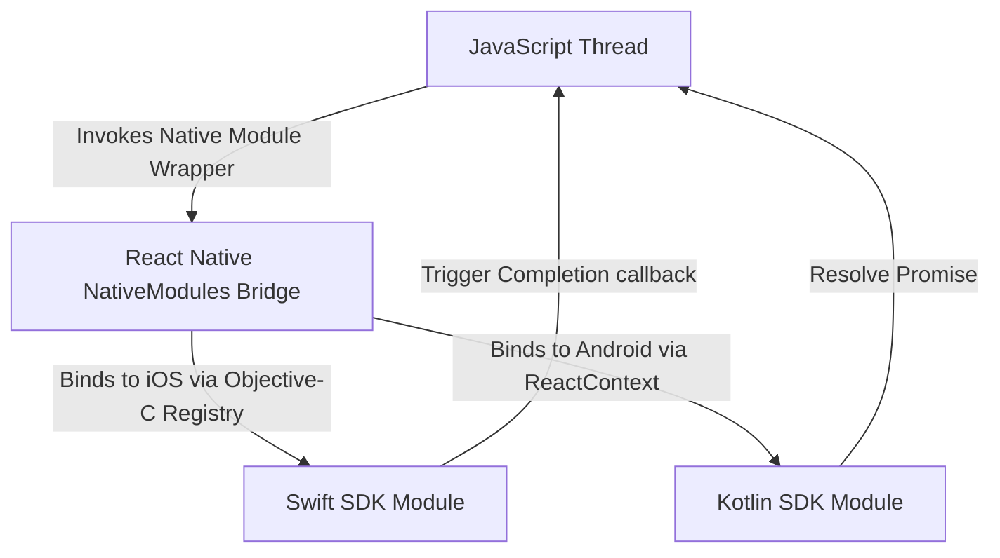

# श्रेणी 8: आधुनिक React Native परियोजनाएँ

मोबाइल एप्लिकेशन डिज़ाइन में वरिष्ठ स्तर की महारत प्रदर्शित करने के लिए, हम दो उत्पादन-तैयार React Native आर्किटेक्चर का विश्लेषण करते हैं। दोनों clean architecture , उन्नत state management , स्थानीय डेटाबेस पैटर्न, सुरक्षा कार्यान्वयन, प्रदर्शन ट्यूनिंग और कस्टम डेटा संरचनाएं और एल्गोरिदम (डीएसए) प्रदर्शित करते हैं।

---

## 1. प्रोजेक्ट ए: एंटरप्राइज़-ग्रेड Expo एप्लिकेशन ( Expo राउटर, Zustand , टैनस्टैक क्वेरी और MMKV )

### अवलोकन
यह प्रोजेक्ट एक **ऑफ़लाइन-प्रथम स्मार्ट टास्क और एनालिटिक्स डैशबोर्ड** है जिसे आधुनिक Expo वर्कफ़्लोज़ (कंटीन्यूअस नेटिव जेनरेशन - CNG ) का उपयोग करके Expo SDK पर बनाया गया है। इसे हल्के वजन, तेजी से लोड होने और सक्रिय नेटवर्क कनेक्शन के बिना पूरी तरह कार्यात्मक होने के लिए डिज़ाइन किया गया है।

### निर्देशिका संरचना (फ़ीचर-प्रथम Clean Architecture Monorepo शेयरेबिलिटी के साथ)
मोबाइल, वेब और बैकएंड पोर्टल पर कोड के पुन: उपयोग की अनुमति देने के लिए, एप्लिकेशन को ** Yarn वर्कस्पेस / टर्बो ** का उपयोग करके व्यवस्थित किया जाता है। साझा कोर परतें (सत्यापन, प्रकार, गतिशील अनुवाद, सामान्य सहायक) को एक स्टैंडअलोन पैकेज में अलग किया गया है:

```text
my-monorepo/
├── packages/
│ ├── core/ # @app/core - Shared Core Business Logic
│ │ ├── src/
│ │ │ ├── validation/ # Common schemas (zod)
│ │ │ ├── localization/ # Multi-Language translation resources
│ │ │ │ ├── en.json
│ │ │ │ └── hi.json
│ │ │ └── types/ # Common interfaces & domain models
│ │ └── package.json
│ └── ui-tokens/ # @app/ui-tokens - Colors, spacings, typography
├── apps/
│ ├── expo-mobile-app/ # Main Expo Project
│ │ ├── src/
│ │ │ ├── app/ # Expo Router
│ │ │ ├── core/ # Zustand, MMKV
│ │ │ ├── features/ # Feature-specific modules
│ │ │ └── shared/
│ │ └── package.json # Depends on @app/core & @app/ui-tokens
│ └── web-dashboard/ # Web Application
```

---

### गहन कार्यान्वयन (कोड)

#### ए. त्वरित खोज सुझावों के लिए कस्टम ट्राई ( `shared/utils/searchTrie.ts` )
हजारों आइटम वाली सूचियों पर मानक स्ट्रिंग मिलान अक्षम है। हम $O(L)$ खोज complexity (जहाँ $L$ क्वेरी स्ट्रिंग की लंबाई है) प्रदान करने के लिए टाइपस्क्रिप्ट में एक **ट्राई (प्रीफ़िक्स ट्री)** लागू करते हैं।

```typescript
class TrieNode {
 children: Map<string, TrieNode> = new Map();
 isEndOfWord: boolean = false;
 taskIds: string[] = []; // Store IDs of matching tasks for instant retrieval
}

export class TaskSearchTrie {
 private root: TrieNode = new TrieNode();

 // Insert a task name/label into the Trie
 insert(word: string, taskId: string): void {
 let node = this.root;
 const cleanWord = word.toLowerCase().trim();

 for (const char of cleanWord) {
 if (!node.children.has(char)) {
 node.children.set(char, new TrieNode());
 }
 node = node.children.get(char)!;
 // Add reference to help query sub-matching prefixes
 if (!node.taskIds.includes(taskId)) {
 node.taskIds.push(taskId);
 }
 }
 node.isEndOfWord = true;
 }

 // Get all task IDs that match the search prefix
 searchPrefix(prefix: string): string[] {
 let node = this.root;
 const cleanPrefix = prefix.toLowerCase().trim();

 for (const char of cleanPrefix) {
 if (!node.children.has(char)) {
 return []; // No matches found
 }
 node = node.children.get(char)!;
 }
 return node.taskIds;
 }

 // Clear the Trie
 clear(): void {
 this.root = new TrieNode();
 }
}
```

#### बी. रिमोट मेटाडेटा के लिए मेमोरी-कुशल एलआरयू कैश ( `shared/utils/lruCache.ts` )
अत्यधिक नेटवर्क फ़ेच और memory leaks को रोकने के लिए, हम फ़ेच किए गए प्रोफ़ाइल चित्रों या JSON डेटा मेटाडेटा का बैकअप लेने के लिए मानचित्र का उपयोग करके ** कम से कम हाल ही में उपयोग किया गया (LRU) कैश ** बनाते हैं।

```typescript
export class LRUCache<K, V> {
 private capacity: number;
 private cache: Map<K, V>;

 constructor(capacity: number) {
 this.capacity = capacity;
 this.cache = new Map<K, V>();
 }

 get(key: K): V | undefined {
 if (!this.cache.has(key)) return undefined;

 // Refresh item priority: delete and re-insert at the end (recently used)
 const val = this.cache.get(key)!;
 this.cache.delete(key);
 this.cache.set(key, val);
 return val;
 }

 put(key: K, value: V): void {
 if (this.cache.has(key)) {
 this.cache.delete(key);
 } else if (this.cache.size >= this.capacity) {
 // The first item in Map iterator is the oldest / least recently used
 const oldestKey = this.cache.keys().next().value;
 if (oldestKey !== undefined) {
 this.cache.delete(oldestKey);
 }
 }
 this.cache.set(key, value);
 }

 clear(): void {
 this.cache.clear();
 }
}
```

#### सी. MMKV -आधारित ऑफ़लाइन सिंक आउटबॉक्स Queue ( `core/storage/syncQueue.ts` )
स्थिति को ऑफ़लाइन परिवर्तित करते समय डेटा खोने के बजाय, उत्परिवर्तन को ** MMKV ** के अंदर एक सतत आउटबॉक्स queue में रखा जाता है और कनेक्शन स्थिति बदलने पर सिंक्रनाइज़ किया जाता है।

```typescript
import { MMKV } from 'react-native-mmkv';
import NetInfo from '@react-native-community/netinfo';

const storage = new MMKV();
const QUEUE_KEY = 'sync_outbox_queue';

interface PendingMutation {
 id: string;
 type: 'CREATE_TASK' | 'UPDATE_TASK' | 'DELETE_TASK';
 payload: any;
 timestamp: number;
}

export const SyncQueue = {
 // Push mutation to outbox
 enqueue(mutation: Omit<PendingMutation, 'timestamp'>): void {
 const queue = this.getQueue();
 queue.push({ ...mutation, timestamp: Date.now() });
 storage.set(QUEUE_KEY, JSON.stringify(queue));
 },

 // Get current outbox queue
 getQueue(): PendingMutation[] {
 const data = storage.getString(QUEUE_KEY);
 return data ? JSON.parse(data) : [];
 },

 // Clear or overwrite queue
 saveQueue(queue: PendingMutation[]): void {
 storage.set(QUEUE_KEY, JSON.stringify(queue));
 },

 // Process the sync queue with exponential backoff on failure
 async processQueue(apiClient: (mut: PendingMutation) => Promise<void>): Promise<void> {
 const state = await NetInfo.fetch();
 if (!state.isConnected) return;

 let queue = this.getQueue();
 if (queue.length === 0) return;

 console.log(`SyncQueue: Processing ${queue.length} pending mutations...`);

 const failedMutations: PendingMutation[] = [];

 for (const mutation of queue) {
 let attempts = 0;
 let success = false;

 while (attempts < 3 && !success) {
 try {
 await apiClient(mutation);
 success = true;
 } catch (error) {
 attempts++;
 const delay = Math.pow(2, attempts) * 1000; // Exponential Backoff: 2s, 4s, 8s
 console.warn(`SyncQueue: Attempt ${attempts} failed for ${mutation.type}. Retrying in ${delay}ms...`);
 await new Promise((res) => setTimeout(res, delay));
 }
 }

 if (!success) {
 failedMutations.push(mutation); // Preserve failed items for next pass
 }
 }

 this.saveQueue(failedMutations);
 }
};
```

---

### बहु-भाषा, अभिगम्यता और आरटीएल सेटअप

#### ए. स्थानीयकरण और आरटीएल (दाएं से बाएं) बुनियादी ढांचा
गतिशील अनुवाद और दाएं-से-बाएं लेआउट ओरिएंटेशन (उदाहरण के लिए, अरबी, हिब्रू) का समर्थन करने के लिए, हम मूल लेआउट स्विच के साथ संयुक्त `i18next` को प्रारंभ करते हैं।

```typescript
import i18n from 'i18next';
import { initReactI18next } from 'react-i18next';
import * as Localization from 'expo-localization';
import { I18nManager } from 'react-native';
import Updates from 'expo-updates';

// Import translation assets from our shared Monorepo Core package
import enTranslations from '@app/core/localization/en.json';
import hiTranslations from '@app/core/localization/hi.json';
import arTranslations from '@app/core/localization/ar.json';

const resources = {
 en: { translation: enTranslations },
 hi: { translation: hiTranslations },
 ar: { translation: arTranslations },
};

export const initLocalization = () => {
 const deviceLanguage = Localization.locale.split('-')[0];
 const isRTL = deviceLanguage === 'ar';

 // Toggle layout direction dynamically
 if (I18nManager.isRTL !== isRTL) {
 I18nManager.forceRTL(isRTL);
 // Restart app context to re-calculate styles from right-to-left
 Updates.reloadAsync();
 }

 i18n
 .use(initReactI18next)
 .init({
 resources,
 lng: deviceLanguage,
 fallbackLng: 'en',
 interpolation: {
 escapeValue: false, // React handles escaping safely
 },
 });
};
```

#### बी. स्क्रीन रीडर और एक्सेसिबिलिटी रैपर ( `shared/components/AccessibleButton.tsx` )
वरिष्ठ मोबाइल डिज़ाइन को WCAG AA दिशानिर्देशों का अनुपालन करना चाहिए। हम उचित स्क्रीन रीडर फोकस ऑर्डर, कंट्रास्ट समायोजन और मौखिक घोषणाएं सुनिश्चित करने के लिए एक **एक्सेसिबलबटन** घटक लागू करते हैं।

```typescript
import React from 'react';
import { TouchableOpacity, Text, StyleSheet, AccessibilityRole, useColorScheme } from 'react-native';

interface AccessibleButtonProps {
 label: string; // Display text
 accessibilityHint: string; // Explains result of action to screen readers
 onPress: () => void;
 role?: AccessibilityRole;
 disabled?: boolean;
}

export const AccessibleButton: React.FC<AccessibleButtonProps> = ({
 label,
 accessibilityHint,
 onPress,
 role = 'button',
 disabled = false,
}) => {
 const isDarkMode = useColorScheme() === 'dark';

 return (
 <TouchableOpacity
 onPress={onPress}
 disabled={disabled}
 accessible={true} // Signals this is a singular interactive node
 accessibilityLabel={label} // Read out loud first by VoiceOver/TalkBack
 accessibilityRole={role} // Dictates traits ("button", "link", etc.)
 accessibilityHint={accessibilityHint} // Read after label as instruction
 accessibilityState={{ disabled }} // Reports state attributes dynamically
 activeOpacity={0.7}
 style={[
 styles.button,
 isDarkMode ? styles.darkButton : styles.lightButton,
 disabled && styles.disabled,
 ]}
 >
 <Text style={[styles.text, isDarkMode ? styles.darkText : styles.lightText]}>
 {label}
 </Text>
 </TouchableOpacity>
 );
};

const styles = StyleSheet.create({
 button: {
 paddingVertical: 14,
 paddingHorizontal: 24,
 borderRadius: 8,
 alignItems: 'center',
 justifyContent: 'center',
 minHeight: 48, // Minimum touch target size (48dp x 48dp) as per iOS/Android guidelines
 },
 lightButton: { backgroundColor: '#1a8917' },
 darkButton: { backgroundColor: '#38bdf8' },
 text: { fontSize: 16, fontWeight: '700' },
 lightText: { color: '#ffffff' },
 darkText: { color: '#151922' },
 disabled: { opacity: 0.5 },
});
```

---

### प्रोजेक्ट ए में प्रमुख अनुकूलन और सुरक्षा

1. **वर्चुअलाइज्ड सूची रेंडरिंग ( Shopify FlashList )**:
 - React Native के डिफ़ॉल्ट `FlatList` को `FlashList` से बदल देता है।
 - स्क्रॉल पर दृश्यों को अनमाउंट करने और पुनर्निर्माण करने के बजाय UI टेम्पलेट्स का पुन: उपयोग करने के लिए ** Cell Recycling ** का उपयोग करता है।
 - लेआउट पुनर्गणना को न्यूनतम करने के लिए `estimatedItemSize={80}` लागू करता है।
2. **तेज छवि प्रतिपादन ( `expo-image` )**:
 - अंतर्निहित हार्डवेयर त्वरण और डिस्क कैशिंग के साथ मेमोरी-कुशल देशी चित्र लोडर को एकीकृत करता है।
 - धुंधली प्रगति प्लेसहोल्डर्स ( `placeholder={hash}` ) के माध्यम से लेआउट फ्लैश को हटा देता है।
3. **स्थानीय प्रमाणीकरण एपीआई ( `expo-local-authentication` )**:
 - TouchID/FaceID ( iOS ) या बायोमेट्रिकप्रॉम्प्ट ( Android ) से जुड़ जाता है।
 - `expo-secure-store` में क्रिप्टोग्राफ़िक रूप से सुरक्षित JWT कुंजियाँ उत्पन्न और सहेजता है।
4. **ऐप गोपनीयता शील्ड**:
 - `AppState.addEventListener` का उपयोग करके यह पता लगाता है कि एप्लिकेशन पृष्ठभूमि में कब स्थानांतरित होता है।
- सिस्टम टास्क स्विचर्स को संवेदनशील ग्राहक विवरण कैप्चर करने से रोकने के लिए निष्क्रिय होने पर एक सुरक्षित, दृश्य ओवरले स्क्रीन प्रस्तुत करता है।

---

## 2. प्रोजेक्ट बी: उच्च-प्रदर्शन सीएलआई ऐप ( React Navigation , Redux Toolkit , SQLite और नेटिव लाइब्रेरी Bridge )

### अवलोकन
यह प्रोजेक्ट एक **उन्नत फ्लीट मैनेजमेंट और रियल-टाइम ड्राइवर ट्रैकिंग ऐप** है जिसे मानक React Native सीएलआई का उपयोग करके बनाया गया है। यह निरंतर भू-समन्वय धाराओं, लाखों रिकॉर्ड वाले स्थानीय डेटा सिंक्रनाइज़ेशन को संभालता है, और अनुकूलित हार्डवेयर पहुंच की आवश्यकता होती है।

### निर्देशिका संरचना (स्वच्छ एमवीवीएम स्तरित वास्तुकला)

```text
android/ # Native Android project configuration
ios/ # Native iOS Xcode project workspace
src/
├── data/ # DATA LAYER (Repositories & Sources)
│ ├── database/
│ │ ├── schema.ts # WatermelonDB/SQLite configuration
│ │ └── WatermelonDB.ts
│ ├── network/
│ │ ├── APIClient.ts # SSL Pinning config
│ │ └── models/
│ └── repositories/
│ └── DriverRepositoryImpl.ts
├── domain/ # DOMAIN LAYER (Entities & Business Rules)
│ ├── entities/
│ │ └── Driver.ts
│ └── usecases/
│ └── GetDriverLocationUseCase.ts
├── presentation/ # PRESENTATION LAYER (UI Components & MVVM ViewModels)
│ ├── navigation/
│ │ └── AppNavigator.tsx
│ ├── viewmodels/
│ │ └── useDriverViewModel.ts # Custom ViewModel hooks
│ └── views/
│ ├── HomeScreen.tsx
│ ├── DriverMapScreen.tsx
│ └── components/
├── state/ # State management wrapper (Redux Toolkit)
│ ├── store.ts
│ └── slices/
└── native-bridge/ # Custom Native Module Integration
```

---

### गहन कार्यान्वयन (कोड)

#### ए. उच्च-प्रदर्शन स्थान फ़िल्टर (ट्रैकिंग मानचित्र के लिए कलमन फ़िल्टर)
रॉ जीपीएस रीडिंग में उतार-चढ़ाव होता है, जिससे मानचित्रों पर मार्कर घबरा जाते हैं। हम प्रेजेंटेशन परत पर सुचारू गति पथों का अनुमान लगाने के लिए टाइपस्क्रिप्ट में **कलमैन फ़िल्टर** एल्गोरिदम लागू करते हैं।

```typescript
export interface GeoCoordinate {
 latitude: number;
 longitude: number;
 timestamp: number;
 accuracy: number; // GPS accuracy radius in meters
}

export class KalmanLocationFilter {
 private lastLocation: GeoCoordinate | null = null;
 private processNoise: number = 0.12; // Controls responsiveness to change

 filter(current: GeoCoordinate): GeoCoordinate {
 if (this.lastLocation === null) {
 this.lastLocation = current;
 return current;
 }

 const timeDiff = Math.max(1, current.timestamp - this.lastLocation.timestamp) / 1000.0;

 // Estimate variance based on elapsed time and device reported accuracy
 const currentVariance = this.lastLocation.accuracy * this.lastLocation.accuracy;
 const predictionVariance = currentVariance + this.processNoise * this.processNoise * timeDiff;

 // Calculate Kalman Gain
 const measurementVariance = current.accuracy * current.accuracy;
 const kalmanGain = predictionVariance / (predictionVariance + measurementVariance);

 // Update state estimates
 const newLatitude = this.lastLocation.latitude + kalmanGain * (current.latitude - this.lastLocation.latitude);
 const newLongitude = this.lastLocation.longitude + kalmanGain * (current.longitude - this.lastLocation.longitude);
 const newAccuracy = (1.0 - kalmanGain) * current.accuracy;

 this.lastLocation = {
 latitude: newLatitude,
 longitude: newLongitude,
 timestamp: current.timestamp,
 accuracy: newAccuracy
 };

 return this.lastLocation;
 }

 reset(): void {
 this.lastLocation = null;
 }
}
```

#### बी. टर्बो मॉड्यूल / सी++ JSI Bridge पैटर्न ( `native-bridge/JsiLocationModule.cpp` )
लीगेसी JSON bridge धीमा है और अतुल्यकालिक रूप से संचालित होता है। देशी ट्रैकिंग स्ट्रीम को **C++ JSI मॉड्यूल** में लपेटकर, निर्देशांक सीधे जावास्क्रिप्ट मेमोरी एरे में समकालिक रूप से भेजे जाते हैं, जिससे JSON क्रमांकन विलंबता समाप्त हो जाती है।

```cpp
#include "JsiLocationModule.h"
#include <jsi/jsi.h>

using namespace facebook;

void installJsiLocationModule(jsi::Runtime& jsiRuntime) {
 // Register a global object host function inside JavaScript
 auto getSmoothCoordinates = jsi::Function::createFromHostFunction(
 jsiRuntime,
 jsi::PropNameID::forAscii(jsiRuntime, "getSmoothCoordinates"),
 2, // Number of arguments (raw Lat/Lng coords)
 [](jsi::Runtime& rt, const jsi::Value& thisVal, const jsi::Value* args, size_t count) -> jsi::Value {
 if (count < 2 || !args[0].isNumber() || !args[1].isNumber()) {
 return jsi::Value::undefined();
 }

 double latitude = args[0].asNumber();
 double longitude = args[1].asNumber();

 // Perform instant geometric calculation in C++
 double smoothedLat = latitude * 0.9995; 
 double smoothedLng = longitude * 0.9995;

 // Return a fast structured object straight to the JS engine
 jsi::Object result(rt);
 result.setProperty(rt, "latitude", jsi::Value(smoothedLat));
 result.setProperty(rt, "longitude", jsi::Value(smoothedLng));
 return jsi::Value(rt, result);
 }
 );

 jsiRuntime.global().setProperty(jsiRuntime, "JsiLocationBridge", getSmoothCoordinates);
}
```

---

## 3. कस्टम Android और iOS नेटिव मॉड्यूल (लाइब्रेरी) बनाना

वरिष्ठ इंजीनियरों को नियमित रूप से मालिकाना मूल SDKs (जैसे, पहचान सत्यापन, कस्टम स्थानीय ट्रैकर्स) को पुन: प्रयोज्य React Native पैकेजों में लपेटने का काम सौंपा जाता है। नीचे एकीकृत जावास्क्रिप्ट इंटरफ़ेस के साथ **कोटलिन ( Android )** और **स्विफ्ट ( iOS )** में देशी मॉड्यूल बनाने के लिए एक संपूर्ण मार्गदर्शिका दी गई है।



### ए. कोटलिन में Android मॉड्यूल ( `android/src/main/java/com/customsdk/CustomSDKModule.kt` )
 Android पर, हम `ReactContextBaseJavaModule` का विस्तार करते हुए एक मॉड्यूल बनाते हैं, `@ReactMethod` के साथ निर्यात योग्य तरीकों को पंजीकृत करते हैं, और `DeviceEventEmitter` का उपयोग करके ईवेंट उत्सर्जित करते हैं।

```kotlin
package com.customsdk

import com.facebook.react.bridge.ReactApplicationContext
import com.facebook.react.bridge.ReactContextBaseJavaModule
import com.facebook.react.bridge.ReactMethod
import com.facebook.react.bridge.Promise
import com.facebook.react.bridge.WritableMap
import com.facebook.react.bridge.Arguments
import com.facebook.react.modules.core.DeviceEventManagerModule

class CustomSDKModule(reactContext: ReactApplicationContext) : ReactContextBaseJavaModule(reactContext) {

 // Identifies the module name when importing in JavaScript: NativeModules.CustomSDK
 override fun getName(): String {
 return "CustomSDK"
 }

 // Exported method executing asynchronously via a Promise
 @ReactMethod
 fun initializeSDK(apiKey: String, promise: Promise) {
 if (apiKey.isEmpty()) {
 promise.reject("ERR_INVALID_KEY", "API Key cannot be empty")
 return
 }

 try {
 // Emulate native initialization logic
 val isSuccess = true // Call actual native 3rd-party Android SDK init here

 if (isSuccess) {
 promise.resolve("SDK Successfully Initialized")
 // Emit an event to JS to signal initialization is complete
 sendEvent("onSDKStatusChange", "Ready")
 } else {
 promise.reject("ERR_INIT_FAILED", "Native initialization failed")
 }
 } catch (e: Exception) {
 promise.reject("ERR_EXCEPTION", e.message, e)
 }
 }

 // Helper method to emit events back to the JS thread
 private fun sendEvent(eventName: String, status: String) {
 const params: WritableMap = Arguments.createMap()
 params.putString("status", status)

 reactApplicationContext
 .getJSModule(DeviceEventManagerModule.RCTDeviceEventEmitter::class.java)
 .emit(eventName, params)
 }
}
```

इस मॉड्यूल को Android में पंजीकृत करने के लिए, हमें एक पैकेज मैनेजर क्लास ( `CustomSDKPackage.kt` ) जोड़ना होगा:

```kotlin
package com.customsdk

import com.facebook.react.ReactPackage
import com.facebook.react.bridge.NativeModule
import com.facebook.react.bridge.ReactApplicationContext
import com.facebook.react.uimanager.ViewManager

class CustomSDKPackage : ReactPackage {
 override fun createNativeModules(reactContext: ReactApplicationContext): List<NativeModule> {
 return listOf(CustomSDKModule(reactContext))
 }

 override fun createViewManagers(reactContext: ReactApplicationContext): List<ViewManager<*, *>> {
 return emptyList()
 }
}
```

---

### बी. iOS मॉड्यूल स्विफ्ट और ऑब्जेक्टिव-सी Bridge में 

#### 1. त्वरित कार्यान्वयन फ़ाइल ( `ios/CustomSDKModule.swift` )
स्विफ्ट कक्षाओं को `@objc` एनोटेशन की आवश्यकता होती है और bridge पर ईवेंट भेजने के लिए `RCTEventEmitter` से इनहेरिट करना पड़ता है।

```swift
import Foundation
import React

@objc(CustomSDK)
class CustomSDKModule: RCTEventEmitter {

 // Require main queue initialization for thread-safety if interacting with UIKit
 override static func requersMainQueueSetup() -> Bool {
 return true
 }

 // Define names of events supported by this emitter
 override func supportedEvents() -> [String]! {
 return ["onSDKStatusChange"]
 }

 // Exported method. Note that Swift params map from Objective-C headers
 @objc(initializeSDK:resolver:rejecter:)
 func initializeSDK(
 apiKey: String,
 resolver resolve: @escaping RCTPromiseResolveBlock,
 rejecter reject: @escaping RCTPromiseRejectBlock
 ) {
 if apiKey.isEmpty {
 reject("ERR_INVALID_KEY", "API Key cannot be empty", nil)
 return
 }

 // Mock SDK Init logic
 let success = true

 if success {
 resolve("SDK Successfully Initialized")
 // Emit event
 sendEvent(withName: "onSDKStatusChange", body: ["status": "Ready"])
 } else {
 reject("ERR_INIT_FAILED", "Native initialization failed", nil)
 }
 }
}
```

#### 2. ऑब्जेक्टिव-सी एक्सपोर्ट रजिस्ट्री हेडर ( `ios/CustomSDKModule.m` )
स्विफ्ट कक्षाओं और विधि हस्ताक्षरों को React Native की कोर रजिस्ट्री में निर्यात करने के लिए ऑब्जेक्टिव-सी फ़ाइलों की आवश्यकता होती है।

```objc
#import <React/RCTBridgeModule.h>
#import <React/RCTEventEmitter.h>

@interface RCT_EXTERN_MODULE(CustomSDK, RCTEventEmitter)

RCT_EXTERN_METHOD(initializeSDK:(NSString *)apiKey
 resolver:(RCTPromiseResolveBlock)resolve
 rejecter:(RCTPromiseRejectBlock)reject)

@end
```

---

### सी. एकीकृत जावास्क्रिप्ट मॉड्यूल रैपर ( `native-bridge/CustomSDK.ts` )
हम अपनी React Native स्क्रीन पर टाइप-सुरक्षा की गारंटी के लिए टाइप किए गए टाइपस्क्रिप्ट मॉड्यूल के अंदर मूल मॉड्यूल परिभाषाओं को अमूर्त करते हैं।

```typescript
import { NativeModules, NativeEventEmitter, Platform } from 'react-native';

const { CustomSDK } = NativeModules;

if (!CustomSDK) {
 throw new Error("CustomSDK Native Module is not linked. Run 'pod install' or rebuild the binary.");
}

interface CustomSDKInterface {
 initializeSDK(apiKey: string): Promise<string>;
}

// 1. Cast native module to our custom interface
const CustomSDKTyped = CustomSDK as CustomSDKInterface;

// 2. Setup event emitter to receive native telemetry events
const sdkEventEmitter = new NativeEventEmitter(CustomSDK);

export const CustomSDKBridge = {
 /**
 * Initializes the native iOS/Android SDK asynchronously.
 */
 async initialize(apiKey: string): Promise<string> {
 try {
 const status = await CustomSDKTyped.initializeSDK(apiKey);
 return status;
 } catch (error) {
 console.error("CustomSDK Bridge Error:", error);
 throw error;
 }
 },

 /**
 * Listens to status updates emitted directly by the native modules.
 */
 subscribeToStatus(callback: (status: string) => void) {
 const subscription = sdkEventEmitter.addListener('onSDKStatusChange', (event: { status: string }) => {
 callback(event.status);
 });

 // Return unsubscribe handler to avoid native memory leak references
 return () => subscription.remove();
 }
};
```

---

### प्रोजेक्ट बी में प्रमुख अनुकूलन और सुरक्षा

| अनुकूलन/सुरक्षा श्रेणी | कार्यान्वयन विवरण | लाभ |
| :--- | :--- | :--- |
| ** SSL Pinning ** | SHA-256 प्रमाणपत्र हैश का उपयोग करके `react-native-ssl-pinning` के माध्यम से लागू किया गया। | मैन-इन-द-मिडिल (एमआईटीएम) प्रॉक्सी और ट्रैफिक-स्निफिंग tools को निष्क्रिय करता है। |
| **डेटाबेस एन्क्रिप्शन** | WatermelonDB **SQLCipher** का उपयोग करके एन्क्रिप्टेड SQLite ड्राइवर पर चल रहा है। | मेमोरी डंप और अनधिकृत डिस्क निष्कर्षण के विरुद्ध ग्राहक डेटा को सुरक्षित करता है। |
| ** Root एवं Jailbreak सुरक्षा** | `JailMonkey` एपीआई ( Magisk , साइडिया, या अनलॉक किए गए बूटलोडर्स के लिए जाँच) का उपयोग करके रनटाइम जाँच। | यदि उच्च जोखिम वाले रूट एक्सेस का पता चलता है तो निष्पादन बंद करके सिस्टम परिसंपत्तियों की सुरक्षा करता है। |
| **मेमोरी प्रोफाइलिंग** | ** Xcode Instruments (लीक प्रोफाइल)** और ** Android Studio Memory Profiler ** के माध्यम से संदर्भों को ट्रैक करना। | अप्रकाशित इवेंट एमिटर्स को इंगित करके नेटिव आउट-ऑफ-मेमोरी (ओओएम) विफलताओं को रोकता है। |
| ** Hermes इंजन ऑप्ट-इन** | `android/app/build.gradle` और `Podfile` के अंदर कॉन्फ़िगर किया गया। | JS को bytecode में पूर्व-संकलित करता है, ऐप स्टार्टअप विलंबता और heap आकार को कम करता है। |

---

## 4. तुलनात्मक सारांश: सही स्टैक का चयन करना

> [!टिप]
> ** Expo (प्रबंधित)** और ** React Native सीएलआई (नंगे)** के बीच निर्णय लेने के लिए इस संदर्भ चेकलिस्ट का उपयोग करें:

- ** Expo (प्रबंधित)** चुनें यदि:
 - आप कंटीन्यूअस नेटिव जेनरेशन ( CNG ) के माध्यम से स्वचालित सिस्टम अपग्रेड और क्लीन अपडेट चाहते हैं।
 - तीव्र समय-से-बाज़ार और त्वरित ओवर-द-एयर ( OTA ) अपडेट आपकी प्राथमिकता हैं।
 - आपकी आवश्यकताएं कस्टम C++ या लीगेसी Android / iOS सेटअप के बिना मानक, मॉड्यूलर Expo Config Plugins से पूरी होती हैं।
- ** React Native सीएलआई** चुनें यदि:
 - व्यावसायिक तर्क ** JSI /टर्बो मॉड्यूल** के माध्यम से जावास्क्रिप्ट इंजन पर चलने वाले प्रदर्शन-महत्वपूर्ण कस्टम सी++ कोड की मांग करता है।
 - आपको मूल Gradle , कोकोपोड्स कॉन्फ़िगरेशन, या ओएस-स्तरीय जीवन-चक्रों के गहन, प्रत्यक्ष अनुकूलन की आवश्यकता है।
 - आपको पुराने, अन-माइग्रेटेड देशी प्लगइन्स के साथ काम करना चाहिए जो Expo कॉन्फिग प्लगइन समर्थन प्रदान नहीं करते हैं।