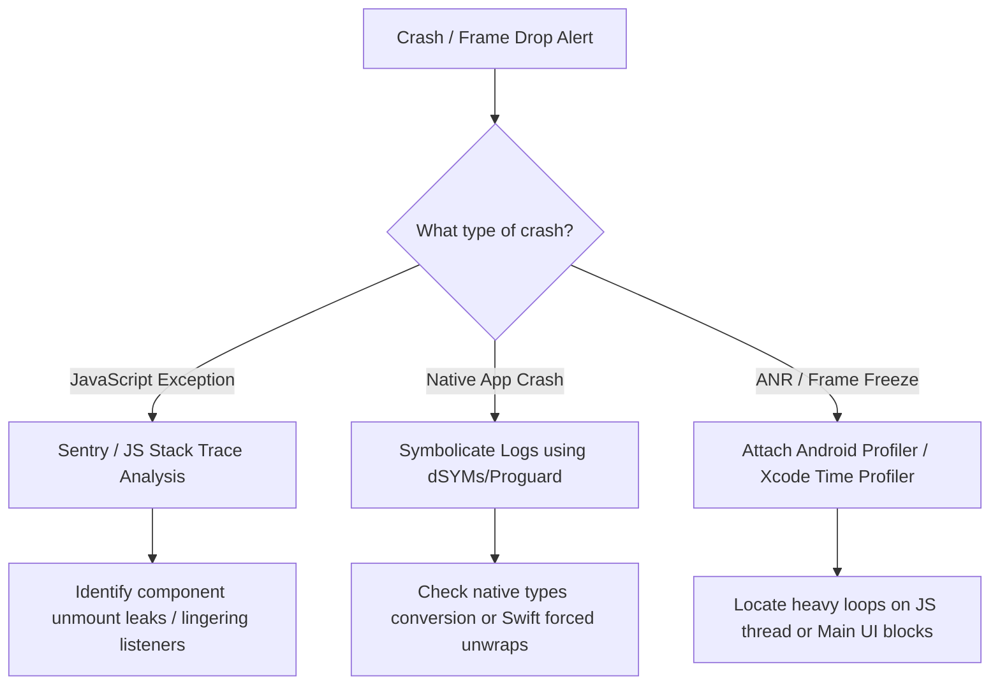

# Senior Lead

## Table of Contents

- [Section 1: 🏗️ MNC & Consulting Architectural Expectations](#section-1-mnc-consulting-architectural-expectations)
- [Section 2: 🔒 Enterprise Security, Compliance & OWASP Mobile Top 10](#section-2-enterprise-security-compliance-owasp-mobile-top-10)
- [Section 3: ⚡ Performance Engineering & Memory Triage (Lead Perspective)](#section-3-performance-engineering-memory-triage-lead-perspective)
- [Section 4: 📦 CI/CD Pipelines, Fastlane & Release Management](#section-4-ci-cd-pipelines-fastlane-release-management)
- [Section 5: 💼 MNC Client Scenarios & Tech Lead Behavior Q&A](#section-5-mnc-client-scenarios-tech-lead-behavior-q-a)
- [Section 6: 📱 Android Native Deep-Dive for React Native Developers](#section-6-android-native-deep-dive-for-react-native-developers)
- [Section 7: 🍎 iOS Native Deep-Dive for React Native Developers](#section-7-ios-native-deep-dive-for-react-native-developers)
- [Section 8: 🔄 Comprehensive Migration Strategies](#section-8-comprehensive-migration-strategies)
- [Section 9: 🏗️ Gradle & CocoaPods Build System Mastery](#section-9-gradle-cocoapods-build-system-mastery)
- [Section 10: 🔬 Advanced Mobile Testing & CI/CD Mastery](#section-10-advanced-mobile-testing-ci-cd-mastery)


---

### MNC Senior Lead Complete Guide

 | Attribute | Details |
| :--- | :--- |
| **Topic Name** | MNC Senior Lead Complete Guide |
| **Difficulty** | Senior / Lead |
| **Interview Frequency** | High |
| **Tags** | 👨💼 Lead Round Favorite |

---


---

| Attribute | Details |
| :--- | :--- |
| **Topic Name** | Section 1: MNC & Consulting Architectural Expectations |
| **Difficulty** | Senior / Lead |
| **Interview Frequency** | High |
| **Tags** | 👨💼 Lead Round Favorite |

---


## Section 1: 🏗️ MNC & Consulting Architectural Expectations

*⏱️ 6 min read*

MNC client architectures require robust separation of concerns, scalability, and long-term maintainability. Senior and Lead developers must design architectures that can scale across large teams and multi-year product cycles.

#### 0. Mandatory Skills Coverage Matrix

Use this matrix to align answers with common Senior React Native JD keywords without sounding like you are reading a checklist.

| Skill Area | Must Mention | Interview Positioning |
| :--- | :--- | :--- |
| **Mandatory Mobile Stack** | React Native, Android, Redux Toolkit | "I can own cross-platform RN delivery while debugging native Android issues and designing predictable RTK state flows." |
| **Core App Layer** | TypeScript/JavaScript, React Navigation, Redux/RTK or Zustand, React Query/TanStack Query | "I separate server state from client state: React Query for remote cache, RTK/Zustand for app state, React Navigation for guarded flows and deep links." |
| **Interaction Layer** | RN Reanimated, RN Gesture Handler | "I keep gestures and animations on the UI thread using shared values, worklets, and gesture composition." |
| **Build & Runtime** | Hermes, Metro bundler, Gradle, CocoaPods | "I understand JS bundling, Hermes bytecode, Android build variants/signing, and iOS pod/linking issues." |
| **Native Tooling** | Android Studio, Xcode, Kotlin, Swift | "I can write light native modules, inspect native crashes, manage permissions, and profile platform-specific performance." |
| **Testing & Quality** | Jest, React Native Testing Library, Detox/Appium, ESLint, Prettier, Husky | "I cover business logic, component behavior, device flows, and enforce code quality before CI." |
| **CI/CD & Release** | Fastlane, CodePush/App Center maintenance, GitHub Actions, Bitrise, Azure DevOps, Play Console, App Store Connect | "I can automate signing, build distribution, staged rollout, OTA risk controls, and store release operations." |
| **Analytics & Observability** | Firebase/GA4, Segment, Amplitude, Sentry/Crashlytics, Datadog | "I separate product analytics, crash diagnostics, RUM/APM, and event routing based on team and compliance needs." |

#### 1. Clean Architecture & SOLID Principles in React Native

Applying **Clean Architecture** to React Native ensures that business logic is completely decoupled from the UI framework, styling libraries, and state management frameworks:

```text
[UI Components (Views)] ➡️ [React Hooks (Presenters)] ➡️ [Use Cases (Domain)] ➡️ [Repositories / Adapters (Data)]
       |                           |                                                  |
(Styles, Native Components)  (Local State/Zustand/RTK)                         (Axios, Apollo, MMKV)
```

- **Domain Layer (Core)**: Contains pure business entities and use cases. This layer should have zero dependencies on React, React Native, or third-party storage/networking APIs. It defines interface contracts (interfaces) for data fetching.
- **Data Layer (Infrastructure)**: Implements repository interfaces defined by the Domain layer. Handles remote API calls (Axios, Apollo Client), local storage operations (MMKV, SQLite), and caching.
- **Presentation Layer (UI)**: Contains React components, styling (StyleSheet, Tailwind), and local state hooks. It calls Domain use cases to execute business logic.

##### Applying SOLID Principles:
- **Single Responsibility Principle (SRP)**: Split screens into presenting views (UI-only components) and state containers (custom hooks containing data fetching and form control logic).
- **Open/Closed Principle (OCP)**: Design components to accept styles, custom action renderers, or configurations as props instead of hardcoding platform or feature checks directly inside components.
- **Liskov Substitution Principle (LSP)**: Ensure custom wrapper components (e.g. `CustomTextInput`) extend and maintain the native properties interface of React Native's `<TextInput>` without breaking behavior.
- **Interface Segregation Principle (ISP)**: Create small, focused typescript interfaces for components and API models instead of passing large global user objects to components that only require a user name.
- **Dependency Inversion Principle (DIP)**: Use Dependency Injection (DI). UI components depend on abstract hooks or domain interfaces rather than importing concrete API client singletons directly.

---

#### 2. Monorepos vs. Multirepos (Yarn, pnpm, Nx) for Large Teams

When coordinating development across multiple sister applications (e.g., customer, partner, agent apps) in large MNC projects, choosing a repository model is a critical decision.

| Model / Feature | Yarn/pnpm Workspaces Monorepo | Nx/Turborepo Monorepo | Multirepos (Separate Git Repos) |
| :--- | :--- | :--- | :--- |
| **Best For** | Medium teams sharing basic TS interfaces & UI elements. | Enterprise-grade multi-app systems with shared native modules. | Siloed teams with completely independent release cycles. |
| **Code Reuse** | High. Shared local folders with workspace symlinks. | Extreme. Enforces strict dependency mapping rules. | Low. Requires publishing private npm packages. |
| **CI/CD Build caching** | Basic. Rebuilds everything unless custom scripts exist. | Advanced. Invalidate cache based on code hashes. | Separate builds. No cross-repo cache sharing. |
| **Dependency Lock** | Single Lockfile. Keeps packages on identical versions. | Single lockfile or workspace scoping options. | Multiple lockfiles. Version drift is common. |

##### Architectural Lead Strategy:
For large-scale teams (50+ engineers), configure **Nx Monorepos** with **pnpm**:
- Enforce boundaries using Nx module tags (e.g., `app:customer` cannot import from `app:agent` directly).
- Use dynamic path mapping in `tsconfig.json` to prevent relative import paths (e.g., import from `@shared/ui` instead of `../../shared/ui`).
- Implement independent version tagging inside packages to decouple deployment cycles while maintaining single-source code storage.

---

#### 3. Legacy Migration & Upgrades (e.g., v0.60 to Modern RN)

Tech Leads are frequently tasked with resolving technical debt by migrating legacy apps or executing major version upgrades.

##### A. Upgrading Legacy React Native (e.g., v0.63 to a modern target):
1. **Analyze Dependencies**: Run audits to check compatibility of third-party native libraries with the target React Native version, Hermes, Fabric, TurboModules, and Codegen.
2. **Utilize React Native Upgrade Helper**: Generate code diffs for native files (`AndroidManifest.xml`, `AppDelegate.mm`, `build.gradle`, `Podfile`) using the community upgrade tool.
3. **Execute Upgrade Steps in Controlled Hops**: Do not jump blindly from a very old RN version to the latest target in one PR. Move through stable checkpoints, update native templates, run both platform builds, and validate the app after each hop.
4. **Hermes & New Architecture Migration**:
   - Hermes is the normal engine expectation in modern RN; verify bytecode builds and Hermes-specific debugging/profiling.
   - Migrate native entry points to modern AppDelegate/ReactHost patterns used by the target template.
   - Enforce TurboModules/Fabric compatibility. Replace or isolate libraries that only work on the legacy architecture when the target app is moving to New Architecture.
5. **Modern RN Target Checks**:
   - Use the Node.js version required by the target React Native template.
   - Update Jest config from `preset: 'react-native'` to `preset: '@react-native/jest-preset'`.
   - Replace removed `StyleSheet.absoluteFillObject` usage with `StyleSheet.absoluteFill` or an explicit absolute-positioning style object.

##### B. Migration Planning Checklist: Legacy RN to Modern RN
Use this answer when an interviewer asks, *"What steps will you follow before migrating a legacy React Native app to a modern app?"*

1. **Discovery & Risk Mapping**:
   - Identify current RN version, native template age, package manager, Node version, Gradle/AGP/Kotlin versions, Xcode/CocoaPods versions, and CI setup.
   - List all native dependencies and custom modules. Mark each as business-critical, replaceable, New-Architecture-ready, or legacy-only.
   - Capture baseline metrics: startup time, bundle size, memory usage, crash-free sessions, ANR rate, slow screens, and release build time.
2. **Business Scope & Release Strategy**:
   - Decide whether the migration is only a framework upgrade or also includes navigation, state, storage, design system, and native SDK changes.
   - Avoid mixing a large feature launch with the architecture migration. Keep the migration branch behaviorally equivalent wherever possible.
   - Define rollback strategy: store release rollback, feature flags, OTA eligibility, and beta-track validation.
3. **Test & Observability Preparation**:
   - Add smoke tests for app launch, login, navigation, payments, push notification handling, deep links, offline sync, and logout.
   - Ensure Sentry/Crashlytics source maps, dSYMs, ProGuard mapping files, and breadcrumbs are uploaded correctly.
   - Add performance checks for startup, large lists, key animations, and memory leaks.
4. **Dependency Upgrade Path**:
   - Upgrade React Native in controlled hops using Upgrade Helper.
   - Upgrade React, React Navigation, Reanimated, Gesture Handler, Screens, Safe Area, MMKV/SQLite, push, analytics, and payment SDKs according to compatibility.
   - Replace abandoned libraries before enabling New Architecture.
5. **Native Template Migration**:
   - Update Android Gradle files, Kotlin configuration, MainApplication/MainActivity, package registration, permissions, ProGuard/R8 rules, and build variants.
   - Update iOS AppDelegate, Podfile, privacy manifests/permissions, entitlements, deployment target, Swift/Objective-C bridging files, and build settings.
6. **Hermes & New Architecture Rollout**:
   - Enable or verify Hermes first; test release bytecode, source maps, and crash symbolication.
   - Enable New Architecture in an internal build; fix Fabric rendering issues, TurboModule specs, event emitters, and Codegen contracts.
   - Keep legacy modules temporarily if they are low-frequency and stable, but migrate performance-sensitive native modules to typed TurboModules/JSI.
7. **Production Rollout**:
   - Release to internal QA, then beta tracks, then a small production percentage.
   - Monitor crash-free sessions, ANRs, startup time, memory, screen load time, API failure rates, and app-store reviews.
   - Remove old bridge shims, deprecated APIs, and unused native configs only after the rollout is stable.

##### C. Migrating Native Android/iOS to React Native:
- **Phase 1: Hybrid Integration (Sub-views)**: Rather than rewriting the entire app, integrate React Native as a single fragment/controller inside the native application. Load the `ReactRootView` inside an Android Activity or iOS UIViewController.
- **Phase 2: Data Bridge Synchronization**: Synchronize authentication states, database registries, and configurations between the native container and React Native JS context using custom bridge events.
- **Phase 3: Incremental Screen Replaces**: Replace legacy screens one-by-one based on feature updates. Once the container navigation is fully replaced by React Navigation, remove native routing files completely.

---


---

---

| Attribute | Details |
| :--- | :--- |
| **Topic Name** | 🔒 Section 2: Enterprise Security, Compliance & OWASP Mobile Top 10 |
| **Difficulty** | Senior / Lead |
| **Interview Frequency** | High |
| **Tags** | 👨💼 Lead Round Favorite |

---


## Section 2: 🔒 Enterprise Security, Compliance & OWASP Mobile Top 10

*⏱️ 2 min read*

Enterprise banking, healthcare, and telecom clients require strict mobile security standards. Lead developers must design applications to protect user data and binary integrity.

#### 1. SSL Pinning & Certificate Rotation

To defend against Man-in-the-Middle (MitM) attacks on public networks, enterprise configurations enforce **SSL Pinning**:

```text
[Mobile App Request] ➡️ Check server certificate hash ➡️ Does it match pre-bundled pin?
                                                                 |
                                                Yes ➡️ Execute request
                                                No  ➡️ Drop connection immediately
```

- **Implementation**: Avoid JavaScript-layer pinning (which is easily bypassed by runtime instrumentation tools like Frida). Implement SSL pinning at the native platform layers:
  - **Android**: Use `OkHttpClient`'s `CertificatePinner` with SHA-256 hashes of the server's public key certificate.
  - **iOS**: Integrate `TrustKit` via Podfile config.
- **Certificate Rotation Strategy**: Bundling static pins in the app binary causes app breakage when certificates expire. Secure configurations:
  - Bundle **backup pins** (e.g., root CA pins or secondary intermediate CA keys).
  - Implement a **dynamic certificate rotation link** (fetch signed, updated pin lists from an authenticated secondary secure endpoint before updating the main API client configurations in memory).

---

#### 2. Jailbreak/Root Detection and Frida Instrumentation Defenses

Attackers decompile binaries and run them on rooted/jailbroken devices to inspect active memory and intercept security functions.

- **Defensive Measures**:
  - **Jailbreak Detection (iOS)**: Check for jailbreak directories (e.g., `/Applications/Cydia.app`), check sandbox integrity by writing to restricted folders, and evaluate if standard native fork calls succeed.
  - **Root Detection (Android)**: Search for the presence of the `su` binary, look for Magisk Manager package registries, and check if test-keys signatures are active on the running kernel.
  - **Anti-Frida Safeguards**: Frida injects dynamic agent libraries and listens on default port `27042`. Use C/C++ native modules to scan `/proc/self/maps` at startup to detect injected `.so` files, and scan local sockets to drop connections if Frida ports are active.

---

#### 3. Secure Local Storage & Data Isolation (Keychain/Keystore)

The OWASP Mobile Top 10 highlights **Insecure Data Storage** as a top vulnerability.

- **Data Isolation**: Never write authentication details, user profiles, or transaction states in plain JSON text format (e.g., standard `AsyncStorage`).
- **Encrypted MMKV**: Wrap MMKV instances with an AES-256 encryption key.
- **Hardware Enclave Binding**: Secure the encryption key itself by writing it to the device's hardware enclaves: **iOS Keychain** and **Android Keystore** (via `react-native-keychain`). The key is resolved in memory only when the application context launches and is verified using biometrics.

---


---

---

| Attribute | Details |
| :--- | :--- |
| **Topic Name** | ⚡ Section 3: Performance Engineering & Memory Triage (Lead Perspective) |
| **Difficulty** | Senior / Lead |
| **Interview Frequency** | High |
| **Tags** | 👨💼 Lead Round Favorite |

---


## Section 3: ⚡ Performance Engineering & Memory Triage (Lead Perspective)

*⏱️ 2 min read*

Enterprise applications running complex data graphs require advanced performance triage strategies.

#### 1. Native Profiling (Xcode Instruments & Android Profiler)

When JavaScript thread diagnostics are insufficient, Tech Leads use native platform profiling tools:

- **Xcode Instruments**:
  - **Allocations**: Identifies memory growth trends. Capture memory snapshots before and after screen interaction sequences. Rising persistent generation heights confirm heap leaks.
  - **Time Profiler**: Analyzes CPU core execution paths. Locates thread-blocking execution stacks in native libraries (C++, Swift, Objective-C).
- **Android Studio Profiler**:
  - **CPU Profiler**: Records method traces (Call Charts/Flame Graphs) to locate native methods blocking the Android Main Thread (causing ANR warnings).
  - **Memory Profiler**: Captures Heap Dumps. Analyze classes with high instance counts (e.g., uncollected Bitmaps or leaked Fragment bindings).
  - **Network Profiler**: Tracks outbound request timings, data sizes, and checks for redundant or duplicate API calls.

---

#### 2. Triage of Memory Leaks, Frame Drops, and ANRs/Crashes

##### Diagnostics Pipeline:



- **Resolving ANRs (App Not Responding)**: Occurs when Android's Main Thread is blocked for $>5$ seconds. Ensure all Native Module logic runs on background worker threads using Kotlin coroutines or Java thread pools (`ExecutorService`), returning callbacks to React Native asynchronously.
- **Symbolication**: Upload source maps to Sentry on every build to resolve obfuscated stack traces (like `Bundle.js:1:2034`) to readable paths (e.g., `PaymentScreen.tsx:L142`).

---

#### 3. Large List Optimizations (Shopify FlashList & Layout Caching)

When rendering massive datasets (e.g., directory listings in telecom portals or statements in banking platforms), traditional `FlatList` has high memory footprints due to view node recreation.

- **Shopify FlashList**: Uses **Cell Recycling** (similar to Android's `RecyclerView` or iOS's `UICollectionView`). When cell views scroll out of bounds, they are not unmounted from native memory. Instead, the native view structure is retained, and only the underlying dataset is swapped.
- **Performance Guidelines**:
  - Keep cell layout components lightweight. Avoid complex view hierarchies inside list elements.
  - Use `estimatedItemSize` in FlashList to allow the layout engine to allocate memory buffers accurately.
  - Wrap list rows in `React.memo` with strict value checks to bypass rendering cycles if list updates occur.

---


---

---

| Attribute | Details |
| :--- | :--- |
| **Topic Name** | 📦 Section 4: CI/CD Pipelines, Fastlane & Release Management |
| **Difficulty** | Senior / Lead |
| **Interview Frequency** | High |
| **Tags** | 👨💼 Lead Round Favorite |

---


## Section 4: 📦 CI/CD Pipelines, Fastlane & Release Management

*⏱️ 2 min read*

In large MNC teams, manual app compilation is unacceptable. Automated deployment guarantees reproducibility and consistency.

#### 1. Fastlane Match & Provisioning Profile Automation

Managing iOS certificate files and provisioning profiles across multiple developers and build agents frequently causes build failures.

- **Fastlane Match**: Implements a Git-based code signing strategy:
  - All developer and distribution certificates, along with their matching provisioning profiles, are encrypted using a symmetric passphrase and stored in a private Git repository.
  - During local or CI/CD builds, Fastlane clones this repository, decrypts the certificates, and installs them directly onto the build machine.
  - Prevents provisioning profile mismatches, duplicate certificate creations, and ensures Xcode builds execute successfully.

---

#### 2. Over-the-Air (OTA) Updates Rollback & Versioning Strategy

OTA updates allow immediate JS-only updates without App Store reviews. However, they carry significant runtime crash risks if managed poorly. Do not position Microsoft App Center CodePush as the default managed service for new projects because the App Center service has been retired. Prefer Expo/EAS Updates for Expo/CNG stacks, or a self-hosted/New-Architecture-compatible OTA provider for bare React Native.

- **The Gold Rules of OTA Versioning**:
  - **Target Binary Locking**: Every OTA bundle must target specific native binary versions (e.g., `~1.4.0` or `1.4.x`). Never target open ranges if native dependencies are updated.
  - **Checking Native Signatures**: If an update changes a native module binding (e.g. adding a new native library), you must bump the binary version. If an old binary downloads the new JS bundle, it will crash immediately due to missing native selectors.
- **Rollback Orchestration**:
  - Configure the updater client to track app start health. If the app crashes twice within 2 minutes of applying an OTA bundle, the updater client must roll back to the stable local embedded bundle immediately.

---

#### 3. Managing App Store Rejections & Play Store Compliance

Tech Leads must navigate compliance requirements to avoid release delays:

- **App Store Rejections (Apple Guidelines)**:
  - *Guideline 2.1 (Performance)*: Ensure Apple reviewers can log in (provide valid mock credentials) and that the app runs without placeholder data or network timeouts.
  - *Guideline 4.8 (Sign in with Apple)*: If the app implements third-party social logins (Google, Facebook), you **must** also provide Apple Sign-In as an equivalent option.
  - *Guideline 5.1.1 (Privacy)*: Declare all background permissions clearly in the `Info.plist` (e.g., Location, Camera) and request usage authorization prompt messages.
- **Play Store Compliance (Google Policies)**:
  - *Target SDK Updates*: Android requires apps to target recent Android API versions. Ensure `compileSdkVersion` and `targetSdkVersion` are updated annually.
  - *Google Play Billing*: Paid features must route through Google Billing APIs rather than external payment portals.

---


---

---

| Attribute | Details |
| :--- | :--- |
| **Topic Name** | 💼 Section 5: MNC Client Scenarios & Tech Lead Behavior Q&A |
| **Difficulty** | Senior / Lead |
| **Interview Frequency** | High |
| **Tags** | 👨💼 Lead Round Favorite |

---


## Section 5: 💼 MNC Client Scenarios & Tech Lead Behavior Q&A

*⏱️ 2 min read*

These scenarios evaluate consulting capabilities, leadership skills, and architectural decision-making.

#### 1. Client-Facing Communication & React Native Recommendations

##### Interview Scenario:
> *"A banking client asks if they should rebuild their existing native iOS and Android retail banking apps using React Native. How do you advise them?"*

- **Strategic Response**:
  "I would guide the client through an Objective Decision Matrix, evaluating their product roadmap, engineering resources, and performance requirements:
  - **When to recommend React Native**:
    - If the product roadmap focuses on UI interactions, forms, statements, data charts, and dynamic content updates.
    - If the client wants to reduce maintenance costs by unifying business logic (TypeScript) and styling across a single team, reducing feature release cycles.
  - **When to retain Native (Swift/Kotlin)**:
    - If the app integrates low-level hardware or OS services (e.g., continuous background location tracking, background audio processing).
    - If the app requires high-performance GPU-bound processing (e.g., real-time face detection models, AR/VR scanning).
  - **Hybrid Recommendation (The Enterprise Way)**:
    - For large banks, I recommend a **Hybrid Strategy**. Retain native containers for core security frameworks, device token registrations, and biometrics. Integrate React Native inside native Activities/Controllers to deliver feature screens (e.g., loans, rewards). This combines native security with cross-platform release speeds."

---

#### 2. Project Estimation & Resource Planning Methods

##### Interview Scenario:
> *"How do you estimate a complex project migration from legacy architectures to React Native?"*

- **Strategic Response**:
  "I apply a multi-tier estimation approach to ensure accuracy and account for integration risks:
  - **1. Feature Decomposition**: Break down the application into modular components: Core Infrastructure (Auth, Networking, Secure Storage), Shared UI Kit components, Feature Screens, and Native Integrations (Custom bridges, push notifications).
  - **2. Three-Point Estimation**: For each component, I gather inputs from senior team members to calculate:
    - $O$: Optimistic duration
    - $P$: Pessimistic duration
    - $M$: Most Likely duration
    - Calculate expected duration using: $E = \frac{O + 4M + P}{6}$
  - **3. Risk Buffer Allocation**: Add a 20-30% buffer specifically for native module integration, build pipeline setups, and third-party SDK upgrades.
  - **4. Sprint Planning Integration**: Map feature components to 2-week sprints, accounting for velocity, testing cycles, and store approval queues."

---

#### 3. Resolving Technical Debt and Team Performance Bottlenecks

##### Interview Scenario:
> *"You join a team where the React Native app build is extremely slow, developers complain about continuous merge conflicts, and crash rates in production are rising. What is your first 30-day action plan?"*

- **Strategic Response**:
  "My first 30 days would follow a structured assessment and remediation framework:
  - **Days 1–10: Audit and Diagnostics**:
    - Analyze crash logs in Sentry to identify the top 3 crash causes.
    - Audit the current CI/CD pipeline bottlenecks (e.g., identify why local caching is disabled during node module restorations).
    - Map dependency graphs to locate version mismatches.
  - **Days 11–20: Immediate Remediations (Quick Wins)**:
    - Implement strict Git hooks (Husky, lint-staged) to enforce linting and type-checks before commits occur, reducing compiler breakages.
    - Fix the top 3 crash causes to stabilize production.
    - Configure dependency cache directories on CI/CD runners to reduce build times by 40-50%.
  - **Days 21–30: Long-Term Architecture Setup**:
    - Introduce feature-based folder organization to isolate code changes, minimizing git merge conflicts.
    - Establish a monorepo strategy if multiple teams are working on shared packages.
    - Draft clear documentation, alignment guidelines, and define automated code review rules."

---


---

---

| Attribute | Details |
| :--- | :--- |
| **Topic Name** | 📱 Section 6: Android Native Deep-Dive for React Native Developers |
| **Difficulty** | Senior / Lead |
| **Interview Frequency** | High |
| **Tags** | 👨💼 Lead Round Favorite |

---


## Section 6: 📱 Android Native Deep-Dive for React Native Developers

*⏱️ 10 min read*

Understanding Android internals is essential for senior React Native developers. MNC interviews frequently probe knowledge of Services, background execution, Kotlin coroutines, Jetpack components, and the Gradle build system — especially for candidates who maintain custom native modules or optimize production Android builds.

#### 1. Android Services

Android **Services** are application components that perform long-running operations in the background without providing a user interface. React Native developers encounter Services when the app needs to continue work after the user navigates away.

##### Types of Services:

| Service Type | Lifecycle | Use Case | Android 8+ Behavior |
| :--- | :--- | :--- | :--- |
| **Foreground Service** | Runs with a persistent notification visible to the user | Music playback, GPS tracking, file uploads | Must call `startForeground()` within 5 seconds |
| **Background Service** | Runs without user awareness | Silent data sync, log uploads | Killed by system within minutes (background execution limits) |
| **Bound Service** | Lives only while a client component is bound to it | IPC between Activities/Fragments and service logic | Not affected by background limits while bound |

##### When React Native Needs Services:
- **Background music playback** that continues when the app is minimized
- **Continuous location tracking** for delivery or ride-sharing apps
- **Large file downloads** that must survive screen navigation
- **Periodic data synchronization** with remote servers

##### Foreground Service with Notification (Android 8+ Requirement):

Starting with Android 8 (API 26), the system enforces **background execution limits**. Any Service that needs to run while the app is in the background must be a Foreground Service with a visible notification:

```kotlin
// MyForegroundService.kt
class LocationTrackingService : Service() {

    override fun onCreate() {
        super.onCreate()
        val channelId = "location_channel"
        val channel = NotificationChannel(
            channelId,
            "Location Tracking",
            NotificationManager.IMPORTANCE_LOW
        )
        val manager = getSystemService(NotificationManager::class.java)
        manager.createNotificationChannel(channel)

        val notification = NotificationCompat.Builder(this, channelId)
            .setContentTitle("Tracking Location")
            .setContentText("Your location is being tracked for delivery")
            .setSmallIcon(R.drawable.ic_location)
            .build()

        // Must call within 5 seconds of startForegroundService()
        startForeground(1, notification)
    }

    override fun onStartCommand(intent: Intent?, flags: Int, startId: Int): Int {
        // Start location tracking logic here
        return START_STICKY
    }

    override fun onBind(intent: Intent?): IBinder? = null
}
```

##### Starting a Service from a React Native Native Module:

```kotlin
// LocationModule.kt — React Native Native Module
class LocationModule(reactContext: ReactApplicationContext) :
    ReactContextBaseJavaModule(reactContext) {

    override fun getName() = "LocationModule"

    @ReactMethod
    fun startTracking() {
        val intent = Intent(reactApplicationContext, LocationTrackingService::class.java)
        if (Build.VERSION.SDK_INT >= Build.VERSION_CODES.O) {
            reactApplicationContext.startForegroundService(intent)
        } else {
            reactApplicationContext.startService(intent)
        }
    }

    @ReactMethod
    fun stopTracking() {
        val intent = Intent(reactApplicationContext, LocationTrackingService::class.java)
        reactApplicationContext.stopService(intent)
    }
}
```

##### IntentService vs JobIntentService vs WorkManager:

| Component | Status | Threading | Use Case |
| :--- | :--- | :--- | :--- |
| **IntentService** | Deprecated (API 30) | Auto background thread, stops itself | Simple one-off background tasks |
| **JobIntentService** | Deprecated | Uses JobScheduler on API 26+ | Backward-compatible background work |
| **WorkManager** | ✅ Recommended | Managed thread pool, survives process death | All deferred/guaranteed background work |

---

#### 2. BroadcastReceivers

**BroadcastReceivers** listen for system-wide or app-internal broadcast events. They act as a pub-sub mechanism within the Android OS.

##### Common System Broadcasts:

| Broadcast Action | Trigger |
| :--- | :--- |
| `CONNECTIVITY_CHANGE` | WiFi/Cellular network state changes |
| `BATTERY_LOW` | Device battery drops below threshold |
| `BOOT_COMPLETED` | Device finishes booting |
| `POWER_CONNECTED` / `POWER_DISCONNECTED` | Charger plugged/unplugged |
| `AIRPLANE_MODE_CHANGED` | Airplane mode toggled |

##### Registering Receivers — Manifest vs Dynamic:

```kotlin
// Option 1: AndroidManifest.xml (survives app death, limited since Android 8)
// <receiver android:name=".BootReceiver" android:exported="true">
//     <intent-filter>
//         <action android:name="android.intent.action.BOOT_COMPLETED" />
//     </intent-filter>
// </receiver>

// Option 2: Dynamic registration in code (preferred for most cases)
class NetworkModule(reactContext: ReactApplicationContext) :
    ReactContextBaseJavaModule(reactContext) {

    private val networkReceiver = object : BroadcastReceiver() {
        override fun onReceive(context: Context, intent: Intent) {
            val isConnected = checkNetworkStatus(context)
            // Send event to React Native JavaScript
            reactApplicationContext
                .getJSModule(DeviceEventManagerModule.RCTDeviceEventEmitter::class.java)
                .emit("onNetworkChange", isConnected)
        }
    }

    @ReactMethod
    fun startListening() {
        val filter = IntentFilter(ConnectivityManager.CONNECTIVITY_ACTION)
        reactApplicationContext.registerReceiver(networkReceiver, filter)
    }

    @ReactMethod
    fun stopListening() {
        reactApplicationContext.unregisterReceiver(networkReceiver)
    }

    override fun getName() = "NetworkModule"
}
```

##### Consuming Native Events in React Native JS:

```typescript
import { NativeEventEmitter, NativeModules } from 'react-native';

const { NetworkModule } = NativeModules;
const emitter = new NativeEventEmitter(NetworkModule);

useEffect(() => {
  NetworkModule.startListening();
  const subscription = emitter.addListener('onNetworkChange', (isConnected: boolean) => {
    console.log('Network status:', isConnected);
  });

  return () => {
    subscription.remove();
    NetworkModule.stopListening();
  };
}, []);
```

---

#### 3. WorkManager

**WorkManager** is the recommended solution for **guaranteed background execution** — tasks that must eventually run even if the app exits or the device restarts.

##### OneTimeWorkRequest vs PeriodicWorkRequest:

```kotlin
// One-time work: upload crash logs once
val uploadWork = OneTimeWorkRequestBuilder<LogUploadWorker>()
    .setConstraints(
        Constraints.Builder()
            .setRequiredNetworkType(NetworkType.CONNECTED)
            .setRequiresCharging(false)
            .setRequiresStorageNotLow(true)
            .build()
    )
    .setBackoffCriteria(BackoffPolicy.EXPONENTIAL, 30, TimeUnit.SECONDS)
    .build()

WorkManager.getInstance(context).enqueue(uploadWork)

// Periodic work: sync data every 15 minutes (minimum interval)
val syncWork = PeriodicWorkRequestBuilder<DataSyncWorker>(15, TimeUnit.MINUTES)
    .setConstraints(
        Constraints.Builder()
            .setRequiredNetworkType(NetworkType.UNMETERED) // WiFi only
            .build()
    )
    .build()

WorkManager.getInstance(context).enqueueUniquePeriodicWork(
    "data_sync",
    ExistingPeriodicWorkPolicy.KEEP,
    syncWork
)
```

##### Chaining Work:

```kotlin
WorkManager.getInstance(context)
    .beginWith(downloadWork)           // Step 1: Download data
    .then(parseWork)                    // Step 2: Parse downloaded data
    .then(uploadWork)                   // Step 3: Upload parsed results
    .enqueue()
```

##### Worker Implementation:

```kotlin
class DataSyncWorker(
    context: Context,
    params: WorkerParameters
) : CoroutineWorker(context, params) {

    override suspend fun doWork(): Result {
        return try {
            val apiService = ApiClient.create()
            val localData = LocalDatabase.getInstance(applicationContext).getPendingSync()
            apiService.syncData(localData)
            LocalDatabase.getInstance(applicationContext).markSynced()
            Result.success()
        } catch (e: Exception) {
            if (runAttemptCount < 3) Result.retry() else Result.failure()
        }
    }
}
```

##### When to Use WorkManager in React Native:
- **Offline data sync**: Queue mutations when offline, sync when connectivity returns
- **Log/analytics uploads**: Batch and upload diagnostic logs periodically
- **Periodic data refresh**: Refresh cached catalogs or configuration data
- **Image/file compression**: Process media files in background before upload

---

#### 4. Kotlin Coroutines

**Coroutines** are Kotlin's solution for asynchronous programming — lightweight, non-blocking, and structured. They are far more efficient than Java threads for concurrent native module operations.

##### Core Concepts:

```kotlin
// suspend function — can be paused and resumed without blocking a thread
suspend fun fetchUserProfile(userId: String): UserProfile {
    return withContext(Dispatchers.IO) {
        apiService.getProfile(userId)  // Network call on IO thread
    }
}

// launch — fire-and-forget coroutine
CoroutineScope(Dispatchers.Main).launch {
    val profile = fetchUserProfile("user_123")
    updateUI(profile)  // Back on Main thread
}

// async/await — concurrent execution with result
CoroutineScope(Dispatchers.IO).launch {
    val profileDeferred = async { apiService.getProfile(userId) }
    val ordersDeferred = async { apiService.getOrders(userId) }
    
    val profile = profileDeferred.await()
    val orders = ordersDeferred.await()
    // Both calls ran concurrently
}
```

##### Dispatchers:

| Dispatcher | Thread Pool | Use Case |
| :--- | :--- | :--- |
| `Dispatchers.Main` | Android Main/UI thread | UI updates, Toast messages |
| `Dispatchers.IO` | Shared pool optimized for blocking I/O | Network calls, database reads, file I/O |
| `Dispatchers.Default` | Shared pool optimized for CPU work | JSON parsing, list sorting, encryption |
| `Dispatchers.Unconfined` | Inherits caller's thread | Testing, advanced edge cases |

##### Coroutines in React Native Native Modules:

```kotlin
class DatabaseModule(reactContext: ReactApplicationContext) :
    ReactContextBaseJavaModule(reactContext) {

    private val scope = CoroutineScope(Dispatchers.IO + SupervisorJob())

    override fun getName() = "DatabaseModule"

    @ReactMethod
    fun queryUsers(filter: String, promise: Promise) {
        scope.launch {
            try {
                val db = AppDatabase.getInstance(reactApplicationContext)
                val users = db.userDao().searchUsers("%$filter%")
                
                val result = WritableNativeArray()
                users.forEach { user ->
                    val map = WritableNativeMap().apply {
                        putString("id", user.id)
                        putString("name", user.name)
                        putString("email", user.email)
                    }
                    result.pushMap(map)
                }
                
                promise.resolve(result)
            } catch (e: Exception) {
                promise.reject("DB_ERROR", e.message, e)
            }
        }
    }

    override fun onCatalystInstanceDestroy() {
        scope.cancel()  // Prevent leaks when React context is destroyed
    }
}
```

##### Coroutines vs RxJava vs Callbacks:

| Feature | Kotlin Coroutines | RxJava | Callbacks |
| :--- | :--- | :--- | :--- |
| **Learning Curve** | Moderate | Steep | Low |
| **Code Readability** | Sequential style (easy) | Operator chains (complex) | Nested callbacks (hard) |
| **Error Handling** | try/catch | onError operators | Manual error propagation |
| **Cancellation** | Built-in structured concurrency | Disposable management | Manual flag checking |
| **Memory Overhead** | Very low (suspend/resume) | Higher (Observable chains) | Low |
| **Android Recommendation** | ✅ Official recommendation | Being replaced | Legacy pattern |
| **React Native Fit** | Excellent for Native Modules | Overkill for most cases | Works but messy |

---

#### 5. Jetpack Components

**Jetpack** is Android's suite of libraries that help developers build robust, maintainable apps. Senior React Native developers need Jetpack knowledge when building complex native modules or hybrid apps.

##### Key Jetpack Libraries Relevant to React Native:

| Library | Purpose | React Native Relevance |
| :--- | :--- | :--- |
| **ViewModel** | Survives configuration changes (rotation) | Managing state in native Activity/Fragment hosting RN |
| **LiveData** | Lifecycle-aware observable data holder | Emitting native data changes to React Native JS layer |
| **Room** | SQLite abstraction with compile-time query verification | Native persistence layer accessed via Native Modules |
| **DataStore** | Modern replacement for SharedPreferences (Proto/Preferences) | Storing typed configuration data natively |
| **Navigation** | Fragment/Activity navigation graph | Hybrid apps with both native and RN screens |
| **Hilt/Dagger** | Dependency injection | Injecting services into Native Modules cleanly |
| **CameraX** | Camera abstraction API | Custom camera Native Modules with preview/capture |
| **Jetpack Compose** | Declarative UI toolkit for Android | Embedding Compose views alongside React Native views |

##### When React Native Developers Need Jetpack Knowledge:
- Building **custom native modules** that interact with device hardware (Camera, Sensors)
- Creating **hybrid applications** where some screens are native Android (Compose/XML) and others are React Native
- Implementing **native persistence** layers (Room, DataStore) accessed from JS via bridge/TurboModules
- Maintaining **existing native Android code** in brownfield React Native integrations
- Optimizing **background processing** using WorkManager (part of Jetpack)

---

#### 6. Gradle Build System Deep-Dive

The **Gradle** build system is the backbone of Android development. React Native developers must understand Gradle configurations to manage build variants, resolve dependency conflicts, and optimize build performance.

##### Project Structure:

```text
android/
├── settings.gradle          # Declares included modules
├── build.gradle             # Project-level: repositories, classpath plugins
├── gradle.properties        # JVM args, RN flags (newArchEnabled, hermesEnabled)
├── gradle/wrapper/
│   └── gradle-wrapper.properties  # Gradle distribution version
└── app/
    ├── build.gradle          # App-level: dependencies, build types, flavors
    ├── proguard-rules.pro    # R8/ProGuard minification rules
    └── src/
        ├── main/             # Shared source
        ├── debug/            # Debug-only overrides
        ├── release/          # Release-only overrides
        ├── staging/          # Flavor-specific source (if configured)
        └── production/       # Flavor-specific source (if configured)
```

##### Multi-Flavor Build Configuration:

```groovy
// android/app/build.gradle
android {
    compileSdkVersion 34

    defaultConfig {
        applicationId "com.myapp"
        minSdkVersion 24
        targetSdkVersion 34
        versionCode 42
        versionName "2.1.0"
    }

    // Signing configurations for release builds
    signingConfigs {
        release {
            storeFile file(MYAPP_RELEASE_STORE_FILE)
            storePassword MYAPP_RELEASE_STORE_PASSWORD
            keyAlias MYAPP_RELEASE_KEY_ALIAS
            keyPassword MYAPP_RELEASE_KEY_PASSWORD
        }
    }

    // Product flavors: different API endpoints, app names, icons
    flavorDimensions "environment"
    productFlavors {
        staging {
            dimension "environment"
            applicationIdSuffix ".staging"
            versionNameSuffix "-staging"
            buildConfigField "String", "API_BASE_URL", '"https://api-staging.myapp.com"'
            resValue "string", "app_name", "MyApp Staging"
        }
        production {
            dimension "environment"
            buildConfigField "String", "API_BASE_URL", '"https://api.myapp.com"'
            resValue "string", "app_name", "MyApp"
        }
    }

    // Build types
    buildTypes {
        debug {
            debuggable true
            // Hermes bytecode not used in debug for fast reload
        }
        release {
            minifyEnabled true        // Enable R8 code shrinking
            shrinkResources true      // Remove unused resources
            signingConfig signingConfigs.release
            proguardFiles getDefaultProguardFile('proguard-android-optimize.txt'),
                          'proguard-rules.pro'
        }
    }

    // Build variants generated: stagingDebug, stagingRelease,
    //                           productionDebug, productionRelease
}
```

##### Build Variants = buildType × productFlavor:

```text
┌──────────────┬────────────────────┬─────────────────────┐
│   Flavor     │  Debug             │  Release            │
├──────────────┼────────────────────┼─────────────────────┤
│  staging     │  stagingDebug      │  stagingRelease     │
│  production  │  productionDebug   │  productionRelease  │
└──────────────┴────────────────────┴─────────────────────┘

Run specific variant:
  ./gradlew assembleStagingDebug
  ./gradlew assembleProductionRelease
  ./gradlew bundleProductionRelease   # AAB for Play Store
```

##### Dependency Management Keywords:

| Keyword | Behavior | Use Case |
| :--- | :--- | :--- |
| `implementation` | Available only to the declaring module | Most dependencies (default choice) |
| `api` | Transitively exposed to consumers | Shared library modules used by other modules |
| `compileOnly` | Available at compile time, not at runtime | Annotation processors, Lombok |
| `runtimeOnly` | Available at runtime, not at compile time | Database drivers, logging backends |
| `testImplementation` | Available only in test source sets | JUnit, Mockito, Espresso |

##### Common Gradle Issues in React Native:

| Issue | Cause | Solution |
| :--- | :--- | :--- |
| Duplicate class errors | Two libraries bundle the same dependency | `exclude group:` in dependency block or `resolutionStrategy.force` |
| Version conflict | Transitive dependencies pull different versions | Use `configurations.all { resolutionStrategy { force 'lib:version' } }` |
| Build failures after RN upgrade | AGP/Gradle version mismatch | Update `distributionUrl` in gradle-wrapper.properties and AGP in project build.gradle |
| Slow builds | No caching, no parallel execution | Add `org.gradle.parallel=true`, `org.gradle.caching=true` to gradle.properties |
| ProGuard stripping needed classes | Missing keep rules for reflection-based code | Add `-keep class com.myapp.** { *; }` rules |

---

#### Interview Q&A for Android Deep-Dive

##### Interview Scenario:
> *"What is the difference between a Service and a BroadcastReceiver?"*

- **Strategic Response**:
  "A **Service** is designed for long-running background operations — it has its own lifecycle and can run independently of any Activity. Examples include music playback, file downloads, and location tracking. A **BroadcastReceiver**, on the other hand, is a lightweight event listener — it responds to system or app broadcasts (like connectivity changes or boot completion) and executes a short piece of code in its `onReceive()` method. A BroadcastReceiver should not perform long-running work directly; instead, it should start a Service or enqueue WorkManager work when extended processing is needed."

##### Interview Scenario:
> *"When would you use WorkManager instead of a foreground Service?"*

- **Strategic Response**:
  "I use **WorkManager** when the task is **deferrable** and needs **guaranteed execution** — meaning it doesn't need to happen right now, but it must eventually complete even if the app is killed or the device restarts. Examples include syncing offline data, uploading logs, or periodic cache cleanup. I use a **Foreground Service** when the task must run **immediately and continuously** with the user's awareness — such as music playback, real-time GPS tracking, or an active phone call. WorkManager is also better for tasks with constraints (like 'only on WiFi' or 'only while charging'), while Foreground Services are appropriate for user-initiated ongoing operations."

##### Interview Scenario:
> *"How do Kotlin coroutines improve React Native native module performance?"*

- **Strategic Response**:
  "Coroutines improve native module performance in several ways. First, they enable **non-blocking asynchronous execution** — database queries, file I/O, and network calls run on `Dispatchers.IO` without blocking the Android Main Thread, preventing ANRs. Second, **structured concurrency** ensures that when the React Native context is destroyed, all coroutines launched within a module's scope are automatically cancelled, preventing memory leaks. Third, using `async/await` allows **concurrent parallel execution** — for example, fetching user profile and order history simultaneously rather than sequentially. Finally, coroutines have minimal memory overhead compared to creating new Java threads for each native module call."

##### Interview Scenario:
> *"What are build variants and product flavors in Android?"*

- **Strategic Response**:
  "**Product Flavors** define different versions of the app — for example, a `staging` flavor that points to a staging API and a `production` flavor that connects to the production API. Each flavor can have its own `applicationId`, app name, icon, and build config fields. **Build Types** define how the app is built — typically `debug` (with debugging enabled, no minification) and `release` (with R8 minification, ProGuard rules, and signing). **Build Variants** are the cross-product of flavors and build types. So with two flavors (staging, production) and two build types (debug, release), you get four variants: `stagingDebug`, `stagingRelease`, `productionDebug`, `productionRelease`. In React Native projects, I configure flavors to manage different API endpoints, feature flags, and app identifiers across environments."

##### Interview Scenario:
> *"How do you handle background tasks in React Native for Android?"*

- **Strategic Response**:
  "I choose the background execution mechanism based on the task requirements:
  - **Immediate, user-visible tasks** (music, GPS): Foreground Service with a notification.
  - **Deferred, guaranteed tasks** (data sync, log upload): WorkManager with constraints.
  - **Short reactive tasks** (respond to network change): BroadcastReceiver that enqueues WorkManager work.
  - **Periodic tasks** (refresh cache every 15 min): PeriodicWorkRequest via WorkManager.
  For React Native integration, I create a Native Module that exposes methods like `scheduleSync()` or `startTracking()` to JavaScript. The native side handles lifecycle, threading, and OS-level scheduling. I avoid running heavy background logic in JavaScript because the JS thread may be suspended when the app is backgrounded."

##### Interview Scenario:
> *"What Jetpack components have you used in React Native projects?"*

- **Strategic Response**:
  "In my React Native projects, I've used several Jetpack components:
  - **WorkManager** for scheduling periodic data synchronization and log uploads with network constraints.
  - **Room Database** as the native persistence layer for offline-first features, accessed from JS via TurboModules.
  - **DataStore** (Preferences) to replace SharedPreferences for storing user settings with type safety and coroutine support.
  - **CameraX** to build a custom camera Native Module with preview, capture, and image analysis capabilities.
  - **Hilt** for dependency injection in complex native module setups — injecting API clients, database instances, and configuration objects into Native Modules cleanly rather than using static singletons.
  In hybrid brownfield apps, I've also used the **Navigation Component** to manage transitions between native Android screens and React Native fragments."

---


---

---

| Attribute | Details |
| :--- | :--- |
| **Topic Name** | 🍎 Section 7: iOS Native Deep-Dive for React Native Developers |
| **Difficulty** | Senior / Lead |
| **Interview Frequency** | High |
| **Tags** | 👨💼 Lead Round Favorite |

---


## Section 7: 🍎 iOS Native Deep-Dive for React Native Developers

*⏱️ 6 min read*

iOS development knowledge is equally critical for senior React Native engineers. MNC interviews test CocoaPods proficiency, Xcode build configuration understanding, and iOS background execution capabilities.

#### 1. CocoaPods Deep-Dive

**CocoaPods** is the primary dependency manager for iOS in React Native projects. It resolves, downloads, and links native iOS libraries specified in the `Podfile`.

##### Podfile Configuration:

```ruby
### ios/Podfile
require_relative '../node_modules/react-native/scripts/react_native_pods'
require_relative '../node_modules/@react-native-community/cli-platform-ios/native_modules'

platform :ios, min_ios_version_supported

prepare_react_native_project!

linkage = ENV['USE_FRAMEWORKS']
if linkage != nil
  Pod::UI.puts "Configuring Pod with #{linkage}#{' static' if googl} linking"
  use_frameworks! :linkage => linkage.to_sym
end

target 'MyApp' do
  config = use_native_modules!

  use_react_native!(
    :path => config[:reactNativePath],
    :app_path => "#{Pod::Config.instance.installation_root}/.."
  )

  # Additional pods
  pod 'Firebase/Analytics', '~> 10.0'
  pod 'GoogleMaps', '~> 8.0'

  target 'MyAppTests' do
    inherit! :complete
  end

  post_install do |installer|
    react_native_post_install(
      installer,
      config[:reactNativePath],
      :mac_catalyst_enabled => false
    )
  end
end
```

##### pod install vs pod update:

| Command | Behavior | When to Use |
| :--- | :--- | :--- |
| `pod install` | Resolves dependencies respecting `Podfile.lock` versions | After cloning repo, after adding/removing pods |
| `pod update` | Ignores lock file, resolves to latest matching versions | When intentionally upgrading pod versions |
| `pod update FirebasePod` | Updates only the specified pod | Targeted single-pod upgrade |
| `pod deintegrate && pod install` | Full clean reinstall | Fixing corrupted pod state |

##### Common CocoaPods Issues in React Native:

| Issue | Cause | Solution |
| :--- | :--- | :--- |
| `CDN: trunk URL couldn't be downloaded` | CocoaPods CDN issues | Run `pod repo update` or add `source 'https://cdn.cocoapods.org/'` |
| Architecture errors on M1/M2 | arm64 simulator exclusion | Add `EXCLUDED_ARCHS[sdk=iphonesimulator*] = arm64` or run with Rosetta |
| `Multiple commands produce` | Duplicate resource files | Clean build folder, check for duplicate pod entries |
| `The following Swift pods cannot yet be integrated as static libraries` | Static linkage incompatibility | Add `use_frameworks! :linkage => :static` or `:dynamic` as needed |
| Slow `pod install` | Large repo cache, no CDN | Use `cdn.cocoapods.org` source, clean cache with `pod cache clean --all` |

##### Linking and Auto-Linking in Modern React Native:
Starting with React Native 0.60+, **auto-linking** automatically detects and links native dependencies listed in `package.json`. Manual linking (`react-native link`) is no longer needed for most libraries. The auto-linking mechanism reads each library's `react-native.config.js` and generates the necessary pod entries during `pod install`.

---

#### 2. Xcode Build Settings

Understanding Xcode build configuration is essential for managing release builds, signing, and platform-specific settings.

##### Build Settings vs Build Phases vs Build Rules:

| Concept | Purpose | Examples |
| :--- | :--- | :--- |
| **Build Settings** | Compiler flags, search paths, signing identity | `PRODUCT_BUNDLE_IDENTIFIER`, `CODE_SIGN_IDENTITY` |
| **Build Phases** | Steps executed during build in order | Compile Sources, Copy Bundle Resources, Run Script (bundle React Native JS) |
| **Build Rules** | Custom processing rules for file types | Custom preprocessing for specific file extensions |

##### Schemes and Configurations:

```text
Scheme: MyApp
├── Build Configuration: Debug
│   ├── Connects to Metro bundler
│   ├── No code optimization
│   └── Debug symbols included
├── Build Configuration: Release
│   ├── Bundles JS offline (main.jsbundle)
│   ├── Full compiler optimization (-Os)
│   └── Stripped debug symbols
└── Build Configuration: Staging (custom)
    ├── Uses staging API endpoint
    ├── Bundles JS offline
    └── Separate provisioning profile
```

To create a custom scheme: **Product → Scheme → Manage Schemes → Duplicate** an existing scheme, then assign the custom build configuration.

##### Code Signing:

| Component | Purpose |
| :--- | :--- |
| **Signing Certificate** | Developer or Distribution identity (from Apple Developer account) |
| **Provisioning Profile** | Links app ID + certificate + allowed devices (Development) or App Store |
| **Team ID** | Your Apple Developer team identifier |
| **Automatic Signing** | Xcode manages certificates/profiles automatically (good for development) |
| **Manual Signing** | Explicitly select certificate and profile (required for CI/CD with Fastlane Match) |

##### Privacy Manifest (PrivacyInfo.xcprivacy) — Required Since iOS 17:

Starting with iOS 17 and enforced in 2024, Apple requires apps to declare **privacy nutrition labels** in a `PrivacyInfo.xcprivacy` file:

```xml
<!-- ios/MyApp/PrivacyInfo.xcprivacy -->
<?xml version="1.0" encoding="UTF-8"?>
<!DOCTYPE plist PUBLIC "-//Apple//DTD PLIST 1.0//EN"
    "http://www.apple.com/DTDs/PropertyList-1.0.dtd">
<plist version="1.0">
<dict>
    <key>NSPrivacyAccessedAPITypes</key>
    <array>
        <dict>
            <key>NSPrivacyAccessedAPIType</key>
            <string>NSPrivacyAccessedAPICategoryUserDefaults</string>
            <key>NSPrivacyAccessedAPITypeReasons</key>
            <array>
                <string>CA92.1</string>
            </array>
        </dict>
    </array>
    <key>NSPrivacyCollectedDataTypes</key>
    <array/>
    <key>NSPrivacyTracking</key>
    <false/>
</dict>
</plist>
```

This file declares which restricted APIs the app uses (e.g., `UserDefaults`, file timestamps, disk space, system boot time) and the **reasons** for using them. Third-party SDKs must also include their own privacy manifests.

---

#### 3. iOS Background Execution

iOS is significantly more restrictive than Android regarding background execution. Understanding the available mechanisms is critical.

##### Background Modes:

| Mode | Capability | Use Case |
| :--- | :--- | :--- |
| **Audio** | Continue playing/recording audio | Music, podcast, VoIP apps |
| **Location Updates** | Receive location changes in background | Navigation, fitness tracking |
| **Background Fetch** | Periodic short execution windows | Refreshing feed content |
| **Remote Notifications** | Silent push triggers background code | Syncing data on server-side events |
| **Background Processing** | Long tasks during device idle (iOS 13+) | Database maintenance, ML model updates |

##### BGTaskScheduler (iOS 13+):

```swift
// AppDelegate.swift — Register background tasks
func application(_ application: UIApplication,
                 didFinishLaunchingWithOptions launchOptions: [UIApplication.LaunchOptionsKey: Any]?) -> Bool {
    
    BGTaskScheduler.shared.register(
        forTaskWithIdentifier: "com.myapp.datasync",
        using: nil
    ) { task in
        self.handleDataSync(task: task as! BGProcessingTask)
    }
    
    return true
}

func handleDataSync(task: BGProcessingTask) {
    let queue = OperationQueue()
    let syncOperation = DataSyncOperation()
    
    task.expirationHandler = {
        queue.cancelAllOperations()
    }
    
    syncOperation.completionBlock = {
        task.setTaskCompleted(success: !syncOperation.isCancelled)
        self.scheduleNextSync()  // Re-schedule for next execution
    }
    
    queue.addOperation(syncOperation)
}

func scheduleNextSync() {
    let request = BGProcessingTaskRequest(identifier: "com.myapp.datasync")
    request.requiresNetworkConnectivity = true
    request.requiresExternalPower = false
    request.earliestBeginDate = Date(timeIntervalSinceNow: 3600)  // 1 hour
    
    try? BGTaskScheduler.shared.submit(request)
}
```

##### Silent Push Notifications for Background Data Sync:

```json
{
  "aps": {
    "content-available": 1
  },
  "sync-type": "new-messages"
}
```

When iOS receives a silent push with `"content-available": 1`, it wakes the app in the background and gives it approximately 30 seconds to fetch new data. This is commonly used in React Native chat apps for syncing messages.

##### When React Native Apps Need Background Execution:
- **Chat applications**: Silent push to sync new messages
- **Fitness/health apps**: Continuous location or sensor tracking
- **Enterprise apps**: Periodic data synchronization with backend
- **Media apps**: Background audio playback

---

#### Interview Q&A

##### Interview Scenario:
> *"How do you resolve CocoaPods issues in React Native?"*

- **Strategic Response**:
  "I follow a systematic debugging approach:
  1. **Clean and reinstall**: `cd ios && pod deintegrate && rm -rf Pods Podfile.lock && pod install`
  2. **Clear caches**: `pod cache clean --all` and clean Xcode derived data (`rm -rf ~/Library/Developer/Xcode/DerivedData`)
  3. **Architecture issues on Apple Silicon**: Ensure `EXCLUDED_ARCHS` is set correctly, or run `arch -x86_64 pod install` if specific pods don't support arm64 simulator
  4. **Version conflicts**: Check `Podfile.lock` for version mismatches, use `pod update SpecificPod` for targeted updates
  5. **Framework linking issues**: Toggle between `use_frameworks! :linkage => :static` and `:dynamic` based on SDK requirements
  6. **React Native version upgrades**: Always regenerate pods after upgrading RN — the `post_install` hooks change between versions"

##### Interview Scenario:
> *"What are Xcode Schemes and when do you create custom schemes?"*

- **Strategic Response**:
  "Xcode Schemes define how a target is built, run, tested, and profiled. Each scheme maps to a **Build Configuration** (like Debug or Release). I create custom schemes when the project needs more than two environments. For example, in an enterprise app, I'll create `MyApp-Staging` and `MyApp-Production` schemes — each pointing to a custom build configuration that sets different API URLs, bundle identifiers, and provisioning profiles. This allows QA to install both staging and production builds on the same device simultaneously. In CI/CD, I reference specific schemes: `xcodebuild -scheme MyApp-Production -configuration Release` to ensure the correct build variant is produced."

##### Interview Scenario:
> *"How do you handle background tasks on iOS?"*

- **Strategic Response**:
  "iOS background execution is heavily restricted compared to Android, so choosing the right mechanism is critical:
  - **For periodic data refresh**: I use `BGAppRefreshTask` via `BGTaskScheduler`, which gives the app brief execution windows when iOS determines it's appropriate based on user usage patterns.
  - **For long background processing**: I use `BGProcessingTask`, which runs during device idle/charging — suitable for database cleanup or ML model updates.
  - **For event-driven sync**: I use **Silent Push Notifications** (`content-available: 1`) to wake the app and sync data when the server has new content.
  - **For continuous tracking**: I enable the **Location Updates** background mode and use significant location change monitoring to minimize battery impact.
  All background tasks must be registered in `Info.plist` under `UIBackgroundModes` and in code via `BGTaskScheduler.shared.register()`. I always implement expiration handlers to save state gracefully when iOS terminates the background task."

##### Interview Scenario:
> *"What is the Privacy Manifest and why is it required?"*

- **Strategic Response**:
  "The **Privacy Manifest** (`PrivacyInfo.xcprivacy`) is Apple's requirement starting iOS 17 that forces apps to declare which restricted system APIs they access and why. This includes APIs like `UserDefaults`, file timestamp access, disk space checks, and system boot time. Each accessed API must have an associated 'reason code' from Apple's predefined list. Third-party SDKs must also include their own privacy manifests. If your app or any included SDK uses these APIs without a privacy manifest, **App Store Connect will reject the submission**. In React Native projects, this means checking that all native dependencies (Firebase, analytics SDKs, etc.) have updated to include their own `PrivacyInfo.xcprivacy` files, and adding your app's own manifest for any direct API usage."

---


---

---

| Attribute | Details |
| :--- | :--- |
| **Topic Name** | 🔄 Section 8: Comprehensive Migration Strategies |
| **Difficulty** | Senior / Lead |
| **Interview Frequency** | High |
| **Tags** | 👨💼 Lead Round Favorite |

---


## Section 8: 🔄 Comprehensive Migration Strategies

*⏱️ 12 min read*

Large-scale migrations are defining moments for senior React Native engineers. MNC interviews heavily test your ability to plan, execute, and de-risk migrations across codebases serving millions of users. This section covers the most common migration paths with step-by-step strategies, risks, and interview-ready responses.

#### 1. JavaScript → TypeScript Migration

##### Why Migrate:
- **Type safety** catches bugs at compile time rather than runtime
- **Better IDE support** with autocomplete, refactoring, and inline documentation
- **Fewer runtime errors** from type mismatches, null/undefined access, and wrong function signatures
- **Codegen requirement**: React Native's New Architecture Codegen requires TypeScript specs for TurboModules and Fabric components

##### Step-by-Step Strategy:

```text
Phase 1: Setup (Week 1)
├── Install typescript, @types/react, @types/react-native
├── Create tsconfig.json with allowJs: true (coexistence mode)
├── Add path aliases (@components, @screens, @services)
└── Configure ESLint with @typescript-eslint parser

Phase 2: Gradual Conversion (Weeks 2-8)
├── Start with utility files (.js → .ts): API clients, helpers, constants
├── Convert shared types/interfaces: API responses, navigation params, store state
├── Convert screen components (.js → .tsx): start with leaf screens, move to navigators
└── Convert hooks and context providers

Phase 3: Strict Mode (Weeks 9-12)
├── Enable strict: true in tsconfig.json
├── Eliminate all 'any' types (search for ': any' and 'as any')
├── Add return types to all exported functions
└── Enable noImplicitAny, strictNullChecks, strictFunctionTypes
```

##### tsconfig.json Setup:

```json
{
  "compilerOptions": {
    "target": "esnext",
    "module": "commonjs",
    "lib": ["es2021"],
    "allowJs": true,
    "checkJs": true,
    "jsx": "react-native",
    "strict": true,
    "noImplicitAny": true,
    "strictNullChecks": true,
    "esModuleInterop": true,
    "skipLibCheck": true,
    "forceConsistentCasingInFileNames": true,
    "resolveJsonModule": true,
    "baseUrl": ".",
    "paths": {
      "@components/*": ["src/components/*"],
      "@screens/*": ["src/screens/*"],
      "@services/*": ["src/services/*"],
      "@hooks/*": ["src/hooks/*"],
      "@store/*": ["src/store/*"]
    }
  },
  "include": ["src/**/*"],
  "exclude": ["node_modules", "babel.config.js", "metro.config.js"]
}
```

##### Common Challenges:
- **Third-party library types**: Some libraries lack `@types/*` packages — create local `.d.ts` declaration files
- **`any` escape hatch overuse**: Set up ESLint rule `@typescript-eslint/no-explicit-any: "warn"` to track and gradually eliminate
- **Estimated timeline for 50k LOC app**: 8–12 weeks with 2 engineers, or 4–6 sprints of gradual migration alongside feature work

---

#### 2. Redux → Redux Toolkit Migration

##### Why Migrate:
- **Less boilerplate**: `createSlice` eliminates separate action type constants, action creators, and reducers
- **Built-in Immer**: Write "mutating" state updates that are safely converted to immutable operations
- **`createAsyncThunk`**: Standardized async action pattern with pending/fulfilled/rejected states
- **RTK Query**: Powerful data fetching and caching layer that can replace Saga/Thunk API logic entirely

##### Before/After Comparison:

```typescript
// ========== BEFORE: Traditional Redux ==========

// actionTypes.ts
export const FETCH_USERS_REQUEST = 'FETCH_USERS_REQUEST';
export const FETCH_USERS_SUCCESS = 'FETCH_USERS_SUCCESS';
export const FETCH_USERS_FAILURE = 'FETCH_USERS_FAILURE';

// actions.ts
export const fetchUsersRequest = () => ({ type: FETCH_USERS_REQUEST });
export const fetchUsersSuccess = (users: User[]) => ({
  type: FETCH_USERS_SUCCESS,
  payload: users,
});
export const fetchUsersFailure = (error: string) => ({
  type: FETCH_USERS_FAILURE,
  payload: error,
});

// reducer.ts
const initialState = { users: [], loading: false, error: null };
export const usersReducer = (state = initialState, action: any) => {
  switch (action.type) {
    case FETCH_USERS_REQUEST:
      return { ...state, loading: true, error: null };
    case FETCH_USERS_SUCCESS:
      return { ...state, loading: false, users: action.payload };
    case FETCH_USERS_FAILURE:
      return { ...state, loading: false, error: action.payload };
    default:
      return state;
  }
};

// ========== AFTER: Redux Toolkit ==========

// usersSlice.ts — Everything in one file
import { createSlice, createAsyncThunk } from '@reduxjs/toolkit';

export const fetchUsers = createAsyncThunk(
  'users/fetchUsers',
  async (_, { rejectWithValue }) => {
    try {
      const response = await api.getUsers();
      return response.data;
    } catch (error) {
      return rejectWithValue(error.message);
    }
  }
);

const usersSlice = createSlice({
  name: 'users',
  initialState: {
    users: [] as User[],
    loading: false,
    error: null as string | null,
  },
  reducers: {
    clearUsers(state) {
      state.users = [];  // Immer makes this safe
    },
  },
  extraReducers: (builder) => {
    builder
      .addCase(fetchUsers.pending, (state) => {
        state.loading = true;
        state.error = null;
      })
      .addCase(fetchUsers.fulfilled, (state, action) => {
        state.loading = false;
        state.users = action.payload;
      })
      .addCase(fetchUsers.rejected, (state, action) => {
        state.loading = false;
        state.error = action.payload as string;
      });
  },
});

export const { clearUsers } = usersSlice.actions;
export default usersSlice.reducer;
```

##### Coexistence Strategy:

```typescript
// store.ts — Old reducers and new slices can coexist
import { configureStore } from '@reduxjs/toolkit';
import { combineReducers } from 'redux';
import usersSlice from './slices/usersSlice';          // New RTK slice
import { legacyAuthReducer } from './reducers/auth';    // Old reducer (not yet migrated)
import { legacyCartReducer } from './reducers/cart';     // Old reducer (not yet migrated)

const rootReducer = combineReducers({
  users: usersSlice,           // ✅ Migrated to RTK
  auth: legacyAuthReducer,     // ⏳ Migrate next sprint
  cart: legacyCartReducer,     // ⏳ Migrate later
});

export const store = configureStore({
  reducer: rootReducer,
  middleware: (getDefaultMiddleware) =>
    getDefaultMiddleware({
      serializableCheck: false,  // Disable if legacy actions use non-serializable data
    }),
});
```

##### Migration Steps:
1. Install `@reduxjs/toolkit` — it's fully compatible alongside existing Redux
2. Replace `createStore` with `configureStore` (includes Redux DevTools and thunk middleware by default)
3. Convert reducers to `createSlice` one at a time (old and new coexist in `combineReducers`)
4. Replace manual action creators with slice-generated actions
5. Replace custom async middleware (Saga/Thunk patterns) with `createAsyncThunk`
6. Optionally replace API fetching layer with **RTK Query** for automatic caching and invalidation

---

#### 3. Class Components → Functional Components + Hooks

##### Lifecycle Mapping:

| Class Component | Functional Component + Hooks |
| :--- | :--- |
| `constructor(props)` | Function parameters + `useState` |
| `this.state = {}` | `const [state, setState] = useState()` |
| `componentDidMount` | `useEffect(() => {}, [])` |
| `componentDidUpdate(prevProps)` | `useEffect(() => {}, [deps])` |
| `componentWillUnmount` | `useEffect(() => { return () => cleanup() }, [])` |
| `shouldComponentUpdate` | `React.memo(Component, areEqual)` |
| `this.props` | Function parameters (destructured) |
| `static getDerivedStateFromProps` | `useState` + `useEffect` or derive during render |
| HOC pattern (withAuth, withTheme) | Custom hooks (`useAuth`, `useTheme`) |

##### Before/After Comparison:

```typescript
// ========== BEFORE: Class Component ==========
class UserProfile extends React.Component<Props, State> {
  state = { user: null, loading: true };
  
  componentDidMount() {
    this.fetchUser();
    this.analyticsSubscription = Analytics.subscribe(this.handleEvent);
  }
  
  componentDidUpdate(prevProps: Props) {
    if (prevProps.userId !== this.props.userId) {
      this.fetchUser();
    }
  }
  
  componentWillUnmount() {
    this.analyticsSubscription?.unsubscribe();
  }
  
  fetchUser = async () => {
    this.setState({ loading: true });
    const user = await api.getUser(this.props.userId);
    this.setState({ user, loading: false });
  };
  
  render() {
    if (this.state.loading) return <ActivityIndicator />;
    return <Text>{this.state.user?.name}</Text>;
  }
}

// ========== AFTER: Functional Component + Hooks ==========
const UserProfile: React.FC<Props> = ({ userId }) => {
  const [user, setUser] = useState<User | null>(null);
  const [loading, setLoading] = useState(true);
  
  useEffect(() => {
    let cancelled = false;
    const fetchUser = async () => {
      setLoading(true);
      const data = await api.getUser(userId);
      if (!cancelled) {
        setUser(data);
        setLoading(false);
      }
    };
    fetchUser();
    return () => { cancelled = true; };
  }, [userId]); // Re-fetches when userId changes (componentDidUpdate)
  
  useEffect(() => {
    const subscription = Analytics.subscribe(handleEvent);
    return () => subscription.unsubscribe(); // Cleanup (componentWillUnmount)
  }, []);
  
  if (loading) return <ActivityIndicator />;
  return <Text>{user?.name}</Text>;
};
```

##### Common Pitfalls:
- **Stale closures**: Callbacks capture old state values — use `useRef` or functional `setState` updates
- **Missing dependencies**: ESLint `react-hooks/exhaustive-deps` rule must be enabled and respected
- **Over-using useEffect**: Not every piece of logic needs `useEffect` — derive state during render when possible

---

#### 4. React Navigation v4/v5 → v6/v7 Migration

##### Key Breaking Changes:

| Change | v5 | v6/v7 |
| :--- | :--- | :--- |
| **Default Stack** | `createStackNavigator` (JS-based) | `createNativeStackNavigator` (native) |
| **Screen Options** | `options={{ headerShown: true }}` | Same API, but `NativeStackNavigationOptions` type |
| **Tab Bar** | `tabBarOptions={{ activeTintColor }}` | Moved into `screenOptions` directly |
| **Drawer** | `drawerContentOptions={{ ... }}` | Moved into `screenOptions` directly |
| **Params** | `navigation.navigate('Screen', { id })` | Same, but stricter TypeScript types recommended |
| **v7 Static API** | N/A | Optional `createStaticNavigation()` for type-safe config |

##### Migration Steps:

```typescript
// Step 1: Update packages
// npm install @react-navigation/native @react-navigation/native-stack

// Step 2: Replace Stack Navigator
// BEFORE (v5)
import { createStackNavigator } from '@react-navigation/stack';
const Stack = createStackNavigator();

// AFTER (v6)
import { createNativeStackNavigator } from '@react-navigation/native-stack';
const Stack = createNativeStackNavigator<RootStackParamList>();

// Step 3: Update screen options
// BEFORE (v5)
<Tab.Navigator tabBarOptions={{ activeTintColor: 'blue', style: { height: 60 } }}>

// AFTER (v6)
<Tab.Navigator screenOptions={{
  tabBarActiveTintColor: 'blue',
  tabBarStyle: { height: 60 },
}}>

// Step 4: Update TypeScript types
type RootStackParamList = {
  Home: undefined;
  Profile: { userId: string };
  Settings: { section?: string };
};

// Typed navigation hook
const navigation = useNavigation<NativeStackNavigationProp<RootStackParamList>>();
```

---

#### 5. Native Modules → TurboModules Migration

##### Why Migrate:
- **Lazy loading**: TurboModules are loaded on first access, not at app startup
- **Type safety**: Codegen generates C++ interfaces from TypeScript specs
- **Better performance**: Direct JSI communication replaces async JSON bridge

##### Migration Steps:

```typescript
// Step 1: Create TypeScript spec file
// src/specs/NativeDeviceInfo.ts
import type { TurboModule } from 'react-native';
import { TurboModuleRegistry } from 'react-native';

export interface Spec extends TurboModule {
  getDeviceModel(): string;           // Synchronous
  getBatteryLevel(): Promise<number>; // Asynchronous
  getConstants(): {
    appVersion: string;
    buildNumber: string;
  };
}

export default TurboModuleRegistry.getEnforcing<Spec>('DeviceInfo');
```

```kotlin
// Step 2: Implement native spec (Android — Kotlin)
// Generated interface: NativeDeviceInfoSpec
class DeviceInfoModule(reactContext: ReactApplicationContext) :
    NativeDeviceInfoSpec(reactContext) {

    override fun getName() = "DeviceInfo"

    override fun getDeviceModel(): String = Build.MODEL

    override fun getBatteryLevel(promise: Promise) {
        val batteryManager = reactApplicationContext
            .getSystemService(Context.BATTERY_SERVICE) as BatteryManager
        val level = batteryManager.getIntProperty(
            BatteryManager.BATTERY_PROPERTY_CAPACITY
        )
        promise.resolve(level.toDouble())
    }

    override fun getTypedExportedConstants(): MutableMap<String, Any> {
        return mutableMapOf(
            "appVersion" to BuildConfig.VERSION_NAME,
            "buildNumber" to BuildConfig.VERSION_CODE.toString()
        )
    }
}
```

```text
Step 3: Run Codegen
  cd android && ./gradlew generateCodegenArtifactsFromSchema

Step 4: Remove old bridge registration
  - Remove @ReactModule annotation if using old pattern
  - Remove manual ReactPackage registration
  - Ensure TurboReactPackage or auto-linking handles registration

Step 5: Test with New Architecture enabled
  - android/gradle.properties: newArchEnabled=true
  - ios/Podfile: ENV['RCT_NEW_ARCH_ENABLED'] = '1'
  - Verify module loads lazily and functions return correct types
```

##### Backward Compatibility:
During migration, use the **interop layer** — TurboModules fall back to bridge behavior when New Architecture is disabled. The same TypeScript spec can work with both architectures, allowing gradual rollout.

---

#### 6. Bridge → JSI Communication Migration

##### When to Migrate:
- **Performance-sensitive native calls** that happen frequently (e.g., sensor data streaming, real-time audio processing)
- **Synchronous data access** needed (bridge is always async with JSON serialization overhead)

##### How JSI Differs from Bridge:

| Aspect | Bridge | JSI |
| :--- | :--- | :--- |
| **Communication** | Async message queue | Synchronous function calls |
| **Serialization** | JSON serialization/deserialization | Zero-copy, direct memory access |
| **Threading** | Messages queued between threads | Runs on JS thread (or any thread with runtime access) |
| **Latency** | Higher (queue + serialize + deserialize) | Near-zero overhead |
| **Complexity** | Simple (JavaScript ↔ JSON ↔ Native) | Requires C++ host objects |

##### JSI Host Object Example:

```cpp
// DeviceInfoHostObject.cpp
##include <jsi/jsi.h>

using namespace facebook::jsi;

class DeviceInfoHostObject : public HostObject {
public:
    Value get(Runtime &rt, const PropNameID &name) override {
        auto propName = name.utf8(rt);
        
        if (propName == "getDeviceModel") {
            return Function::createFromHostFunction(
                rt, name, 0,
                [](Runtime &rt, const Value &, const Value *, size_t) -> Value {
                    // Direct native call — no bridge overhead
                    return String::createFromUtf8(rt, getDeviceModelNative());
                }
            );
        }
        return Value::undefined();
    }
};

// Install on the JS runtime
void install(Runtime &jsiRuntime) {
    auto hostObject = std::make_shared<DeviceInfoHostObject>();
    auto object = Object::createFromHostObject(jsiRuntime, hostObject);
    jsiRuntime.global().setProperty(jsiRuntime, "DeviceInfo", std::move(object));
}
```

##### Considerations:
- **Thread safety**: JSI calls execute on the JS thread by default. If native work is heavy, dispatch to a background thread and use a callback/Promise to return results.
- **Error handling**: C++ exceptions must be caught and converted to JS errors — uncaught C++ exceptions crash the app.
- **Debugging**: JSI objects don't appear in Chrome DevTools (use Flipper or Hermes debugger).

---

#### 7. Large-Scale Production Migration (Millions of Users)

For apps with millions of active users, a migration failure can cost significant revenue and user trust. Production migrations require rigorous planning beyond code changes.

##### Phase Planning:

```text
Phase 1: Internal (Week 1-2)
├── Deploy migrated build to internal team (dogfooding)
├── Run automated test suites (unit, integration, E2E)
├── Verify crash-free rate ≥ 99.5%
└── Baseline performance metrics

Phase 2: Alpha (Week 3)
├── Release to 100-500 volunteer testers
├── Monitor Sentry/Crashlytics for new crash patterns
├── Collect qualitative feedback
└── Fix critical issues before beta

Phase 3: Beta (Week 4-5)
├── Release to 5-10% of production users via staged rollout
├── A/B test: old vs new code paths (feature flags)
├── Compare metrics: crash rate, ANR rate, startup time, engagement
└── Hold for 1 week minimum before expanding

Phase 4: Staged Production (Week 6-8)
├── 10% → 25% → 50% → 100% rollout
├── Each stage: monitor for 48 hours minimum
├── Automated rollback trigger: if crash rate increases > 0.5%
└── Full rollout only after all metrics are green
```

##### Feature Flags for A/B Testing:

```typescript
// Feature flag to toggle between old and new code paths
import { useFeatureFlag } from '@services/featureFlags';

const PaymentScreen: React.FC = () => {
  const useNewPaymentFlow = useFeatureFlag('new_payment_flow');

  if (useNewPaymentFlow) {
    return <NewPaymentFlow />;   // Migrated implementation
  }
  return <LegacyPaymentFlow />;  // Old implementation (fallback)
};
```

##### Rollback Plan:

| Rollback Type | Trigger | Recovery Time | Scope |
| :--- | :--- | :--- | :--- |
| **OTA Rollback** | JS-only regression | Minutes | Roll back OTA bundle to last stable version |
| **Store Rollback** | Native crash spike | Hours–Days | Submit hotfix to App Store / Play Store |
| **Server-Side Kill Switch** | Critical security issue | Seconds | Feature flag disables new code path remotely |
| **Phased Rollout Halt** | Metrics degradation | Immediate | Stop percentage rollout, revert staged users |

---

#### Migration Checklists

##### Performance Validation Checklist:

| Metric | Pre-Migration Baseline | Post-Migration Target | Tool |
| :--- | :--- | :--- | :--- |
| App startup time (cold) | Measured | ≤ baseline + 5% | Flipper, Perfetto |
| App startup time (warm) | Measured | ≤ baseline | Flipper |
| JS bundle size | Measured | ≤ baseline + 2% | Metro bundler stats |
| Memory usage (idle) | Measured | ≤ baseline | Xcode Instruments / Android Profiler |
| Frame rate (key screens) | Measured | ≥ 58 FPS | Perf Monitor overlay |
| API response handling | Measured | ≤ baseline | Network profiler |

##### Testing Checklist:

| Test Category | Items | Status |
| :--- | :--- | :--- |
| **Smoke Tests** | App launch, login, main navigation, logout | ☐ |
| **Critical Flows** | Payment, registration, push notifications, deep links | ☐ |
| **Platform-Specific** | iOS permissions, Android back button, notch/cutout handling | ☐ |
| **Edge Cases** | Offline mode, low memory, interrupted network, app backgrounding | ☐ |
| **Regression** | All existing E2E tests pass | ☐ |
| **Accessibility** | Screen reader, dynamic font sizes, color contrast | ☐ |

##### Release Checklist:

| Step | Description | Status |
| :--- | :--- | :--- |
| Source maps uploaded | Sentry/Crashlytics can symbolicate JS + native crashes | ☐ |
| ProGuard mapping uploaded | Android native crashes are readable | ☐ |
| dSYMs uploaded | iOS native crashes are readable | ☐ |
| Feature flags configured | New features behind flags, kill switch ready | ☐ |
| Rollback plan documented | OTA, store, and server-side rollback steps written | ☐ |
| Staged rollout configured | Play Console / App Store Connect phased release enabled | ☐ |
| Monitoring dashboards ready | Crash rate, ANR rate, startup time, engagement metrics | ☐ |

##### Rollback Readiness Checklist:

| Readiness Item | Verified |
| :--- | :--- |
| Previous stable OTA bundle tagged and available | ☐ |
| Previous store binary archived and downloadable | ☐ |
| Server-side feature flags tested (on/off toggle) | ☐ |
| Rollback runbook reviewed by on-call engineer | ☐ |
| Communication template ready (for stakeholders, support team) | ☐ |
| Post-rollback smoke test plan prepared | ☐ |

---

#### Interview Q&A for Migration Strategies

##### Interview Scenario:
> *"How would you migrate a legacy RN app with 5M users to New Architecture?"*

- **Strategic Response**:
  "For a 5M-user app, I'd never do a big-bang migration. My approach:
  1. **Audit Phase**: Identify all native modules and third-party libraries. Check each for New Architecture compatibility using the React Native Directory and library changelogs.
  2. **Enable Hermes First**: If not already using Hermes, migrate to Hermes separately — this is a prerequisite and should be validated independently.
  3. **Interop Layer Testing**: Enable New Architecture in a development build. The interop layer lets old bridge modules work alongside TurboModules. Run the full E2E test suite to identify breaking modules.
  4. **Migrate Critical Modules**: Convert the highest-traffic native modules to TurboModules with TypeScript specs first. Keep low-usage modules on the interop layer temporarily.
  5. **Staged Rollout**: Internal → Alpha (500 users) → Beta (5%) → watch crash rates and performance for 1 week at each stage → expand to 100%.
  6. **Rollback Safety**: Feature flags control whether specific TurboModules or Fabric components are active. Server-side kill switch can revert to bridge behavior instantly."

##### Interview Scenario:
> *"How do you evaluate migration risks for a production app?"*

- **Strategic Response**:
  "I use a structured risk assessment matrix:
  - **Dependency Risk**: How many third-party libraries are affected? Are they actively maintained? Do they support the target architecture?
  - **Surface Area Risk**: How much of the codebase changes? A navigation library migration touches every screen; a state management migration touches every connected component.
  - **User Impact Risk**: What's the blast radius if something fails? Payment flows are high-risk; settings screens are low-risk.
  - **Rollback Complexity**: Can we roll back with OTA (minutes) or do we need a store release (days)?
  - **Testing Coverage**: Do we have E2E tests covering the migrated flows? If coverage is low, I invest in adding tests before migrating.
  Each risk is scored Low/Medium/High, and I prioritize migrations with clear value and manageable risk profiles."

##### Interview Scenario:
> *"How do you ensure zero downtime during a major migration?"*

- **Strategic Response**:
  "True zero downtime in mobile is achieved through:
  1. **Feature Flags**: Old and new implementations coexist. The flag determines which path runs. Switch is instant and server-controlled.
  2. **Backward-Compatible APIs**: If the migration involves API changes, the backend supports both old and new contracts simultaneously during the transition window.
  3. **Phased Rollout**: Use Play Store staged rollout (1% → 5% → 20% → 100%) and App Store phased release. Never push to 100% on day one.
  4. **OTA Updates**: For JS-only changes, push fixes in minutes without waiting for store review.
  5. **Blue-Green Deployment**: For backend changes, run both old and new API versions. Route traffic based on app version headers.
  The key insight is that 'zero downtime' means zero downtime *for users* — some users may be on the old version while others are on the new version, and both must work correctly."

##### Interview Scenario:
> *"How do you migrate from Redux Saga to Redux Toolkit?"*

- **Strategic Response**:
  "Redux Saga to RTK migration is best done incrementally:
  1. **Install RTK** alongside existing Saga middleware — they coexist in the same store.
  2. **Identify isolated sagas**: Start with sagas that handle simple API calls (fetch, post, put). These map directly to `createAsyncThunk`.
  3. **Convert one saga at a time**: Replace the saga watcher + worker with a `createAsyncThunk` + `extraReducers` in a new slice. Remove the saga from the root saga.
  4. **Handle complex sagas last**: Sagas with `takeLatest`, `race`, `channel`, or `fork` patterns need careful conversion. Some may use RTK listener middleware (`createListenerMiddleware`) instead of `createAsyncThunk`.
  5. **Replace API layer with RTK Query** (optional): For CRUD operations, RTK Query eliminates both sagas and manual thunks entirely — it auto-generates hooks with loading/error states and manages caching.
  6. **Remove redux-saga** only after all sagas are migrated and tested."

##### Interview Scenario:
> *"How do you handle backward compatibility during a phased migration?"*

- **Strategic Response**:
  "Backward compatibility is the foundation of safe phased migrations:
  - **Code Level**: Use adapter patterns — wrap new implementations behind the same interface as old ones. Consumers don't need to change until they're ready.
  - **API Level**: Version APIs (v1/v2) or use feature negotiation headers. The server handles both old and new request formats.
  - **Storage Level**: When changing data schemas (e.g., migrating from AsyncStorage to MMKV or changing Room database schemas), write migration scripts that transform old data formats to new ones on first launch.
  - **Navigation Level**: During navigation library migration, both old and new navigators can coexist using nested navigators — migrate one stack at a time.
  - **Feature Flags**: Toggle new behavior per-user. If a user experiences issues, disable the flag for that user segment while you investigate."

##### Interview Scenario:
> *"What's your rollback strategy if a migration causes production issues?"*

- **Strategic Response**:
  "My rollback strategy has three tiers:
  1. **Tier 1 — Immediate (seconds)**: Server-side feature flag disables the new code path. All users fall back to the old implementation. This is my first line of defense and requires no app update.
  2. **Tier 2 — Fast (minutes)**: Push an OTA update that reverts the JS bundle to the last stable version. This works for JavaScript-only regressions and doesn't require store review.
  3. **Tier 3 — Store Release (hours–days)**: If the issue is in native code, submit an expedited hotfix build to App Store and Play Store. Use Play Store's staged rollout halt to stop the broken version from reaching more users. For App Store, request expedited review.
  I always prepare all three tiers before any production migration begins. The rollback runbook is reviewed by the on-call team, and we do a rollback drill in staging before the production rollout."

---


---

---

| Attribute | Details |
| :--- | :--- |
| **Topic Name** | Section 9: Gradle & CocoaPods Build System Mastery |
| **Difficulty** | Senior / Lead |
| **Interview Frequency** | High |
| **Tags** | 👨💼 Lead Round Favorite |

---


## Section 9: 🏗️ Gradle & CocoaPods Build System Mastery

*⏱️ 4 min read*

Build system questions are a staple in MNC interviews. This section provides quick-reference answers for Gradle and CocoaPods topics commonly tested at the senior/lead level.

#### 1. Gradle Essentials for React Native

##### Common React Native Gradle Configurations:

```groovy
// android/gradle.properties — Key React Native flags
org.gradle.jvmargs=-Xmx4096m -XX:MaxMetaspaceSize=512m
org.gradle.parallel=true
org.gradle.caching=true
org.gradle.configureondemand=true

### React Native flags
newArchEnabled=true
hermesEnabled=true
reactNativeArchitectures=armeabi-v7a,arm64-v8a,x86,x86_64
```

##### Resolving Dependency Conflicts:

```groovy
// android/app/build.gradle

// Strategy 1: Force a specific version globally
configurations.all {
    resolutionStrategy {
        force 'com.google.guava:guava:31.1-android'
        force 'org.jetbrains.kotlin:kotlin-stdlib:1.9.22'
    }
}

// Strategy 2: Exclude a transitive dependency
implementation('com.some.library:sdk:1.0.0') {
    exclude group: 'com.google.code.gson', module: 'gson'
}

// Strategy 3: Dependency substitution (replace one module with another)
configurations.all {
    resolutionStrategy.dependencySubstitution {
        substitute module('org.json:json') using module('com.google.code.gson:gson:2.10')
    }
}
```

##### Build Speed Optimization:

| Setting | Location | Effect |
| :--- | :--- | :--- |
| `org.gradle.parallel=true` | gradle.properties | Builds independent modules in parallel |
| `org.gradle.caching=true` | gradle.properties | Reuses outputs from previous builds |
| `org.gradle.daemon=true` | gradle.properties | Keeps Gradle JVM alive between builds |
| `org.gradle.configureondemand=true` | gradle.properties | Only configures required projects |
| `-Xmx4096m` | JVM args | Increases heap size for large projects |
| `reactNativeArchitectures=arm64-v8a` | gradle.properties | Build for single ABI during development |

##### R8/ProGuard Rules for React Native:

```text
### proguard-rules.pro

### React Native
-keep class com.facebook.react.** { *; }
-keep class com.facebook.hermes.** { *; }
-keep class com.facebook.jni.** { *; }

### Keep native module classes
-keep class com.myapp.modules.** { *; }

### Keep classes used via reflection (e.g., Gson, Retrofit)
-keepattributes Signature
-keepattributes *Annotation*
-keep class * implements com.google.gson.TypeAdapterFactory
-keep class * implements com.google.gson.JsonSerializer
-keep class * implements com.google.gson.JsonDeserializer

### Prevent stripping of Reanimated
-keep class com.swmansion.reanimated.** { *; }
```

---

#### 2. CocoaPods Essentials for React Native

##### Podfile Structure and Platform Settings:

```ruby
### ios/Podfile — Essential structure
platform :ios, '15.1'  # Minimum deployment target

### For Swift-based pods or when required by dependencies
use_frameworks! :linkage => :static

target 'MyApp' do
  config = use_native_modules!
  
  use_react_native!(
    :path => config[:reactNativePath],
    :hermes_enabled => true,
    :fabric_enabled => true,
    :app_path => "#{Pod::Config.instance.installation_root}/.."
  )
  
  # App-specific pods
  pod 'GoogleMaps', '~> 8.4'
  pod 'Firebase/Messaging', '~> 10.0'
  
  post_install do |installer|
    react_native_post_install(installer, config[:reactNativePath])
    
    # Fix deployment target warnings
    installer.pods_project.targets.each do |target|
      target.build_configurations.each do |config|
        config.build_settings['IPHONEOS_DEPLOYMENT_TARGET'] = '15.1'
      end
    end
  end
end
```

##### Static vs Dynamic Frameworks:

| Type | Linking | Build Time | App Size | Use Case |
| :--- | :--- | :--- | :--- | :--- |
| **Static** | Compiled into app binary at build time | Slower build | Smaller binary (dead code elimination) | Default for React Native pods |
| **Dynamic** | Loaded at runtime from `.framework` bundles | Faster incremental builds | Larger (all framework code included) | Required by some Swift pods |

##### Pod Cache Management:

```bash
### View cache contents
pod cache list

### Clear all cached pods
pod cache clean --all

### Clear cache for a specific pod
pod cache clean Firebase

### Full nuclear reset (when nothing else works)
cd ios
rm -rf Pods Podfile.lock
rm -rf ~/Library/Caches/CocoaPods
rm -rf ~/Library/Developer/Xcode/DerivedData
pod deintegrate
pod setup
pod install
```

---

#### Interview Q&A

##### Interview Scenario:
> *"How do you resolve Gradle dependency conflicts in React Native?"*

- **Strategic Response**:
  "Gradle dependency conflicts are common in React Native because multiple libraries can pull in different versions of the same transitive dependency. My resolution approach:
  1. **Diagnose**: Run `./gradlew app:dependencies` to visualize the full dependency tree and identify conflicting versions.
  2. **Force Resolution**: Use `resolutionStrategy.force` in the app-level `build.gradle` to pin a specific version.
  3. **Exclude Transitives**: If a library bundles a dependency you already include, use `exclude group:` to remove the duplicate.
  4. **Align Versions**: For common conflicts (like Kotlin stdlib or AndroidX), ensure all libraries use compatible versions by setting version variables in the project-level `build.gradle` (`ext { kotlinVersion = '1.9.22' }`).
  5. **Dependency Locking**: For critical production builds, use Gradle's dependency locking feature to ensure reproducible builds."

##### Interview Scenario:
> *"How do you optimize Gradle build times?"*

- **Strategic Response**:
  "Gradle build optimization is crucial for developer productivity in React Native projects:
  1. **Enable parallel builds**: `org.gradle.parallel=true` builds independent modules simultaneously.
  2. **Enable build caching**: `org.gradle.caching=true` reuses task outputs from previous builds.
  3. **Increase JVM heap**: Set `-Xmx4096m` to prevent garbage collection pauses during large builds.
  4. **Single ABI for development**: Set `reactNativeArchitectures=arm64-v8a` during development to build for only one architecture (the emulator's or device's).
  5. **Enable configuration on demand**: `org.gradle.configureondemand=true` only configures projects that are actually needed.
  6. **Use build cache sharing**: In CI/CD, share the Gradle build cache across builds using remote cache or artifact storage.
  These optimizations together can reduce build times by 40-60% in typical React Native projects."

##### Interview Scenario:
> *"What is the difference between pod install and pod update?"*

- **Strategic Response**:
  "`pod install` resolves dependencies respecting the versions locked in `Podfile.lock`. If a pod is already in the lock file, it installs that exact version — even if a newer version is available. This ensures **reproducible builds** across team members and CI. New pods not in the lock file are resolved and added.
  `pod update` ignores the lock file entirely and resolves all pods to the latest versions that satisfy the `Podfile` constraints. This is used when you intentionally want to upgrade pod versions. You can also target a single pod: `pod update Firebase` to update only Firebase while keeping everything else locked.
  In team workflows, I always commit `Podfile.lock` to Git and use `pod install` for regular development. I only run `pod update` during scheduled dependency upgrade sprints."

##### Interview Scenario:
> *"How do you handle CocoaPods issues on Apple Silicon Macs?"*

- **Strategic Response**:
  "Apple Silicon (M1/M2/M3) introduced arm64 architecture for macOS, which created compatibility issues with older pods compiled for x86_64. My approach:
  1. **Install CocoaPods via Homebrew** (not system Ruby) — `brew install cocoapods` — this gives you a native arm64 build.
  2. **Rosetta fallback**: For pods that don't support arm64 simulator, run `arch -x86_64 pod install`. But this is increasingly rare as most pods now support arm64.
  3. **Excluded architectures**: In `Podfile`'s `post_install`, set `EXCLUDED_ARCHS[sdk=iphonesimulator*] = arm64` only if specific pods fail on arm64 simulator. Remove this exclusion as soon as the pod is updated.
  4. **Xcode settings**: Ensure 'Build Active Architecture Only' is set to `YES` for Debug and `NO` for Release.
  5. **Clean install**: When switching between Rosetta and native terminals, always do a full clean: `rm -rf Pods Podfile.lock && pod install`.
  Most modern React Native projects (0.72+) work natively on Apple Silicon without any workarounds."

---

---

### 💻 Senior & Lead React Native Coding Challenges

 | Attribute | Details |
| :--- | :--- |
| **Topic Name** | Senior & Lead React Native Coding Challenges |
| **Difficulty** | Medium |
| **Interview Frequency** | High |
| **Tags** | 👨💼 Lead Round Favorite |

---


<!-- INDEX_START -->

<!-- INDEX_END -->

---

### Challenge 1: Resilient Offline Sync Manager (Zustand + MMKV + NetInfo)
*⏱️ 3 min read*

### Question
Implement a complete, production-ready offline outbox sync manager hook in React Native.
1. Use **Zustand** coupled with **MMKV** to store an outbox queue of pending network requests (mutations) to disk.
2. Monitor network connectivity status using `@react-native-community/netinfo`.
3. When the network is restored, automatically execute the queued requests sequentially. Support dynamic retries with exponential backoff (e.g. initial 1s delay, doubling up to a maximum delay) and idempotency keys to ensure transaction safety.

### Code
```typescript
import { create } from 'zustand';
import { persist, createJSONStorage } from 'zustand/middleware';
import { MMKV } from 'react-native-mmkv';
import NetInfo from '@react-native-community/netinfo';
import axios from 'axios';

// 1. Initialize MMKV Storage Adapter
const storage = new MMKV();
const zustandStorage = {
  setItem: (name: string, value: string) => storage.set(name, value),
  getItem: (name: string) => storage.getString(name) ?? null,
  removeItem: (name: string) => storage.delete(name),
};

export interface OutboxItem {
  id: string; // Idempotency UUID
  url: string;
  method: 'POST' | 'PUT' | 'DELETE';
  payload: Record<string, any>;
  retries: number;
  lastAttemptTimestamp: number;
}

interface OutboxState {
  outbox: OutboxItem[];
  isSyncing: boolean;
  addToOutbox: (item: Omit<OutboxItem, 'retries' | 'lastAttemptTimestamp'>) => void;
  removeFromOutbox: (id: string) => void;
  incrementRetries: (id: string) => void;
  setSyncing: (status: boolean) => void;
}

// 2. Zustand Persisted Outbox Store
export const useOutboxStore = create<OutboxState>()(
  persist(
    (set) => ({
      outbox: [],
      isSyncing: false,
      addToOutbox: (item) =>
        set((state) => ({
          outbox: [...state.outbox, { ...item, retries: 0, lastAttemptTimestamp: Date.now() }],
        })),
      removeFromOutbox: (id) =>
        set((state) => ({
          outbox: state.outbox.filter((item) => item.id !== id),
        })),
      incrementRetries: (id) =>
        set((state) => ({
          outbox: state.outbox.map((item) =>
            item.id === id
              ? { ...item, retries: item.retries + 1, lastAttemptTimestamp: Date.now() }
              : item
          ),
        })),
      setSyncing: (status) => set({ isSyncing: status }),
    }),
    {
      name: 'offline-outbox-storage',
      storage: createJSONStorage(() => zustandStorage),
    }
  )
);

// 3. Resilient Outbox Sync Execution Engine
export class OfflineSyncManager {
  private static MAX_RETRIES = 5;
  private static BASE_BACKOFF_MS = 1000;

  static async startSyncProcess() {
    const store = useOutboxStore.getState();
    if (store.isSyncing || store.outbox.length === 0) return;

    // Verify active internet connection
    const netState = await NetInfo.fetch();
    if (!netState.isConnected) return;

    store.setSyncing(true);
    console.log(`Starting sync process for ${store.outbox.length} pending items.`);

    // Execute items sequentially to preserve dependency order
    for (const item of [...store.outbox]) {
      const backoffDelay = this.calculateBackoff(item.retries);
      const timeSinceLastAttempt = Date.now() - item.lastAttemptTimestamp;

      // Skip item if it is in backoff cooldown period
      if (item.retries > 0 && timeSinceLastAttempt < backoffDelay) {
        console.log(`Item ${item.id} is cooling down, skipping in this cycle.`);
        continue;
      }

      const success = await this.executeRequest(item);
      if (success) {
        store.removeFromOutbox(item.id);
        console.log(`Item ${item.id} successfully synced.`);
      } else {
        store.incrementRetries(item.id);
        console.log(`Item ${item.id} execution failed, incrementing retries.`);
        
        // Stop execution queue on failure to preserve sequential integrity
        break;
      }
    }

    store.setSyncing(false);
  }

  private static calculateBackoff(retries: number): number {
    // Exponential backoff with jitter: 2^retries * 1000ms
    const delay = Math.pow(2, retries) * this.BASE_BACKOFF_MS;
    const jitter = Math.random() * 200; // Prevent collision stampede
    return Math.min(delay + jitter, 30000); // Caps at 30 seconds max delay
  }

  private static async executeRequest(item: OutboxItem): Promise<boolean> {
    if (item.retries >= this.MAX_RETRIES) {
      console.error(`Item ${item.id} exceeded maximum retries. Discarding or moving to DLQ.`);
      return true; // Discard or route to Dead Letter Queue (DLQ)
    }

    try {
      const response = await axios({
        url: item.url,
        method: item.method,
        data: item.payload,
        headers: {
          'Content-Type': 'application/json',
          'X-Idempotency-Key': item.id, // Guarantee server-side idempotency
        },
        timeout: 10000, // 10s execution timeout
      });

      return response.status >= 200 && response.status < 300;
    } catch (error: any) {
      console.warn(`Request failed for ${item.id}:`, error.message);
      
      // If error is 4xx client-side input error, don't retry, remove from queue
      if (error.response && error.response.status >= 400 && error.response.status < 500) {
        console.error(`Client error ${error.response.status} on ${item.id}, discarding request.`);
        return true;
      }
      return false; // Server-side or connectivity issue warrants a retry
    }
  }

  // Hook listener mapping NetInfo connectivity shifts
  static registerNetworkListener() {
    return NetInfo.addEventListener((state) => {
      if (state.isConnected) {
        this.startSyncProcess();
      }
    });
  }
}
```

### Complexity & Explanation
- **Time Complexity**: $O(N)$ where $N$ is the count of items in the queue. Sequential execution maintains dependency consistency.
- **Space Complexity**: $O(N)$ memory allocations to keep serialized items on disk.
- **Explanation**: This module combines MMKV, Zustand, and NetInfo. MMKV writes queue structures synchronously to native files. Idempotency UUIDs are assigned to each item to prevent double-processing on server retries. The scheduler implements an exponential backoff algorithm with jitter to avoid slamming servers upon network recovery.

---

### Challenge 2: Native Android Kotlin Module for Device Security
*⏱️ 1 min read*

### Question
Write a custom Android Native Module structure in **Kotlin** that exposes device security integrity metrics to React Native JavaScript:
1. Detect if the host system is rooted.
2. Detect if the app is running on an emulator.
3. Detect if a native debugger is currently attached to the process context.
4. Implement a Promise-based Kotlin bridge signature returning these checks in a payload object.

### Code
```kotlin
package com.mncapp.security

import android.os.Build
import android.os.Debug
import com.facebook.react.bridge.Arguments
import com.facebook.react.bridge.Promise
import com.facebook.react.bridge.ReactApplicationContext
import com.facebook.react.bridge.ReactContextBaseJavaModule
import com.facebook.react.bridge.ReactMethod
import java.io.File

class DeviceSecurityModule(reactContext: ReactApplicationContext) : ReactContextBaseJavaModule(reactContext) {

    override fun getName(): String {
        return "DeviceSecurity"
    }

    @ReactMethod
    fun getSecurityIntegrity(promise: Promise) {
        try {
            val payload = Arguments.createMap()
            payload.putBoolean("isRooted", checkRootMethod())
            payload.putBoolean("isEmulator", checkEmulatorMethod())
            payload.putBoolean("isDebuggerAttached", checkDebuggerMethod())
            
            promise.resolve(payload)
        } catch (e: Exception) {
            promise.reject("SECURITY_ERROR", "Failed to retrieve security markers", e)
        }
    }

    private fun checkRootMethod(): Boolean {
        val rootPaths = arrayOf(
            "/system/app/Superuser.apk",
            "/sbin/su",
            "/system/bin/su",
            "/system/xbin/su",
            "/data/local/xbin/su",
            "/data/local/bin/su",
            "/system/sd/xbin/su",
            "/system/bin/failsafe/su",
            "/data/local/su"
        )
        
        // 1. Check file path signatures
        for (path in rootPaths) {
            if (File(path).exists()) return true
        }

        // 2. Check test-keys signature configurations
        val buildTags = Build.TAGS
        if (buildTags != null && buildTags.contains("test-keys")) return true

        return false
    }

    private fun checkEmulatorMethod(): Boolean {
        // Evaluate emulator fingerprint patterns across android Build configs
        return (Build.FINGERPRINT.startsWith("generic")
                || Build.FINGERPRINT.startsWith("unknown")
                || Build.MODEL.contains("google_sdk")
                || Build.MODEL.contains("Emulator")
                || Build.MODEL.contains("Android SDK built for x86")
                || Build.MANUFACTURER.contains("Genymotion")
                || (Build.BRAND.startsWith("generic") && Build.DEVICE.startsWith("generic"))
                || "google_sdk" == Build.PRODUCT)
    }

    private fun checkDebuggerMethod(): Boolean {
        // Query debugger connection state directly from native Debug runtime APIs
        return Debug.isDebuggerConnected()
    }
}
```

### Complexity & Explanation
- **Time Complexity**: $O(1)$ constant execution runtime.
- **Space Complexity**: $O(1)$ stack allocations.
- **Explanation**: This native Kotlin module queries Android OS attributes directly. It checks build fingerprints for emulator matches, checks known binary locations for root signatures, and queries Android runtime APIs (`android.os.Debug`) to detect active debugger attachments. It returns results as a React Native `WritableMap` dictionary back to JavaScript.

---

### Challenge 3: High-Performance Swipable Card Component (Reanimated & Gestures)
*⏱️ 2 min read*

### Question
Write an interactive swipable card component (often used for swipe-to-delete patterns in lists) using **React Native Reanimated** and **React Native Gesture Handler**.
The component must:
1. Handle horizontal swipe gestures (`Gesture.Pan()`) running purely on the UI thread via worklets.
2. Transition the card smoothly when swiped past a threshold (e.g. 150px), invoking an `onDismiss` callback.
3. Automatically slide back into place if released before the threshold.

### Code
```tsx
import React from 'react';
import { StyleSheet, View, Text, Dimensions } from 'react-native';
import { GestureDetector, Gesture } from 'react-native-gesture-handler';
import Animated, {
  useSharedValue,
  useAnimatedStyle,
  withSpring,
  runOnJS,
} from 'react-native-reanimated';

const { width: SCREEN_WIDTH } = Dimensions.get('window');
const SWIPE_THRESHOLD = -SCREEN_WIDTH * 0.4;

interface SwipeProps {
  children: React.ReactNode;
  onDismiss: () => void;
}

export function SwipeableCard({ children, onDismiss }: SwipeProps) {
  const translateX = useSharedValue(0);
  const itemHeight = useSharedValue(75); // Initial height of recycled cell
  const opacity = useSharedValue(1);

  // 1. Define Pan Gesture Handler running on UI Thread
  const panGesture = Gesture.Pan()
    .onChange((event) => {
      // Limit swipes strictly to the left direction
      if (event.translationX < 0) {
        translateX.value = event.translationX;
      }
    })
    .onEnd(() => {
      if (translateX.value < SWIPE_THRESHOLD) {
        // Trigger dismiss transition
        translateX.value = withSpring(-SCREEN_WIDTH);
        opacity.value = withSpring(0);
        itemHeight.value = withSpring(0, {}, (isFinished) => {
          if (isFinished) {
            runOnJS(onDismiss)(); // Invoke callback on JS thread
          }
        });
      } else {
        // Snap back to origin style
        translateX.value = withSpring(0);
      }
    });

  // 2. Bind reanimated styles to shared values
  const rCardStyle = useAnimatedStyle(() => ({
    transform: [{ translateX: translateX.value }],
  }));

  const rContainerStyle = useAnimatedStyle(() => ({
    height: itemHeight.value,
    opacity: opacity.value,
  }));

  return (
    <Animated.View style={[styles.container, rContainerStyle]}>
      <View style={styles.backgroundContainer}>
        <Text style={styles.deleteText}>Delete</Text>
      </View>
      <GestureDetector gesture={panGesture}>
        <Animated.View style={[styles.card, rCardStyle]}>
          {children}
        </Animated.View>
      </GestureDetector>
    </Animated.View>
  );
}

const styles = StyleSheet.create({
  container: {
    width: '100%',
    marginVertical: 4,
  },
  backgroundContainer: {
    ...StyleSheet.absoluteFill,
    backgroundColor: '#e53e3e',
    justifyContent: 'center',
    alignItems: 'flex-end',
    paddingRight: 24,
    borderRadius: 8,
  },
  deleteText: {
    color: '#fff',
    fontWeight: 'bold',
  },
  card: {
    flex: 1,
    backgroundColor: '#fff',
    borderRadius: 8,
    padding: 16,
    justifyContent: 'center',
    shadowColor: '#000',
    shadowOffset: { width: 0, height: 1 },
    shadowOpacity: 0.1,
    shadowRadius: 2,
    elevation: 2,
  },
});
```

### Complexity & Explanation
- **Time Complexity**: $O(1)$ layout rendering. Animation steps compile to native loops running at 60/120 FPS.
- **Space Complexity**: $O(1)$ constant allocations.
- **Explanation**: This component utilizes React Native Reanimated's UI worklets. The gesture listener intercepts movement details and sets `translateX` values entirely on the native render thread. Using `runOnJS` ensures the native thread triggers the callback asynchronously, keeping frames responsive.

---

### Challenge 4: Lead-Level Navigation Guards & Role-Based Stack Controller
*⏱️ 2 min read*

### Question
Write a routing stack controller component using `@react-navigation/native` and `@react-navigation/stack`.
The stack must act as a **Navigation Guard**:
1. Check authentication status globally.
2. If authenticated, verify the user's role (e.g. `'ADMIN'` vs `'USER'`).
3. If an unauthorized role attempts to route to a protected area, route them to an Access Denied fallback panel. Include a token-refresh handler intercepting transition errors.

### Code
```tsx
import React, { createContext, useContext, useState, useEffect } from 'react';
import { createStackNavigator } from '@react-navigation/stack';
import { View, Text, Button } from 'react-native';

type UserRole = 'ADMIN' | 'USER' | null;

interface AuthContextType {
  isAuthenticated: boolean;
  userRole: UserRole;
  login: (role: UserRole) => void;
  logout: () => void;
}

const AuthContext = createContext<AuthContextType | null>(null);

export function AuthProvider({ children }: { children: React.ReactNode }) {
  const [isAuthenticated, setIsAuthenticated] = useState(false);
  const [userRole, setUserRole] = useState<UserRole>(null);

  const login = (role: UserRole) => {
    setUserRole(role);
    setIsAuthenticated(true);
  };
  const logout = () => {
    setUserRole(null);
    setIsAuthenticated(false);
  };

  return (
    <AuthContext.Provider value={{ isAuthenticated, userRole, login, logout }}>
      {children}
    </AuthContext.Provider>
  );
}

const useAuth = () => {
  const context = useContext(AuthContext);
  if (!context) throw new Error('useAuth must be used inside AuthProvider');
  return context;
};

// 1. Mock Screen Components
function LoginScreen() {
  const { login } = useAuth();
  return (
    <View style={{ flex: 1, justifyContent: 'center', padding: 24 }}>
      <Button title="Login as User" onPress={() => login('USER')} />
      <View style={{ height: 12 }} />
      <Button title="Login as Admin" onPress={() => login('ADMIN')} />
    </View>
  );
}

function UserDashboard() {
  const { logout } = useAuth();
  return (
    <View style={{ flex: 1, justifyContent: 'center', alignItems: 'center' }}>
      <Text>User Dashboard</Text>
      <Button title="Sign Out" onPress={logout} />
    </View>
  );
}

function AdminConsole() {
  const { logout } = useAuth();
  return (
    <View style={{ flex: 1, justifyContent: 'center', alignItems: 'center' }}>
      <Text>Admin Console (Protected)</Text>
      <Button title="Sign Out" onPress={logout} />
    </View>
  );
}

function UnauthorizedScreen() {
  const { logout } = useAuth();
  return (
    <View style={{ flex: 1, justifyContent: 'center', alignItems: 'center', padding: 24 }}>
      <Text style={{ color: '#e53e3e', fontSize: 16, fontWeight: 'bold' }}>Access Denied</Text>
      <Text style={{ textAlign: 'center', marginVertical: 8 }}>You do not have permissions to access this module.</Text>
      <Button title="Return to Login" onPress={logout} />
    </View>
  );
}

// 2. Guarded Navigation Stack Controller
const Stack = createStackNavigator();

export function GuardedNavigator() {
  const { isAuthenticated, userRole } = useAuth();

  // Define conditional navigation stacks based on user state
  return (
    <Stack.Navigator screenOptions={{ headerShown: true }}>
      {!isAuthenticated ? (
        // Unauthenticated Stack
        <Stack.Screen name="Login" component={LoginScreen} />
      ) : userRole === 'ADMIN' ? (
        // Admin Stack
        <Stack.Screen name="AdminConsole" component={AdminConsole} />
      ) : userRole === 'USER' ? (
        // Standard User Stack
        <Stack.Screen name="UserDashboard" component={UserDashboard} />
      ) : (
        // Unauthorized Fallback
        <Stack.Screen 
          name="Unauthorized" 
          component={UnauthorizedScreen} 
          options={{ headerLeft: () => null }} 
        />
      )}
    </Stack.Navigator>
  );
}
```

### Complexity & Explanation
- **Time Complexity**: $O(1)$ stack evaluation. React Navigation dynamic stacking optimizes memory by mounting only the active stack.
- **Space Complexity**: $O(S)$ stack size state footprint.
- **Explanation**: This navigation pattern acts as an architectural guard. By conditionally declaring stack routes based on the current user state instead of performing screen-level redirect checks, we guarantee that unauthorized screens cannot be reached via navigation APIs, completely securing deep linking endpoints.

---

### Challenge 5: TDD Jest & RNTL Suite for Async Form Wizard
*⏱️ 2 min read*

### Question
Write a complete Test-Driven Development (TDD) cycle for an asynchronous registration wizard component (`WizardForm`):
1. **Red**: Write a failing test suite using `@testing-library/react-native` asserting that:
   - Entering an invalid email throws a validation warning.
   - Clicking "Submit" triggers an active loading indicator, fetches API endpoints asynchronously, and shows a success layout on completion.
2. **Green**: Write the minimal React Native component code to resolve and pass all tests.

### Code

#### 1. The Test Suite File (`WizardForm.test.tsx` - Written First)
```tsx
import React from 'react';
import { render, fireEvent, waitFor } from '@testing-library/react-native';
import { WizardForm } from './WizardForm';

// Mock global API fetch utility
global.fetch = jest.fn();

describe('TDD WizardForm Suite', () => {
  beforeEach(() => {
    jest.clearAllMocks();
  });

  it('validates invalid email strings and shows warnings', async () => {
    const { getByTestId, getByText } = render(<WizardForm />);
    
    const emailInput = getByTestId('email_input');
    fireEvent.changeText(emailInput, 'invalid-email');
    
    const submitBtn = getByTestId('submit_btn');
    fireEvent.press(submitBtn);
    
    await waitFor(() => {
      expect(getByText('Invalid Email Address')).toBeTruthy();
    });
  });

  it('submits form inputs, displays loading states, and renders success messages', async () => {
    (global.fetch as jest.Mock).mockResolvedValueOnce({
      ok: true,
      json: async () => ({ success: true }),
    });

    const { getByTestId, getByText, queryByTestId } = render(<WizardForm />);
    
    fireEvent.changeText(getByTestId('email_input'), 'admin@myportal.com');
    fireEvent.changeText(getByTestId('name_input'), 'Rajeev');
    fireEvent.press(getByTestId('submit_btn'));

    // Verify loading spinner is visible during API execution
    expect(getByTestId('loading_indicator')).toBeTruthy();

    await waitFor(() => {
      expect(getByText('Registration Complete!')).toBeTruthy();
      expect(queryByTestId('loading_indicator')).toBeNull();
    });
  });
});
```

#### 2. The Form Component Code (`WizardForm.tsx` - Written Second to pass the tests)
```tsx
import React, { useState } from 'react';
import { 
  StyleSheet, 
  Text, 
  TextInput, 
  TouchableOpacity, 
  ActivityIndicator, 
  View 
} from 'react-native';

export function WizardForm() {
  const [email, setEmail] = useState('');
  const [name, setName] = useState('');
  const [error, setError] = useState('');
  const [loading, setLoading] = useState(false);
  const [success, setSuccess] = useState(false);

  const handleSubmit = async () => {
    setError('');
    // Simple email validation regex check
    const emailRegex = /^[^\s@]+@[^\s@]+\.[^\s@]+$/;
    if (!emailRegex.test(email)) {
      setError('Invalid Email Address');
      return;
    }

    setLoading(true);
    try {
      const response = await fetch('https://api.myportal.com/register', {
        method: 'POST',
        body: JSON.stringify({ email, name }),
      });
      if (response.ok) {
        setSuccess(true);
      } else {
        setError('Server Registration Failed');
      }
    } catch (err) {
      setError('Network Connection Error');
    } finally {
      setLoading(false);
    }
  };

  if (success) {
    return (
      <View style={styles.container}>
        <Text style={styles.successText}>Registration Complete!</Text>
      </View>
    );
  }

  return (
    <View style={styles.container}>
      <TextInput
        testID="email_input"
        placeholder="Enter Email"
        value={email}
        onChangeText={setEmail}
        style={styles.input}
        autoCapitalize="none"
      />
      <TextInput
        testID="name_input"
        placeholder="Enter Name"
        value={name}
        onChangeText={setName}
        style={styles.input}
      />
      {error ? <Text style={styles.errorText}>{error}</Text> : null}
      
      {loading ? (
        <ActivityIndicator testID="loading_indicator" size="small" color="#3182ce" />
      ) : (
        <TouchableOpacity testID="submit_btn" onPress={handleSubmit} style={styles.button}>
          <Text style={styles.btnText}>Submit</Text>
        </TouchableOpacity>
      )}
    </View>
  );
}

const styles = StyleSheet.create({
  container: { padding: 16, flex: 1, justifyContent: 'center' },
  input: { borderWidth: 1, borderColor: '#cbd5e0', padding: 12, borderRadius: 8, marginVertical: 6 },
  errorText: { color: '#e53e3e', fontSize: 13, marginVertical: 4 },
  successText: { color: '#38a169', fontSize: 18, fontWeight: 'bold', textAlign: 'center' },
  button: { backgroundColor: '#3182ce', padding: 14, borderRadius: 8, alignItems: 'center' },
  btnText: { color: '#fff', fontWeight: 'bold' }
});
```

### Complexity & Explanation
- **Time Complexity**: $O(1)$ validation executions. Async fetch resolves depending on network speed.
- **Space Complexity**: $O(1)$ memory footprints.
- **Explanation**: This showcases a full TDD loop. In the "Red" phase, we wrote test specifications checking UI elements and mocked fetch actions. In the "Green" phase, we implemented email regex validation, state handling, loading indicators, and success panels to make the tests pass.

---

| Attribute | Details |
| :--- | :--- |
| **Topic Name** | 🔬 Section 10: Advanced Mobile Testing & CI/CD Mastery |
| **Difficulty** | Senior / Lead |
| **Interview Frequency** | High |
| **Tags** | 👨💼 Lead Round Favorite |

---

## Section 10: 🔬 Advanced Mobile Testing & CI/CD Mastery

*⏱️ 8 min read*

For senior engineers, writing code is only 50% of the job. The other 50% is ensuring that code doesn't break production and is seamlessly delivered to users. Deep knowledge of testing frameworks (Jest, Detox, Appium) and CI/CD (Bitrise, Fastlane, GitHub Actions) is a critical multiplier.

#### 1. The Mobile Testing Pyramid in React Native

A robust testing strategy requires multiple layers. Leads must enforce this pyramid to prevent QA bottlenecks:

1. **Static Analysis & Formatting (Base)**
   - **Tools**: TypeScript, ESLint, Prettier, Husky (pre-commit hooks).
   - **Goal**: Catch syntax errors and type mismatches instantly before the code even runs.
2. **Unit Testing (Core Business Logic)**
   - **Tools**: Jest.
   - **Goal**: Test pure functions, Redux reducers, RTK Query selectors, and custom hooks. Mock out React Native entirely. Tests should run in milliseconds.
3. **Component & Integration Testing (UI & State)**
   - **Tools**: React Native Testing Library (RNTL) + Jest.
   - **Goal**: Render the component tree in memory. Dispatch Redux actions or click buttons, and verify the UI changes. **Never** test implementation details (like state names); test what the user sees.
4. **End-to-End (E2E) Testing (Critical Flows)**
   - **Tools**: Detox (Gray Box) or Appium (Black Box).
   - **Goal**: Boot up an actual iOS Simulator or Android Emulator, navigate through the app (e.g., Login -> Add to Cart -> Checkout), and verify the final native view tree.

---

#### 2. Detox vs. Appium (Architectural Choice)

If asked, *"Which E2E framework would you choose for our React Native app and why?"*

| Feature | Detox (Gray Box) | Appium (Black Box) |
| :--- | :--- | :--- |
| **Visibility** | Knows exactly when React Native's JS thread is idle, when network requests finish, and animations end. | Blind. It taps the screen and waits using timeouts. |
| **Speed** | Extremely fast and significantly less flaky because of automatic synchronization with the app. | Slower and flaky. Requires arbitrary `sleep(3000)` pauses. |
| **Setup & Ecosystem** | Maintained by Wix. specifically tailored for React Native. Setup can be tricky on CI machines. | Industry standard for native QA teams. Supports Web, iOS, and Android using Selenium WebDriver. |
| **Lead Recommendation** | ✅ **Detox** is vastly superior for a pure React Native engineering team. | Appium is better if a separate QA team is writing tests in Java/Python across many different apps. |

##### Detox Configuration Architecture
Detox requires build configurations inside `detoxrc.json`. For CI/CD, you compile a **Release** build of your app specifically for Detox:

```json
// .detoxrc.json
"configurations": {
  "ios.sim.release": {
    "device": "simulator",
    "app": "ios.release",
    "build": "xcodebuild -workspace ios/App.xcworkspace -scheme App -configuration Release -sdk iphonesimulator -derivedDataPath ios/build"
  }
}
```

---

#### 3. Advanced CI/CD Strategies (GitHub Actions vs. Bitrise)

A CI/CD pipeline ensures that your code is tested and deployed safely.

| Feature | GitHub Actions | Bitrise |
| :--- | :--- | :--- |
| **Platform** | General purpose. Configured via `.yml`. | Mobile-first. Excellent GUI and pre-built workflows. |
| **macOS Runners** | Expensive. Limited concurrency. | Specialized, highly optimized for Xcode and Android. |
| **Fastlane Match** | Requires manual setup of SSH keys to pull encrypted certs. | Built-in steps for code signing and Fastlane. |
| **Best For** | Teams already fully embedded in GitHub. | Mobile-heavy teams looking for plug-and-play. |

##### The Golden CI/CD Pipeline (GitHub Actions Example)

As a Lead, you should architect the following pipeline triggered on every Pull Request to `develop`:

**Job 1: Lint & Type Check**
- Run `yarn tsc` and `yarn lint`. Fails instantly if types are broken.

**Job 2: Unit & Component Tests**
- Run `yarn test --coverage`.
- **Optimization**: Use Jest's `--changedSince` flag to only run tests relevant to the PR files, reducing CI time from 10 minutes to 30 seconds.

**Job 3: Native Build & E2E (Parallelized)**
- Only triggers if Job 1 & Job 2 pass.
- Boot macOS runner -> Restore Gradle/CocoaPods cache -> Build `.app` / `.apk` -> Boot Simulator -> Run Detox.

##### Advanced Caching for React Native CI
To prevent 45-minute builds, you MUST implement aggressive caching on CI runners:
1. **Yarn/npm Cache**: Cache `node_modules` using the lockfile hash.
2. **CocoaPods Cache**: Cache the `Pods` directory and `Podfile.lock`.
3. **Gradle Cache**: Cache `~/.gradle/caches` and `~/.gradle/wrapper`.
4. **Metro Cache**: Cache the React Native bundler output for faster JS bundling.

```yaml
# Example GitHub Actions Caching
- name: Cache Gradle
  uses: actions/cache@v3
  with:
    path: ~/.gradle/caches
    key: ${{ runner.os }}-gradle-${{ hashFiles('**/*.gradle*') }}
```

---

#### 4. Managing Test Flakiness (Interview Perspective)

*"How do you handle flaky tests in your E2E pipeline?"*

- **Strategic Response**:
  1. **Identify the Source**: Flakiness usually comes from network timeouts, animation durations, or date/time differences.
  2. **Eliminate Network Variance**: Mock out network layers during E2E testing by running a local mock server (like Mock Service Worker - MSW) or mocking Axios.
  3. **Disable Animations**: Pass `--args -disable-animations` to the Android Emulator and disable `UIView` animations on iOS during test runs.
  4. **Retry Mechanisms**: As a last resort, use Jest's `jest.retryTimes(2)` to automatically retry a failing block before failing the entire CI build.

---
